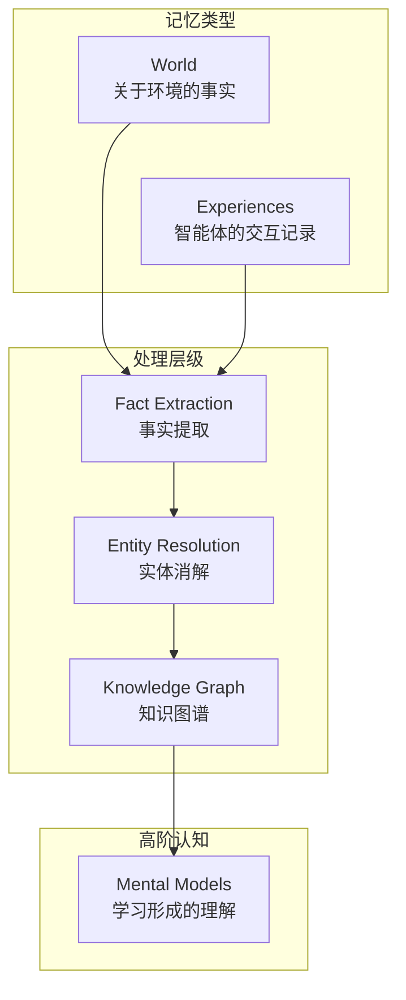
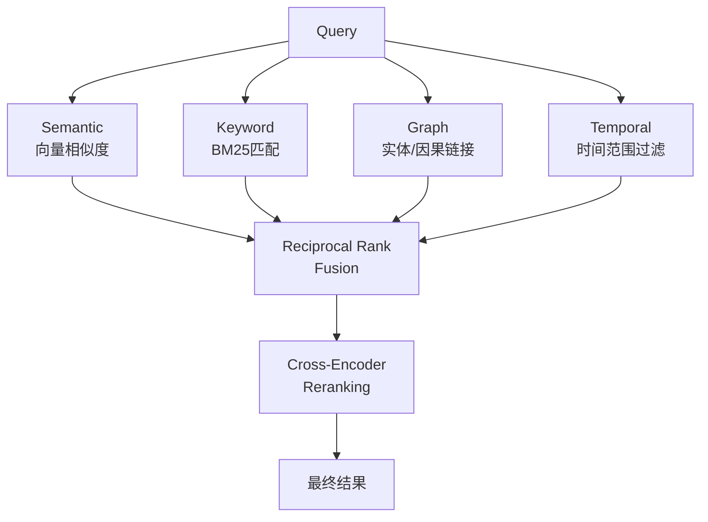
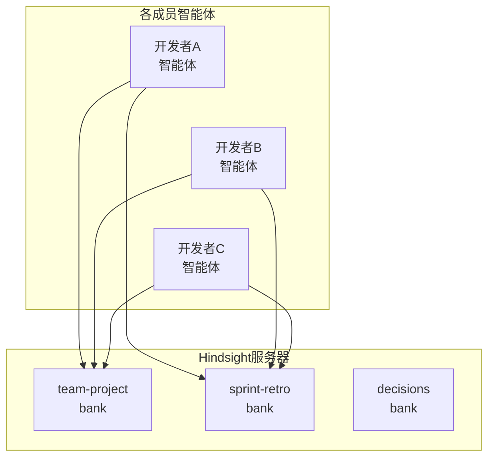

## AI智能体的记忆难题

作为将AI智能体部署到生产环境的Engineering Manager，你一定遇到过这样的场景：当你说"还记得昨天讨论的内容吗？"，智能体却一脸茫然。对话结束后所有上下文消失殆尽，下一次会话又得从头开始。

虽然有很多尝试通过RAG（Retrieval-Augmented Generation）或简单的向量数据库来解决这个问题，但大多数只停留在"检索"层面，未能进阶到"学习"。单纯搜索过往对话，与从经验中提取模式并形成mental model，本质上是完全不同的。

<strong>Hindsight</strong>正是一个正面挑战这一难题的开源项目。它兼容[MCP（Model Context Protocol）](/zh/blog/zh/mcp-server-build-practical-guide-2026)，可与Claude、Cursor、VS Code等主流AI工具即时集成，并在LongMemEval基准测试中达到91.4%，成为智能体记忆系统中首个突破90%大关的方案。

## Hindsight的架构

Hindsight采用受人类认知结构启发的仿生（biomimetic）数据结构来组织记忆。



记忆大致分为三个层级：

- <strong>World</strong>：关于环境的事实（"炉子是烫的"）
- <strong>Experiences</strong>：智能体自身的交互记录（"我碰了炉子，发现是烫的"）
- <strong>Mental Models</strong>：通过对原始记忆进行反思（reflect）而形成的学习性理解

与传统RAG系统的核心差异正在于这个Mental Models。它不只是存储和检索数据，而是分析记忆、形成模式，构建出让智能体"[从经验中学习](/zh/blog/zh/hermes-agent-self-evolving-ai-framework)"的结构。

## 三大核心操作

### Retain —— 记忆存储

```python
from hindsight_client import Hindsight

client = Hindsight(base_url="http://localhost:8888")

# 不是简单文本，而是以结构化记忆形式存储
client.retain(
    bank_id="project-alpha",
    content="김 팀장이 Sprint 23에서 인증 모듈 리팩토링을 완료했다. "
            "기존 세션 기반에서 JWT로 전환했으며, 응답 시간이 40% 개선되었다.",
    context="sprint-retrospective",
    timestamp="2026-03-15T10:00:00Z"
)
```

仅通过这一次调用，Hindsight内部会执行以下操作：

1. 实体提取："金组长"、"Sprint 23"、"认证模块"
2. 关系映射："金组长 → 完成 → 认证模块重构"
3. 事实归一化："Session → JWT迁移"、"响应时间提升40%"
4. 时间索引：记录为2026-03-15发生的事件
5. 生成向量嵌入并更新知识图谱

### Recall —— 记忆检索



```python
result = client.recall(
    bank_id="project-alpha",
    query="인증 관련 최근 변경 사항은?",
    max_tokens=4096
)
```

### Reflect —— 反思与学习

```python
insight = client.reflect(
    bank_id="project-alpha",
    query="우리 팀의 스프린트 회고에서 반복되는 패턴이 있나?",
)
```

## MCP集成：5分钟快速上手

### 安装与启动

```bash
export OPENAI_API_KEY=sk-xxx
docker run --rm -it --pull always \
  -p 8888:8888 -p 9999:9999 \
  -e HINDSIGHT_API_LLM_API_KEY=$OPENAI_API_KEY \
  -v $HOME/.hindsight-docker:/home/hindsight/.pg0 \
  ghcr.io/vectorize-io/hindsight:latest
```

### MCP客户端配置

```json
{
  "mcpServers": {
    "hindsight": {
      "type": "http",
      "url": "http://localhost:8888/mcp/my-project/"
    }
  }
}
```

### 支持的LLM提供商

| 提供商 | 配置值 | 备注 |
|--------|--------|------|
| OpenAI | `openai` | 默认值 |
| Anthropic | `anthropic` | Claude |
| Google | `gemini` | Gemini |
| Groq | `groq` | 快速推理 |
| Ollama | `ollama` | [本地部署](/zh/blog/zh/local-llm-private-mcp-server-gemma4-fastmcp) |
| LM Studio | `lmstudio` | 本地部署 |

## Engineering Manager视角的落地策略

### 第一阶段：从个人智能体开始

### 第二阶段：构建团队共享记忆



按用途分离bank：
- <strong>team-project</strong>：代码库、架构决策、技术栈
- <strong>sprint-retro</strong>：Sprint回顾、速度指标
- <strong>decisions</strong>：ADR、技术选型依据

### 第三阶段：运维监控

## 实战应用场景

### 场景1：加速新人入职
### 场景2：Sprint回顾自动分析
### 场景3：技术决策追踪

## 与现有方案的对比

| 特性 | 简单向量DB | RAG | Knowledge Graph | Hindsight |
|------|-----------|-----|-----------------|-----------|
| 存储 | 仅嵌入向量 | 文档分块 + 嵌入 | 实体 + 关系 | 事实 + 实体 + 时序 + 向量 |
| 检索 | 仅向量相似度 | 向量 + 关键词 | 图遍历 | 四路并行检索 + 重排序 |
| 学习 | 无 | 无 | 有限 | Mental Model自动形成 |
| 时间感知 | 无 | 有限 | 有限 | 原生时间索引 |
| 基准测试 | - | - | - | LongMemEval 91.4% |

## 注意事项

1. <strong>处理延迟</strong>：retain后立即recall，处理可能尚未完成。
2. <strong>LLM成本</strong>：内部处理需要额外的LLM调用。
3. <strong>数据安全</strong>：记忆中可能包含敏感信息。
4. <strong>Mental Model质量</strong>：自动生成的mental model并非总是准确的。

## 结论

Hindsight是在AI智能体记忆领域展现出重要进展的项目。它采用MIT许可证的开源方案，通过一个Docker容器即可在5分钟内快速上手。

## 参考资料

- [Hindsight GitHub](https://github.com/vectorize-io/hindsight)
- [Hindsight 官方文档](https://hindsight.vectorize.io/)
- [Hindsight 研究论文 (arXiv)](https://arxiv.org/abs/2512.12818)
- [MCP Agent Memory 博客文章](https://hindsight.vectorize.io/blog/2026/03/04/mcp-agent-memory)
