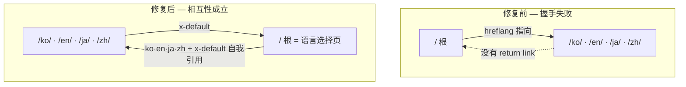

我把一个30行的脚本对准自己网站的`dist/`目录。248篇博客文章全是绿灯。恰好有一篇是红灯，偏偏是首页。

```text
[PASS] return-link reciprocity    broken pairs : 0   （一篇文章的四种语言）
...
[FAIL] return-link reciprocity    broken pairs : 4   （全站249个页面）
[FAIL] self-referencing hreflang   missing      : 1
```

hreflang是多语言站点里用来告诉搜索引擎"这个页面的中文版、英文版在这里"的标签。加它很容易。问题在于，它是一份<strong>双向契约</strong>。只有一方伸手，握手就不成立，Google会把这条注释整个丢弃。这条规则我只在文档里读过，但我很想知道自己的站点是否真的守住了，于是亲手测了一遍。结果如上。我按顺序拆解。

## hreflang保证什么，不保证什么

先把期待降下来。hreflang不会提升排名。Google Search Central的文档把它描述为一个"按语言或地区把用户引导到最合适版本"的工具。它是<strong>路由信号</strong>，不是排名加成。

这个区分在实战里很关键。我以前曾模糊地以为，把hreflang做干净，各语言版本就会在各自市场里排名上升。这是个错误的期待。hreflang真正做的是：当一位中国用户搜索时，它把已经进入排名的结果<strong>替换</strong>成正确的语言，让中文版而非英文版出现。它不会造出原本不存在的排名。

反过来，做错了，损失是确定的。相互链接断裂的注释会被忽略，最坏时搜索引擎会搞不清哪个是正本，端出错误的语言版本。所以hreflang更接近"做得完全正确才保本，做错就亏"，而不是"加了就赚、不加就保本"。理解了这种不对称，你就不会觉得花时间做验证是多余的。

## 双向（return link）规则 — 为什么单向不行

Google文档的那句话短而果断："如果两个页面没有互相指向，标签就会被忽略（If two pages don't both point to each other, the tags will be ignored）。"

拆开就是三点。

1. <strong>Return link</strong>：A把B指定为替代版本，B也必须反过来指定A。
2. <strong>Self-reference</strong>：每个页面把自己也列入hreflang清单。中文版的清单里必须有自己（zh）。
3. <strong>绝对URL</strong>：`href`要是含协议和域名的完整地址。

这条规则为何如此严格，我自己想通后觉得合理。hreflang必须防止不可信的第三方擅自把我的页面声称为它的替代版本。如果承认单向声明，任何站点都能宣布"我的西班牙语版就是你那个知名的英文页面"，从而污染信号。要求双方互相指名才认可，等于一次相互签名。从反垃圾的角度看，这反而是干净的设计。

麻烦在于，这条规则靠人手很难守住。四种语言乘以数百篇文章，就是数百个集群。哪怕一个页面清单错位，那个集群就被悄悄忽略，屏幕上还不会报错。所以我写了一个检查器。

## 我直接审计了自己的站点

这个脚本读取构建产物（`dist/`）里所有的`index.html`，抽出hreflang链接，建成一张图，核查return link是否真的存在。RSS订阅源上带的`hreflang`不是HTML页面，我把它们过滤掉了。

````javascript
// hreflang-audit.mjs（核心部分）
function extractHreflang(html) {
  const out = [];
  const linkRe = /<link\b[^>]*rel=["']alternate["'][^>]*>/gi;
  for (const m of html.match(linkRe) || []) {
    if (/type=["']application\/rss\+xml["']/i.test(m)) continue; // 排除RSS
    const lang = (m.match(/hreflang=["']([^"']+)["']/i) || [])[1];
    const href = (m.match(/href=["']([^"']+)["']/i) || [])[1];
    if (lang && href) out.push({ lang, href });
  }
  return out;
}
// 每条注释的target是否反过来指向我们？
const target = pages.get(a.href);
if (target && !target.alts.some(t => t.href === url)) brokenReturn++;
````

先只检查一篇文章的四种语言版本。我拿讲无障碍审计的[Lighthouse无障碍那篇](/zh/blog/zh/a11y-lighthouse-audit-fix-2026/)做对象。

```text
$ node hreflang-audit.mjs dist a11y-lighthouse-audit-fix-2026
pages with hreflang annotations : 4
----------------------------------------------------
[PASS] return-link reciprocity    broken pairs : 0
[PASS] self-referencing hreflang   missing      : 0
[PASS] x-default present            missing      : 0
[PASS] absolute URLs                relative     : 0
[PASS] language code format         invalid      : 0
```

干净。打开实际的标签，四种语言精确地互相指名，也指向自己。

```html
<!-- /zh/blog/zh/a11y-.../ 输出的内容 -->
<link rel="canonical" href="https://jangwook.net/zh/blog/zh/a11y-lighthouse-audit-fix-2026/">
<link rel="alternate" hreflang="ko" href="https://jangwook.net/ko/blog/ko/a11y-lighthouse-audit-fix-2026/">
<link rel="alternate" hreflang="en" href="https://jangwook.net/en/blog/en/a11y-lighthouse-audit-fix-2026/">
<link rel="alternate" hreflang="ja" href="https://jangwook.net/ja/blog/ja/a11y-lighthouse-audit-fix-2026/">
<link rel="alternate" hreflang="zh" href="https://jangwook.net/zh/blog/zh/a11y-lighthouse-audit-fix-2026/">
<link rel="alternate" hreflang="x-default" href="https://jangwook.net/en/blog/en/a11y-lighthouse-audit-fix-2026/">
```

到这里我很满意。可一旦把范围扩到全站，画面就变了。

```text
$ node hreflang-audit.mjs dist
pages with hreflang annotations : 249
----------------------------------------------------
[FAIL] return-link reciprocity    broken pairs : 4
[FAIL] self-referencing hreflang   missing      : 1
[PASS] x-default present            missing      : 0
[PASS] absolute URLs                relative     : 0
[PASS] language code format         invalid      : 0

first broken return links:
  https://jangwook.net/
    → https://jangwook.net/ko/ (ko) has NO return link
  https://jangwook.net/
    → https://jangwook.net/en/ (en) has NO return link
  https://jangwook.net/
    → https://jangwook.net/ja/ (ja) has NO return link
  https://jangwook.net/
    → https://jangwook.net/zh/ (zh) has NO return link
```

断裂的四组全都指向同一处：没有语言代码的<strong>裸根</strong>`https://jangwook.net/`。248篇文章都完美，只有一张首页在扰乱集群。

## 为什么只有首页坏了

把两个页面的实际标签并排放，原因立刻显现。

```html
<!-- 裸根 / 输出的内容 -->
<link rel="canonical" href="https://jangwook.net/">
<link rel="alternate" hreflang="ko" href="https://jangwook.net/ko/">
<link rel="alternate" hreflang="en" href="https://jangwook.net/en/">
<link rel="alternate" hreflang="ja" href="https://jangwook.net/ja/">
<link rel="alternate" hreflang="zh" href="https://jangwook.net/zh/">
<link rel="alternate" hreflang="x-default" href="https://jangwook.net/en/">

<!-- /zh/ 首页输出的内容 -->
<link rel="canonical" href="https://jangwook.net/zh/">
<link rel="alternate" hreflang="ko" href="https://jangwook.net/ko/">
<link rel="alternate" hreflang="en" href="https://jangwook.net/en/">
<link rel="alternate" hreflang="ja" href="https://jangwook.net/ja/">
<link rel="alternate" hreflang="zh" href="https://jangwook.net/zh/">
<link rel="alternate" hreflang="x-default" href="https://jangwook.net/en/">
```

裸根`/`把自己声明为正本（`canonical`），又把`/ko/` `/en/` `/ja/` `/zh/`指定为替代版本。可偏偏`/zh/`的清单里没有`/`。`/zh/`只指名自己和其余三种语言。也就是说，根向语言首页伸手，而语言首页里没有一个向根伸手。握手失败。加上根没把自己（`/`）放进自己的清单，也就没有self-reference。检查器抓到的"missing self : 1"正是这个根。

老实说，这是个常见的坑。多语言站点里，没有语言代码的"中立根"通常会重定向到某个语言首页，或充当语言选择页。可一旦这个根<strong>像一个独立正本页面那样，另外输出自己的hreflang枢纽</strong>，它就成了闯入者，挤进语言首页早已彼此完结的集群。语言首页不知道根的存在，自然没有理由为它建return link。

还有一点。x-default指向`/en/`。这本身不算错。Google明确允许x-default指向某个特定语言版本。但x-default的用意是"面向任何语言都不匹配的用户的页面"，也就是语言选择界面或自动重定向的首页。最贴合这个角色的，恰恰是中立根`/`。当前结构是个尴尬的中间态：有一个中立根，x-default却指向英文，而那个中立根在集群里悬着。

我用最小复现又确认了一遍这个机制。造两个页面，枢纽A指向B，但B不指向A，然后跑检查器。

```text
===== BROKEN =====
[FAIL] return-link reciprocity    broken pairs : 1
[FAIL] self-referencing hreflang   missing      : 1

===== FIXED（每个页面都指名自己+全部变体，且相互指名） =====
[PASS] return-link reciprocity    broken pairs : 0
[PASS] self-referencing hreflang   missing      : 0
[PASS] x-default present            missing      : 0
```

修复方向有三选一。(1) 把根301重定向到某个语言首页，让它彻底退出集群；(2) 把根的`canonical`让给语言首页，理清重复信号；(3) 把根当作真正的x-default目标，让所有语言首页都用x-default指向根，恢复相互性。我认为(3)在语义上最诚实。不过它动的是线上站点的canonical和重定向，所以我打算先在预发环境复核那248个健康集群不受影响，再单独上线。这篇文章里我没有临时改动线上SEO行为。检查器会充当回归测试：修完之后再跑一次同样的脚本，确认绿灯即可。

<strong>2026-07-04 后续</strong>：该修复已上线。按方法(3)把首页集群的x-default改为中立根`/`，并把上面的检查器常设为构建流水线的postbuild门禁。重跑结果：253个页面，broken pairs 0，missing self 0 — 全部绿灯。

把修复前后画在一起，问题一目了然。



## 三种实现方式 — 何时用哪个

输出hreflang有三种方式，Google坚决表示"三种方式等价"。等价应当理解为<strong>任选其一，但绝不混用</strong>。如果对同一个页面，HTML标签和站点地图说的不一样，你只是给自己造了一个验证地狱。

| 方式 | 放在哪 | 优势 | 劣势 | 适用场景 |
|------|-------|------|------|---------|
| HTML `<link>`标签 | 每页`<head>` | 实现与检查最简单；静态构建自动生成 | 每页N个标签；页面多时HTML变重 | 静态博客、数百页规模 |
| HTTP `Link:`头 | 响应头 | 可用于PDF、图片等非HTML文件 | 需服务器/CDN配置；肉眼核查麻烦 | 非HTML资源、易于控制头的环境 |
| 站点地图 `xhtml:link` | XML站点地图 | 不动HTML；大规模有利，集中管理 | 站点地图膨胀；需要生成流水线 | 数万页、难改标记的CMS |

我的博客是静态构建，所以HTML标签方式合适。在数百页的当下，标签方式"HTML变重"的劣势还不成负担。若长到数万页，我会考虑改用站点地图方式。那种情况下，正如[把LocalBusiness结构化数据在服务端输出](/zh/blog/zh/localbusiness-structured-data-server-side-vs-js-2026/)那次一样，在构建时点确定性地打出信号，比人手管理安全得多。

## 常踩的雷 — 尤其是中文

我的站点语言代码过了关，但规则本身有几个常见的坑，用清单记下来。

- <strong>地区代码用错</strong>：英国是`GB`，不是`UK`。`EU`、`UN`也不是ISO 3166-1 Alpha 2，因此无效。这是Google官方点名的典型错误。
- <strong>语言与地区混淆</strong>：`hreflang="us"`是错的。`us`是地区，不是语言。要把语言写在前面，如`en-US`。
- <strong>中文子标签</strong>：我的站点用bare `zh`。它有效，但无法区分简体和繁体。如果只面向大陆读者，`zh`就够；如果也面向台湾、香港，用`zh-Hans` / `zh-Hant`明示脚本更精确。这个博客在后来加中文支持时，是从单一简体起步的，现在回看，至少该明示为`zh-Hans`。这一点我记为自己的失误。
- <strong>相对路径</strong>：`href="/en/..."`不行，必须是绝对URL。
- <strong>与noindex同用</strong>：如果hreflang的目标是`noindex`，信号之间就自相矛盾。你一边说别收录，一边又把用户引向它作为替代版本。

最后一条尤其和[用robots.txt控制AI爬虫那篇](/zh/blog/zh/ai-crawler-control-robots-txt-llms-txt-2026/)相连。收录、抓取、语言这些信号分散在不同的文件和标签里，一旦彼此矛盾，爬虫要么按最保守的方式解读，要么干脆忽略。加信号不难，<strong>让信号之间不打架</strong>才是实战的一半。

## 所以开发者现在该做什么

归纳起来，顺序是这样。

1. <strong>检查构建产物。</strong>看真正发出去的HTML，而不是源模板。把上面那个30行脚本对准`dist/`，五秒内一次性抓出return link、self-reference、绝对URL和代码格式。
2. <strong>别漏掉self-reference。</strong>每个页面的hreflang清单里都要有自己。忘掉这一点是最常见的错。
3. <strong>理清中立根。</strong>检查没有语言代码的`/`是否在另外输出自己的canonical和hreflang枢纽。把它重定向、把canonical让给语言首页，或让它当x-default目标以建立相互性。
4. <strong>统一用一种方式。</strong>不要混用HTML标签、HTTP头和站点地图。
5. <strong>把检查器接进CI。</strong>每次构建后自动跑，broken pair不为0就让构建失败。我打算就这么用这个脚本。等哪天再加一门语言，它能阻止新语言悄悄弄坏既有集群。

若只留一句，就是这句：hreflang不是"加了"就算完，而是"在构建产物里双向咬合"才算完。而这个确认要用脚本做，不是用眼睛。连我这个把文档背得滚瓜烂熟的人，首页坏了都没察觉。

---

如果你想检查一个多语言站点的hreflang、canonical和结构化数据是否真的在构建产物里咬合，或者想搭一套从静态／服务端渲染确定性地输出这些信号的结构，我个人承接咨询与实现。像上面这样一个小小的回归装置，就能防住数百页里的沉默错误。可通过博客个人资料里的联系方式找到我。
