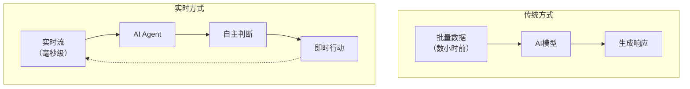
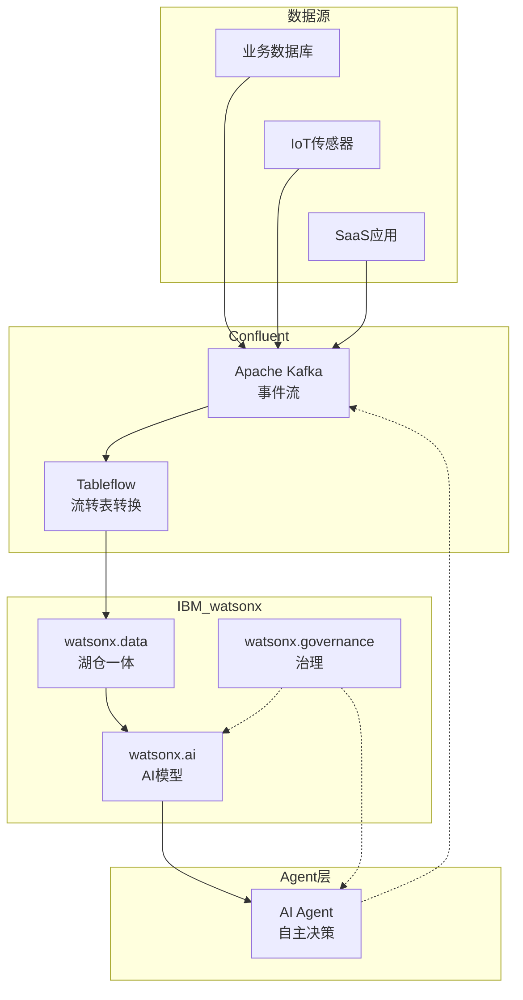
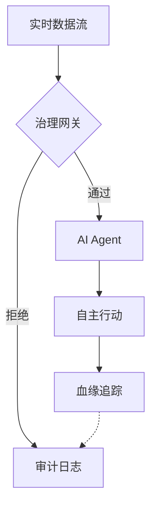

## 概述

2026年3月17日，IBM完成了对数据流平台企业Confluent的收购，交易金额高达<strong>110亿美元（约合800亿人民币）</strong>。Confluent基于Apache Kafka构建的平台已被超过40%的Fortune 500企业采用，此次与IBM watsonx生态系统的整合，标志着<strong>实时数据流正式成为企业级AI Agent的核心基础设施</strong>。

本次收购不仅仅是一起并购事件，更清晰地揭示了AI时代数据架构的演进方向。从Engineering Manager到CTO，本文将分析工程领导者应如何解读这一变革。

## 为什么是实时数据 — "Data Latency Gap"问题

### 传统AI系统的局限

大多数企业级AI系统基于<strong>批处理（Batch Processing）</strong>模式运行：先收集数据，通过ETL（Extract, Transform, Load）管道进行清洗，然后再输入模型。

```
[业务数据库] → [ETL管道] → [数据仓库] → [AI模型]
            延迟数小时〜数天
```

在这种架构下，AI模型所引用的数据始终是<strong>"历史快照"</strong>，无法反映实时变化的市场动态、用户行为和系统状态。

### AI Agent的真正需求

2026年的AI Agent已不再是简单的问答聊天机器人，而是<strong>能够自主判断、执行操作并验证结果的主动式系统</strong>。[LangGraph、CrewAI、Dapr等Agent框架](/zh/blog/zh/ai-agent-framework-comparison-2026-langgraph-crewai-dapr-production)正是这类Agent的实现基础，而如果这样的Agent基于"昨天的数据"进行决策，其结果将无法令人信赖。



IBM收购Confluent的核心原因正是为了消除这一<strong>"Data Latency Gap"</strong>。

## IBM + Confluent 集成架构

### 核心集成要点

IBM高级副总裁Rob Thomas将此次收购称为<strong>"Agentic AI拼图的最后一块"</strong>。具体的集成架构如下：



### Zero-Copy数据共享

最值得关注的技术是<strong>Confluent Tableflow与watsonx.data的集成</strong>。

以往，要在AI模型中使用Kafka的流式数据，必须经过单独的ETL流程。借助Tableflow，可以<strong>像查询数据库表一样直接查询Kafka流</strong>。

```python
# 传统方式：需要ETL管道
raw_data = kafka_consumer.poll()
transformed = etl_pipeline.transform(raw_data)
warehouse.insert(transformed)
result = ai_model.predict(warehouse.query("SELECT * FROM orders"))

# Tableflow集成：零拷贝直接查询
result = ai_model.predict(
    watsonx_data.query("SELECT * FROM kafka_stream.orders")
)
```

这种方式<strong>消除了ETL成本</strong>，将数据延迟降低到毫秒级别，使AI Agent能够始终基于最新数据采取行动。

## CTO/VPoE视角的战略启示

### 1. "Live Agentic AI"范式的崛起

此次收购揭示了整个行业的发展方向。AI Agent基于<strong>实时事件流</strong>而非静态数据运行的"Live Agentic AI"范式正在全面铺开。

<strong>实际影响：</strong>
- 需要评估将现有批处理ML管道迁移至流式架构
- 数据工程团队需要建立Kafka/事件流处理能力
- AI Agent的决策质量直接取决于数据新鲜度（Data Freshness）

### 2. 治理与血缘追踪的重要性

当实时数据直接影响AI Agent的决策时，<strong>[数据治理](/zh/blog/zh/nist-ai-agent-security-standards)</strong>的重要性急剧上升。



<strong>检查要点：</strong>
- 构建数据血缘（Lineage）追踪系统
- 确保AI Agent决策依据的数据可审计、可追溯
- 实施基于策略的访问控制（Policy-Based Access Control）

### 3. 厂商锁定 vs 开源策略

IBM的集成平台功能强大，但也伴随着<strong>厂商锁定风险</strong>。作为CTO需要考虑的替代策略：

| 方案 | 优势 | 劣势 |
|------|------|------|
| IBM全栈（Confluent + watsonx） | 统一管理、治理一体化 | 成本较高、厂商锁定 |
| 开源组合（Kafka + 自建AI） | 灵活性高、成本可控 | 集成复杂度高、治理需自行构建 |
| 混合方案（Confluent Cloud + 多AI） | 数据层统一、AI灵活性 | 架构管理复杂 |

### 4. 组织能力转型

这一变革不仅仅是技术问题，还需要<strong>组织架构与能力</strong>的同步转型。

<strong>数据工程团队角色转变：</strong>
- 批量ETL运维 → 事件流架构设计
- 数据仓库管理 → 实时数据管道运维
- 静态报表 → AI Agent数据源优化

<strong>AI/ML工程师角色扩展：</strong>
- 模型训练/部署 → Agent编排
- 离线评估 → 实时监控与反馈回路设计

## 实战应用：从第一步开始

即使没有IBM-Confluent级别的基础设施，实时数据 + AI Agent模式在小规模场景中同样适用。

### 最小化配置示例

```yaml
# docker-compose.yml（最小实时AI Agent技术栈）
services:
  kafka:
    image: confluentinc/cp-kafka:latest
    ports:
      - "9092:9092"

  agent-worker:
    build: ./agent
    environment:
      - KAFKA_BOOTSTRAP_SERVERS=kafka:9092
      - LLM_API_KEY=${LLM_API_KEY}
    depends_on:
      - kafka

  monitoring:
    image: grafana/grafana:latest
    ports:
      - "3000:3000"
```

### 事件驱动AI Agent模式

```python
from confluent_kafka import Consumer
import anthropic

client = anthropic.Anthropic()
consumer = Consumer({
    'bootstrap.servers': 'localhost:9092',
    'group.id': 'ai-agent-group',
    'auto.offset.reset': 'latest'
})
consumer.subscribe(['business-events'])

while True:
    msg = consumer.poll(1.0)
    if msg is None:
        continue

    event = json.loads(msg.value())

    # AI Agent基于实时事件进行判断
    response = client.messages.create(
        model="claude-sonnet-4-6",
        max_tokens=1024,
        messages=[{
            "role": "user",
            "content": f"请分析以下业务事件并提出处理建议：{event}"
        }]
    )

    # 将Agent的判断结果作为事件重新发布
    producer.produce(
        'agent-decisions',
        json.dumps({"event": event, "decision": response.content})
    )
```

## 结论

IBM收购Confluent明确传达了一个信号：<strong>"AI Agent时代的数据基础设施必须是实时的"</strong>。110亿美元的收购金额证明，实时数据流不再只是技术趋势，而是<strong>企业级AI的基础设施</strong>。[Deloitte 2026 Agentic AI分析](/zh/blog/zh/deloitte-agentic-ai-operations-2026)同样将实时数据连接列为Agent运营的核心要素。

作为工程领导者，现在可以启动的行动：

1. <strong>审计当前数据架构的延迟</strong> — 衡量AI Agent引用的数据有多"新鲜"
2. <strong>启动事件流PoC</strong> — 在时间敏感度最高的工作流中试点Kafka流式处理
3. <strong>设计治理框架</strong> — 在实时数据进入AI决策流程之前，建立策略与审计体系
4. <strong>制定团队能力路线图</strong> — 规划数据工程 + AI工程的交叉能力发展计划

从批处理到流处理，从聊天机器人到Agent — 数据与AI的关系正在被根本性地重新定义。

## 参考资料

- [IBM Completes Acquisition of Confluent — IBM Newsroom](https://newsroom.ibm.com/2026-03-17-ibm-completes-acquisition-of-confluent,-making-real-time-data-the-engine-of-enterprise-ai-and-agents)
- [IBM Solidifies AI Infrastructure Dominance with $11 Billion Confluent Acquisition](https://www.financialcontent.com/article/marketminute-2026-3-19-ibm-solidifies-ai-infrastructure-dominance-with-11-billion-confluent-acquisition)
- [IBM closes $11B Confluent deal for AI data](https://www.stocktitan.net/news/IBM/ibm-completes-acquisition-of-confluent-making-real-time-data-the-lbuwdbharsqe.html)
- [Deloitte Agentic AI Strategy](https://www.deloitte.com/us/en/insights/topics/technology-management/tech-trends/2026/agentic-ai-strategy.html)
