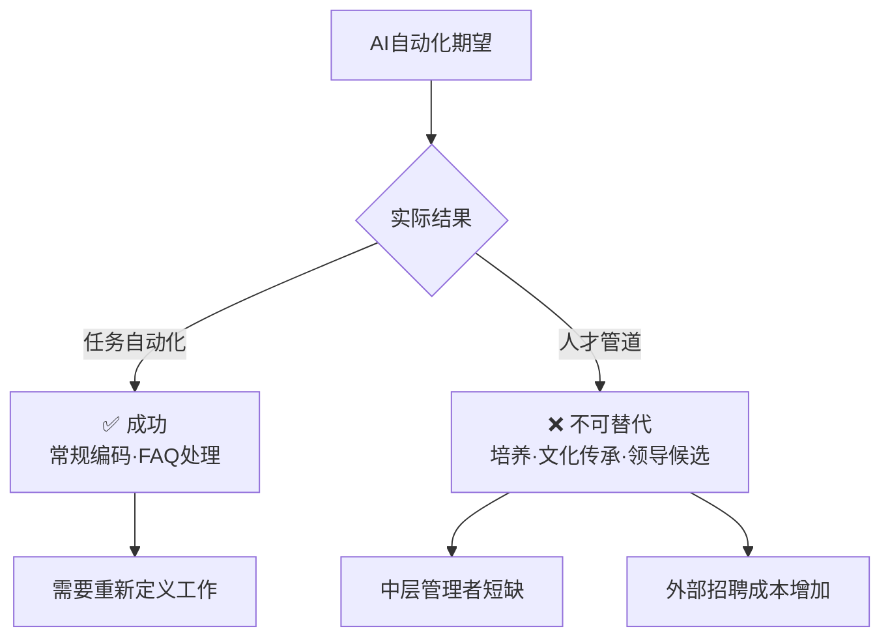
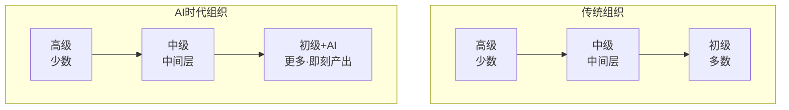
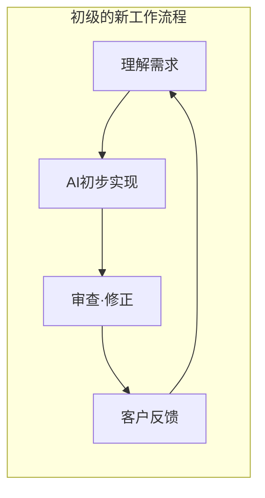

## 引言

"AI将取代入门级工作"——这个在科技行业重复了多年的预言，如今正迎来重大转折。

2026年2月，<strong>IBM的CHRO（首席人力资源官）Nickle LaMoreaux</strong>做出了一个震撼性的宣布：IBM将<strong>把入门级招聘扩大3倍</strong>，而且是针对"那些被告知AI可以做的软件开发者等岗位"。

根据[Fortune的报道](https://fortune.com/2026/02/13/tech-giant-ibm-tripling-gen-z-entry-level-hiring-according-to-chro-rewriting-jobs-ai-era/)，不仅是IBM，Dropbox和Cognizant也在做出类似的举措。

作为工程管理者（EM），这一趋势极具启发性。让我们来分析AI替代的"期望"与"现实"之间的差距，以及由此揭示的组织设计本质。

## AI替代的现实 vs 期望

### 预期中的场景

2023至2025年间，许多企业高管描绘了这样的愿景：

- 入门级编码工作可以通过AI自动化
- 减少初级工程师招聘，转向以高级工程师为核心的精英小团队
- Korn Ferry的调查发现，<strong>37%的组织计划用AI替代入门级职位</strong>

### IBM面临的现实

然而，IBM实际经历的是一个截然不同的现实：

- 入门级的"任务"可以自动化，但"人才培养管道"不可替代
- 减少初级人员会导致3~5年后<strong>中层管理者严重短缺</strong>
- 外部招聘成本更高，外部人员适应内部文化也需要更长时间

LaMoreaux这样说道：

> "3到5年后最成功的企业，将是那些在当前环境下加倍投入入门级招聘的企业"

### EM的启示

AI在"任务自动化"方面表现出色，但"组织的可持续性"是另一个问题。要长期维持团队，人才培养管道不可或缺。

## 大企业的人力规划：IBM的战略转型

### 从"削减"到"重新定义"

IBM的有趣之处在于，他们不是简单地增加初级人员，而是<strong>重新定义岗位本身</strong>：

| 传统角色 | AI时代的新角色 |
|---|---|
| 软件工程师：以常规编码为主 | 软件工程师：客户对接·AI辅助设计 |
| HR人员：直接回答问题 | HR人员：聊天机器人干预·异常处理 |
| 初级：按上级指示执行任务 | 初级：利用AI工具即刻产生价值 |

### Dropbox的观点

Dropbox CPO Melanie Rosenwasser对Gen Z的AI技能给出了令人印象深刻的评价：

> "他们就像在环法自行车赛上骑行，而我们还在用辅助轮。老实说，他们在能力上就是这样超越我们的"

Dropbox计划将实习和应届毕业生项目<strong>扩大25%</strong>。

### Cognizant的"倒金字塔"构想

Cognizant CEO Ravi Kumar S也预见了组织结构的变化：

> "传统的金字塔结构将变得更宽更短，达到专业水平的速度也会更快"

## 组织设计论：EM现在应该思考什么

### 1. 人才管道是"基础设施"

如同道路和水电一样，人才管道是无法用短期ROI衡量的基础设施。IBM的案例表明，<strong>停止管道的成本</strong>远远超过<strong>维持管道的成本</strong>。

作为EM，不仅要优化季度人员编制，更重要的是向管理层提出3~5年的人力规划。

### 2. "重新发明"初级岗位

如果AI替代了初级人员的传统任务，就需要重新定义他们的角色：

- <strong>AI编排者</strong>：组合AI工具解决问题
- <strong>领域桥梁</strong>：在技术和客户之间架起桥梁
- <strong>质量把关者</strong>：审查和测试AI生成的代码

### 3. 设计"AI + 人类"混合组织

过去初级工程师需要一周的实现工作，在AI辅助下1~2天即可完成。但因此<strong>可以将更多时间用于客户对接和领域理解</strong>。这正是IBM所追求的"更持久技能"的构建。

### 4. 重新审视招聘策略

Korn Ferry调查中37%的企业计划用AI替代初级职位，但IBM的行动恰恰相反。EM需要考虑的要点：

- AI素养高的应届毕业生比现有员工更快掌握AI工具
- LinkedIn数据显示，<strong>AI素养是美国增长最快的技能</strong>
- "善用AI的初级"可能比"不会用AI的高级"生产力更高

## 总结：AI是人才的"放大器"而非"替代品"

IBM的决定向科技行业传递了重要信息：

1. <strong>AI可以自动化任务，但无法自动化人才培养</strong>
2. <strong>削减入门级招聘会带来重大的中长期风险</strong>
3. <strong>岗位的"重新定义"才是AI时代组织战略的核心</strong>

Cognizant CEO的话完美地表达了这一变化的本质：

> "AI是人类潜力的放大器，而不是替代策略"

作为EM，我们需要重新思考的不仅是AI工具的引入，更是<strong>组织设计本身</strong>。不是裁掉初级人员，而是设计让他们能与AI共同成长的新角色和环境——这才是3~5年后组织制胜的条件。

## 参考资料

- [Fortune: IBM is tripling Gen Z entry-level hiring](https://fortune.com/2026/02/13/tech-giant-ibm-tripling-gen-z-entry-level-hiring-according-to-chro-rewriting-jobs-ai-era/)
- [Korn Ferry: Companies plan to replace entry roles with AI](https://www.hrdive.com/news/companies-plan-to-replace-entry-roles-ai/804870/)
- [LinkedIn: AI literacy is fastest-growing skill](https://www.linkedin.com/pulse/linkedin-skills-rise-2025-15-fastest-growing-us-linkedin-news-hy0le/)
