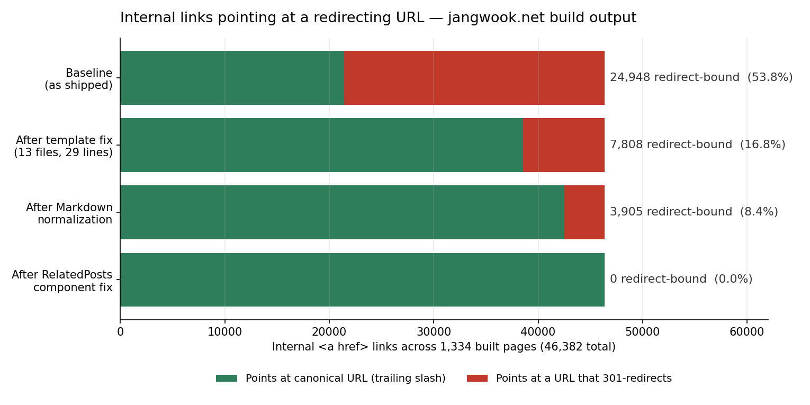

我在构建出来的1,334个HTML页面里数了46,382条内部链接。其中24,948条指向会返回301的地址。超过一半。

更难堪的是，我并不是冲着这个数字去的。当时我在测链接文本的无障碍表现。WCAG里有一条关切：同名的两条链接如果通向不同地方，屏幕阅读器用户就无法区分目的地。我想把这件事机器化地数一遍，于是写了脚本。脚本标出了1,330个页面。逐个打开看，没有一处是无障碍缺陷。名为`home`的链接，在页头指向`/en/`，在页脚指向`/en`。

## 尾部斜杠不是风格偏好，而是第二个URL

先把地基打好。`https://example.com/blog`和`https://example.com/blog/`在人眼里是同一个页面，但在HTTP层面是两个不同的资源标识符。哪一个返回真正的文档，由服务器决定。静态站点托管通常按目录形式放置文件（`/blog/index.html`），所以带斜杠的一侧返回200，不带斜杠的一侧用301转过去。也有反过来配置的托管环境。这是惯例而非规则，而惯例会随部署目标改变。

真正要紧的问题不是"哪一种正确"，而是当两种形态在同一个站点里混用时会发生什么：站点开始用两个地址宣传自己的同一个页面。canonical标签指着其中一个，内部链接却指着另一个。我的站点就处在这个状态。

在我的部署环境里，实际响应是这样的。

```text
$ curl -sS -o /dev/null -w "%{http_code} -> %{redirect_url}\n" https://jangwook.net/en
301 -> https://jangwook.net/en/

$ curl -sS -o /dev/null -w "%{http_code}\n" https://jangwook.net/en/
200
```

浏览器会自动跟随这个301，所以用户毫无察觉，页面照常显示。区别只是请求发了两次。

## 测无障碍，测出了URL缺陷

最初的任务是链接文本审计。从每个构建页面里取出`<a>`的可访问名称（顺序为`aria-label`、文本、图片`alt`、`title`），统计同一个页面内同一个名称指向两个及以上目的地的情况。

顺带产出的卫生指标并不难看。名称为空的内部链接为零；"这里""详情""click here"这类空洞链接文本为零；缺少`alt`的图片链接为零；不重复的链接名称共7,153个。

但"同名不同目的地"这一项在1,330个页面上报警，几乎是全站。翻看排在前面的条目，里面混着两类东西。

一类是误报。语言切换链接在每个页面上名称都是`🇨🇳 中文`，目的地却随页面变化。一个名称挂着323个目的地，机器判定为违规，人来看却完全正常。WCAG判断链接用途时看的是链接文本加上下文，而语言切换器的上下文正是当前页面，所以这条规则本就不该抓它。做自动化指标时，如果不先把这种结构性误报切出去，整份清单就会变成噪音。

另一类是真的。`home`、`blog`、`about`、`contact`、`social`。五个名称各自对应两个目的地，两者之差只有末尾一个字符。一个本该由URL规范化检查抓到的缺陷，先被无障碍指标抓到了。

翻开源码，成因只有一行。

```astro
<!-- src/components/Header.astro -->
<a href={`/${lang}/`}>{t("nav.home")}</a>

<!-- src/components/Footer.astro -->
<a href={`/${lang}`}>{t("nav.home")}</a>
```

两个组件是在不同的日子写的，中间没有任何机制去强制形态统一。自动检查也抓不到，因为链接没有坏。这个仓库的构建关卡里其实已经有一项检查在确认`broken internal links: 0`，而301不算坏链接，会被顺利放行。当初[测量抓取深度、确认不可达为零](/zh/blog/zh/crawl-depth-flat-archive-audit-2026/)时也是同样的情形。能到达，毕竟是能到达的。

## 把46,382条拆开看

全量扫描的结果。对象是`dist/`下的1,334个HTML文件；统计范围是同源的路径型内部链接（排除外部链接、`mailto:`、`tel:`、纯锚点，以及带扩展名的静态文件）。

| 项目 | 数值 |
|---|---|
| 构建出的HTML页面 | 1,334 |
| 内部路径链接总数 | 46,382 |
| 以斜杠结尾的链接 | 21,434（46.2%） |
| 不带斜杠的链接 | 24,948（53.8%） |
| 其中带斜杠路径确实存在页面，即必然301 | 24,944 |
| 至少包含一条问题链接的页面 | 1,330 / 1,334 |
| `<link rel="canonical">`为带斜杠形态 | 1,330 / 1,330 |

最后一行才是要害。canonical无一例外地声明了带斜杠的形态。也就是说，那24,948条不带斜杠的链接，全都指向站点自己声明为"非正本"的地址。

按产生位置拆开，责任归属就清楚了。

| 位置 | 问题链接数 |
|---|---|
| 页脚、页头等模板 | 10,640 |
| 正文（`article`/`main`）内部 | 14,300 |
| 其他 | 8 |

正文一侧更多，这一点让我有点难受。那14,300条，是我一篇篇手写进去的站内链接，加上相关文章组件生成的链接。换句话说，我越是勤快地铺内部链接，错误形态就越多。

## 官方说了什么，没说什么

这里需要把预期调准。在Google文档里能直接核对到的句子有两句。

> When linking within your site, link to the canonical URL rather than a duplicate URL. Linking consistently to the URL that you consider to be canonical helps Google understand your preference.

（[Consolidate duplicate URLs — Google Search Central](https://developers.google.com/search/docs/crawling-indexing/consolidate-duplicate-urls)）

> Avoid long redirect chains, which have a negative effect on crawling.

（[Large site owner's guide to managing your crawl budget — Google Search Central](https://developers.google.com/search/docs/crawling-indexing/large-site-managing-crawl-budget)）

这两句保证的范围比很多人以为的要窄。前一句说的是"把内部链接对齐到canonical有助于Google理解你的偏好"，而不是"不对齐就扣分"。后一句说的是"长链"。我这里只有一跳。

而且抓取预算这套说辞对我的站点本来就不适用。同一份文档把适用范围收得很紧。

> Large sites (1 million+ unique pages) with content that changes moderately often (once a week)
> Medium or larger sites (10,000+ unique pages) with very rapidly changing content (daily)

1,334页的站点两条都不沾。所以如果我写"为了省抓取预算才修"，那就是撒谎。声称排名会上升就更不可能。无论是结构化数据还是链接形态，Google一贯的立场都是不保证排名，我也不越过这条线。

那为什么修？三个理由，全都在排名之外。

第一，用户等待时间。同一个URL各打七次。301响应本身的中位数是33.6ms，反而更快；返回真实文档的200响应中位数是43.0ms。问题在于用户两笔都要付：大约77ms对43ms。这是一台笔记本、缓存已经预热的边缘节点上取的七个样本，绝对值不必当真。但方向很明确，走一趟总比走两趟快。

第二，消除自相矛盾。canonical指向A，内部链接却有一半指向B，这种状态从哪个角度都不好解释。

第三，这件事不会止步于链接。不带斜杠的地址一旦被外部分享出去，分析工具里同一个页面就会拆成两条路径分别统计。哪怕完全不谈排名，仅凭计量质量也够构成修复理由。

## 从24,948到零的四个阶段

一次没能收工。修一轮、重测一轮，看剩下的数字再找下一个成因。



<strong>第一阶段：模板修正（13个文件，29行）。</strong> `Footer.astro`、`AuthorBox.astro`、`HeroSection.astro`、`BlogPost.astro`以及几个页面里`/${lang}/blog`形态的href，全部补上斜杠。结果是24,948 → 7,808。29行消掉了17,140条，因为模板的一行会被复制到1,330个页面上。这里的杠杆最长。

<strong>第二阶段：Markdown正文规范化（1,276个文件）。</strong> 把正文里手写的`](/zh/blog/zh/slug)`批量替换。带锚点的情况（`...slug#section`）要把斜杠插在锚点之前。

```perl
perl -pi -e 's{\]\((/[a-z]{2}/[^)\s#]*[^/)\s#])(#[^)\s]*)?\)}{"](" . $1 . "/" . ($2//"") . ")"}ge' "$f"
```

结果是7,808 → 3,905。

<strong>第三阶段：相关文章组件（一行）。</strong> 打开一个渲染好的页面追查剩下的3,905条，发现它们全部落在`recommendation-item`区块里。真凶是`RelatedPosts.astro`中用slug拼装URL的那一行。改完，3,905 → 85。

<strong>第四阶段：最后的85条。</strong> 散在11个页面上，来源有三支：三篇旧文里以原生HTML `<a href="...">`写成而非`](...)`的链接、改进历史数据JSON中的`sourceReport`字段，以及`404.astro`里硬编码的链接。收尾时剩下的那点残渣，总是藏在最奇怪的角落。

四个阶段走完，会撞上重定向的内部链接归零。严格说还剩4条不带斜杠，但那是旧文引用的`/research/seo/*.svelte`路径，本来就不是页面（那属于另一笔要单独清理的账）。有意思的是工作量的分布：第一阶段动了13个文件就解决了69%，后三个阶段动了大约1,280个文件才解决剩下的31%。手写链接的昂贵，向来就体现在这里。

## 可以直接跑的审计脚本

不需要浏览器，也不需要无头工具。解析构建产物就够了，依赖只有`cheerio`一个。

```js
import fs from 'node:fs';
import path from 'node:path';
import * as cheerio from 'cheerio';

const DIST = process.argv[2] ?? 'dist';
const SITE = 'https://example.com';

function walk(dir, out = []) {
  for (const e of fs.readdirSync(dir, { withFileTypes: true })) {
    const p = path.join(dir, e.name);
    if (e.isDirectory()) walk(p, out);
    else if (e.name.endsWith('.html')) out.push(p);
  }
  return out;
}

let total = 0;
const bad = [];

for (const file of walk(DIST)) {
  const rel = '/' + path.relative(DIST, file).replace(/index\.html$/, '');
  const $ = cheerio.load(fs.readFileSync(file, 'utf8'));

  $('a[href]').each((_, a) => {
    const href = $(a).attr('href');
    if (!href || /^(https?:|mailto:|tel:|javascript:|#|\/\/)/i.test(href)) return;
    const { pathname } = new URL(href, SITE + rel);
    if (/\.[a-z0-9]{2,5}$/i.test(pathname)) return;  // 跳过静态文件
    total++;
    // 如果你的canonical是不带斜杠的形态，把这个条件反过来
    if (!pathname.endsWith('/')) bad.push(`${rel} -> ${href}`);
  });
}

console.log(`internal links: ${total}, non-canonical form: ${bad.length}`);
for (const b of bad.slice(0, 20)) console.log('  ' + b);
if (bad.length) process.exit(1);
```

对`dist`跑，这一点很关键。grep源码会漏掉所有由组件在构建时拼出来的链接，在我这里那恰好是一半。

最后两行就是CI关卡：不为零就让构建失败。如果现存违规太多、关卡立不起来，正确的顺序是先清到零再上关卡。设一个阈值、口头上"维持现状"，那个数字一定会再涨回去。先测量再固化成关卡的顺序，我在这个仓库里一直沿用，[审计hreflang互指关系](/zh/blog/zh/hreflang-reciprocity-audit-multilingual-2026/)时也是同一套做法。

## 收束：链接只写成与canonical一致的那串字符

- <strong>先确认正本形态。</strong> 看`<link rel="canonical">`带不带尾部斜杠，那就是基准，内部链接向它对齐。反方向对齐同样成立，唯独不能混着来。
- <strong>检查构建产物，而不是源码。</strong> 模板、组件、数据文件、Markdown各自都在产出链接，只有最终HTML才把它们汇聚到一处。
- <strong>"坏链为零"和"重定向为零"是两项检查。</strong> 301不算坏链接，现成的链接检查器会直接放行。
- <strong>从模板开刀。</strong> 13个文件覆盖了我这边69%的问题。杠杆最长，改动最小。
- <strong>把残渣追到底。</strong> 原生HTML锚点、JSON数据里的URL字段、404页面。最后那几十条从来不在预料之内。
- <strong>清零之后再上关卡。</strong> 一段返回退出码1的二十行代码，就足以挡住复发。
- <strong>不要把它说成排名收益。</strong> 没有依据表明这项修复能提升排名。你得到的是省下一次往返、一致的canonical信号，以及不会被拆开统计的分析数据。

做无障碍指标却挖出URL缺陷，看着像偶然，细想并不是。一条链接，对人是目的地的名字，对爬虫是正本地址的声明，对分析管道是聚合的键。只用其中一个视角去检查，另外两处的缺陷就留在阴影里。

像这样把构建产物筛一遍、把"到底漏在哪里"换算成数字，是我平时做的事。如果你想知道自己正在运营的站点上这个数字是多少，[个人介绍页](/zh/about/)里留了联系方式。

---

*来源：Google Search Central的[Consolidate duplicate URLs](https://developers.google.com/search/docs/crawling-indexing/consolidate-duplicate-urls)与[Large site owner's guide to managing your crawl budget](https://developers.google.com/search/docs/crawling-indexing/large-site-managing-crawl-budget)（均为官方）。测量环境：本站Astro构建产物HTML 1,334个，使用Node 24 + cheerio 1.2.0全量解析，响应码与延迟取自curl 7次采样。链接数值与延迟值均来自本站与本部署环境，不构成对Google处理方式的陈述。*
