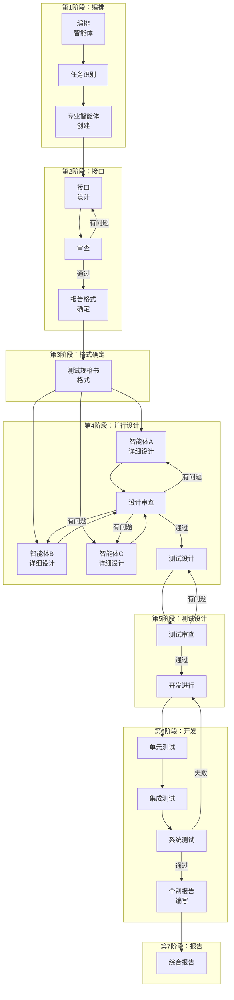
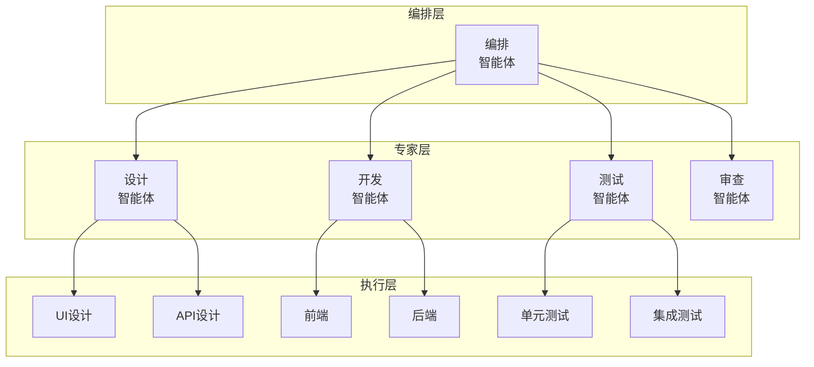
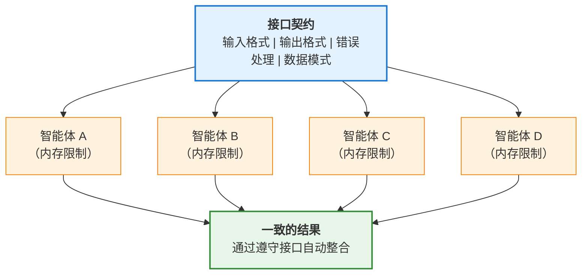
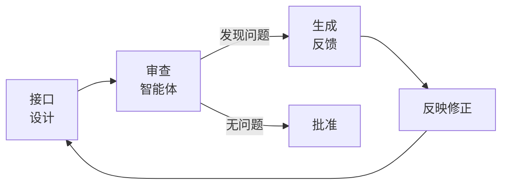
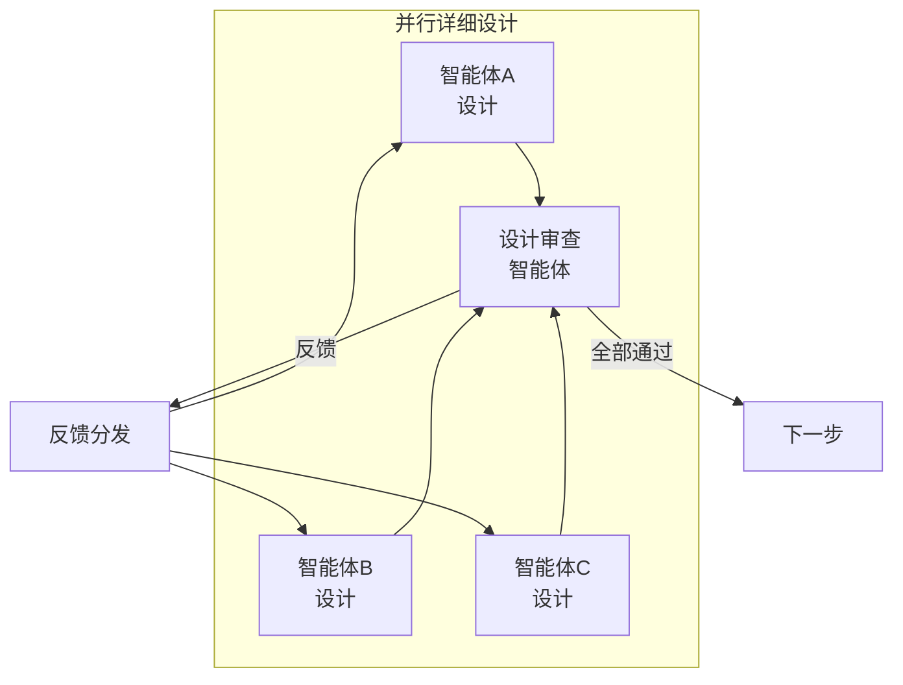
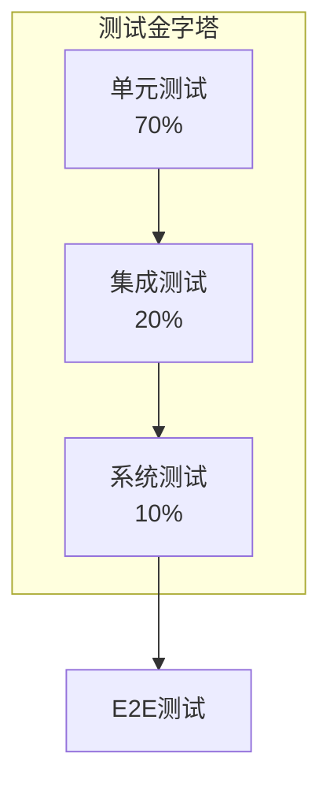
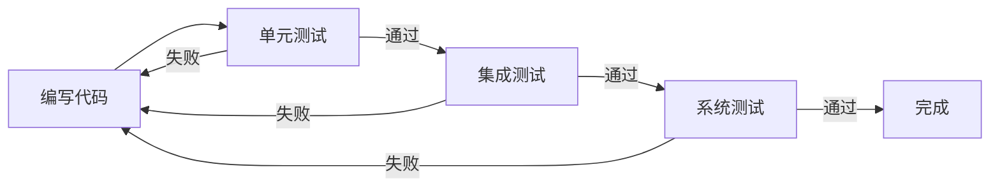
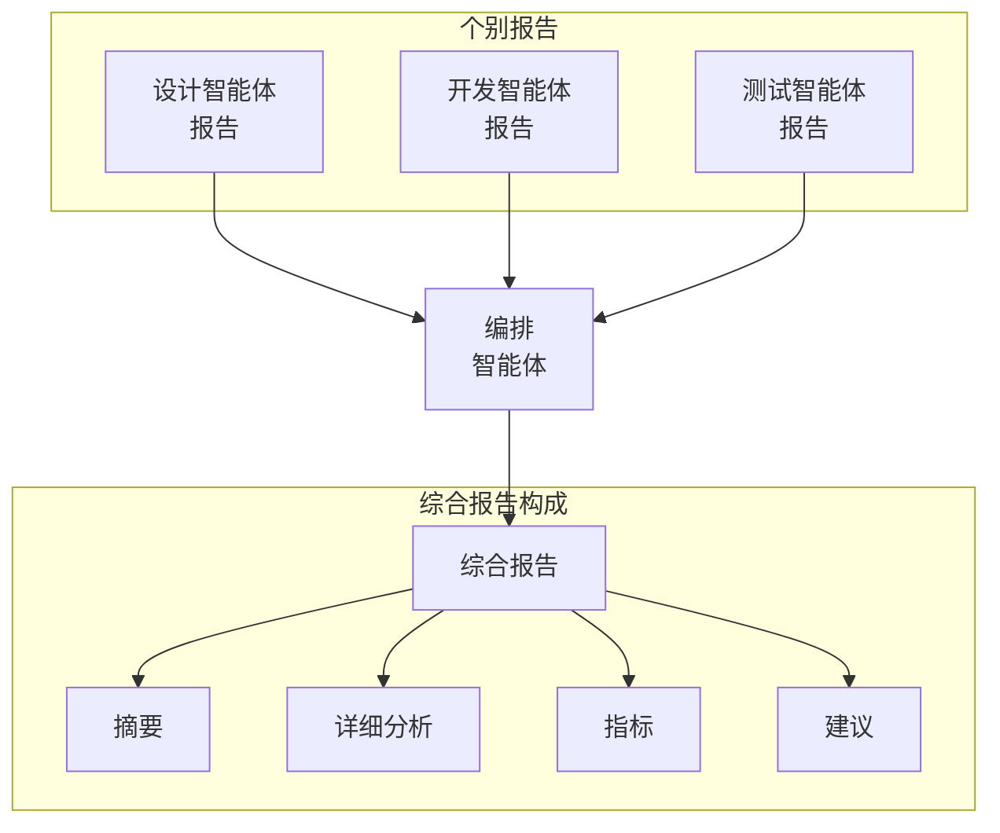
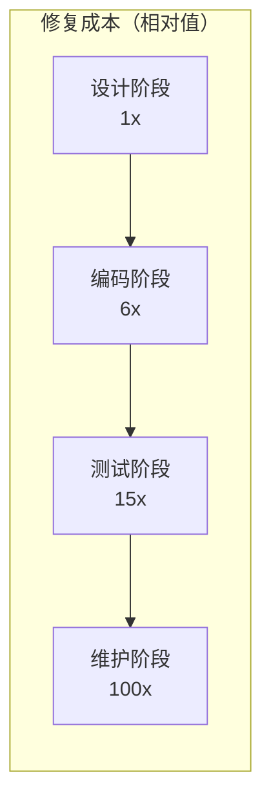

## 引言

在复杂的软件开发项目中，错误管理一直是最大的挑战之一。随着功能增加和系统间依赖关系变得复杂，一个简单的bug频繁威胁整个系统的稳定性。传统开发方法论提出了各种方法来解决这个问题，但随着AI时代的到来，一个全新的范式出现了。

### 本方法论的核心洞察

本文介绍的方法论核心很简单：

> **"先设计接口，让所有智能体遵守这个接口契约，即使单个智能体有内存限制，错误也会最小化。"**

基于LLM的智能体有一个本质性的限制——<strong>上下文窗口（内存）限制</strong>。在复杂项目中，单个智能体很难把握整体上下文。但是如果**像北极星一样先确立接口**：

1. 即使单个智能体不了解整体上下文，**只需遵守自己的输入输出契约**即可
2. 即使内存被重置，**参考接口文档**就能保持一致性
3. 多个智能体的结果可以**自然整合**
4. 最终**实现40〜90%的错误率降低**

### 现有方法论的局限

<strong>瀑布模型（Waterfall）</strong>提供了顺序且可预测的开发流程，但后期发现的缺陷修复成本呈指数级增长。根据Boehm的研究，维护阶段发现的缺陷修复成本是设计阶段的<strong>100倍</strong>。

<strong>敏捷（Agile）方法论</strong>通过迭代开发和快速反馈循环缓解了这个问题，但难以维护复杂系统的架构一致性，且高度依赖开发者的能力。

### AI多智能体系统的出现

以2024-2025年为节点，基于LLM（大型语言模型）的多智能体系统正在软件工程领域引领革命性变革。根据ACM Transactions on Software Engineering and Methodology发表的He et al.（2024）的研究，多智能体系统通过将复杂问题分解成小单元并由专业化的智能体协作解决的方式，克服了现有方法论的局限。

根据McKinsey的2025年报告，<strong>79〜85%的企业</strong>正在引入或计划引入AI智能体，<strong>23%的组织</strong>已经在整个业务中扩展应用智能体AI系统。

---

## 核心方法论：迭代审查循环

本方法论由7个系统性的步骤组成，在每个步骤中<strong>"审查 → 修正"</strong>循环会持续到没有指出的问题为止。这种方法的核心是以编排智能体为中心的层次结构与并行处理的结合。



### 第1步：确立编排智能体

方法论的第一步是确立将协调整个流程的<strong>编排智能体</strong>。这个智能体作为中央指挥官，负责以下核心功能。

#### 任务识别与分解

编排智能体分析整个项目，将其分解为可独立执行的任务单元。在此过程中重要的是：

1. <strong>把握任务间依赖性</strong>：明确定义哪些任务需要先于其他任务完成
2. <strong>识别并行处理可能性</strong>：将可同时进行的任务分组
3. <strong>分析资源需求</strong>：把握每个任务所需的专业性和工具

#### 专业智能体创建委托

对于识别出的每个任务，编排智能体委托创建适当的专业智能体。如Microsoft的Magentic-One架构所示，有效的智能体配置包括：

- <strong>设计智能体</strong>：负责架构和详细设计
- <strong>审查智能体</strong>：提供质量验证和反馈
- <strong>开发智能体</strong>：实际代码实现
- <strong>测试智能体</strong>：测试设计和执行

#### 层次化编排模式

在Microsoft Azure Architecture Center提出的5种核心编排模式中，本方法论基于<strong>层次化（Hierarchical）模式</strong>：



---

### 第2步：接口结构设计（核心步骤）

> **🎯 这是整个方法论的核心步骤。**

智能体确立后，下一步是设计它们之间的<strong>最优接口结构</strong>。**在开发之前彻底完成这一步是本方法论最重要的原则。**

#### 为什么接口优先？

LLM智能体最大的限制是<strong>上下文窗口（内存）限制</strong>。在复杂项目中：

- 单个智能体难以理解整个系统
- 对话变长时会忘记初始上下文
- 多个智能体间的工作结果可能不一致

但如果**先确定接口**：



**每个智能体即使不了解整体上下文，只需遵守自己的输入输出契约即可。** 这就是克服内存限制的核心机制。

#### 接口设计原则

1. <strong>明确的输入输出定义</strong>：明确定义每个智能体接收的输入和生成的输出
2. <strong>最小耦合度</strong>：最小化智能体间的依赖性，使独立修改成为可能
3. <strong>标准化消息格式</strong>：使用JSON、Protocol Buffers等一致的数据格式
4. <strong>错误处理规约</strong>：预先定义异常情况下的行为方式
5. <strong>版本管理</strong>：接口变更时的兼容性维护策略

#### 审查 → 修正循环

接口设计后必须通过审查智能体进行验证：



这个循环会<strong>持续到没有指出的问题为止</strong>。研究表明平均需要2〜4次迭代，每次迭代的问题发现率如下降低：

| 迭代次数 | 问题发现率 | 累计解决率 |
|:---:|:---:|:---:|
| 第1次 | 55% | 55% |
| 第2次 | 25% | 80% |
| 第3次 | 12% | 92% |
| 第4次 | 5% | 97% |

---

### 第3步：确定报告和测试规格书格式

接口确定后，建立项目全程使用的<strong>文档化标准</strong>。这一步经常被忽视，但一致的文档化保证了：

- 所有智能体以相同格式提交结果
- 编排智能体高效的汇总工作
- 后续审计（Audit）和追踪的便利性

#### 任务完成报告格式

每个专业智能体任务完成时应提交的报告标准结构：

```yaml
report:
  agent_id: "design-agent-001"
  task_id: "TASK-2024-001"
  completion_timestamp: "2025-12-06T14:30:00Z"
  status: "completed"

  summary:
    objectives_achieved: true
    deliverables:
      - type: "design_document"
        path: "/docs/api-design-v1.0.md"
      - type: "interface_specification"
        path: "/specs/interface-contract.json"

  metrics:
    review_cycles: 3
    issues_found: 12
    issues_resolved: 12

  dependencies:
    upstream:
      - task_id: "TASK-2024-000"
        status: "verified"
    downstream:
      - task_id: "TASK-2024-002"
        ready: true
```

#### 测试规格书格式

各测试阶段的规格书遵循以下结构：

```yaml
test_specification:
  phase: "integration"  # unit | integration | system
  version: "1.0"

  test_cases:
    - id: "TC-INT-001"
      name: "API端点集成验证"
      priority: "high"
      preconditions:
        - "单元测试100%通过"
        - "API服务器运行状态"
      steps:
        - action: "调用POST /api/users"
          expected: "201 Created响应"
        - action: "调用GET /api/users/{id}"
          expected: "返回创建的用户信息"
      postconditions:
        - "确认数据库正常记录"
```

---

### 第4步：并行详细设计

在这一步，各专业智能体<strong>同时（Parallel）</strong>对其负责领域进行详细设计。并行处理大大缩短了整体开发周期，但没有适当的协调可能会出现不一致问题。

#### 并行设计的优势

根据MIT的2025年研究，并行智能体工作比顺序工作<strong>提高26%的生产力</strong>。特别是：

- 独立模块可同时设计
- 最小化审查等待时间
- 最大化资源利用率

#### 利用设计审查智能体

每个智能体的设计结果提交给专门的<strong>设计审查智能体</strong>。审查智能体：

1. <strong>一致性验证</strong>：确认与整体系统设计的一致性
2. <strong>接口遵守</strong>：第2步达成的接口契约遵守情况
3. <strong>最佳实践应用</strong>：满足行业标准和最佳实践
4. <strong>识别潜在问题</strong>：预先检测未来集成时可能出现的问题

#### 审查循环迭代



这个过程会持续到所有设计通过审查为止。根据Microsoft/IBM的研究，这种迭代审查可以<strong>减少40〜90%的缺陷</strong>。

---

### 第5步：测试设计和实现

基于确定的设计先设计测试。这是<strong>TDD（测试驱动开发）</strong>原则的扩展。

#### 应用测试金字塔



| 测试类型 | 比例 | 目的 |
|:---:|:---:|:---|
| 单元测试 | 70% | 验证单个函数/方法的正确性 |
| 集成测试 | 20% | 验证模块间交互 |
| 系统测试 | 10% | 验证整个系统的需求满足 |

#### 测试设计审查

测试设计也经历审查 → 修正循环：

- <strong>覆盖率验证</strong>：确认所有需求都被测试
- <strong>边界情况</strong>：包含边界条件和异常情况测试
- <strong>性能基准</strong>：非功能性需求测试设计

---

### 第6步：开发和集成测试

在测试准备好的状态下开始开发。这一步的核心是<strong>持续开发直到所有测试通过</strong>。

#### 持续测试执行



研究表明，<strong>变更后立即运行测试</strong>可以减少90%的缺陷（MoldStud, 2024）。

#### 集成测试和系统测试

单元测试完成后，测试专家智能体执行以下任务：

1. 分析单元测试结果
2. 导出集成测试用例
3. 设计系统测试场景
4. 执行测试并报告结果

---

### 第7步：编写综合报告

所有开发和测试完成后，各专家智能体编写自己工作的<strong>个别报告</strong>。这个报告必须遵循第3步定义的格式。

#### 报告汇总流程



编排智能体汇总所有个别报告，生成包含以下内容的<strong>综合报告</strong>：

1. <strong>项目摘要</strong>：整体目标达成情况
2. <strong>各阶段详细分析</strong>：各阶段的成果和问题
3. <strong>质量指标</strong>：审查循环次数、发现/解决的问题数
4. <strong>经验教训和建议</strong>：未来改进点

---

## 有效性验证和研究结果

### 行业研究结果

本方法论的有效性已在多项学术研究和行业报告中得到验证。

#### Microsoft/IBM研究：40-90%缺陷减少

根据Nagappan et al.的研究（Microsoft Research），在应用TDD和迭代审查的4个行业团队中观察到<strong>40〜90%的缺陷减少</strong>。虽然初始开发时间增加了15〜35%，但被维护成本的降低所抵消。

#### MIT研究2025：26%生产力提升

在使用GitHub Copilot的MIT研究中，使用AI工具时平均<strong>提高26%的生产力</strong>。特别是：

- 新开发者：提高27〜39%
- 有经验的开发者：混合结果（需要结构化编排）

#### 即时测试的效果：90%缺陷减少

有研究结果表明，变更后立即运行测试可以<strong>减少90%的缺陷</strong>（MoldStud, 2024）。

### 与现有方法论的比较

| 指标 | 瀑布 | 敏捷 | 迭代审查循环 |
|:---|:---:|:---:|:---:|
| 生产力提升 | 基准线 | 20〜40% | <strong>26%以上</strong> |
| 缺陷率 | 高 | 中 | <strong>减少40〜90%</strong> |
| 灵活性 | 低 | 高 | 自适应 |
| 后期变更成本 | 100x | 中 | <strong>低</strong> |
| 文档化水平 | 高 | 低 | <strong>标准化</strong> |

### 缺陷修复成本分析

基于Boehm研究的缺陷发现时机与修复成本：



迭代审查循环方法论在<strong>设计和编码阶段</strong>发现大部分缺陷，从而最小化修复成本。

---

## 实施时的关键成功因素

### 1. 结构化编排的重要性

METR的2025年研究提供了重要教训。在针对有经验的开源开发者的随机对照实验中，<strong>非结构化方式使用</strong>AI工具反而<strong>慢19%</strong>。

相反，应用<strong>结构化编排</strong>时：
- Amazon内部研究：快57%完成任务
- ServiceNow：80%的支持工单无需人工干预即可解决

### 2. 智能体专业化

根据Microsoft、IBM、OpenAI指南的智能体设计原则：

1. <strong>专注于特定领域</strong>：搜索、研究、编写、审查等明确的角色分离
2. <strong>工具权限绑定</strong>：根据角色限制工具访问权限
3. <strong>基于角色的架构</strong>：Planner、Coder、Critic等明确分工

### 3. 迭代审查的必要性

单次审查无法发现所有问题。根据研究：

- 第1次审查：发现55%的问题
- 第2次审查：额外发现25%（累计80%）
- 第3次审查：额外发现12%（累计92%）
- 第4次审查：额外发现5%（累计97%）

### 4. 可观察性（Observability）

参考Azure AI Foundry方法实现的可观察性：

- <strong>性能指标</strong>：各智能体的响应时间、吞吐量
- <strong>质量指标</strong>：审查通过率、缺陷发现率
- <strong>成本指标</strong>：Token使用量、API调用次数
- <strong>安全指标</strong>：安全验证结果、合规情况

---

## 实际应用案例

### HyperAgent：SWE-Bench 26%成功率

在OpenReview（2024）发表的HyperAgent在GitHub问题解决中：

- <strong>SWE-Bench-Lite</strong>：26%成功率
- <strong>SWE-Bench-Verified</strong>：33%成功率

这大大超过了现有单智能体方式（18%）的结果。

### Microsoft Magentic-One

Microsoft的多智能体系统：

- 中央编排器协调4个专业智能体（WebSurfer、FileSurfer、Coder、ComputerTerminal）
- 在GAIA基准测试中达到<strong>54.3%</strong>
- 远高于单一LLM（14.3%）

### 行业采用趋势

| 来源 | 统计 |
|:---|:---|
| PwC 2025 | 79〜85%的企业引入/计划AI智能体 |
| McKinsey 2025 | 23%的组织扩展应用智能体AI |
| Deloitte 2025 | 26%探索自主智能体开发 |
| 市场规模 | 2024年54.3亿美元 → 2025年79.2亿美元（40%增长） |

### 各行业成果

| 行业 | 成果 |
|:---|:---|
| 航空航天/汽车 | 上市时间缩短50%，成本降低30% |
| 金融服务 | 风险评估和合规自动化 |
| 软件开发 | 2024年90%的顶级AI模型用于开发 |

---

## 结论

### 核心原则再确认

再次强调本方法论最重要的洞察：

> **"先设计接口，让所有智能体遵守这个接口契约，即使单个智能体有内存限制，错误也会最小化。"**

这是现有AI开发方式（非结构化提示）与本方法论的根本区别：

| 区分 | 非结构化AI使用 | 接口优先方法论 |
|:---|:---:|:---:|
| 内存限制应对 | 无应对（上下文丢失） | **通过接口保持一致性** |
| 智能体间整合 | 需要手动协调 | **可自动整合** |
| 错误率 | 高 | **减少40〜90%** |
| 可扩展性 | 有限 | **无限扩展可能** |

### 方法论的核心价值

<strong>迭代审查循环方法论</strong>充分利用AI多智能体系统的潜力，最小化复杂软件开发的错误：

1. <strong>接口是北极星</strong>：所有智能体遵循相同契约
2. <strong>克服内存限制</strong>：即使单个智能体不了解整体也能生成一致结果
3. <strong>验证的效果</strong>：减少40〜90%缺陷，提高26%以上生产力
4. <strong>无限可扩展性</strong>：可根据项目规模添加/调整智能体

### 未来展望

预计2025〜2028年间多智能体系统的采用将进一步加速。根据Gartner，到2028年<strong>33%的企业软件</strong>将内置智能体功能，这比2024年的不到1%大幅增加。

**只需遵守接口优先设计这一简单原则**，就能克服LLM的本质限制，将复杂项目引向成功。

---

## 参考资料

### 学术论文

1. He, J., et al. (2024). "LLM-Based Multi-Agent Systems for Software Engineering: Literature Review, Vision and the Road Ahead." *ACM Transactions on Software Engineering and Methodology*. DOI: 10.1145/3712003

2. Nagappan, N., et al. "Realizing Quality Improvement Through Test Driven Development: Results and Experiences of Four Industrial Teams." *Microsoft Research*.

3. arXiv 2507.08944v1 (2025). "Optimizing Sequential Multi-Step Tasks with Parallel LLM Agents"

4. METR (2025). "Measuring the Impact of Early-2025 AI on Experienced Open-Source Developer Productivity" (arXiv 2507.09089)

### 行业报告

5. McKinsey (2025). "The State of AI in 2025: Agents, Innovation, and Transformation"

6. PwC (2025). "AI Agent Survey" & "2025 AI Business Predictions"

7. Deloitte (2025). "State of Generative AI in the Enterprise Report"

### 技术指南

8. Microsoft Azure Architecture Center. "AI Agent Orchestration Patterns" - https://learn.microsoft.com/en-us/azure/architecture/ai-ml/guide/ai-agent-design-patterns

9. OpenAI. "Orchestrating Multiple Agents - OpenAI Agents SDK" - https://openai.github.io/openai-agents-python/multi_agent/

10. IBM Think (2025). "What is AI Agent Orchestration?" - https://www.ibm.com/think/topics/ai-agent-orchestration
