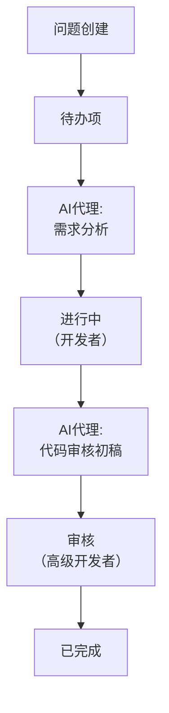
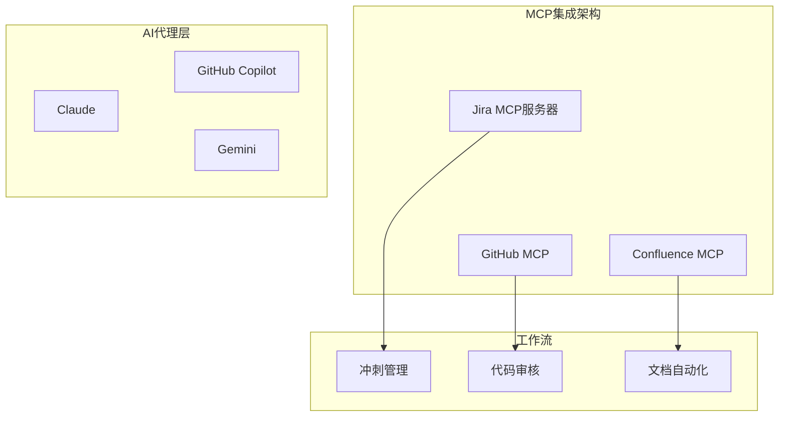

## 概述

2026年2月25日，Atlassian <strong>正式在Jira中引入AI代理</strong>。这不是简单的聊天机器人。AI代理可以在Jira工作流中<strong>获得任务分配、通过评论参与协作、自动执行工作流步骤</strong>。

同时，Atlassian全面采用<strong>Model Context Protocol（MCP）</strong>，不仅Rovo（自有AI）可以连接Jira，GitHub Copilot、Claude、Gemini等外部AI代理也能直接与Jira集成。

对于工程管理者而言，这不仅仅是功能更新，而是<strong>团队运营方式本身的转变信号</strong>。本文从工程管理视角分析发生了什么变化，以及我们需要如何准备。

## 变化了什么 — Jira AI代理的三项核心功能

### 1. 像分配团队成员一样分配代理

现在可以在Jira问题的负责人（Assignee）字段中指定AI代理。由于使用了与人员相同的字段结构，可以无缝集成到现有工作流中。

```
# 传统工作流
问题创建 → 分配开发者 → 工作 → 审核 → 完成

# AI代理集成工作流
问题创建 → 分配AI代理（草稿/研究） → 开发者审核 → 工作 → 完成
```

### 2. 基于评论的@mention协作

在评论中@mention AI代理，可以在问题的上下文中获得摘要、研究、解决方案建议。无需打开额外工具，直接在Jira中与AI协作。

### 3. 工作流自动触发

将AI代理配置到Jira工作流的特定状态（Status），当状态转换时自动执行任务。



## 为什么MCP很重要 — 从厂商锁定中解放

Atlassian采用MCP不仅是技术选择，更是<strong>从厂商锁定中彻底解放</strong>的体现。

### MCP集成现状

通过Atlassian托管的MCP服务器，以下AI客户端可以直接连接到Jira/Confluence：

| AI客户端 | 连接方式 |
|---|---|
| Claude（Anthropic） | MCP原生 |
| GitHub Copilot | MCP集成 |
| Gemini CLI（Google） | MCP集成 |
| Cursor | MCP集成 |
| Lovable | MCP集成 |
| WRITER | MCP集成 |

### Rovo MCP Gallery

通过Atlassian的Rovo MCP Gallery，GitHub、Box、Figma等第三方工具的代理也可以在Jira中运作。值得注意的是，<strong>当前MCP使用量的约1/3来自写入（Write）操作</strong>，这说明AI代理不仅仅在查询数据，而是真正在执行工作。

### 企业采用现状

- MCP使用量的<strong>93%来自付费客户</strong>
- 企业账户占MCP工作量的<strong>约一半</strong>
- 这是已经在实际工作中大规模应用的证据

## 工程管理者需要准备的5件事

### 1. 建立AI代理治理体系

当AI代理加入团队时，必须<strong>明确权限和责任的边界</strong>。

```yaml
# AI代理治理检查清单
permissions:
  - 定义代理可访问的项目范围
  - 设置授予写入权限的标准
  - 生产环境变更必须经过人工审批

audit:
  - 决定代理活动日志监控周期
  - 设置异常行为检测标准
  - 建立月度代理性能评审流程

escalation:
  - 代理失败时的备用流程
  - 代理→人工升级的触发条件
  - 紧急情况下的代理停用程序
```

### 2. 重新定义团队角色

当AI代理承担重复工作时，团队成员的角色随之改变。

<strong>变化前</strong>：开发者直接执行问题分类、代码审核初稿、文档更新
<strong>变化后</strong>：AI生成初稿，开发者专注于验证和决策

作为工程管理者，重点是将这种转变<strong>定位为机遇而非威胁</strong>。明确设计哪些工作由AI承担，哪些工作由人承担，让团队成员专注于更有价值的工作。

### 3. 基于MCP的工具集成战略

MCP现在已是事实上的标准。虽然由Anthropic创建，但已捐赠给Linux Foundation，OpenAI、Google、Microsoft、AWS都已支持。



### 4. 分阶段实施路线图

不要一次性改变所有内容。分阶段实施。

<strong>第一阶段（1〜2周）</strong>：从只读代理开始
- 问题摘要、冲刺报告自动生成
- 风险：低，价值：立即体现

<strong>第二阶段（3〜4周）</strong>：有限度地引入写入代理
- 问题标签、优先级建议
- 必须包含人工审批关卡

<strong>第三阶段（2个月以上）</strong>：工作流自动化
- 状态转换触发代理
- 与CI/CD管道连接
- 定期测量效果并调整

### 5. 设计衡量指标

必须能够量化测量AI代理引入的价值。

| 指标 | 测量方法 | 目标 |
|---|---|---|
| 问题分类时间 | 问题创建→首次响应时间 | 缩短50% |
| 重复工作占比 | AI处理工作/总工作 | 30%以上 |
| 开发者满意度 | 月度调查（1-5分） | 3.5分以上 |
| 代理准确性 | AI建议采纳率 | 70%以上 |
| 冲刺速度变化 | 点数/冲刺 | 提高20% |

## 实战场景 — 工程管理者的一天如何改变

### 变化前：传统冲刺管理

```
09:00 - 问题分类（30分钟）
09:30 - 站立会准备（了解各成员进展，15分钟）
10:00 - 站立会议
10:30 - 解决阻碍（与其他团队协调，1小时）
14:00 - 代码审核（1小时）
15:00 - 冲刺评审准备（30分钟）
```

### 变化后：利用AI代理

```
09:00 - 审核AI分类结果（10分钟）
09:10 - 审核AI生成的站立会总结（5分钟）
09:30 - 站立会议（基于AI总结更高效）
10:00 - 专注于战略性阻碍解决（AI提供前期分析）
14:00 - 基于AI代码审核初稿进行评审（30分钟）
14:30 - 利用节省的时间进行一对一会议、技术债清理
```

<strong>核心转变</strong>：工程管理者的角色从"工作管理者"转变为"决策者"。

## 需要注意的事项

### AI代理≠万能工具

- 代理是工具。<strong>判断权仍在人</strong>
- 初期代理输出质量可能不稳定。一定要设置验证流程
- 考虑团队成员的心理安全感。主动应对"AI会替代我的工作"的焦虑

### 安全和合规

- 尊重Jira现有的权限体系
- 所有代理活动都保留审计记录
- 生产环境修改必须经过人工审批
- 代理在开发者隔离的沙箱环境中运行

## 结论

Atlassian的Jira AI代理+MCP采用是<strong>项目管理工具的范式转变</strong>。随着MCP成为事实上的标准，AI代理与开发工具的集成速度将加快。

作为工程管理者，现在需要做的很明确：

1. <strong>理解MCP生态</strong>，为团队找到合适的AI代理组合
2. <strong>先设计治理体系</strong>再引入
3. <strong>分阶段实施</strong>，但要配合可衡量的指标
4. <strong>将团队角色转变定位为机遇</strong>

2026年是AI代理从演示走向实战的一年。Jira这个被数百万个团队使用的平台上的这一变化，是这一转变最明确的信号。

## 参考资源

- [Atlassian官方发布 — Jira中的AI代理](https://www.atlassian.com/blog/announcements/ai-agents-in-jira)
- [TechCrunch — Jira最新更新让AI代理和人类并肩工作](https://techcrunch.com/2026/02/25/jiras-latest-update-allows-ai-agents-and-humans-to-work-side-by-side/)
- [SiliconANGLE — Atlassian在Jira中嵌入代理并采用MCP](https://siliconangle.com/2026/02/25/atlassian-embeds-agents-jira-embraces-mcp-third-party-integrations/)
- [MCP官方网站](https://modelcontextprotocol.io/)
