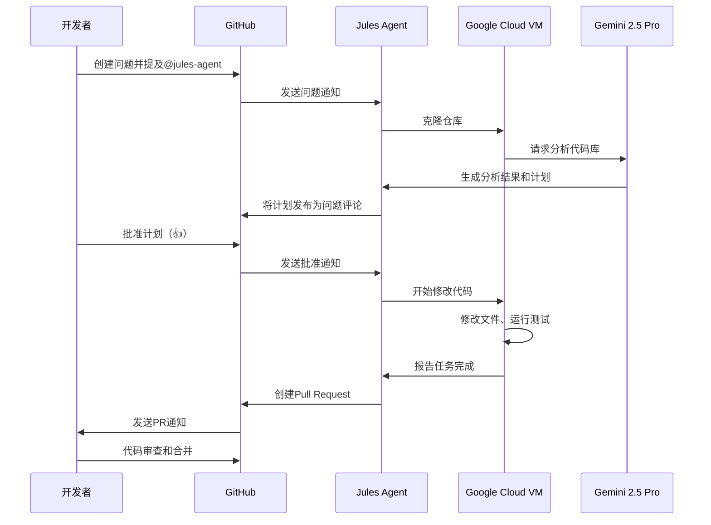

## 概述

作为开发者，你一定经历过在重复性的错误修复、编写测试和依赖项更新等任务上浪费时间的情况。Google在2024年12月推出的<strong>Jules</strong>是一个旨在解决这些问题的革命性AI编程代理（AI Coding Agent）。

Jules不仅仅是一个简单的代码自动补全工具。当被分配到GitHub问题（issue）后，它能在后台自主分析代码库、制定计划、修改代码，最终创建Pull Request——这是一个<strong>完全自主的AI代理</strong>。

### 与其他AI编程工具的差异

目前市场上有各种AI编程工具：

- <strong>GitHub Copilot</strong>：实时代码自动补全和建议
- <strong>Cursor</strong>：基于AI的IDE，支持对话式代码编辑
- <strong>Claude Code</strong>：基于终端的AI编程助手

Jules的核心差异在于<strong>异步性（asynchronous）</strong>。其他工具在开发者的IDE中实时工作，而Jules在Google Cloud的隔离虚拟机中独立执行任务。开发者只需分配GitHub问题并批准计划，就可以继续其他工作，等待Jules完成任务。

### 核心价值主张

1. <strong>节省时间</strong>：自动化重复且耗时的任务
2. <strong>透明度</strong>：通过GitHub问题评论分享所有推理过程和计划
3. <strong>安全性</strong>：在隔离的VM中运行，不影响本地环境
4. <strong>深度理解</strong>：Gemini 2.5 Pro的200万token上下文窗口可分析整个代码库

## Jules的核心功能

### 1. GitHub原生集成

Jules与GitHub完美集成。无需额外的插件或配置，只需在GitHub问题中提及`@jules-agent`或直接分配问题即可开始工作。

```markdown
<!-- GitHub问题示例 -->
## Bug：登录页面邮箱验证失败

@jules-agent 请修复此错误。

<strong>复现步骤</strong>：
1. 访问登录页面
2. 输入无效的邮箱格式
3. 点击Submit按钮

<strong>预期行为</strong>：显示错误消息
<strong>实际行为</strong>：表单提交时没有错误提示
```

### 2. 异步工作流程

Jules最大的优势是后台执行。分配任务后：

1. 仓库被克隆到Google Cloud VM
2. Jules分析代码库并生成计划
3. 开发者审查并批准计划
4. Jules自主修改代码并运行测试
5. 完成后创建Pull Request

整个过程与开发者的本地环境独立，可以继续进行其他工作。

### 3. 透明的计划和推理过程

Jules在开始工作前会通过GitHub问题评论分享详细计划：

```markdown
## Jules计划

<strong>分析结果</strong>：
- 问题：`LoginForm.tsx`中缺少邮箱验证逻辑
- 相关文件：`src/components/LoginForm.tsx`、`src/utils/validation.ts`

<strong>解决方法</strong>：
1. 在`validation.ts`中添加邮箱验证函数
2. 在`LoginForm.tsx`中调用验证函数
3. 添加错误消息UI
4. 编写单元测试

<strong>预计修改的文件</strong>：
- `src/components/LoginForm.tsx`（修改）
- `src/utils/validation.ts`（修改）
- `tests/LoginForm.test.ts`（新建）

如需批准，请添加👍反应或评论"批准"。
```

### 4. 自动生成PR

任务完成后，Jules会自动创建Pull Request，包括：

- 变更的详细说明
- 修改的文件列表
- 测试结果
- 相关GitHub问题链接

### 5. 基于Gemini 2.5 Pro的全代码库理解

Jules使用Google最新的AI模型Gemini 2.5 Pro。该模型支持<strong>200万token</strong>的上下文窗口，能够一次性分析整个大型代码库。

例如，即使是超过10万行代码的代码库，它也能完全理解文件间依赖关系、架构模式和编码风格，并生成一致的代码。

## 技术架构和工作原理

让我们通过图表了解Jules的工作流程：



### 详细步骤说明

#### 1. 通过GitHub问题/评论分配任务

开发者在GitHub问题中提及`@jules-agent`或直接将问题分配给Jules。问题应包含清晰的任务描述。

<strong>好的示例</strong>：
```markdown
## 功能：添加用户头像上传

@jules-agent 请实现以下需求：
- 用户可以上传头像图片
- 图片大小限制在5MB以下
- 支持的格式：JPG、PNG、WebP
- 上传后自动生成缩略图（200x200）
```

<strong>不好的示例</strong>：
```markdown
添加头像功能
```

#### 2. 在Google Cloud VM中克隆仓库

Jules在隔离的Google Cloud VM环境中克隆仓库。这提供了以下优势：

- <strong>安全性</strong>：与开发者的本地环境完全分离
- <strong>可重现性</strong>：保证一致的执行环境
- <strong>可扩展性</strong>：可以并行处理多个任务

#### 3. Gemini 2.5 Pro分析和生成计划

Jules将整个代码库传递给Gemini 2.5 Pro并请求：

- 识别与问题相关的文件
- 理解代码库的架构模式
- 分析现有的编码风格
- 生成需要修改的文件列表
- 制定分步执行计划

#### 4. 开发者批准

生成的计划会发布为GitHub问题评论。开发者可以通过以下方式批准：

- 在评论中添加👍表情反应
- 编写"批准"或"Approve"评论
- 如需修改计划，可以编写反馈评论

#### 5. 自主执行（修改文件、测试）

获得批准后，Jules执行计划：

1. 修改必要的文件
2. 创建新文件（如需要）
3. 编写或修改测试
4. 运行测试命令（如`npm test`或`pytest`）
5. 运行lint和格式化工具
6. 确认所有测试通过

#### 6. 创建PR

任务完成后，Jules自动创建Pull Request：

```markdown
## Pull Request：添加用户头像上传功能

Fixes #123

### 变更内容
- 添加`ProfileUpload.tsx`组件
- 实现图片验证逻辑（`utils/imageValidation.ts`）
- 添加缩略图生成API端点（`/api/thumbnail`）
- 添加单元测试和集成测试

### 测试结果
✅ 所有测试通过（42/42）
✅ 无lint错误
✅ 类型检查通过

### 截图
[图片上传UI截图]
```

#### 7. 审查和合并

开发者审查PR，如有需要可以请求额外修改。Jules也可以根据审查评论进行进一步修改。

## 集成方法

有三种方法将Jules集成到项目中。

### 1. GitHub Web界面

最简单的方法。在GitHub上安装Jules，然后在问题中提及或分配即可。

<strong>安装步骤</strong>：

1. 在GitHub市场搜索"Jules AI Agent"
2. 在仓库中安装Jules应用
3. 授权权限（读/写访问）
4. 在问题中提及`@jules-agent`进行测试

### 2. Jules Tools CLI

2025年10月发布的CLI工具可以直接在终端管理Jules任务。

<strong>安装</strong>：

```bash
# 使用npm全局安装
npm install -g @google/jules-tools

# 使用yarn
yarn global add @google/jules-tools

# 确认安装
jules --version
```

<strong>基本用法</strong>：

```bash
# 创建新任务
jules task create \
  --repo="myorg/myproject" \
  --title="Bug修复：登录验证" \
  --description="添加邮箱验证逻辑"

# 查看任务列表
jules task list --repo="myorg/myproject"

# 查看任务状态
jules task status --id="task-123"

# 批准任务
jules task approve --id="task-123"

# 取消任务
jules task cancel --id="task-123"
```

<strong>高级用法</strong>：

```bash
# 使用配置文件进行批量任务
# jules.config.json:
# {
#   "tasks": [
#     {
#       "title": "测试覆盖率达到80%",
#       "priority": "high",
#       "labels": ["testing"]
#     },
#     {
#       "title": "依赖项更新",
#       "priority": "low",
#       "labels": ["maintenance"]
#     }
#   ]
# }

jules batch create --config=jules.config.json

# 自动批准模式（注意：仅用于可信任的任务）
jules task create \
  --repo="myorg/myproject" \
  --title="修复lint错误" \
  --auto-approve
```

### 3. Public API（早期访问）

要以编程方式集成Jules，可以使用Public API。目前处于早期访问阶段。

<strong>API示例</strong>：

```typescript
// 初始化Jules API客户端
import { JulesClient } from '@google/jules-api';

const client = new JulesClient({
  apiKey: process.env.JULES_API_KEY,
});

// 创建任务
const task = await client.tasks.create({
  repository: 'myorg/myproject',
  title: 'Bug修复：登录验证',
  description: '添加邮箱验证逻辑',
  assignee: 'jules-agent',
  labels: ['bug', 'high-priority'],
});

console.log(`任务已创建：${task.id}`);

// 监控任务状态
const statusUpdates = client.tasks.watch(task.id);

for await (const update of statusUpdates) {
  console.log(`状态：${update.status}`);

  if (update.status === 'plan_ready') {
    console.log('计划：', update.plan);

    // 自动批准（或手动审查后）
    await client.tasks.approve(task.id);
  }

  if (update.status === 'completed') {
    console.log('PR已创建：', update.pullRequestUrl);
    break;
  }

  if (update.status === 'failed') {
    console.error('失败：', update.error);
    break;
  }
}
```

<strong>Webhook配置</strong>：

```typescript
// 通过webhook接收事件
app.post('/webhooks/jules', async (req, res) => {
  const event = req.body;

  switch (event.type) {
    case 'task.plan_ready':
      // 计划审查逻辑
      await reviewPlan(event.task);
      break;

    case 'task.completed':
      // 自动请求PR审查
      await requestReview(event.pullRequest);
      break;

    case 'task.failed':
      // 发送失败通知
      await notifyTeam(event.error);
      break;
  }

  res.sendStatus(200);
});
```

## 实战应用案例

让我们看看如何在实际开发工作流程中应用Jules的具体案例。

### 1. Bug分类和修复

<strong>场景</strong>：生产环境中报告了用户登录失败的bug。

<strong>传统工作流程</strong>：
1. 重现bug（30分钟）
2. 在代码库中查找相关文件（20分钟）
3. 分析原因（40分钟）
4. 修复和测试（1小时）
5. 创建PR和审查（30分钟）

<strong>总耗时</strong>：约3小时

<strong>使用Jules</strong>：

```markdown
## GitHub问题 #456：登录失败bug

<strong>症状</strong>：
- 特定邮箱格式登录失败
- 错误消息："Invalid credentials"
- 重现率：约5%用户

<strong>复现步骤</strong>：
1. 邮箱包含'+'字符（如：user+test@example.com）
2. 输入正确密码
3. 尝试登录

@jules-agent 请分析并修复此bug。
```

<strong>Jules的工作</strong>：
1. 自动识别登录相关文件（`auth.ts`、`validation.ts`等）
2. 发现'+'字符处理bug（邮箱验证正则表达式错误）
3. 提出修复方案并等待批准（10分钟）
4. 自动修改代码并运行测试（20分钟）
5. 自动创建PR（5分钟）

<strong>开发者耗时</strong>：约15分钟（编写问题+审查计划）
<strong>节省时间</strong>：约2小时45分钟

### 2. 提升测试覆盖率

<strong>场景</strong>：需要将代码覆盖率从60%提升到80%。

<strong>使用Jules</strong>：

```markdown
## GitHub问题 #789：达到80%测试覆盖率

@jules-agent 请按以下条件提升测试覆盖率：

<strong>要求</strong>：
- 当前覆盖率：60%
- 目标覆盖率：80%
- 优先级：核心业务逻辑（src/services/）

<strong>约束</strong>：
- 不要修改现有测试
- 使用Jest框架
- 优先单元测试，仅必要时使用集成测试
```

<strong>Jules的工作</strong>：
1. 分析覆盖率报告（`npm run test:coverage`）
2. 识别未覆盖的代码路径
3. 从高优先级文件开始编写测试
4. 添加边界情况和错误处理测试
5. 确认覆盖率达到80%

<strong>结果</strong>：
- 添加45个新测试用例
- 覆盖率从60%提升到82%
- 开发者耗时：30分钟（审查计划+审查PR）
- Jules工作时间：约2小时（后台）

### 3. 依赖项更新

<strong>场景</strong>：需要更新发现安全漏洞的依赖项。

<strong>传统工作流程的问题</strong>：
- 需要检查破坏性变更
- 不确定是否需要修改代码
- 运行和验证测试需要时间
- 同时更新多个依赖项困难

<strong>使用Jules</strong>：

```markdown
## GitHub问题 #1001：依赖项安全更新

@jules-agent 请更新以下依赖项并解决兼容性问题：

<strong>更新列表</strong>：
- axios: 0.27.2 → 1.6.0（修复安全漏洞）
- react-router-dom: 6.8.0 → 6.20.0
- typescript: 4.9.0 → 5.3.0

<strong>要求</strong>：
- 处理破坏性变更
- 确认所有测试通过
- 修复类型错误
```

<strong>Jules的工作</strong>：
1. 更新依赖项：`npm update`
2. 检查破坏性变更文档
3. 自动修复类型错误
4. 运行测试并修复失败的测试
5. 记录变更内容

<strong>PR示例</strong>：

````markdown
## 依赖项安全更新

### 变更内容

<strong>axios 0.27.2 → 1.6.0</strong>：
- 修复安全漏洞CVE-2023-XXXX
- 破坏性变更：`AxiosError`类型变更
- 影响文件：`src/api/client.ts`（类型已修复）

<strong>react-router-dom 6.8.0 → 6.20.0</strong>：
- `useNavigate`选项变更
- 影响文件：`src/components/Navigation.tsx`（已更新）

<strong>typescript 4.9.0 → 5.3.0</strong>：
- 应用新的类型检查规则
- 更新`tsconfig.json`（strictNullChecks相关）
- 修复类型错误：12个文件

### 测试结果
✅ 所有单元测试通过（156/156）
✅ 集成测试通过（23/23）
✅ 类型检查通过
✅ 构建成功

### 安全扫描
✅ 0个漏洞（之前：3个）
````

### 4. 代码重构

<strong>场景</strong>：需要将遗留代码重构为现代模式。

<strong>使用Jules</strong>：

```markdown
## GitHub问题 #1234：将遗留类组件转换为函数组件

@jules-agent 请执行以下任务：

<strong>范围</strong>：
- `src/components/legacy/`文件夹中的所有类组件
- 共15个文件

<strong>要求</strong>：
- 转换为React Hooks（useState、useEffect等）
- PropTypes → TypeScript接口
- 100%保持现有行为（无回归bug）
- 更新测试

<strong>约束</strong>：
- 每次处理3〜5个文件（限制PR大小）
- 每个PR应该可以独立合并
```

<strong>Jules的策略</strong>：
1. 将15个文件分为3批
2. 为每批创建单独的分支和PR
3. 按顺序进行工作

<strong>批次1 PR</strong>：
- 转换`UserProfile.tsx`、`UserSettings.tsx`、`UserAvatar.tsx`
- 确认测试通过
- 可以独立合并

<strong>结果</strong>：
- 代码行数减少30%
- 性能提升（移除不必要的渲染）
- 改善类型安全性
- 开发者耗时：每个PR审查15分钟（共45分钟）

## 与其他AI编程工具的比较

市场上有各种AI编程工具，但每个工具都有其最佳使用场景。请参考以下表格：

| 功能/工具 | Jules | Claude Code | GitHub Copilot | Cursor |
|----------|-------|-------------|----------------|--------|
| <strong>执行方式</strong> | 异步（基于VM） | 同步（终端） | 同步（IDE） | 同步（IDE） |
| <strong>主要用例</strong> | 自动解决问题、生成PR | 整体项目重构 | 实时代码编写支持 | 对话式代码编辑 |
| <strong>GitHub集成</strong> | ⭐⭐⭐⭐⭐ 原生 | ⭐⭐⭐ 基于CLI | ⭐⭐⭐⭐ 应用集成 | ⭐⭐ Git连接 |
| <strong>自主性</strong> | ⭐⭐⭐⭐⭐ 完全自主 | ⭐⭐⭐⭐ 高度自主 | ⭐⭐ 以建议为中心 | ⭐⭐⭐ 对话式 |
| <strong>代码库理解</strong> | ⭐⭐⭐⭐⭐ 200万token | ⭐⭐⭐⭐⭐ 20万token | ⭐⭐⭐ 文件级别 | ⭐⭐⭐⭐ 项目级别 |
| <strong>自动运行测试</strong> | ✅ 自动 | ✅ 自动 | ❌ 手动 | ✅ 自动 |
| <strong>自动生成PR</strong> | ✅ 自动 | ✅ 需要手动命令 | ❌ 无 | ❌ 无 |
| <strong>需要IDE</strong> | ❌ 不需要 | ❌ 仅终端 | ✅ VSCode等 | ✅ Cursor IDE |
| <strong>支持语言</strong> | Python、JS/TS | 大多数语言 | 大多数语言 | 大多数语言 |
| <strong>价格（月）</strong> | $0〜124.99 | $20 | $10〜39 | $20〜40 |
| <strong>免费计划</strong> | ✅ 15任务/天 | ❌ 无 | ✅ 有限 | ✅ 有限 |

### 各工具的最佳使用场景

<strong>选择Jules</strong>：
- ✅ 想要自动解决GitHub问题时
- ✅ 想要在后台执行任务时
- ✅ 想要节省重复性bug修复、编写测试的时间时
- ✅ 想要提高整个团队的生产力时
- ❌ 需要实时代码编写支持时（使用其他工具）

<strong>选择Claude Code</strong>：
- ✅ 偏好基于终端的工作流程时
- ✅ 需要复杂重构时
- ✅ 需要探索整个文件系统时
- ✅ 偏好Anthropic的Claude模型时

<strong>选择GitHub Copilot</strong>：
- ✅ 需要实时代码自动补全时
- ✅ 想要在IDE内完成所有工作时
- ✅ 快速编写单个函数或小代码块时
- ✅ 使用多种语言和框架时

<strong>选择Cursor</strong>：
- ✅ 想要以对话方式编辑代码时
- ✅ 想要用自然语言与AI沟通开发时
- ✅ 能够适应新IDE环境时
- ✅ 需要Cursor的多文件编辑功能时

### 工具组合策略

为了获得最高生产力，组合使用多个工具是有效的：

<strong>推荐组合1：Jules + GitHub Copilot</strong>
- <strong>Jules</strong>：问题解决、编写测试、重构
- <strong>Copilot</strong>：实时代码编写、自动补全
- <strong>优点</strong>：异步任务和实时支持的和谐

<strong>推荐组合2：Jules + Claude Code</strong>
- <strong>Jules</strong>：基于GitHub问题的自动化
- <strong>Claude Code</strong>：本地复杂代码探索和修改
- <strong>优点</strong>：两者都自主且具有强大的代码库理解能力

<strong>推荐组合3：Jules + Cursor</strong>
- <strong>Jules</strong>：后台自动化（bug修复、测试）
- <strong>Cursor</strong>：对话式功能开发
- <strong>优点</strong>：例行任务自动化+创意开发支持

## 定价和可用性

Jules从2024年12月开始通过Google AI Studio提供，有三种定价计划。

### 定价计划比较

| 计划 | 价格（月） | 任务限额 | 最佳用户 |
|------|----------|----------|------------|
| <strong>Free</strong> | $0 | 15任务/天 | 个人开发者、小型项目 |
| <strong>Pro</strong> | $19.99 | 75任务/天 | 专业开发者、初创公司 |
| <strong>Ultra</strong> | $124.99 | 300任务/天 | 团队、企业 |

### 任务限额计算示例

<strong>场景：3人开发团队</strong>

<strong>每日任务</strong>：
- Bug修复：5个
- 编写测试：3个
- 依赖项更新：1个
- 重构：2个
- <strong>总计</strong>：11任务/天

<strong>推荐计划</strong>：
- <strong>Free计划</strong>：可行（15任务/天）
- 余量：4任务/天
- <strong>成本</strong>：$0/月

<strong>场景：10人开发团队</strong>

<strong>每日任务</strong>：
- Bug修复：15个
- 编写测试：10个
- 依赖项更新：3个
- 重构：5个
- 功能开发支持：10个
- <strong>总计</strong>：43任务/天

<strong>推荐计划</strong>：
- <strong>Pro计划</strong>：合适（75任务/天）
- 余量：32任务/天
- <strong>成本</strong>：$19.99/月（整个团队）

### 成本效益分析

<strong>开发者时间节省计算</strong>：

假设：
- 开发者时薪：$50
- Jules平均每任务节省2小时
- Pro计划：75任务/天

<strong>月度节省</strong>：
- 每日任务：30个（留有余地）
- 每日节省时间：30任务 × 2小时 = 60小时
- 月度节省时间：60小时 × 22天 = 1,320小时
- <strong>月度成本节省</strong>：1,320小时 × $50 = $66,000
- <strong>Jules成本</strong>：$19.99
- <strong>净节省</strong>：$65,980.01

当然，不可能将所有任务都交给Jules，但仅通过重复性任务就能获得可观的投资回报率。

### 免费计划的战略性利用

虽然每天有15个任务的限制，但可以通过以下策略最大化利用：

1. <strong>优先任务</strong>：从最重复且最耗时的任务开始
2. <strong>批量任务</strong>：将多个bug合并为一个任务
3. <strong>自动化模式</strong>：让Jules学习经常重复的任务
4. <strong>时区分散</strong>：团队成员在各自的时区分配任务

## 限制和注意事项

虽然Jules很强大，但存在以下限制。

### 1. 当前支持的语言

<strong>完全支持</strong>：
- ✅ Python（3.8+）
- ✅ JavaScript / TypeScript（Node.js 16+、React、Vue、Angular）

<strong>部分支持</strong>（beta版）：
- ⚠️ Go（仅简单任务）
- ⚠️ Rust（仅基本功能）
- ⚠️ Java（仅限Spring Boot）

<strong>不支持</strong>：
- ❌ C/C++
- ❌ Ruby
- ❌ PHP
- ❌ Swift / Objective-C
- ❌ Kotlin

<strong>应对方法</strong>：
- 对于多语言项目，仅在Python/TypeScript部分使用Jules
- 其他语言使用Claude Code或Copilot

### 2. 仅英文界面

目前Jules仅提供英文界面，建议用英文编写GitHub问题。

<strong>中文问题示例</strong>：

```markdown
## Bug：登录失败

@jules-agent 请修复此bug。
```

Jules可以理解中文，但响应以英文提供：

```markdown
## Plan

<strong>Analysis</strong>:
I've identified the issue in the login validation logic...

<strong>Proposed Solution</strong>:
1. Fix email validation regex
2. Add error message display
...
```

<strong>建议</strong>：
- 问题标题和主要描述用英文编写
- 详细说明可以使用中文
- 代码注释保持现有项目风格

### 3. 异步延迟时间

Jules在后台工作，因此不适合需要即时反馈的情况。

<strong>典型任务时间</strong>：
- 生成计划：5〜15分钟
- 简单bug修复：15〜30分钟
- 编写测试：30分钟〜1小时
- 复杂重构：1〜3小时

<strong>应对方法</strong>：
- 紧急bug自行修复
- 将重复且不紧急的任务分配给Jules
- 批量分配多个任务以利用等待时间

### 4. 仅限GitHub

Jules与GitHub紧密集成，无法在其他平台使用。

<strong>支持</strong>：
- ✅ GitHub.com
- ✅ GitHub Enterprise Cloud
- ❌ GitLab
- ❌ Bitbucket
- ❌ Azure DevOps

<strong>应对方法</strong>：
- 创建GitHub镜像仓库
- 用Jules完成工作后同步到其他平台
- 或使用其他AI工具（Claude Code与平台无关）

### 5. 复杂决策的限制

Jules针对明确的任务进行了优化，在以下情况下可能会遇到困难：

<strong>困难任务</strong>：
- ❌ 架构设计决策（如："微服务 vs 单体"）
- ❌ 业务逻辑设计（如："设计支付系统"）
- ❌ 创意UI/UX设计
- ❌ 模糊需求（如："更好的性能"）

<strong>适合的任务</strong>：
- ✅ 明确的bug修复
- ✅ 编写测试（基于现有代码）
- ✅ 统一代码风格
- ✅ 依赖项更新
- ✅ 文档化

## 最佳实践

介绍有效使用Jules的最佳实践。

### 1. 编写清晰的GitHub问题

<strong>好的问题示例</strong>：

```markdown
## Bug: Email validation fails for addresses with plus sign

<strong>Current Behavior</strong>:
Users cannot log in when their email contains a '+' character
(e.g., user+test@example.com)

<strong>Expected Behavior</strong>:
All valid email formats should be accepted according to RFC 5322

<strong>Steps to Reproduce</strong>:
1. Navigate to /login
2. Enter email: user+test@example.com
3. Enter valid password
4. Click "Login"
5. Observe error: "Invalid email format"

<strong>Technical Context</strong>:
- Affected file: src/utils/validation.ts (suspected)
- Current regex: /^[a-zA-Z0-9._-]+@[a-zA-Z0-9.-]+\.[a-zA-Z]{2,6}$/
- Issue: Missing '+' in allowed characters

<strong>Acceptance Criteria</strong>:
- [ ] Email validation accepts '+' character
- [ ] Existing tests still pass
- [ ] New test case added for '+' character
- [ ] No regression in other validation logic

@jules-agent Please fix this bug and add appropriate tests.
```

<strong>不好的问题示例</strong>：

```markdown
登录失败

@jules-agent 修复
```

<strong>关键要素</strong>：
1. <strong>清晰的标题</strong>：用一句话总结问题
2. <strong>当前行为 vs 预期行为</strong>：明确说明错误之处
3. <strong>复现步骤</strong>：让Jules理解问题
4. <strong>技术背景</strong>：相关文件或函数的提示
5. <strong>验收标准</strong>：明确完成条件

### 2. 计划审查和批准流程

审查Jules提出的计划时需要检查的事项：

<strong>检查清单</strong>：
```markdown
## 计划审查检查清单

- [ ] <strong>范围</strong>：是否只修改必要的文件？
- [ ] <strong>方法</strong>：解决方法是否适当？
- [ ] <strong>副作用</strong>：是否可能影响其他功能？
- [ ] <strong>测试</strong>：是否包含足够的测试用例？
- [ ] <strong>性能</strong>：是否对性能有负面影响？
- [ ] <strong>安全性</strong>：是否引入安全漏洞？
```

<strong>提供反馈示例</strong>：

```markdown
@jules-agent 我已审查计划。请修改以下内容：

1. <strong>调整范围</strong>：除了`validation.ts`，还需要修改`auth.ts`中的邮箱验证逻辑
2. <strong>添加测试</strong>：添加各种邮箱格式的测试用例（RFC 5322标准）
   - user+tag@example.com
   - user.name+tag@example.co.uk
   - user@subdomain.example.com
3. <strong>文档</strong>：在README中说明支持的邮箱格式

请提交修改后的计划。
```

### 3. CI/CD管道集成

将Jules集成到CI/CD管道可以实现更强大的自动化。

<strong>GitHub Actions示例</strong>：

```yaml
# .github/workflows/jules-automation.yml
name: Jules Automated Tasks

on:
  schedule:
    # 每天上午9点运行
    - cron: '0 9 * * *'
  workflow_dispatch: # 可手动运行

jobs:
  dependency-updates:
    runs-on: ubuntu-latest
    steps:
      - name: Check for outdated dependencies
        id: outdated
        run: |
          npm outdated --json > outdated.json || true
          echo "count=$(jq 'length' outdated.json)" >> $GITHUB_OUTPUT

      - name: Create Jules task for updates
        if: steps.outdated.outputs.count > 0
        uses: actions/github-script@v7
        with:
          script: |
            const outdated = require('./outdated.json');
            const packages = Object.keys(outdated).slice(0, 5); // 仅前5个

            await github.rest.issues.create({
              owner: context.repo.owner,
              repo: context.repo.repo,
              title: `Automated dependency updates: ${new Date().toISOString().split('T')[0]}`,
              body: `@jules-agent Please update the following dependencies:\n\n${packages.map(p => `- ${p}: ${outdated[p].current} → ${outdated[p].latest}`).join('\n')}\n\n**Requirements**:\n- Fix any breaking changes\n- Ensure all tests pass\n- Update TypeScript types if needed`,
              labels: ['dependencies', 'automated', 'jules']
            });

  test-coverage:
    runs-on: ubuntu-latest
    steps:
      - uses: actions/checkout@v4

      - name: Check test coverage
        id: coverage
        run: |
          npm test -- --coverage --coverageReporters=json-summary
          COVERAGE=$(jq '.total.lines.pct' coverage/coverage-summary.json)
          echo "coverage=$COVERAGE" >> $GITHUB_OUTPUT

      - name: Create Jules task if coverage is low
        if: steps.coverage.outputs.coverage < 80
        uses: actions/github-script@v7
        with:
          script: |
            await github.rest.issues.create({
              owner: context.repo.owner,
              repo: context.repo.repo,
              title: 'Improve test coverage to 80%',
              body: `@jules-agent Current coverage is ${process.env.COVERAGE}%. Please improve it to 80%.\n\n**Priority**: Focus on:\n- src/services/ (business logic)\n- src/utils/ (utility functions)\n\n**Requirements**:\n- Write unit tests using Jest\n- Do not modify existing tests\n- Ensure all new tests pass`,
              labels: ['testing', 'automated', 'jules']
            });
          env:
            COVERAGE: ${{ steps.coverage.outputs.coverage }}
```

### 4. 批量任务优化

高效处理多个任务的策略：

<strong>策略1：分组相关任务</strong>

```markdown
## Bug修复批次#1（登录相关）

@jules-agent 请一起修复以下bug：

1. Email validation with '+' character (#456)
2. Password reset link expiration (#478)
3. OAuth callback error handling (#492)

所有这些都与`src/auth/`目录相关，请在一个PR中处理。
```

<strong>策略2：基于优先级分配</strong>

```bash
# jules.config.json
{
  "tasks": [
    {
      "title": "Critical: Security vulnerability in auth",
      "priority": "critical",
      "auto_approve": false
    },
    {
      "title": "High: Performance issue in dashboard",
      "priority": "high",
      "auto_approve": false
    },
    {
      "title": "Medium: Improve error messages",
      "priority": "medium",
      "auto_approve": true
    },
    {
      "title": "Low: Update code comments",
      "priority": "low",
      "auto_approve": true
    }
  ]
}
```

<strong>策略3：按时区分散</strong>

```markdown
<!-- 早晨：快速任务（15分钟内） -->
- 修复lint错误
- 修复类型错误
- 代码格式化

<!-- 下午：中等任务（30分钟〜1小时） -->
- Bug修复
- 编写测试
- 更新文档

<!-- 晚上：长任务（1小时以上） -->
- 重构
- 依赖项更新
- 提升测试覆盖率
```

## 结论

### 何时使用Jules

Jules在以下情况下最有效：

<strong>✅ 理想的使用案例</strong>：
1. <strong>重复性bug修复</strong>：经常发生类似模式的bug时
2. <strong>编写测试</strong>：需要提高覆盖率时
3. <strong>依赖项管理</strong>：需要定期更新时
4. <strong>代码维护</strong>：lint错误、类型错误、格式化等
5. <strong>文档化</strong>：代码注释、README更新
6. <strong>重构</strong>：有明确目标的代码改进

<strong>❌ 不适合的使用案例</strong>：
1. <strong>紧急热修复</strong>：需要立即修复时
2. <strong>复杂设计</strong>：需要架构决策时
3. <strong>创意开发</strong>：新功能的UX/UI设计
4. <strong>模糊需求</strong>：没有明确目标时
5. <strong>实时协作</strong>：需要结对编程时

### 与其他工具的组合策略

为实现最大效率的推荐组合：

<strong>小型团队（1〜3人）</strong>：
- <strong>Jules Free</strong>：自动化重复任务
- <strong>GitHub Copilot</strong>：实时代码编写
- <strong>总成本</strong>：$10/月（仅Copilot）

<strong>中型团队（4〜10人）</strong>：
- <strong>Jules Pro</strong>：后台自动化
- <strong>Cursor</strong>：对话式开发
- <strong>总成本</strong>：$19.99 + ($20 × 团队成员数)

<strong>大型团队（10人以上）</strong>：
- <strong>Jules Ultra</strong>：大量任务处理
- <strong>Claude Code</strong>：复杂重构
- <strong>GitHub Copilot Enterprise</strong>：整个团队的实时支持
- <strong>总成本</strong>：$124.99 + ($39 × 团队成员数)

### 未来展望

Jules现在已经很强大，但Google正在开发以下功能：

<strong>2025年路线图</strong>：
1. <strong>支持更多语言</strong>：完全支持Go、Rust、Java
2. <strong>多语言界面</strong>：中文、日语、韩语等
3. <strong>GitLab/Bitbucket支持</strong>：集成GitHub以外的平台
4. <strong>IDE插件</strong>：直接集成VSCode、IntelliJ
5. <strong>高级分析</strong>：自动检测代码质量、安全漏洞
6. <strong>团队协作功能</strong>：改进任务分配、优先级管理

<strong>长期愿景</strong>：
- <strong>完全自主的开发团队</strong>：Jules承担初级开发者角色
- <strong>AI代码审查</strong>：自动审查和反馈PR
- <strong>预测性维护</strong>：在bug发生前预防
- <strong>知识共享</strong>：学习和传播团队的编码模式

### 开始使用

要开始使用Jules：

1. <strong>访问Google AI Studio</strong>（ai.google.dev）
2. <strong>连接GitHub账户</strong>
3. <strong>在仓库中安装Jules</strong>
4. <strong>创建第一个问题并提及@jules-agent</strong>
5. <strong>审查计划后批准</strong>
6. <strong>审查和合并PR</strong>

建议从免费计划开始，测试是否适合团队的工作流程，然后再升级。

---

Jules是一个能够革命性提升开发者生产力的工具。它自动化重复性任务，让你专注于更具创造性和价值的工作。现在就开始使用吧！
