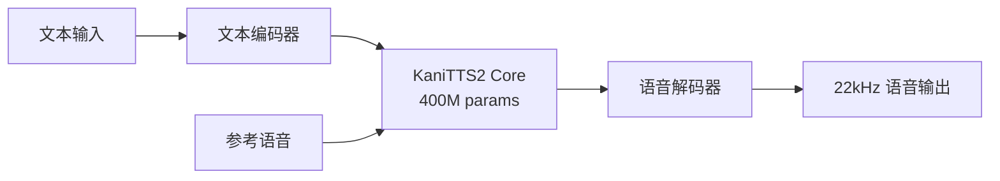

## 概述

语音合成（TTS）技术长期以来需要大规模模型和高性能GPU。然而<strong>KaniTTS2</strong>的发布大幅降低了这一门槛。仅凭<strong>4亿（400M）参数</strong>和<strong>3GB VRAM</strong>就能实现实时语音克隆，这一模型成为语音AI民主化的最新典范。

nineninesix-ai团队以Apache 2.0许可证发布了该项目，不仅包含模型权重，还<strong>完整公开了预训练代码</strong>，让任何人都可以从零开始训练自己的TTS模型。

## KaniTTS2核心规格

| 项目 | 规格 |
|------|------|
| 参数量 | 400M（BF16） |
| 采样率 | 22kHz |
| GPU VRAM | 3GB |
| RTF（实时因子） | ~0.2（RTX 5090基准） |
| 训练数据 | 约10,000小时语音数据 |
| 训练时间 | 8x H100上6小时 |
| 支持语言 | 英语、西班牙语（更多语言即将支持） |
| 许可证 | Apache 2.0 |

<strong>RTF 0.2</strong>意味着生成1秒语音仅需0.2秒，完全满足实时对话场景的性能需求。

## 为什么KaniTTS2很重要

### 1. 极致轻量化

传统高质量TTS模型通常需要数十亿参数和10GB以上的VRAM。KaniTTS2用400M参数实现了这一目标，可在<strong>消费级GPU（如RTX 3060）</strong>上运行。

### 2. 完全开源的预训练框架

不仅是模型权重，<strong>整个预训练代码</strong>都已公开。这开启了以下可能性：

- 为少数语言训练TTS模型
- 构建特定领域（医疗、法律等）的语音模型
- 针对特定口音和方言进行定制

### 3. 内置语音克隆

无需额外微调，<strong>语音克隆</strong>功能已内置于模型中。只需提供参考语音样本，即可将文本转换为该说话者的语音。

## 架构与训练流程



训练使用约10,000小时的语音数据，在<strong>8台H100 GPU上仅需6小时</strong>即可完成。相比大规模TTS模型需要数天到数周的训练时间，这非常高效。

## 快速开始

### 从HuggingFace下载模型

KaniTTS2提供两种模型变体：

- <strong>多语言模型（Pretrained）</strong>：支持英语、西班牙语
- <strong>英语专用模型</strong>：支持本地口音的英语专属模型

```bash
# 从HuggingFace下载模型
# 多语言模型
git clone https://huggingface.co/nineninesix/kani-tts-2-pt

# 英语专用模型
git clone https://huggingface.co/nineninesix/kani-tts-2-en
```

### 在HuggingFace Spaces体验Demo

无需安装，直接在浏览器中体验：

- 多语言模型：[HF Spaces（Pretrained）](https://huggingface.co/spaces/nineninesix/kani-tts-2-pt)
- 英语模型：[HF Spaces（English）](https://huggingface.co/spaces/nineninesix/kanitts-2-en)

### 训练自己的模型

利用预训练代码，可以从零开始训练自己的TTS模型：

```bash
# 克隆预训练代码
git clone https://github.com/nineninesix-ai/kani-tts-2-pretrain
cd kani-tts-2-pretrain

# 环境设置和开始训练
# 详细指南请参阅仓库README
```

## 轻量级TTS模型对比

近期涌现了多个可本地运行的TTS模型：

| 模型 | 参数量 | VRAM | 语音克隆 | 开源训练代码 |
|------|--------|------|:---:|:---:|
| <strong>KaniTTS2</strong> | 400M | 3GB | ✅ | ✅ |
| Bark | ~1B | 6GB+ | ✅ | ❌ |
| XTTS v2 | ~500M | 4GB+ | ✅ | 部分 |
| Piper | ~60M | <1GB | ❌ | ✅ |

KaniTTS2的差异化优势在于<strong>同时提供语音克隆和完整预训练代码</strong>，同时保持轻量级模型。

## 语音AI民主化的意义

KaniTTS2的发布超越了简单的模型发布，是语音AI民主化的重要里程碑：

1. <strong>少数语言支持</strong>：预训练代码的公开使少数语言社区能够构建自己的TTS模型
2. <strong>消除成本障碍</strong>：3GB VRAM即可满足需求，无需昂贵GPU即可实现语音克隆
3. <strong>加速研究</strong>：完整训练管线的公开提高了TTS研究的可重复性和发展速度
4. <strong>个人隐私</strong>：可在本地运行而非通过云API，确保语音数据隐私

## 结论

KaniTTS2展现了<strong>"小而强"</strong>模型的典范。400M参数就能实现语音克隆，挑战了只有大模型才能提供高质量语音合成的固有认知。

特别是预训练代码的完全公开，预计将对整个语音AI生态系统产生积极影响。从少数语言支持到特定领域优化，再到个性化语音助手构建，多样化的应用场景值得期待。

随着本地AI日益强大，KaniTTS2证明了<strong>"本地优先"</strong>在语音AI领域也正在成为现实。

## 参考资料

- [KaniTTS2 Pretrained Model（HuggingFace）](https://huggingface.co/nineninesix/kani-tts-2-pt)
- [KaniTTS2 English Model（HuggingFace）](https://huggingface.co/nineninesix/kani-tts-2-en)
- [KaniTTS2 Pretrain Code（GitHub）](https://github.com/nineninesix-ai/kani-tts-2-pretrain)
- [Reddit: KaniTTS2 Discussion（r/LocalLLaMA）](https://www.reddit.com/r/LocalLLaMA/comments/1r4sivv/kanitts2_opensource_400m_tts_model_with_voice/)
