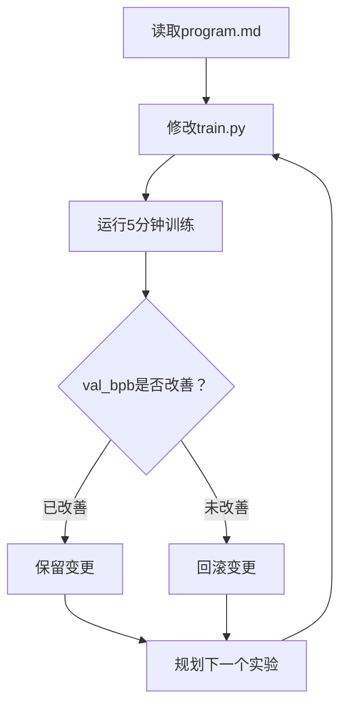

## 概述

2026年3月，Andrej Karpathy（前Tesla AI总监、OpenAI联合创始人）将[autoresearch](https://github.com/karpathy/autoresearch)以开源形式公开发布。这个项目的核心理念非常简单——<strong>给AI Agent一块GPU和训练代码，让它一整夜自主进行实验</strong>。

Agent修改代码、运行5分钟训练、评估结果，如果有改进就保留变更，否则回滚。这个循环每小时执行约12次，一夜下来大约可完成100次实验。项目发布后迅速在GitHub上获得了8,000多颗Star，3月8至9日夜间，35个Agent在Hyperspace网络上完全无人值守地完成了333个实验。

本文将分析autoresearch的架构与工作原理，并从Engineering Manager的视角探讨它对R&D团队可能产生的影响。

## autoresearch的设计哲学

Karpathy的设计哲学可以概括为<strong>"一块GPU、一个文件、一个指标"</strong>。

### 为什么只有630行？

autoresearch的完整训练代码（`train.py`）大约只有630行。这是一个有意为之的约束：

- 整个代码可以完整放入现代LLM的上下文窗口（128K+tokens）
- Agent能在"理解"全部代码的状态下进行修改
- 修改范围受限，便于调试和变更追踪

```python
# train.py — Agent唯一修改的文件
# 包含GPT模型定义、Muon + AdamW优化器、训练循环
# 约630行代码 — 可完全容纳在LLM上下文窗口中
```

### 核心文件结构

```
autoresearch/
├── prepare.py    # 数据准备（运行一次）— Tokenizer训练、数据加载
├── train.py      # 训练代码 — Agent唯一修改的文件
└── program.md    # Agent指令 — 由人类编写的"研究方向书"
```

各文件的职责划分清晰明确：

- <strong>prepare.py</strong>：数据集下载、BPE Tokenizer训练、数据加载工具。人和Agent都不修改的固定基础设施
- <strong>train.py</strong>：完整的GPT模型、优化器（Muon + AdamW）、训练循环。Agent唯一修改的文件
- <strong>program.md</strong>：由人类编写的Markdown指令文档，决定Agent研究方向的"研究方向书"

## Agent实验循环

autoresearch的自主实验周期运作方式如下：



### 5分钟固定时间预算

所有实验都精确运行5分钟。这个约束是关键所在：

- 无论是更改架构还是调整超参数，都使用相同的时间预算
- 实验之间可以进行公平比较
- 每小时12个实验 × 8小时 = 一夜约100个实验

### 评估指标：val_bpb

<strong>val_bpb</strong>（validation bits per byte）是一个与词汇表大小无关的评估指标。即使更换Tokenizer或完全改变架构，也能进行一致的比较。数值越低代表性能越好。

## EM视角：对R&D团队的启示

作为Engineering Manager审视autoresearch，可以看到超越"有趣项目"层面的结构性变革信号。

### 1. 是重复工作的自动化，而非思考的自动化

autoresearch所自动化的是<strong>"修改→训练→评估"的重复循环</strong>。研究人员仍然需要做的事情是：

- 在`program.md`中设定实验方向
- 解读结果并决定下一步研究方向
- 从成功的实验中提取洞察

这是<strong>"重复的自动化"</strong>，而非<strong>"思考的自动化"</strong>。这也是EM需要向团队成员传达的核心信息。

### 2. 研究生产力的重新定义

让我们与传统ML研究工作流程进行对比：

| 项目 | 传统方式 | autoresearch |
|------|----------|--------------|
| 实验执行 | 手动（修改代码→训练→等待） | 自动（Agent连续执行） |
| 每日实验次数 | 3〜5个 | 100个+ |
| 研究人员角色 | 执行 + 分析 | 方向设定 + 分析 |
| 夜间/周末利用 | 长时间训练1个任务 | 短期实验100个 |
| 失败成本 | 浪费时间（数小时） | 5分钟（自动回滚） |

### 3. 团队引入时的考量

如果将autoresearch引入R&D团队，需要考虑以下几点：

<strong>技术要求</strong>：
- 1块NVIDIA GPU（已在H100上验证）
- Python 3.10+、PyTorch
- `uv`包管理器

<strong>组织层面的考量</strong>：
- 编写`program.md`的能力即研究能力——需要能写出优质指令的资深研究员
- 实验结果的解读和下一步方向设定仍然是人的职责
- "一夜100个实验"并不总是意味着"更好的研究"

## 实战应用指南

### 基本设置（5分钟内上手）

```bash
# 1. 克隆仓库并安装依赖
git clone https://github.com/karpathy/autoresearch.git
cd autoresearch
uv sync

# 2. 准备数据（约2分钟）
uv run prepare.py

# 3. 手动测试（确认GPU正常工作）
uv run train.py
```

### program.md编写示例

`program.md`是决定Agent研究方向的核心文件。以下是优质指令的示例：

```markdown
# Research Direction

## Goal
Reduce val_bpb by optimizing the attention mechanism.

## Constraints
- Do not change the tokenizer or vocabulary size
- Keep total training time under 5 minutes
- Maintain model parameter count within 2x of baseline

## Suggested Experiments
1. Try multi-head attention with different head counts
2. Experiment with rotary position embeddings
3. Test grouped query attention (GQA)
```

### 结果分析

一夜运行结束后，分析Agent留下的日志。可以查看每个实验中val_bpb的变化、应用的修改内容以及成功/失败情况。

## 更广阔的视角：AI研究自动化趋势

autoresearch并非孤立现象。它是2026年初AI行业中<strong>"AI研究AI"</strong>趋势的一部分：

- <strong>Anthropic Code Review</strong>：多Agent系统自动分析AI生成的代码并检测逻辑错误
- <strong>OpenAI的自动化红队测试</strong>：AI模型自动探索其他AI模型的漏洞
- <strong>Google的AutoML进化</strong>：由AI设计神经网络架构本身

autoresearch的差异化优势在于<strong>可及性</strong>。仅凭一块H100和630行代码，任何人都能体验这一范式。这也是它迅速积累8,000多颗GitHub Star的原因。

## 结论

Karpathy的autoresearch是一个将ML研究中"重复执行"部分委托给Agent的实用框架。630行的有意约束、5分钟固定时间预算、单一指标比较等设计哲学清晰明确。

从EM/VPoE的视角值得关注的要点是：

1. <strong>研究生产力定义的转变</strong>：从"一天跑了多少个实验"转向"设定了多好的实验方向"
2. <strong>资深研究员角色的转变</strong>：从亲自跑实验的人转变为设计Agent研究方向的人
3. <strong>GPU空闲时间的价值</strong>：夜间/周末的GPU空闲时间转化为100个实验的机会

比起"一夜100个实验"这个数字本身，更值得关注的是<strong>研究人员的角色正从"执行"向"方向设定"转移</strong>这一结构性变化。

## 参考资料

- [karpathy/autoresearch (GitHub)](https://github.com/karpathy/autoresearch)
- [Andrej Karpathy Open-Sources 'Autoresearch' (MarkTechPost)](https://www.marktechpost.com/2026/03/08/andrej-karpathy-open-sources-autoresearch-a-630-line-python-tool-letting-ai-agents-run-autonomous-ml-experiments-on-single-gpus/)
- [Karpathy Just Turned One GPU Into a Research Lab (Garry's List)](https://garryslist.org/posts/karpathy-just-turned-one-gpu-into-a-research-lab-f55754a6)
- [Autoresearch: Karpathy's Overnight AI Researcher (Top AI Product)](https://topaiproduct.com/2026/03/07/autoresearch-karpathys-overnight-ai-researcher-that-runs-100-experiments-while-you-sleep/)
