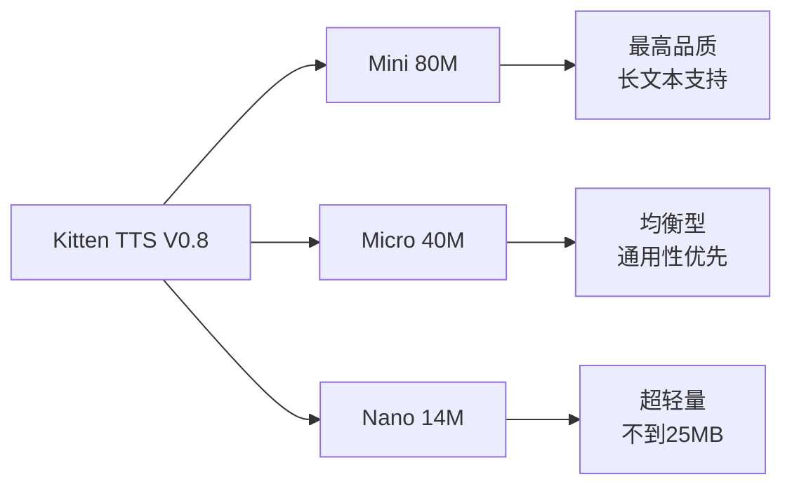
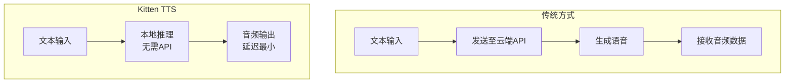
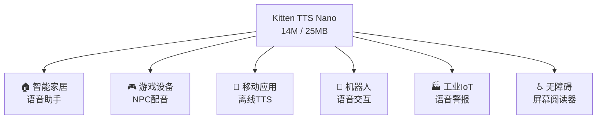

## 概述

语音AI领域迎来了"小即是王道"的时代。<strong>Kitten TTS V0.8</strong>是一款仅凭<strong>14M参数、不到25MB</strong>的体积就实现了媲美云端TTS品质的超小型文本转语音模型。

在KaniTTS2、Qwen3-TTS.cpp、FreeFlow等本地语音AI模型接连涌现的背景下，Kitten TTS以其极致的轻量化开辟了新的天地。本文将深入分析Kitten TTS V0.8的技术特征、三个模型变体的对比，以及边缘设备部署的可能性。

## Kitten TTS V0.8简介

由[Kitten ML](https://github.com/KittenML/KittenTTS)开发的开源TTS模型，以Apache 2.0许可证发布。从V0.1到V0.8的重大更新带来了品质、表现力和真实感的大幅提升。

### 三个模型变体



| 模型 | 参数量 | 大小 | 特点 |
|------|--------|------|------|
| <strong>Mini</strong> | 80M | ~150MB | 最高品质，长文本也有出色表现力 |
| <strong>Micro</strong> | 40M | ~80MB | 品质与体积的平衡 |
| <strong>Nano</strong> | 14M | <strong><25MB</strong> | 超轻量，边缘设备最优 |

三个模型均搭载了<strong>8种富有表现力的声音</strong>（4种女声、4种男声）。目前支持英语，多语言支持将在后续版本中添加。

## 技术亮点

### 1. 仅需CPU即可运行

不仅是"无需GPU"，而是<strong>专为资源受限的边缘设备设计</strong>。在Raspberry Pi和IoT设备等低配置环境下也能运行，对于没有GPU的开发者来说是一大福音。

### 2. 设备端实现云端TTS品质



完全不使用云端API，在设备上完成全部推理：

- <strong>大幅降低延迟</strong>：无需网络往返
- <strong>隐私保障</strong>：语音数据不会外传
- <strong>零成本</strong>：无API费用
- <strong>离线运行</strong>：无需网络连接

### 3. 从V0.1的进化

V0.8包含以下重大改进：

- <strong>10倍训练数据集</strong>：数据量大幅扩充
- <strong>改进的训练流程</strong>：优化方法革新
- <strong>品质、表现力、真实感提升</strong>：自然的韵律和语调

## 在本地语音AI趋势中的定位

2025年至2026年间，语音AI的本地化正在快速推进。

| 模型 | 特点 | 规模 |
|------|------|------|
| <strong>KaniTTS2</strong> | 日语专精高品质TTS | 中大型 |
| <strong>Qwen3-TTS.cpp</strong> | 多语言支持·llama.cpp集成 | 中型 |
| <strong>FreeFlow</strong> | 自然韵律·情感表达 | 中型 |
| <strong>Kitten TTS V0.8</strong> | <strong>极致轻量化达到SOTA品质</strong> | <strong>超小型（14M~80M）</strong> |

Kitten TTS的最大差异化在于<strong>体积</strong>。14M参数、不到25MB的规格与其他模型完全不在一个维度。

## 边缘设备部署潜力

### 用例分析



### 具体部署场景

<strong>1. 智能家居设备</strong>

不到25MB的模型大小已经进入ESP32等低成本微控制器可运行的范围。无需云端连接的本地语音助手成为可能。

<strong>2. 移动应用</strong>

可以轻松集成到应用包中，在离线环境下也能提供TTS功能。有助于改善网络条件差的地区的无障碍体验。

<strong>3. 语音代理</strong>

基于本地推理的低延迟TTS是对话式语音代理的理想选择。与LLM结合可构建完全本地化的语音对话系统。

## 快速入门

```bash
# 克隆仓库
git clone https://github.com/KittenML/KittenTTS.git
cd KittenTTS

# 下载模型（Nano模型）
# 从HuggingFace下载
# https://huggingface.co/KittenML/kitten-tts-nano-0.8
```

HuggingFace上提供的三个模型：

- [Mini 80M](https://huggingface.co/KittenML/kitten-tts-mini-0.8) — 最高品质
- [Micro 40M](https://huggingface.co/KittenML/kitten-tts-micro-0.8) — 均衡型
- [Nano 14M](https://huggingface.co/KittenML/kitten-tts-nano-0.8) — 超轻量

## 未来展望

Kitten TTS V0.8目前仅支持英语，但<strong>多语言支持</strong>已列入未来发布计划。一旦中文支持落地，将对国内边缘AI市场产生重大影响。

此外，Apache 2.0许可证意味着可以自由商用。从初创公司到大型企业，将语音功能集成到产品中的门槛大幅降低。

## 总结

Kitten TTS V0.8体现了<strong>"小模型也能高品质"</strong>的新范式。以令人惊叹的14M参数、不到25MB的体积，实现了媲美云端TTS的品质。

在KaniTTS2、Qwen3-TTS.cpp、FreeFlow引领的语音AI本地化浪潮中，Kitten TTS作为<strong>边缘设备部署的终极方案</strong>脱颖而出。无需GPU、无需API、完全本地运行的超小型TTS模型，展示了语音AI民主化的下一步。

## 参考资料

- [Kitten TTS GitHub仓库](https://github.com/KittenML/KittenTTS)
- [Reddit — Kitten TTS V0.8发布帖](https://www.reddit.com/r/LocalLLaMA/comments/1r8pztp/kitten_tts_v08_is_out_new_sota_supertiny_tts/)
- [HuggingFace — Kitten TTS Mini 0.8](https://huggingface.co/KittenML/kitten-tts-mini-0.8)
- [HuggingFace — Kitten TTS Micro 0.8](https://huggingface.co/KittenML/kitten-tts-micro-0.8)
- [HuggingFace — Kitten TTS Nano 0.8](https://huggingface.co/KittenML/kitten-tts-nano-0.8)
