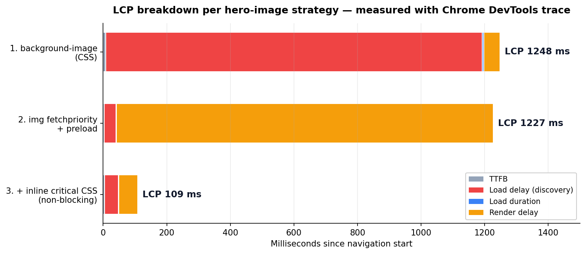

我只放了一张英雄图，然后抓了一份跟踪。文件是 117KB 的 PNG，在本地下载只花了 5 毫秒。可这个页面的 Largest Contentful Paint 却是 1247 毫秒。图片 5ms 就到了，最大元素却要 1.2 秒才画出来。剩下那 1242ms，究竟去哪了？

答案不是"图片太重"，而是浏览器**什么时候才开始找**这张图。如果你只把 LCP 当成图片体积问题，这 1.2 秒里的大半你永远追不回来。这次我把同一张英雄图用三种方式下发，用 Chrome DevTools 的跟踪把 LCP 拆开，看瓶颈到底藏在哪儿。下面的表和日志，全是那个沙盒里跑出来的真实测量值。

## LCP 不是一个数字，而是四段

先打地基。LCP（Largest Contentful Paint）指的是视口内最大的内容元素——通常是英雄图或大标题块——被画到屏幕上的时刻。Google 建议这个值发生在页面开始加载后的 **2.5 秒以内**（[Google Search Central，Core Web Vitals](https://developers.google.com/search/docs/appearance/core-web-vitals)）。这个阈值是真实用户数据（CrUX）的第 75 百分位。

关键在后面。LCP 看起来是单一指标，但 web.dev 的 [Optimize LCP](https://web.dev/articles/optimize-lcp) 把它拆成了四段：

- **TTFB**：服务器返回第一个字节之前
- **Load delay（加载延迟）**：浏览器**发现 LCP 资源并发起请求**之前的时间
- **Load duration（加载时长）**：真正下载这个资源花的时间
- **Render delay（渲染延迟）**：下载完之后，到画到屏幕上的时间

我喜欢这个四段模型，理由很简单：「LCP 慢」是症状，不是诊断。你得看清四段里哪一段肿了，才能开药方。而多数慢英雄图，时间都漏在 **Load delay（发现）**上，不在 Load duration（下载）。下面就是证据。

## 实测：用背景图下发的英雄图

第一个版本是个常见写法。英雄图不用 ``，而是用 CSS 的 `background-image` 铺上去。

```css
.hero {
  width: 100%;
  height: 600px;
  background-image: url("hero.png");
  background-size: cover;
}
```

```html
<link rel="stylesheet" href="style.css">
<div class="hero"></div>
```

测试环境是这样：本地多线程 HTTP 服务器，所有响应都带 `Cache-Control: no-store`（每次都重新拉），并给样式表加了 1 秒延迟。这个延迟是为了复现"渲染阻塞 CSS 很慢"的真实情况。我带着 reload 抓了一份 Chrome DevTools 的 `performance` 跟踪。结果：

```text
LCP: 1247 ms
  TTFB:          8 ms
  Load delay: 1184 ms   ← 就在这
  Load duration: 5 ms
  Render delay:  51 ms
DevTools 洞察：标记了 "LCP request discovery"
```

Load delay 是 1184ms。图片下载才 5ms，浏览器却花了 1.2 秒去**发现**它。为什么？因为英雄图的 URL 藏在 CSS 里面。

这里要讲一个关键概念。浏览器里有个东西叫**预加载扫描器（preload scanner）**。当 HTML 响应字节一到，在主解析器跑起来之前，这个扫描器就先扫一遍原始 HTML，把 ``、`<script src>`、`<link href>` 这类资源提前发现、提前发请求。问题是，它只看 HTML。**CSS 里的 `background-image` URL，扫描器看不见**（[web.dev，Don't fight the browser preload scanner](https://web.dev/preload-scanner/)）。所以背景图要等 CSS 下载并解析完，才会开始请求。我的 CSS 加了 1 秒延迟，英雄图就精确地晚了这么多才被发现。Chrome 自己把这点点了出来，标成 "LCP request discovery" 洞察（[LCP discovery, Chrome for Developers](https://developer.chrome.com/docs/performance/insights/lcp-discovery)）。

这现象和[AI 爬虫不执行 JavaScript、因此看不到你的内容那篇](/zh/blog/zh/ai-crawlers-dont-render-javascript-csr-2026/)同根同源。资源被放在哪、怎么放，决定了它什么时候（甚至到底会不会）被处理。

## 加了 fetchpriority 和 preload——可 LCP 纹丝不动

第二个版本。我把英雄图换成真正的 ``，加上 `fetchpriority="high"`，还在 `<head>` 里放了 preload 提示。

```html
<link rel="preload" as="image" href="hero.png" fetchpriority="high">
...

```

`fetchpriority="high"` 是个提示，告诉浏览器"这个资源要抢在别人前面、以高优先级去取"（[web.dev，Fetch Priority API](https://web.dev/articles/fetch-priority)）。为什么需要它？在布局之前，浏览器并不知道一张图会落在屏幕的哪个位置，所以大多数图片一开始都被放成低优先级。英雄图也好，页脚的装饰图标也好，初期待遇是一样的。`fetchpriority="high"` 就是把其中一张——英雄图——用手拎上来。换成 `` 后，URL 就在 HTML 里，预加载扫描器立刻能看到。测量值：

```text
LCP: 1226 ms
  TTFB:          3 ms
  Load delay:   37 ms   ← 从 1184 骤降到 37
  Load duration: 2 ms
  Render delay: 1185 ms  ← 这回轮到它肿了
```

Load delay 从 1184ms 塌到了 37ms。发现的问题被彻底解决。图片在导航开始后 42ms 就已经收完。可 **LCP 还是 1226ms**，几乎没动。说实话，第一次看到这结果我愣了一下。你把发现提速了 30 倍，头号指标却不动，那一定是漏了什么。

是瓶颈挪位了。现在 Render delay 吃掉 1185ms。图片 42ms 就备好了，可浏览器**画不出来**——那个渲染阻塞样式表（我加了 1 秒的那个）还没到。CSS 到达、能做首帧绘制之前，Chrome 什么都不画。图在手上，笔却拿不起来。

这就是我这篇最想说的话。**fetchpriority 和 preload 是必要条件，不是充分条件。**它俩消掉的是"发现"这个瓶颈。但只要 LCP 四段里另外三段有一段是肿的，你把发现提得再前，最终数字也只动那么一点。不看四段就到处撒 fetchpriority，特别容易自我感觉良好。

## 把渲染阻塞也去掉，LCP 从 1247 掉到 109ms

第三个版本。上面那个 `` 保留，这回把渲染阻塞去掉。英雄图渲染所必需的那点最小 CSS（关键 CSS）用 `<style>` 内联，剩下的样式表用不阻塞绘制的方式加载。

```html
<style>
  .herowrap{width:100%;height:600px;overflow:hidden}
  .herowrap img{width:100%;height:600px;object-fit:cover}
</style>
<link rel="stylesheet" href="style.css"
      media="print" onload="this.media='all'">
```

设成 `media="print"` 就不会阻塞屏幕渲染，再用 `onload` 切成 `all` 让它真正生效。这是个很常见的非阻塞 CSS 加载写法。测量值：

```text
LCP: 109 ms
  TTFB:          5 ms
  Load delay:   43 ms
  Load duration: 1 ms
  Render delay:  60 ms
```

从 1247ms 到 109ms。三段全落到两位数。发现快（43ms），也没东西挡着绘制（Render delay 60ms）。把三个版本并排看：

| 英雄图下发方式 | Load delay（发现） | Render delay | LCP |
|---|---|---|---|
| CSS `background-image` | 1184 ms | 51 ms | 1247 ms |
| `` + preload | 37 ms | 1185 ms | 1226 ms |
| + 关键 CSS 内联（非阻塞） | 43 ms | 60 ms | **109 ms** |

只修一个数时，瓶颈往旁边溜了；两个瓶颈都堵上，指标才真正塌下来。这张表，就是四段模型的价值本身。



## 那么，开发者今天该做什么（清单）

把上面的实验落到实操，就是：

1. **英雄图用 HTML 的 `` 下发，别用 CSS 背景。**预加载扫描器得看得见，才能早发现。如果设计上非用背景不可，就用 `<link rel="preload" as="image" href="..." fetchpriority="high">` 替扫描器把发现提前（[web.dev preload-scanner](https://web.dev/preload-scanner/)）。
2. **给 LCP 图片加 `fetchpriority="high"`。**浏览器初期常把图片当成低优先级。只把英雄图提上去。
3. **绝对别给 LCP 图片加 `loading="lazy"`。**对首屏以下的图片有用，可给视口最顶部的英雄图加，就是自己拖慢自己的发现（[web.dev，关于 LCP 的误区](https://web.dev/blog/common-misconceptions-lcp)）。
4. **内联关键 CSS，其余非阻塞。**图片收得再早，只要渲染阻塞 CSS 还卡着绘制，就白搭。
5. **永远写上 `width`/`height`（或 `aspect-ratio`）。**这能防止布局偏移（CLS）。上面三个版本，CLS 都是 0.00。
6. **最要紧的，先读 LCP 分解。**DevTools 的 Performance 面板会直接把 TTFB / Load delay / Load duration / Render delay 摆给你看。从最大那段下手。这套测量流程本身，我在[用 Lighthouse 直接抓出并修复无障碍问题那篇](/zh/blog/zh/a11y-lighthouse-audit-fix-2026/)里挖得更深。

## 诚实的边界——别误读这些数字

我这些实验值是**实验室（lab）数字**。本地服务器、不做网络限速、CPU 一倍速。连那 1 秒的样式表延迟，也是我为了让效果看得见而人为加进去的。所以别把"1247 → 109"这个倍率照搬到你的站上。这些数字是**给机制做的演示**，不是你能指望的绝对提升幅度。Google 真正用来排名的是 CrUX 的现场（真实用户）数据，而你的提升幅度，取决于你页面真实的关键路径。

第二个边界更重要。**把 LCP 压进 2.5 秒，并不保证排名上升。**Google 在官方文档里说得很直白："没有单一的排名信号"，而且页面体验再好，也"替代不了优质、相关的内容"（[Google Search Central](https://developers.google.com/search/docs/appearance/core-web-vitals)）。Core Web Vitals 只是众多信号之一。我觉得，把 LCP 优化当成"减少跳出的 UX 工作"来讲才诚实，而不是当成"排名杠杆"。页面快，是因为用户不走人，不是因为速度本身给你买来靠前的位置。

这里也把复现时两次骗到我的坑老实记下。一开始我用的是 Python 单线程服务器，`fetchpriority` 版本明明早早发现了图片，LCP 却下不去。原来服务器忙着响应那个 1 秒的 CSS、被阻塞住的时候，早发现的图片请求排到了它后面。换成真实的 HTTP/2 源站，多路复用本会让两者同时下来——是服务器的假象盖住了真实收益。改用多线程服务器之后，数字才变诚实。第二个坑是缓存。没加 `no-store` 时，浏览器从磁盘缓存里把上一次运行的 CSS 掏了出来，1 秒延迟消失，"before" 的惩罚整个蒸发。这再次提醒我：相信测量之前，先怀疑测量环境。

第三。preload 滥用也会变毒。什么都用 preload 给高优先级，反而抢了真正要紧资源的带宽，某些条件下还会把一张图下载两遍。preload 要省着用，只给**那一个 LCP 元素**。

一句话总结这篇：LCP 慢的时候，别先怀疑图片体积，先打开那四段——看浏览器什么时候发现这个元素、什么时候画它。瓶颈通常藏在发现和渲染阻塞里，不在下载。我在实际审计一个多语言博客、剥掉渲染阻塞资源的[技术 SEO 审计记录](/zh/blog/zh/multilingual-blog-technical-audit-campaign-2026/)里，也走到了同一个结论。

---

*如果你想把结构化数据稳稳地在服务端输出，或者想对现有站点的 Core Web Vitals、无障碍、爬虫应对做一次实测体检，我个人接受咨询和实现委托。通过我资料页上的联系入口找我就行。*
