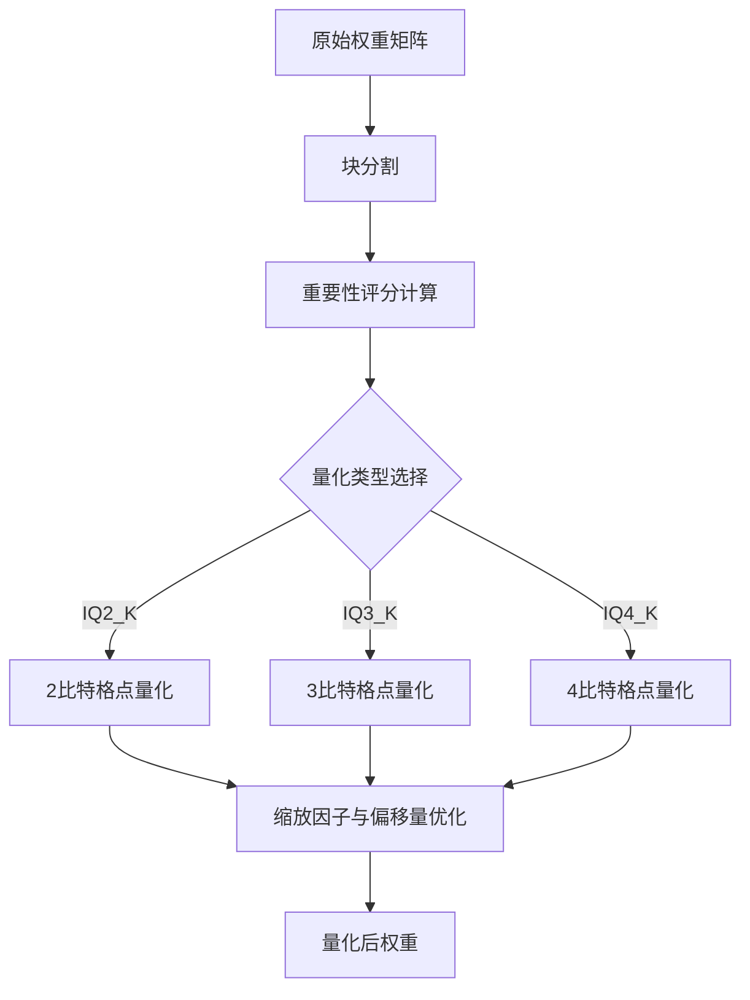
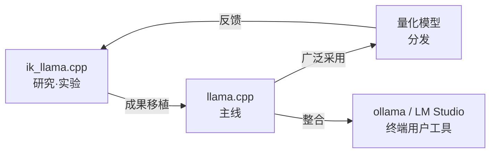

## 概述

llama.cpp的量化方法迎来了重大转折。在<strong>ik_llama.cpp</strong>（llama.cpp的分支）中独立开发的<strong>IQ*_K / IQ*_KS</strong>系列量化，正通过PR #19726合并至llama.cpp主线。该消息在Reddit r/LocalLLaMA获得125分，在本地LLM社区引起广泛关注。

本文将解析IQ系量化的技术背景、与现有方法的差异，以及对本地LLM推理的影响。

## 什么是IQ量化

### 传统量化方法的局限

llama.cpp中传统的<strong>Q4_K_M</strong>、<strong>Q5_K_S</strong>等k-quant系列量化一直是主流。这些方法使用均匀的量化网格，无法充分利用模型权重的分布特征。

### IQ系列的方法

IQ（Importance-aware Quantization，重要性感知量化）系列采用<strong>基于权重重要性的非均匀量化</strong>。具体包括：

- <strong>格点量化</strong>：使用信息论最优的格点而非均匀网格
- <strong>重要性加权</strong>：根据每个权重对损失函数的贡献度调整量化精度
- <strong>块级优化</strong>：为每个权重块计算最优缩放因子和偏移量

```
传统Q4_K:    均匀的16级量化网格
IQ4_K:       适应权重分布的非均匀格点量化
结果:        相同比特数下实现更高精度
```

## PR #19726的内容

### 移植的量化类型

[GitHub PR #19726](https://github.com/ggml-org/llama.cpp/pull/19726)由AesSedai从ik_llama.cpp移植了以下量化类型：

| 量化类型 | 比特数/权重 | 用途 |
|---------|-----------|------|
| <strong>IQ2_K</strong> | ~2.5 bpw | 超低比特，内存严格受限的环境 |
| <strong>IQ2_KS</strong> | ~2.5 bpw | IQ2_K的小模型变体 |
| <strong>IQ3_K</strong> | ~3.5 bpw | 均衡型，适用于多数场景 |
| <strong>IQ3_KS</strong> | ~3.5 bpw | IQ3_K的小模型变体 |
| <strong>IQ4_K</strong> | ~4.5 bpw | 高精度，内存充足时使用 |
| <strong>IQ4_KS</strong> | ~4.5 bpw | IQ4_K的小模型变体 |

### 与ik_llama.cpp的关系

这个PR背后有着有趣的故事。ik_llama.cpp的开发者Iwan Kawrakow在PR中明确表示：

- 当前形式（包含版权声明）的移植<strong>完全没有问题</strong>
- 符合MIT许可证精神的适当署名很重要
- 应认识到这是"复制"而非"重写"

这是开源社区中<strong>从分支向上游回馈成果</strong>的典范案例。

## 技术深度解析

### 格点量化的原理

IQ系量化的核心在于<strong>格点（lattice）量化</strong>。



传统k-quant系列中量化网格点等间距排列。而IQ系列中，<strong>格点根据权重的概率分布进行放置</strong>，在权重值频繁出现的区域提供高分辨率，在罕见值区域提供低分辨率。

### K与KS的区别

每种量化类型都有<strong>K</strong>和<strong>KS</strong>两个变体：

- <strong>K（Standard）</strong>：针对大型模型（7B以上）优化
- <strong>KS（Small）</strong>：针对小型模型（3B以下）优化的参数

由于小型模型的权重分布与大型模型不同，KS变体调整了格点放置和缩放策略。

## 基准对比

现有Q系列与IQ系列量化的对比（参考值）：

| 量化 | 困惑度 | 模型大小 | 推理速度 |
|------|-------|---------|---------|
| Q2_K | 基准 | 基准 | 基准 |
| <strong>IQ2_K</strong> | 改善5-10% | 相同 | 相同至略降 |
| Q3_K_M | 基准 | 基准 | 基准 |
| <strong>IQ3_K</strong> | 改善3-7% | 相同 | 相同至略降 |
| Q4_K_M | 基准 | 基准 | 基准 |
| <strong>IQ4_K</strong> | 改善2-5% | 相同 | 相同至略降 |

最大优势是<strong>相同比特数下困惑度的改善</strong>。尤其在低比特量化（2-3比特）时改善幅度显著。

## 对本地LLM推理的影响

### 内存效率提升

IQ系量化的整合在以下场景中带来收益：

- <strong>8GB VRAM环境</strong>：使用IQ3_K可以比Q3_K_M更高质量地运行7B模型
- <strong>Apple Silicon Mac</strong>：在统一内存限制内以更高质量运行更大模型
- <strong>边缘设备</strong>：IQ2_K/IQ2_KS使得2-3GB内存下的LLM推理变得实用

### 量化生态系统的演进



合并至llama.cpp主线意味着向<strong>ollama</strong>和<strong>LM Studio</strong>等终端用户工具的传播。用户无需特殊配置即可使用更高质量的量化模型。

## 实践：IQ量化的使用方法

合并完成后，可按如下方式使用：

```bash
# 模型量化（llama-quantize）
./llama-quantize model-f16.gguf model-iq3k.gguf IQ3_K

# 小型模型使用KS变体
./llama-quantize small-model-f16.gguf small-model-iq3ks.gguf IQ3_KS

# 运行推理
./llama-cli -m model-iq3k.gguf -p "Hello, world"
```

## 未来展望

IQ系量化的主线整合是本地LLM推理<strong>效率化趋势</strong>中的重要里程碑：

1. <strong>更低比特量化</strong>：IQ1_K系列等亚2比特研究的可能性
2. <strong>模型特定优化</strong>：根据架构自动调整量化参数
3. <strong>硬件优化</strong>：针对ARM NEON、AVX-512等的IQ系内核优化

## 总结

从ik_llama.cpp到llama.cpp的IQ*_K/IQ*_KS量化整合，是开源生态系统中<strong>从分支向上游回馈成果</strong>的典范。这项在相同比特数下实现更高精度的技术，将显著提升内存受限环境下的LLM推理质量。

对本地LLM用户而言，只需在llama-quantize中选择`IQ3_K`或`IQ4_K`就能获得比现有Q系列量化更高质量模型的日子已近在眼前。

## 参考资料

- [GitHub PR #19726: Port IQ*_K quants from ik_llama.cpp](https://github.com/ggml-org/llama.cpp/pull/19726)
- [Reddit r/LocalLLaMA 讨论](https://www.reddit.com/r/LocalLLaMA/)
- [ik_llama.cpp 仓库](https://github.com/ikawrakow/ik_llama.cpp)
- [llama.cpp 量化文档](https://github.com/ggml-org/llama.cpp)
