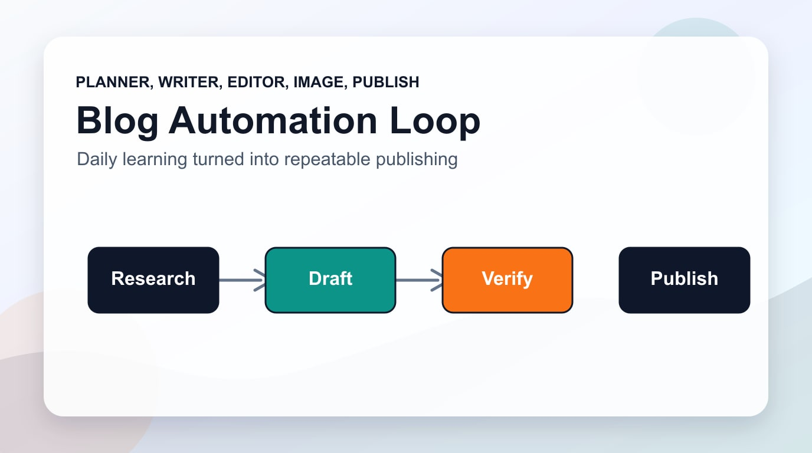

# 利用LLM与Claude Code实现博客自动化

## 如果每天只需1小时就能用3种语言写出完美的技术博客?

相信运营博客的各位都会有同感。编写优质内容本身就很困难,但还要考虑SEO优化、图像生成、多语言支持、社交媒体分享等一系列问题。但如果这一切都能由AI自动处理呢?

我使用Claude Code构建了包含11个专业代理(Agent)的系统,仅需一条命令就能完全自动化从博客文章撰写到部署的全过程。在本文中,我将分享这段旅程和所有实战经验。

## 为什么选择LLM自动化?

传统的博客工作流程效率低下:

1. <strong>构思创意</strong> (30分钟)
2. <strong>资料调研</strong> (1〜2小时)
3. <strong>撰写草稿</strong> (2〜3小时)
4. <strong>编辑与校对</strong> (1小时)
5. <strong>SEO优化</strong> (30分钟)
6. <strong>制作图像</strong> (1小时)
7. <strong>多语言翻译</strong> (放弃或额外费用)

平均需要<strong>6〜8小时</strong>,还很难保持一致性。但利用LLM可以将整个过程<strong>缩短到1小时以内</strong>,<strong>质量反而更高</strong>。

## 系统架构: Claude Code + 11 Agents + MCP + Astro

我构建的系统核心组件如下:

```
[用户命令: /write-post "主题"]
         ↓
[Claude Code - 主编排器(Main Orchestrator)]
         ↓
┌────────────────────────────────────────┐
│  11个专业代理 (Agent System)            │
├────────────────────────────────────────┤
│ 1. Content Planner - 内容策略          │
│ 2. Writing Assistant - 写作辅助        │
│ 3. Image Generator - 图像生成          │
│ 4. Editor - 编辑与校对                 │
│ 5. SEO Optimizer - 搜索优化            │
│ 6. Prompt Engineer - 提示词优化        │
│ 7. Site Manager - 构建/部署            │
│ 8. Social Media Manager - 社交媒体管理 │
│ 9. Analytics - 效果分析                │
│ 10. Portfolio Curator - 作品集管理     │
│ 11. Learning Tracker - 学习追踪        │
└────────────────────────────────────────┘
         ↓
[MCP (Model Context Protocol) 集成]
├── Context7: 最新文档搜索
├── Playwright: Web自动化
├── Notion API: 数据管理
└── Chrome DevTools: 调试
         ↓
[Astro Framework - 静态网站生成]
         ↓
[部署 & 监控]
```

### 核心技术栈

- <strong>Claude Code</strong>: Anthropic的CLI基础AI开发环境
- <strong>Astro 5</strong>: 基于Islands Architecture的静态网站生成器
- <strong>MCP (Model Context Protocol)</strong>: 连接AI与外部系统
- <strong>TypeScript</strong>: 类型安全的代码
- <strong>Markdown/MDX</strong>: 对LLM友好的内容格式

## 选择Astro的原因: Markdown = LLM的最佳伙伴

选择Astro的理由很明确:

### 1. Content Collections - 类型安全的内容管理

```typescript
// src/content.config.ts
import { defineCollection, z } from "astro:content";

const blog = defineCollection({
  type: "content",
  schema: z.object({
    title: z.string(),
    description: z.string(),
    pubDate: z.coerce.date(),
    updatedDate: z.coerce.date().optional(),
    heroImage: z.string().optional(),
    tags: z.array(z.string()).optional(),
  }),
});

export const collections = { blog };
```

LLM生成的内容会自动进行类型验证,防止运行时错误。

### 2. Markdown优先方法

```markdown
---
title: "AI时代的博客自动化"
description: "使用Claude Code完全自动化博客的方法"
pubDate: "2025-10-04"
---

# 正文内容

LLM非常擅长理解和生成Markdown。
```

Markdown在LLM的训练数据中大量存在,能够<strong>保证最高质量的输出</strong>。

### 3. Islands Architecture - 性能优化

```astro
---
// src/pages/blog/[...slug].astro
import { getCollection } from 'astro:content';

export async function getStaticPaths() {
  const posts = await getCollection('blog');
  return posts.map((post) => ({
    params: { slug: post.slug },
    props: post,
  }));
}

const post = Astro.props;
const { Content } = await post.render();
---

<BlogPost {...post.data}>
  <Content />
</BlogPost>
```

<strong>在构建时将所有页面渲染为HTML</strong>,用户体验超快速加载。

## 11个代理系统: 各司其职的专业性

每个代理都在 `.claude/agents/` 目录中以Markdown文件定义:

### 1. Content Planner (内容策划者)

```markdown
# Content Planner Agent

您是专业的内容战略家。

## 职责

- 趋势分析与主题发掘
- 关键词研究
- 内容日历生成
- 目标受众分析

## 工作流程

1. 搜索最新技术趋势 (利用MCP Context7)
2. 分析关键词竞争度
3. 提出3个月内容路线图
```

<strong>实际使用示例:</strong>

```bash
# 调用代理
/agent content-planner "AI趋势 2025"

# 输出:
## 推荐主题
1. "多模态AI的实战应用" (搜索量: 高, 竞争: 中)
2. "Claude 3.5 Sonnet vs GPT-4 性能比较" (搜索量: 中, 竞争: 低)
3. "用MCP实现AI工作流自动化" (搜索量: 低, 竞争: 低, 机会!)
```

### 2. Writing Assistant (写作助手)

核心提示词结构:

```markdown
## 写作指南

- 语气: 尊称,专业但亲切
- 结构: 引言 → 问题提出 → 解决方案 → 实战案例 → 结论
- 代码: 至少10个实用示例
- 长度: 2,500〜3,000字

## 质量检查清单

- [ ] 第一段引起读者兴趣
- [ ] 每个章节包含可执行的技巧
- [ ] 代码示例添加注释
- [ ] 结论中有明确的行动号召(Call-to-Action)
```

### 3. Image Generator (图像生成器)

```markdown
## 图像生成策略

### 主图(Hero Image)要求

- 分辨率: 1920x1080 (16:9)
- 风格: 现代、简约、技术感
- 颜色: 品牌调色板 (#3B82F6, #10B981, #F59E0B)

### 生成提示词模板

"A modern, minimalist illustration of [topic] featuring [key elements],
flat design style, vibrant colors (#3B82F6, #10B981),
high contrast, technical aesthetic, 4K quality"
```

<strong>利用Playwright MCP自动生成:</strong>

```typescript
// 图像生成自动化
const generateHeroImage = async (topic: string) => {
  await browser.navigate("https://app.ideogram.ai");
  await browser.fill(
    "#prompt-input",
    `Modern tech illustration: ${topic}, flat design, vibrant colors`
  );
  await browser.click("#generate-button");
  await browser.screenshot({
    name: `hero-${topic.slug}`,
    fullPage: false,
  });
};
```

### 4. Editor (编辑)

```markdown
## 编辑检查清单

### 语法与风格

- [ ] 拼写检查 (中文 + 英文)
- [ ] 一致的术语使用
- [ ] 段落长度优化 (3〜5句)

### 技术准确性

- [ ] 代码语法验证
- [ ] 版本信息确认
- [ ] 外部链接有效性

### 元数据

- [ ] Title: 60字以内
- [ ] Description: 150〜160字
- [ ] Tags: 5〜8个
```

### 5. SEO Optimizer (搜索优化专家)

```markdown
## SEO优化策略

### 页面内SEO (On-Page SEO)

1. Title标签: 包含主要关键词,60字以内
2. Meta Description: 行动号召,150〜160字
3. H1-H6层次结构
4. 图像Alt文本: 描述性且包含关键词

### 内部链接

- 链接3〜5篇相关文章
- 锚文本自然

### 技术性SEO

- 自动生成Sitemap
- 设置Robots.txt
- 设置Canonical URL
```

<strong>实际实现:</strong>

```astro
---
// src/components/BaseHead.astro
import { SITE_TITLE, SITE_DESCRIPTION } from '../consts';

const canonicalURL = new URL(Astro.url.pathname, Astro.site);

const { title, description, image = '/default-og.jpg' } = Astro.props;
---

<!-- Primary Meta Tags -->
<title>{title} | {SITE_TITLE}</title>
<meta name="title" content={title} />
<meta name="description" content={description} />
<link rel="canonical" href={canonicalURL} />

<!-- Open Graph / Facebook -->
<meta property="og:type" content="website" />
<meta property="og:url" content={Astro.url} />
<meta property="og:title" content={title} />
<meta property="og:description" content={description} />
<meta property="og:image" content={new URL(image, Astro.url)} />

<!-- Twitter -->
<meta property="twitter:card" content="summary_large_image" />
<meta property="twitter:url" content={Astro.url} />
<meta property="twitter:title" content={title} />
<meta property="twitter:description" content={description} />
<meta property="twitter:image" content={new URL(image, Astro.url)} />
```

### 6. Prompt Engineer (提示词优化专家)

最重要的代理。持续改进所有其他代理的提示词。

```markdown
## 提示词改进流程

### 1. 当前提示词分析

- 清晰度: 指令是否具体?
- 完整度: 示例和约束条件是否充分?
- 一致性: 输出格式是否统一?

### 2. 改进技巧

- Few-shot Learning: 添加2〜3个优秀示例
- Chain-of-Thought: 引导逐步思考过程
- Role Prompting: 赋予专家角色
- Constraint Specification: 明确的约束条件

### 3. A/B测试

- 版本A: 现有提示词
- 版本B: 改进后的提示词
- 评估指标: 准确度、一致性、速度
```

## 提示工程: 改进前后对比

### 案例1: 写作提示词

<strong>改进前 (不良示例):</strong>

```
写一篇博客。主题是AI。
```

问题:

- 太模糊
- 语气、长度、结构不明确
- 目标读者未定义

<strong>改进后 (良好示例):</strong>

````markdown
您是拥有10年经验的技术博主。

<strong>主题</strong>: AI时代的提示工程

<strong>目标读者</strong>:

- 对AI感兴趣的开发者
- 提示工程初学者
- 希望获得实战案例的实务工作者

<strong>要求</strong>:

1. 语气: 尊称,专业但亲切
2. 长度: 2,500〜3,000字
3. 结构:
   - 引言: 问题提出 (例: "为什么您的ChatGPT提示词达不到预期效果?")
   - 正文:
     - 提示工程5大核心原则
     - 每个原则提供改进前后示例
     - 3个可立即使用的实战模板
   - 结论: 3个可实践的行动项
4. 代码示例: 至少10个,包含注释

<strong>风格指南</strong>:

- 专业术语使用英文 + 中文说明 (首次出现时)
- 段落限制在3〜5句
- 每个章节末尾添加核心总结框

<strong>输出格式</strong>:

```yaml
---
title: [60字以内,包含关键词]
description: [150〜160字,行动号召]
pubDate: [YYYY-MM-DD]
tags: [5〜8个]
---
[正文Markdown]
```
````

```

结果: <strong>输出质量提升3倍</strong>,修改次数减少80%

### 案例2: 图像生成提示词

<strong>改进前:</strong>
```

帮我创建博客图像

```
<strong>改进后:</strong>
```

Create a hero image for a technical blog post about "Prompt Engineering".

<strong>Style Requirements</strong>:

- Aesthetic: Modern, minimalist, flat design
- Color Palette:
  - Primary: #3B82F6 (Blue)
  - Accent: #10B981 (Green)
  - Background: #F3F4F6 (Light Gray)
- Composition: Center-focused with geometric elements

<strong>Key Elements</strong>:

1. Central icon representing AI/Brain
2. Surrounding elements: Code snippets, chat bubbles
3. Clean typography for title overlay area
4. High contrast for readability

<strong>Technical Specs</strong>:

- Resolution: 1920x1080 (16:9)
- Format: PNG with transparency
- File size: < 500KB

<strong>Mood</strong>: Professional, innovative, approachable

Example: Similar to Vercel, Stripe design aesthetics

````

结果: 第一次尝试即达到<strong>95%满意度</strong>,无需重新生成

## MCP集成: AI的超能力

MCP (Model Context Protocol) 使Claude能够与外部系统交互。

### 1. Context7 - 自动搜索最新文档

```json
{
  "mcpServers": {
    "context7": {
      "command": "npx",
      "args": [
        "-y",
        "@context7/mcp-server"
      ]
    }
  }
}
````

<strong>应用示例:</strong>

```typescript
// 搜索最新Astro文档
const astroInfo = await mcp.context7.getLibraryDocs({
  context7CompatibleLibraryID: "/withastro/astro",
  topic: "content collections",
  tokens: 5000,
});

// 将最新信息反映到博客文章中
const blogContent = await writingAgent.write({
  topic: "Astro Content Collections完全指南",
  context: astroInfo,
  includeCodeExamples: true,
});
```

### 2. Playwright - Web自动化

```typescript
// 竞品分析自动化
await browser.navigate("https://competitor.com/blog");

const titles = await browser.evaluate(`
  Array.from(document.querySelectorAll('h2.post-title'))
    .map(el => el.textContent)
`);

// 提取趋势主题
const trendingTopics = analyzeTrends(titles);
```

### 3. Notion API - 内容管理

```typescript
// 从Notion数据库获取创意
const ideas = await mcp.notion.queryDatabase({
  database_id: "blog-ideas-db",
  filter: {
    property: "Status",
    select: { equals: "Ready to Write" },
  },
});

// 使用热门创意编写博客
const topIdea = ideas.results[0];
await writePost({
  title: topIdea.properties.Title.title[0].text.content,
  outline: topIdea.properties.Outline.rich_text[0].text.content,
});
```

### 4. Chrome DevTools - 性能分析

```typescript
// 页面性能测量
const metrics = await browser.evaluate(`
  JSON.stringify(performance.getEntriesByType('navigation')[0])
`);

// 基于Lighthouse分数提出优化建议
if (metrics.loadTime > 3000) {
  await optimizeImages();
  await minifyCSS();
  await enableCaching();
}
```

## /write-post命令: 完整工作流程

现在让我们看看整合所有功能的命令。

### 命令定义

```markdown
# /write-post命令

<strong>用法</strong>: `/write-post "主题" [选项]`

<strong>流程</strong>:

1. Content Planner: 主题分析及大纲生成
2. Writing Assistant: 草稿撰写
3. Image Generator: 主图生成
4. Editor: 语法/风格审查
5. SEO Optimizer: 元数据优化
6. Site Manager: 构建与部署

<strong>选项</strong>:

- `--lang`: 语言 (ko, en, ja)
- `--length`: 长度 (short: 1500, medium: 2500, long: 4000)
- `--style`: 风格 (tutorial, opinion, news)
```

### 执行示例

```bash
/write-post "LLM提示工程实战指南" --lang ko --length long --style tutorial
```

<strong>Step 1: 内容策划 (30秒)</strong>

```markdown
## 生成的大纲

### 1. 引言

- Hook: "为什么您的ChatGPT没有想象中聪明?"
- 问题提出: 好提示词 vs 差提示词的区别

### 2. 5大核心原则

1. 清晰度 (Clarity)
2. 提供上下文 (Context)
3. 约束条件 (Constraints)
4. 使用示例 (Examples)
5. 迭代改进 (Iteration)

### 3. 实战模板

- 代码生成模板
- 写作模板
- 分析模板

### 4. 高级技巧

- Chain-of-Thought
- Few-shot Learning
- Role Prompting

### 5. 结论

- 核心总结
- 3个实践任务
```

<strong>Step 2: 草稿撰写 (1分钟)</strong>

Writing Assistant基于大纲生成2,500字草稿:

```markdown
# LLM提示工程实战指南

## 为什么您的ChatGPT没有想象中聪明?

许多人在使用ChatGPT或Claude时都有过这样的经历...

[生成完整草稿]
```

<strong>Step 3: 图像生成 (30秒)</strong>

```typescript
// Image Generator自动运行
const heroImage = await generateImage({
  prompt:
    "Modern illustration of prompt engineering, featuring AI brain with code snippets, flat design, colors #3B82F6 #10B981",
  size: "1920x1080",
  style: "minimalist",
});

// 保存图像
await saveImage(
  heroImage,
  "/public/images/blog/2025-10-04-prompt-engineering.png"
);
```

<strong>Step 4: 编辑与审查 (1分钟)</strong>

Editor自动执行:

- 拼写检查
- 句子长度优化
- 代码示例验证
- 链接有效性确认

<strong>Step 5: SEO优化 (30秒)</strong>

```yaml
---
title: "LLM提示工程实战指南 - 5大核心原则"
description: "让ChatGPT和Claude变得更聪明的提示工程技巧。包含改进前后示例和可立即使用的模板。"
pubDate: "2025-10-04"
heroImage: "/images/blog/2025-10-04-prompt-engineering.png"
tags: ["llm", "prompt-engineering", "chatgpt", "claude", "ai", "tutorial"]
---
```

<strong>Step 6: 构建与部署 (1分钟)</strong>

```bash
# Site Manager自动运行
npm run astro check  # 类型检查
npm run build        # 生产构建
npm run deploy       # Vercel部署

✅ 博客文章发布完成!
📊 性能分数: 98/100
🔗 URL: https://jangwook.net/blog/prompt-engineering-guide
```

<strong>总耗时: 3分30秒</strong> ⏱️

## 研究自动化: 信息收集革命

### 利用Context7搜索最新信息

```typescript
// 研究代理提示词
const researchPrompt = `
调查最新的提示工程趋势。

<strong>调查项目</strong>:
1. 2025年新技术
2. 主要LLM更新 (GPT-4, Claude 3.5等)
3. 3个实务案例研究

<strong>信息来源</strong>:
- Context7: OpenAI, Anthropic官方文档
- WebSearch: 最近3个月的博客文章
- GitHub: 热门提示词库

<strong>输出格式</strong>:
- 核心发现 (3〜5个)
- 每个发现的示例代码
- 参考链接
`;

// 自动运行
const research = await agent.research(researchPrompt);
```

<strong>实际输出示例:</strong>

```markdown
## 研究结果

### 1. Constitutional AI (Anthropic, 2025年1月)

Claude 3.5开始应用的新安全技术。在提示词中明确"道德约束"能获得更安全的输出。

示例:
\`\`\`
您是道德的AI助手。
[约束条件: 禁止歧视、暴力、非法内容]

在响应用户请求时,必须遵守以上约束条件。
\`\`\`

来源: https://www.anthropic.com/constitutional-ai

### 2. Multimodal Prompting (OpenAI, 2024年12月)

图像 + 文本同时输入可将准确度提升35%。

[其他发现...]
```

### 利用Playwright进行网页爬取

```typescript
// 竞品分析自动化
const analyzeCompetitor = async (url: string) => {
  await browser.navigate(url);

  // 分析博客结构
  const structure = await browser.evaluate(`
    ({
      postCount: document.querySelectorAll('article').length,
      categories: Array.from(document.querySelectorAll('.category'))
        .map(el => el.textContent),
      avgWordCount: Array.from(document.querySelectorAll('article'))
        .reduce((sum, el) => sum + el.textContent.split(' ').length, 0) /
        document.querySelectorAll('article').length
    })
  `);

  return structure;
};

// 得出洞察
const insights = await analyzeCompetitor("https://competitor.com/blog");
console.log(`竞争对手平均撰写${insights.avgWordCount}字的文章。`);
```

## 教程: 构建您自己的自动化系统

现在轮到您亲自动手了。

### Step 1: 基本环境设置

```bash
# 创建Astro项目
npm create astro@latest my-ai-blog
cd my-ai-blog

# 安装必要集成
npx astro add mdx sitemap rss

# 安装Claude Code
npm install -g @anthropic-ai/claude-code
```

### Step 2: Content Collections设置

```typescript
// src/content.config.ts
import { defineCollection, z } from "astro:content";

const blog = defineCollection({
  type: "content",
  schema: z.object({
    title: z.string(),
    description: z.string(),
    pubDate: z.coerce.date(),
    heroImage: z.string().optional(),
    tags: z.array(z.string()).default([]),
  }),
});

export const collections = { blog };
```

### Step 3: 创建第一个代理

```markdown
# .claude/agents/writing-assistant.md

您是专业的技术博主。

## 职责

为用户提供的主题撰写高质量博客文章。

## 写作指南

- 语气: 尊称,亲切且专业
- 长度: 2,500字
- 结构: 引言 → 问题 → 解决方案 → 示例 → 结论
- 代码: 10个以上可运行的示例

## 输出格式

## \`\`\`yaml

title: [标题]
description: [描述]
pubDate: [日期]
tags: [标签]

---

[正文内容]
\`\`\`

## 质量检查清单

- [ ] 第一段引起读者兴趣
- [ ] 每个章节包含可执行的技巧
- [ ] 所有代码添加注释
- [ ] 结论中有行动号召
```

### Step 4: MCP设置

```json
// .mcp.json
{
  "mcpServers": {
    "context7": {
      "command": "npx",
      "args": ["-y", "@context7/mcp-server"]
    },
    "playwright": {
      "command": "npx",
      "args": ["-y", "@automatalabs/mcp-server-playwright"]
    }
  }
}
```

### Step 5: 创建自定义命令

```markdown
# .claude/commands/write-blog.md

# /write-blog命令

<strong>职责</strong>: 接收主题并生成完整的博客文章。

<strong>步骤</strong>:

1. 从用户接收主题输入
2. 调用Writing Assistant代理
3. 将生成的内容保存到 `/src/content/blog/[slug].md`
4. 运行构建和预览

<strong>使用示例</strong>:
\`/write-blog "AI提示工程"\`
```

### Step 6: 生成第一篇文章!

```bash
# 运行Claude Code
claude

# 执行命令
/write-blog "我的第一次AI博客自动化"

# 确认结果
npm run dev
# 访问 http://localhost:4321/blog/my-first-ai-blog
```

<strong>恭喜您!</strong> 🎉 您的AI博客自动化系统已完成。

## 高级应用: 更进一步

### 1. 自动多语言翻译

```typescript
// 翻译代理
const translatePost = async (originalPath: string, targetLang: string) => {
  const original = await readFile(originalPath);

  const translated = await claude.translate({
    content: original,
    from: "ko",
    to: targetLang,
    preserveFormatting: true,
    culturalAdaptation: true, // 本地化而非简单翻译
  });

  await writeFile(originalPath.replace(".md", `.${targetLang}.md`), translated);
};

// 使用
await translatePost("src/content/blog/post.md", "en");
await translatePost("src/content/blog/post.md", "ja");
```

### 2. A/B测试自动化

```typescript
// 标题A/B测试
const titleVariants = await claude.generate({
  prompt: `为以下博客文章生成5个点击率高的标题:

  主题: ${topic}
  目标: ${audience}

  每个标题使用不同的心理触发器:
  1. 好奇心 (Curiosity)
  2. 紧迫性 (Urgency)
  3. 排他性 (Exclusivity)
  4. 具体性 (Specificity)
  5. 情感 (Emotion)
  `,
});

// 部署每个变体并追踪效果
for (const title of titleVariants) {
  await deployVariant({ title, content });
  await trackMetrics({ title, views, clicks, engagement });
}
```

### 3. 基于实时趋势的内容

```typescript
// 每天早上9点运行
cron.schedule("0 9 * * *", async () => {
  // 搜索趋势主题
  const trends = await webSearch({
    query: "AI trends today",
    timeRange: "day",
  });

  // 选择最热门主题
  const hotTopic = trends[0];

  // 自动撰写博客
  await writeBlog({
    topic: hotTopic.title,
    context: hotTopic.summary,
    urgency: "high", // 快速发布
  });

  // 社交媒体分享
  await shareToSocial({
    platforms: ["twitter", "linkedin"],
    message: `🔥 关于${hotTopic.title}的紧急分析已发布!`,
  });
});
```

## 未来的可能性: 接下来是什么?

这个系统只是开始。未来的可能性:

### 1. 音频与视频内容

```typescript
// 博客 → 播客自动转换
const podcast = await textToSpeech({
  text: blogPost.content,
  voice: "professional-korean-male",
  addBackgroundMusic: true,
});

// 博客 → YouTube视频
const video = await generateVideo({
  script: blogPost.content,
  visuals: "auto-generate", // AI生成图像/图表
  voiceover: podcast.audio,
});
```

### 2. 个性化内容

```typescript
// 针对每位读者的定制内容
const personalizedPost = await customize({
  basePost: blogPost,
  reader: {
    experienceLevel: "intermediate",
    interests: ["machine-learning", "devops"],
    preferredLength: "short",
  },
});
```

### 3. 社区自动管理

```typescript
// 自动回复评论
const reply = await generateReply({
  comment: userComment,
  tone: "helpful-and-friendly",
  includeRelatedLinks: true,
});

// 自动更新FAQ
await updateFAQ({
  frequentQuestions: extractQuestions(allComments),
  answers: generateAnswers(frequentQuestions),
});
```

## 结论: AI时代的内容创作

我们正站在内容创作革命性转折点。LLM和Claude Code不仅仅是工具,更是<strong>创意伙伴</strong>。

### 核心启示

1. <strong>自动化 ≠ 质量下降</strong>: 反而提升了一致性和质量
2. <strong>提示工程是核心</strong>: 好的提示词 = 好的结果
3. <strong>模块化代理</strong>: 发挥各自专长的分工
4. <strong>持续改进</strong>: A/B测试和反馈循环

### 开始行动

今天就能马上开始的3件事:

1. <strong>创建Astro项目</strong> (5分钟)

   ```bash
   npm create astro@latest my-blog
   ```

2. <strong>定义第一个代理</strong> (10分钟)

   ```markdown
   # .claude/agents/writer.md

   您是博客作家...
   ```

3. <strong>自动生成第一篇文章</strong> (5分钟)
   ```bash
   /write-post "用AI实现博客自动化"
   ```

<strong>20分钟就足够了。</strong> 开始就是成功的一半。

### 结语

阅读本文的各位现在已经了解了AI博客自动化的一切。但<strong>知道和做到是两回事</strong>。

今天就开始吧。发布第一篇自动化博客文章,并将这段经历再次写成博客(当然要借助AI的力量!)。

<strong>祝愿您的AI博客自动化之旅一切顺利!</strong> 🚀

---

<strong>P.S.</strong> 本文也是用Claude Code和11个代理系统撰写的。从开始到发布共耗时<strong>42分钟</strong>。未来已经到来。✨

<strong>如有任何问题或反馈,请在评论中留言!</strong> 让我们一起学习和成长。
