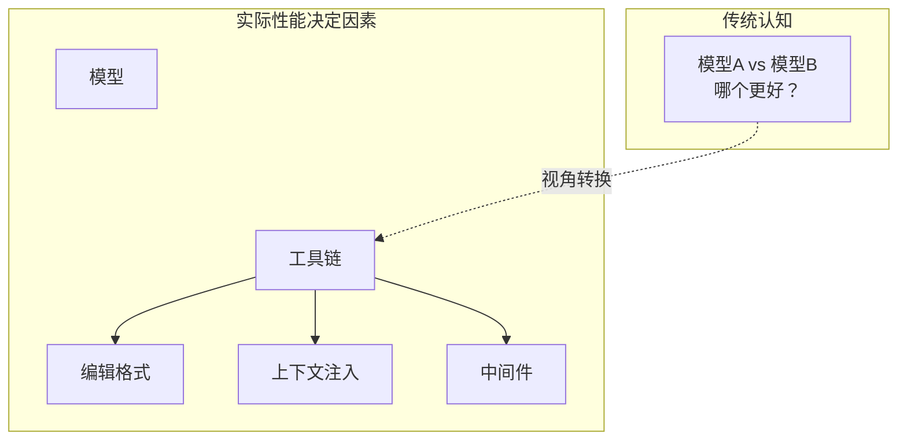
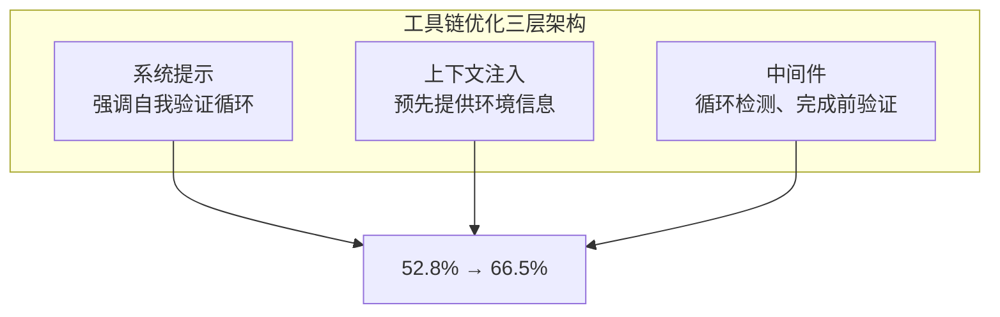

## 概述

"哪个LLM编码能力最强？"

每当工程团队反复提出这个问题时，我们往往忽略了一个关键变量——<strong>工具链（harness）</strong>。工具链是指LLM读取文件、接收提示、应用编辑的<strong>整个接口层</strong>。

2026年2月，Can Bölük发表了"[I Improved 15 LLMs at Coding in One Afternoon. Only the Harness Changed](https://blog.can.ac/2026/02/12/the-harness-problem/)"，正面探讨了这个工具链问题。仅仅更换了编辑格式，<strong>15个LLM的编码性能就提升了5~14个百分点</strong>，<strong>输出token减少了约20%</strong>。



本文将梳理工具链工程的概念、基准测试数据，以及从Engineering Manager/CTO视角出发的实战应用策略。

## 什么是工具链（Harness）

工具链是指LLM与实际代码之间的<strong>所有基础设施</strong>。

| 组成要素 | 说明 | 示例 |
|---------|------|------|
| 编辑格式 | 模型修改代码的方式 | diff, string_replace, hashline |
| 系统提示 | 给模型的指令 | 自我验证循环、问题解决策略 |
| 工具接口 | 模型使用的工具定义 | read_file, edit_file, run_test |
| 上下文注入 | 预先提供环境信息 | 目录结构、评估标准 |
| 中间件 | 执行流程控制 | 循环检测、完成前验证 |

核心要点是：<strong>同一模型在不同工具链下性能会产生巨大差异。</strong>

在Aider基准测试中，仅更换编辑格式就使GPT-4 Turbo的准确率从<strong>26%跃升至59%</strong>，这一案例充分证明了这一点。

## 三种编辑格式对比

目前主流AI编码工具使用不同的编辑格式。

### 1. apply_patch（OpenAI Codex方式）

OpenAI在Codex中使用的基于diff的补丁格式。模型以unified diff形式输出修改内容，工具链解析后应用到文件中。

<strong>优点</strong>：对diff格式熟悉的模型能稳定运行。
<strong>缺点</strong>：diff格式训练不足的模型失败率很高。Grok 4的<strong>失败率高达50.7%</strong>。

### 2. string_replace（Claude Code、Gemini方式）

精确指定要查找的字符串和替换字符串的方式。Claude Code的`str_replace`工具是典型代表。

<strong>优点</strong>：直观且实现简单。
<strong>缺点</strong>：哪怕一个空格、一个缩进不对，就会出现"String to replace not found"错误。要求<strong>完美的字符串复现</strong>。

### 3. hashline（新方法）

Can Bölük提出的方法，为文件的每一行分配2~3位的内容哈希。

```
11:a3|function hello() {
22:f1|  return "world";
33:0e|}
```

模型无需复现完整的源代码，而是<strong>通过引用哈希标签</strong>来指定修改位置。例如"替换行`2:f1`"或"在`3:0e`后插入"。

<strong>优点</strong>：
- 无需完美的字符串复现 → 减少错误
- 文件状态变更时哈希不匹配自动检测 → 防止冲突
- 输出token约减少20%

<strong>缺点</strong>：并非所有模型都能保证同样的效果（GPT-3.5在哈希复现本身就存在困难）。

## 基准测试结果揭示了什么

Can Bölük的基准测试对180个任务在16个模型 × 3种编辑格式下各运行3次。

| 模型 | 原有格式 | hashline格式 | 提升幅度 |
|------|---------|-------------|---------|
| Grok Code Fast 1 | 6.7% | 68.3% | +61.6pp |
| Gemini 3 Flash | — | 78.3% | — |
| Grok 4 | 低 | 提升 | 输出token减少61% |
| MiniMax | — | 提升2倍 | — |

<strong>Grok Code Fast 1的案例尤其令人震惊。</strong>模型本身完全相同，仅更换了编辑格式，<strong>就从6.7%提升到68.3%，提高了10倍</strong>。这就是工具链工程的潜力所在。

### Cursor的承认

最能说明这一问题严重性的案例是Cursor。Cursor为了修复编辑失败，部署了<strong>一个独立的70B参数神经网络</strong>。它承认了编辑格式的问题，并为此额外投入了一个大规模模型来弥补。

## 工具链工程实战案例：LangChain的Terminal Bench

展示工具链优化实际效果的另一个案例来自LangChain团队。他们在Terminal Bench 2.0中<strong>不更换模型，仅优化工具链</strong>，就将成绩从<strong>52.8%提升至66.5%，提高了13.7个百分点</strong>。从排行榜Top 30跃升至Top 5。

他们使用的工具链优化技术包含三个层面：



### 1. 自我验证循环

Agent倾向于在得到第一个看似合理的解决方案后就立即终止。LangChain在系统提示、上下文注入、中间件三个层面全部强制执行了"构建-验证-修复"循环。

### 2. 推理算力分配策略（"Reasoning Sandwich"）

不是在所有步骤均匀分配高推理算力，而是<strong>进行策略性分配</strong>：

- <strong>规划阶段</strong>：最高级别（xhigh）
- <strong>实现阶段</strong>：高级别（high）
- <strong>验证阶段</strong>：最高级别（xhigh）

这种"三明治"策略比均匀的xhigh推理取得了<strong>更好的效果</strong>。在超时限制内明智地分配了推理资源。

### 3. 环境引导

像对待新入职工程师一样，<strong>预先向Agent提供环境信息</strong>：
- 可用工具列表
- 目录结构
- 评估标准
- 时间限制

这样可以避免Agent浪费时间去探索环境。

## EM/CTO应关注的3个启示

### 1. 工具链优化的ROI可能高于更换模型

与每次新模型发布就更换供应商相比，<strong>优化当前模型的工具链</strong>可能更具成本效益。更换模型需要重新调整API密钥、提示格式、token限制等所有配置，而工具链优化可以在现有基础设施上渐进式改进。

### 2. 开源工具链可能优于供应商锁定方案

Can Bölük的核心论点之一：<strong>开源工具链因为社区中不同模型的用户各自修复遇到的失败问题</strong>，所以在通用性方面往往比特定供应商专用工具链表现更好。

另一方面，Anthropic封锁OpenCode和Google停用作者Gemini账户的案例，展示了供应商锁定的风险。

### 3. "炫酷Demo"与"可靠工具"之间的鸿沟

> "The gap between 'cool demo' and 'reliable tool' isn't model magic. It's careful, rather boring, empirical engineering at the tool boundary."
> — Can Bölük

作为CTO在评估AI编码工具时，比起Demo中展示的华丽代码生成，更应该衡量<strong>实际编辑成功率、重试比率和token效率</strong>。

## 实战应用指南

### 团队层面可以做的事

1. <strong>衡量编辑成功率</strong>：追踪AI编码工具的编辑尝试与成功比率。如果"String not found"错误频繁出现，那就是工具链问题。

2. <strong>引入中间件</strong>：添加循环检测、完成前验证、上下文自动注入等中间件。

3. <strong>推理策略分层</strong>：为规划-实现-验证各阶段分配不同的推理级别。

4. <strong>基于Trace的调试</strong>：使用LangSmith等工具追踪Agent的所有行为、延迟和token消耗，进行系统化改进。

### HN社区分享的实用工具

| 工具 | 用途 | 方法 |
|------|------|------|
| Serena | 代码智能 | 基于AST的结构分析 |
| RepoMapper | 代码库映射 | 目录结构可视化 |
| Tilth | 编辑工具 | 行哈希 + 语义分段（节省17~25%成本） |
| Tree-sitter集成 | AST感知编辑 | 大幅减少交互轮次 |

## 结论

2026年AI编码工具的竞争中，决定胜负的不仅仅是"使用哪个模型"。<strong>在模型之上构建怎样的工具链</strong>才是造成实质性能差异的关键。

- 仅凭编辑格式就实现了<strong>6.7% → 68.3%</strong>（10倍提升）
- 仅靠工具链优化就实现了<strong>Top 30 → Top 5</strong>（13.7个百分点）
- 输出token<strong>减少20~61%</strong>

作为Engineering Manager，如果想提升团队的AI编码生产力，在等待下一个模型发布之前，不妨先<strong>衡量一下当前工具链的编辑成功率</strong>。这个数字可能会告诉你意想不到的信息。

## 参考资料

- [I Improved 15 LLMs at Coding in One Afternoon. Only the Harness Changed](https://blog.can.ac/2026/02/12/the-harness-problem/) — Can Bölük
- [Harness Engineering for Agentic Coding Systems](https://www.zenml.io/llmops-database/harness-engineering-for-agentic-coding-systems) — ZenML
- [Hacker News Discussion](https://news.ycombinator.com/item?id=46988596)
- [Addy Osmani's LLM Coding Workflow 2026](https://medium.com/@addyosmani/my-llm-coding-workflow-going-into-2026-52fe1681325e)
