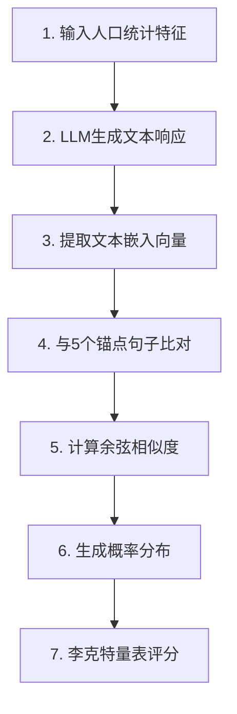
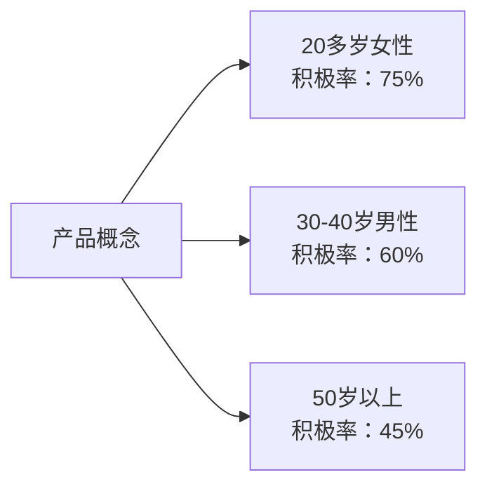

## 概述

消费者调研每年为企业带来数十亿美元的成本，但始终面临样本偏差和规模受限这两大顽疾。最近发表在arXiv上的一项研究提出了一种创新性方法论，利用大语言模型（Large Language Model, LLM）生成"合成消费者"，以90%的可信度重现真实消费者的购买意图。

该研究提出的<strong>语义相似度评估（Semantic Similarity Rating, SSR）</strong>方法，解决了LLM生成的文本响应转换为李克特量表（Likert Scale）过程中出现的非现实分布问题。

## 传统消费者调研的局限性

### 成本与规模的困境

企业在消费者调研上投入巨额成本，却面临以下制约：

- <strong>高昂成本</strong>：大规模问卷调查耗时耗资
- <strong>样本偏差</strong>：调查参与者往往无法代表整体人群
- <strong>规模受限</strong>：难以获得足够的统计可信度
- <strong>响应缓慢</strong>：无法快速应对市场变化

### LLM驱动的合成消费者诞生

LLM展现了模拟具有不同人口统计特征"合成消费者"的可能性。然而，早期研究遭遇了关键问题：

<strong>直接数值评估的问题</strong>：
- 直接询问LLM"请从1到5中选择一个"时
- 会生成非现实的极端或偏向分布
- 与真实人类响应模式差异显著

## SSR方法论的创新突破

### 核心理念

SSR是一种巧妙的方法，既发挥了LLM在"自然语言生成"方面的优势，又满足了结构化问卷数据的需求。



### 三阶段流程

#### 第一阶段：生成文本响应

向LLM提供人口统计属性（年龄、性别、地区等）和产品概念，生成自由格式的文本响应。

<strong>提示词示例</strong>：
```
你是一位35岁女性，居住在北京。
请自由描述你对以下新产品的购买意向：
[产品描述]
```

#### 第二阶段：语义映射

使用OpenAI的`text-embedding-3-small`模型将生成的文本转换为嵌入向量（embedding vector）。

#### 第三阶段：计算与锚点句子的相似度

与5个参考锚点句子（对应李克特量表各级别）计算余弦相似度：

- <strong>1分</strong>："完全不想购买"
- <strong>2分</strong>："不太想购买"
- <strong>3分</strong>："一般"
- <strong>4分</strong>："想购买"
- <strong>5分</strong>："非常想购买"

将计算出的相似度值归一化，生成李克特量表上的概率分布（PMF，Probability Mass Function）。

### 数学表示

基于余弦相似度的概率分布生成：

```typescript
function computeLikertDistribution(
  responseEmbedding: number[],
  anchorEmbeddings: number[][]
): number[] {
  // 计算与每个锚点的余弦相似度
  const similarities = anchorEmbeddings.map(anchor =>
    cosineSimilarity(responseEmbedding, anchor)
  );

  // 通过softmax归一化
  const probabilities = softmax(similarities);

  return probabilities; // [P(1), P(2), P(3), P(4), P(5)]
}

function cosineSimilarity(vec1: number[], vec2: number[]): number {
  const dotProduct = vec1.reduce((sum, val, i) => sum + val * vec2[i], 0);
  const mag1 = Math.sqrt(vec1.reduce((sum, val) => sum + val * val, 0));
  const mag2 = Math.sqrt(vec2.reduce((sum, val) => sum + val * val, 0));
  return dotProduct / (mag1 * mag2);
}
```

## 实验结果：惊人的准确性

### 数据集

研究团队使用了一家大型个人护理品公司进行的57项实际产品问卷调查：
- <strong>总响应数</strong>：9,300条人类响应
- <strong>产品类别</strong>：个人护理品（化妆品、日用品等）
- <strong>评估指标</strong>：测试-重测信度（test-retest reliability）、KS相似度

### 主要成果

<strong>达成90%的人类测试-重测信度</strong>：
- 与真实人类两次接受同一问卷时的一致性相比较
- SSR方法达到人类响应一致性的90%水平

<strong>KS相似度 > 0.85</strong>：
- 使用Kolmogorov-Smirnov统计量测量分布相似性
- 0.85以上的高相似度意味着合成响应分布与真实人类响应分布高度相似

### 额外优势：定性反馈

SSR的独特优势在于<strong>同时提供定量评估和定性说明</strong>：

- 不仅有李克特量表评分
- 还有关于受访者为何如此评价的详细文本说明
- 营销人员能更深入地理解消费者心理

## 实战应用案例

### 1. 新产品概念测试

```python
# 使用SSR进行新产品测试示例
from semantic_similarity_rating import SSRModel

# 生成合成消费者样本
synthetic_panel = [
    {"age": 25, "gender": "女性", "region": "北京"},
    {"age": 35, "gender": "男性", "region": "上海"},
    {"age": 45, "gender": "女性", "region": "广州"},
    # ... 数千个用户画像
]

# 产品概念
product_concept = """
环保竹制牙刷：采用100%可生物降解材料制成的
高端牙刷，价格比现有产品高20%
"""

# 用SSR模型评估购买意向
ssr_model = SSRModel(model="gpt-4")
results = ssr_model.evaluate(synthetic_panel, product_concept)

# 结果分析
print(f"平均购买意向：{results.mean_rating:.2f}")
print(f"积极响应比例：{results.positive_ratio:.1%}")
print(f"主要购买动机：{results.top_reasons}")
```

### 2. A/B测试模拟

可以快速大规模测试产品描述的细微差异对购买意向的影响：

- <strong>版本A</strong>："环保竹制牙刷"
- <strong>版本B</strong>："为可持续未来而生的竹制牙刷"

用数千名合成消费者进行测试，立即确认哪种信息更有效。

### 3. 细分目标分析

按不同人口统计细分市场分析反应：



## 局限性与注意事项

### 偏差问题

LLM本身的偏差也会反映在合成消费者响应中：

- <strong>地理偏差</strong>：西方、英语国家、发达国家的性能更优
- <strong>人口统计偏差</strong>：存在性别、种族、年龄、教育水平相关偏差
- <strong>文化背景</strong>：可能无法充分反映特定文化圈的消费模式

### 改进方法

- <strong>与真实数据验证</strong>：用小规模实际问卷验证SSR结果
- <strong>偏差缓解技术</strong>：通过提示词工程（prompt engineering）最小化偏差
- <strong>使用多种模型</strong>：集成多个LLM的结果以减少偏差

## 未来展望

### 消费者调研的范式转变

随着SSR等技术的成熟：

1. <strong>成本削减</strong>：以传统调研成本的10%以下进行大规模调查
2. <strong>速度提升</strong>：将耗时数周的调查缩短至几小时内完成
3. <strong>规模扩大</strong>：使用数万名而非数百名合成受访者进行测试
4. <strong>迭代实验</strong>：通过快速迭代优化产品

### 数字孪生消费者

为每个个体生成"数字孪生"消费者：
- 个性化产品推荐
- 定制化营销信息测试
- 实时市场反应预测

## 实现指南

### 开源实现

PyMC Labs在GitHub上公开了SSR算法的开源实现：

```bash
# 安装
pip install semantic-similarity-rating

# 基本用法
from ssr import SemanticSimilarityRating

# 创建SSR实例
ssr = SemanticSimilarityRating(
    llm_model="gpt-4",
    embedding_model="text-embedding-3-small"
)

# 定义锚点句子
anchors = [
    "完全不想购买",
    "不太想购买",
    "一般",
    "想购买",
    "非常想购买"
]

# 执行评估
result = ssr.evaluate(
    product_description="环保竹制牙刷",
    consumer_profile={"age": 30, "gender": "女性"},
    anchors=anchors
)

print(f"李克特分布：{result.distribution}")
print(f"响应文本：{result.text_response}")
```

### 最佳实践

1. <strong>优化锚点句子</strong>：根据产品类别调整锚点句子
2. <strong>提示词工程</strong>：明确定义人口统计特征
3. <strong>结果验证</strong>：初期与实际问卷并行验证准确性
4. <strong>持续改进</strong>：通过反馈改进提示词和锚点

## 结论

语义相似度评估（SSR）在利用LLM进行消费者调研领域实现了突破性进展。这种在达成90%人类信度的同时提供丰富定性反馈的方法论，开启了以下可能性：

<strong>核心贡献</strong>：
- ✓ 成本效益高的大规模消费者调研
- ✓ 通过快速迭代实验优化产品
- ✓ 定量评估与定性洞察的结合
- ✓ 多样化人口统计细分市场分析

<strong>注意事项</strong>：
- 需持续监控偏差问题
- 通过与真实数据验证确保可信度
- 伦理考量（个人信息、操纵可能性等）

消费者调研行业正迎来AI时代的新转折点。SSR等技术将成为企业打造更优产品、深入理解消费者的强大工具。

## 参考资料

- [arXiv论文：LLMs Reproduce Human Purchase Intent via Semantic Similarity Elicitation of Likert Ratings](https://arxiv.org/abs/2510.08338)
- [GitHub实现：PyMC Labs SSR Algorithm](https://github.com/pymc-labs/semantic-similarity-rating)
- [VentureBeat：Digital Twin Consumers](https://venturebeat.com/ai/this-new-ai-technique-creates-digital-twin-consumers-and-it-could-kill-the)
- [Research on LLM Bias in Survey Research](https://www.nature.com/articles/s41599-024-03609-x)
