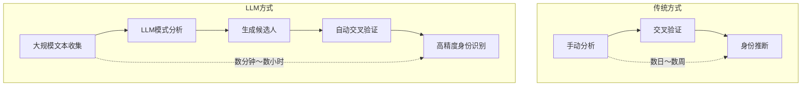
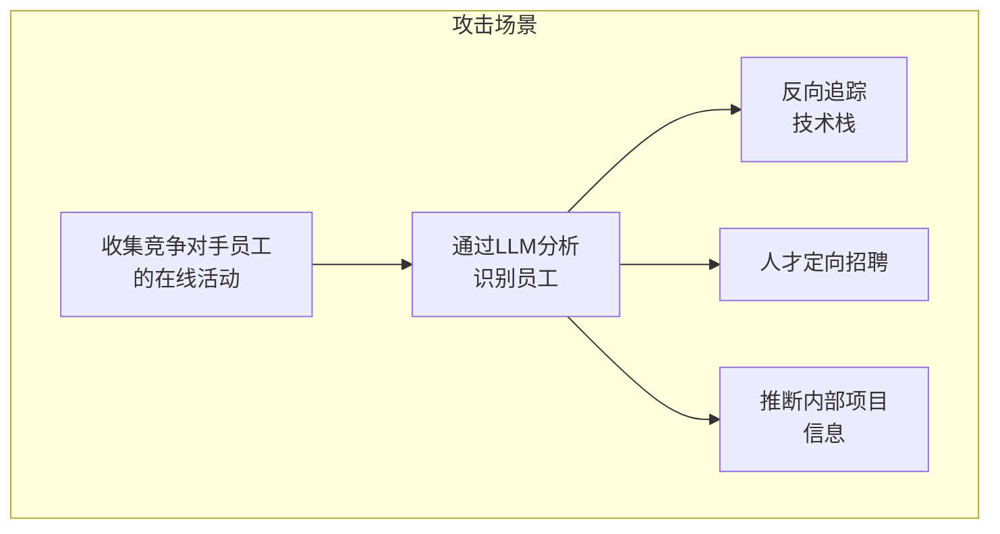
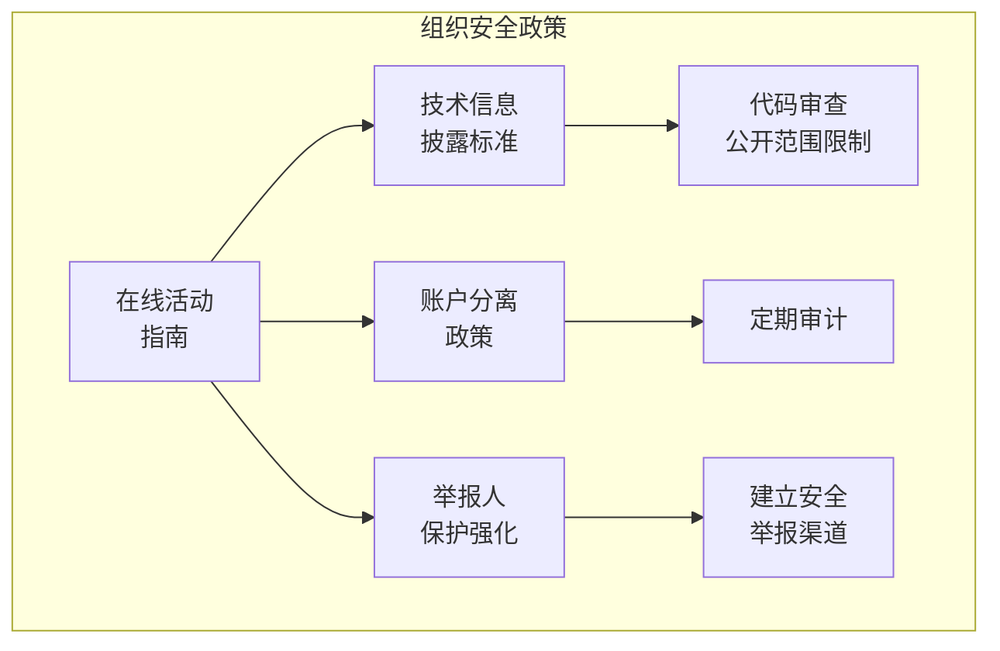

## 338条匿名帖子中226条身份被识别 — 67%的曝光率

2026年2月，MATS（Model Alignment Technical Studies）研究团队发布的论文<strong>"Large-scale online deanonymization with LLMs"</strong>震撼了安全社区。针对Hacker News、Reddit、LinkedIn和匿名访谈记录的实验中，LLM准确识别了338名目标人物中的226人。精确度90%、成功率67%这组数字远超传统手动分析。

安全专家Bruce Schneier也在2026年3月3日的个人博客中讨论了这项研究并提出警告。作为<strong>工程经理、VPoE和CTO</strong>，我将分析这项研究对组织的影响及应对策略。

## LLM驱动的去匿名化工作原理

### 传统方式 vs LLM方式

传统的去匿名化（Deanonymization）依赖于人工分析和交叉验证。虽然仅用几个数据点就能识别个人的事实已被证实，但<strong>在非结构化文本中自动化这一过程实际上是不可行的</strong>。

LLM彻底突破了这一限制。



### 核心攻击机制

该研究揭示了LLM去匿名化的核心机制：

<strong>1. 文体分析（Stylometry）</strong>：LLM精确分析个人的写作模式 — 特定表达、句子结构、技术术语使用频率 — 捕捉人们有意识地难以改变的细微特征。

<strong>2. 语义交叉引用</strong>：将散布在多个平台上的帖子进行语义关联。LLM能判断Hacker News上的技术讨论与Reddit上的爱好帖子是否来自同一人。

<strong>3. 上下文推理</strong>：即使没有直接身份标识，LLM也能综合工作环境、技术栈、地理位置等间接信息来缩小候选范围。

<strong>4. 规模</strong>：最危险的方面是能同时处理数万名候选人。传统方式需要特定个人作为目标，而LLM可以"先找到猎物再发动攻击"。

## 对组织的实际威胁

### 员工隐私风险

开发者和工程师在Stack Overflow、Hacker News、Reddit等平台提出技术问题和分享观点。如果这些帖子被追踪到特定公司的特定员工，会产生以下问题：

<strong>猎头精准定位</strong>：竞争对手可以精确掌握内部技术栈和人员构成，进行目标化招聘。这在职业跳槽市场可能是优势，但对组织管理者而言是人才流失风险。

<strong>内部信息泄露</strong>：员工的技术问题和讨论可能间接暴露正在使用的基础设施、架构和技术挑战。

<strong>社会工程学攻击</strong>：基于识别出的员工在线活动模式，攻击者可以实施精心策划的钓鱼攻击。

### 举报人保护削弱

最严重的隐忧之一是<strong>举报人（Whistleblower）匿名性的丧失</strong>。如果想举报企业伦理问题的员工可能被LLM识别，这会对健全的公司治理构成严重威胁。

### 竞争情报恶意利用



## 工程领导者的防御策略

### 1. 组织层面的认知教育

首先需要做的是<strong>向团队成员传达这一威胁</strong>。许多开发者仍然相信在匿名论坛上的活动是安全的。

```markdown
# 团队教育检查清单

- [ ] 分享LLM驱动的去匿名化风险
- [ ] 发布在线活动注意事项指南
- [ ] 制定公司相关技术信息发布政策
- [ ] 定期进行安全意识培训
```

### 2. 技术防御手段

<strong>文体混淆（Stylometric Obfuscation）</strong>：在匿名发布时提供工具，有意改变写作风格。新兴工具能自动改变单词选择和句子结构，使LLM难以分析文体。

<strong>元数据最小化</strong>：最小化发布时间、IP地址、浏览器信息等额外信息。建议使用VPN、Tor浏览器或隐私优先的浏览器。

<strong>账户分离原则</strong>：将工作相关活动与个人活动的账户完全分离。制定禁止使用相同电子邮件或类似用户名的政策。

### 3. 政策框架



### 4. 监控和应对体系

<strong>自身曝光检查</strong>：定期使用LLM检查公司员工的在线曝光程度。在攻击者之前发现漏洞是关键。

<strong>事件应对计划</strong>：预先制定员工匿名性被侵犯时的应对程序。包括法律应对、社交媒体应对和内部沟通计划。

## CTO/VPoE可立即执行的行动项目

<strong>第1周 — 了解现状</strong>

- 调查团队成员的公开在线活动现状（自愿问卷）
- 收集公司相关技术信息外泄的案例
- 确认现有安全政策中是否包含在线隐私条款

<strong>1个月内 — 制定政策</strong>

- 起草在线活动指南初稿
- 检查和强化内部举报人保护渠道
- 将LLM去匿名化风险添加到安全培训课程

<strong>一个季度内 — 技术应对</strong>

- 评估文体混淆工具的引入
- 加强内部通讯工具的隐私设置
- 建立定期曝光程度检查流程

## 这项技术的双刃性

LLM驱动的去匿名化技术并非只有恶意应用。

<strong>积极应用</strong>：执法机构可以使用它追踪网络犯罪分子、识别虚假信息传播者和定位在线骚扰者。

<strong>恶意滥用</strong>：可被用于跟踪、人肉搜索（doxxing）、压制活动人士、企业监控和政府监视。

技术本身是中立的，但<strong>当前防御手段远落后于攻击手段</strong>是问题所在。攻击者能以低成本执行大规模去匿名化，而防卫者必须逐个应对，形成不对称结构。

## 结论

LLM驱动的大规模去匿名化已是<strong>现实</strong>。67%的成功率和90%的精确度完全颠覆了对在线匿名性的既有假设。

作为工程领导者，我们的任务很清晰。

1. 认真对待这一威胁并与团队共享
2. 制定组织层面的在线活动指南
3. 引入技术防御手段并定期检查
4. 强化举报人保护体系

<strong>仅凭匿名发布不再能保证身份保护。</strong>

## 参考资源

- [Large-scale online deanonymization with LLMs (arXiv)](https://arxiv.org/abs/2602.16800)
- [LLM-Assisted Deanonymization — Schneier on Security](https://www.schneier.com/blog/archives/2026/03/llm-assisted-deanonymization.html)
- [AI takes a swing at online anonymity — The Register](https://www.theregister.com/2026/02/26/llms_killed_privacy_star/)
- [Large-Scale Online Deanonymization with LLMs — LessWrong](https://www.lesswrong.com/posts/xwCWyy8RvAKsSoBRF/large-scale-online-deanonymization-with-llms)
