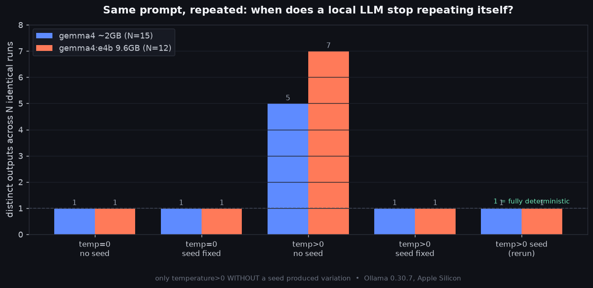
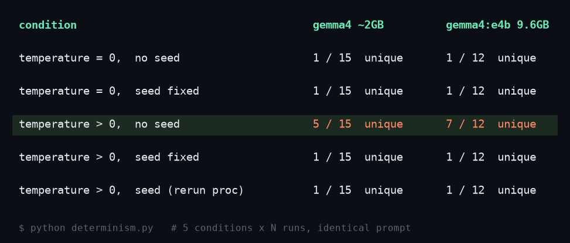

我把评估脚本跑了两遍，分数却不一样。代码、提示词、模型都没变。什么都没改，可原本通过的一个用例却失败了。

我最初怀疑是自己动了什么。可重跑一次又通过了。于是怀疑转向了模型本身。LLM不是把相同输入映射到相同答案的函数。这个道理我心里清楚，但当评估流水线开始晃动时，问题立刻变得具体起来：到底要固定什么，输出才会复现？

所以我自己测了。不是在云端API上，而是在我能从头到尾掌控的本地Ollama + Gemma 4环境里。把同一提示词发送数十次，按哈希把输出归类，数一数出现了几种。先说结论：在我的环境里，可复现性归结于恰好两个旋钮。

## 先说什么都没改结果却晃动的原因

LLM挑选token的最后一步是采样，从概率分布中抽取一个。改变这一采样性格的就是`temperature`。temperature为0时，模型每次都直接取概率最高的token(贪心)。没有随机性进入的余地，理论上应当是确定的。提高temperature会给第二、第三名的token留出余地，而支配这场抽签的是`seed`。

还有一个值得点名的旋钮是`num_predict`，即生成的最大token数。它短时，模型可分叉的区段就少，看起来更确定；它长时，越往后微小差异越有累积的余地。所以我先用一句短标语(约40个token)抓取干净的信号，长输出另行测试。结果正是在这个长输出测试中，我遇到了后面要讲的空响应问题。

到这里都是文档里写好的内容。问题在于这套理论在我的笔记本上是否真的照样成立。光看ollama的issue追踪器，就有一连串报告：『固定了seed答案却变了』(#4660)、『temperature=0加固定seed，首次和第二次运行仍有细微差异』(#586)。所以我决定不轻信，去测。

## 把同一提示词发送数十次的实验设计

实验环境建在repo之外的临时目录里。Ollama 0.30.7、Apple Silicon，用了两个模型：一个2GB的小Gemma 4构建，一个9.6GB的`gemma4:e4b`。用两种尺寸是想看看同样的模式是否与模型规模无关。

测量方法很简单。每个条件下把同一提示词发送12到15次，把每个输出用SHA-256哈希，数有几个不同的哈希。为1就是完全确定，数越大说明输出越分散。

```python
import json, hashlib, urllib.request
from collections import Counter

def gen(model, prompt, temperature, seed=None, num_predict=40):
    opts = {"temperature": temperature, "num_predict": num_predict}
    if seed is not None:
        opts["seed"] = seed
    body = {"model": model, "messages": [{"role": "user", "content": prompt}],
            "stream": False, "options": opts}
    req = urllib.request.Request("http://localhost:11434/api/chat",
            data=json.dumps(body).encode(),
            headers={"Content-Type": "application/json"})
    with urllib.request.urlopen(req) as r:
        return json.load(r)["message"]["content"].strip()

def count_unique(model, prompt, temperature, seed, n):
    outs = [gen(model, prompt, temperature, seed) for _ in range(n)]
    hashes = [hashlib.sha256(o.encode()).hexdigest()[:12] for o in outs]
    return len(set(hashes)), Counter(hashes).most_common(1)[0][1]
```

条件分为五种。temperature=0和temperature>0各自在固定seed与不固定seed两种情况下，再加上最后一种：固定seed的同时新起一个Python进程再跑一次。最后这个条件很重要，因为『在同一进程内复现』和『关掉进程重启后仍复现』，从评估/CI的角度看是完全不同的保证。

提示词选了有变化余地的生成型：『为一款新的AI编程助手写一句简短的营销标语，只输出标语。』只有在答案不会收窄为唯一解的任务上，多样性才会显现。若用『2+2等于几』这类封闭问题，提高temperature也几乎不会分散，seed的效果就无从观察。

我同时看两个指标。一个是上面的distinct数，另一个是majority share，即出现最多的那一个输出在全部N次中所占的比例。distinct为5但其中一个出现11次，就基本稳定；5种均匀分散，majority share则掉到0.3附近。要把分布的形状压成一个数字，同时看这两个更稳妥。

## 测量结果：旋钮只有两个



用表格看模式更清楚。

| 条件 | gemma4 ~2GB (N=15) | gemma4:e4b 9.6GB (N=12) |
|------|------|------|
| temperature=0, 无seed | 1种 (确定) | 1种 (确定) |
| temperature=0, 固定seed | 1种 | 1种 |
| temperature>0, 无seed | **5种** | **7种** |
| temperature>0, 固定seed | 1种 | 1种 |
| temperature>0, 固定seed (进程重跑) | 1种 | 1种 |



它讲的故事是这样的。temperature=0时两个模型都只产生一种输出。跑15次、12次，一个字都不差，每次都是同一句。给不给seed结果都一样。这直接证实了贪心解码下seed无事可做。

唯一分散的是temperature>0且无seed那一格。2GB模型在15次里分成5种，9.6GB模型在12次里分成7种。可一旦在同一temperature下把seed固定为42，又重新合并为1种。最令人印象深刻的是最后一行。我把Python进程彻底新起再跑，只要seed相同就给出同一句：『Code faster, effortlessly smart.』两次独立执行逐字一致。

实际出现的句子让人更有体感。temperature=0时2GB模型每次只吐『Code Smarter, Not Harder』。把temperature提到0.8并去掉seed，就混进了『Code Smarter, Not Harder with Ada』这样的变体。但把seed固定为42，就冻结在那一行，进程重启后的重跑里依旧如此。9.6GB模型也一样，在无seed的temperature 0.8下分成7种，固定seed后收敛到『Code faster, effortlessly smart』。用majority share看差异更鲜明：无seed的temperature 0.8下9.6GB模型为0.333，最常见的输出也不过三次出现一次。其余所有条件都是1.0，全部相同。

这个结果干净到我反而又怀疑了一次，于是换模型重跑。尺寸相差5倍的两个模型给出了相同的模式。至少在我的环境里，可复现性的旋钮有temperature和seed两个就够了。

## 一个空响应给了更大的教训

我本想以12B的`gemma4:12b-it-qat`作主力。可这个社区构建从头到尾只返回空字符串。无论用`/api/generate`还是`/api/chat`发送，`done_reason`都是`length`，`eval_count`正常涨到40、200，可关键的`content`却是空字符串。

```text
content repr: ''
done_reason: length   eval_count: 200
```

token显然生成了。GPU每次跑了28秒。可对用户可见的文本却什么都没出来。这个QAT构建的聊天模板可能坏了，或者模型只吐了不可见的控制token。确切原因超出我的专业范围，我不下断言。

但这里得到的教训很明确。『模型跑了』和『模型答了』是两个不同的命题。一个只看eval_count上升就当成成功的流水线，会让这种空响应直接混进评估数据。为什么需要一个剔除零长度响应的守卫，这个失败比任何一行代码都更有说服力。失败也是素材，这次我又一次切身体会到。处理本地模型时这类打包变量，我在[关于Ollama结构化输出的文章](/zh/blog/zh/ollama-structured-outputs-pydantic-local-llm-guide-2026)里也以小模型的schema处理局限这种相似形态遇到过。

## 在我笔记本上对，不等于在云端也对

这里我要把界线划清楚。我测的是『在本地Ollama上、一次一个顺序发送请求时』的确定性。把这个条件搬到OpenAI或Claude这类云端API上，故事就变了。

至于为什么变，Thinking Machines在2025年9月发布的《Defeating Nondeterminism in LLM Inference》给出了最有说服力的解释。人们常说『GPU浮点运算不确定，所以才这样』，但该文把真正的原因放在别处。推理服务器会把多个用户的请求合并成批处理，而批大小会随那一刻的服务器负荷参差变化。由于核心kernel会因批大小走上略有不同的数值路径，同一提示词即便在贪心解码下也可能分叉成不同的token。据我理解，不确定性的真凶不是随机，而是『我的请求每次都挤进不同大小的批』这一点。

本地ollama也并非完全的安全地带。ollama issue #586里有报告称，在相同seed、相同temperature=0、相同num_ctx下，首次与第二次运行的输出仍有细微差异，更有趣的是同一段代码在Ubuntu和Windows上给出了不同的『固定』输出。也就是说，确定性可能是绑定平台的性质。我的测量之所以干净，很可能是因为它跑在一台Mac上、用一个版本的ollama、接收的是短输出。输出越长、num_ctx越大，微小数值差异累积并分叉的余地就越大。

我没有直接复现这种批不确定性。因为我没有搭建施加并发负荷的环境。所以这一部分我仅根据该文引用。我亲手验证的范围终究是『顺序请求 + 本地 + 短输出』。若把这条界线模糊掉，我的文章也会变成又一篇把未经验证的主张当事实兜售的文章。

所以坦白说，把评估的可复现性建立在云端API之上，比想象中棘手。即便是接受seed参数的API，也挡不住批不确定性。我认为这正是LLM评估无法像单元测试那样干净落定的根本原因。

## 立刻应用到评估和代理测试上的事

测量结束后我立即纳入自己工作流的几点。

第一，回归评估用temperature=0加固定seed钉死。如果是看『有没有变』而非『有多好』的回归测试，就不需要模型的创造力。锁定到一个可复现的输出，捕捉它改变的那一刻更好。在我的环境里这个组合即便进程重启也返回同一句，足以挂进CI。

第二，绝不凭一次运行下结论。用较高temperature的功能(像标语生成这种以多样性为价值的)本质上会分散。评估这种输出时不能跑一次就判定通过/失败，而要跑N次看分布。看到我的测量里分成7/12，就知道凭一次幸运输出判断功能有多危险。

第三，把输出有效性守卫放在评估前面。返回空响应的12B模型就是直接理由。除非把零长度、JSON解析失败、缺少期望字段这类情况明确归为『失败』，否则坏掉的模型会伪装成正常分数。我用于回归测试的骨架就这么简单。

```python
def assert_reproducible(model, prompt, expected_hash, n=5):
    outs = [gen(model, prompt, temperature=0, seed=42) for _ in range(n)]
    # 1) 空响应守卫——把"跑了"和"答了"分开
    assert all(len(o) > 0 for o in outs), "empty output detected"
    # 2) 同一次运行内是否锁定为一种
    hashes = {hashlib.sha256(o.encode()).hexdigest()[:12] for o in outs}
    assert len(hashes) == 1, f"non-deterministic: {len(hashes)} variants"
    # 3) 是否与此前钉好的期望输出一致
    assert hashes.pop() == expected_hash, "output drifted from baseline"
```

把期望哈希钉一次，CI就能在模型版本或ollama升级让输出改变的那一刻抓住它。这是我对『LLM没法测试』这种常见放弃论的反驳。不是全部都能测，但把可复现条件控制住的那一部分，确实能测。

推广到代理也一样。要对代理的工具调用序列做回归测试，那个序列就得能复现。如果你有用本地模型[搭建完全离线MCP服务器的经验](/zh/blog/zh/local-llm-private-mcp-server-gemma4-fastmcp)，在它之上固定seed来复现工具调用相对可控。而云端LLM上的代理则因批不确定性难以获得同样的保证。归根结底，『在哪里推理』决定了『测试能写得多牢』，这是这次实验最实用的收获。

接下来我打算搭建施加并发负荷的环境，直接确认本地ollama上是否也会复现批不确定性。如果会，那我『本地是安全的』这个暂定结论也得加上一条注脚。

## 参考资料

- [Ollama API 文档 — 生成选项](https://github.com/ollama/ollama/blob/main/docs/api.md)：包含`temperature`和`seed`的`options`对象，并说明为获得可复现的输出应把`seed`设为一个数字。
- [Ollama Modelfile 参考](https://docs.ollama.com/modelfile)：用`PARAMETER`指令定义`seed`（「对同一提示词生成相同文本」）和`temperature`。
- [OpenAI Cookbook — 用seed参数获得可复现输出](https://developers.openai.com/cookbook/examples/reproducible_outputs_with_the_seed_parameter)：解释为何在云端即便`seed`和`system_fingerprint`都匹配，输出也只是「基本一致」而非保证。
- [Thinking Machines — Defeating Nondeterminism in LLM Inference](https://thinkingmachines.ai/blog/defeating-nondeterminism-in-llm-inference/)：本文引用但未直接复现的、关于云端不确定性的批不变性论证。
