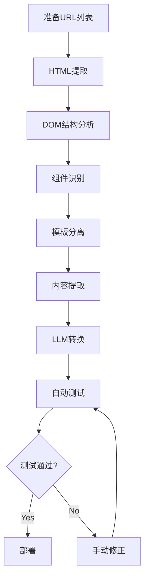

## 概述

网站改版或框架迁移是许多开发团队面临的巨大挑战。特别是迁移50〜500页以上的中大型站点时，手动操作需要数百小时，而且很难保持一致性和测试覆盖率。

<strong>从2024年到2025年，Google、Airbnb、Zalando等全球企业成功利用LLM(Large Language Model，大型语言模型)完成了大规模代码迁移</strong>。从这些案例中我们可以了解到：

- <strong>可自动化范围</strong>：整体迁移作业的70〜80%
- <strong>节省时间</strong>：缩短数百小时的开发时间
- <strong>质量提升</strong>：一致的代码模式和自动测试生成

本文介绍以Claude Code为中心的基于LLM的网页迁移作业标准化工作流程。涵盖Web组件(Web Components)组件库、CMS模板系统以及综合测试自动化策略等在生产环境中经过验证的最佳实践。

## 传统方式 vs 基于LLM的方法

### 传统转译器(Transpiler)方式的局限性

传统的代码迁移依赖于语法级别的1:1映射。例如，将React类组件转换为函数组件的工具只是简单地将`class`关键字替换为`function`。

<strong>问题点</strong>：
- 无法理解业务逻辑的上下文
- 机械转换导致代码未优化
- 发生错误时需要手动修正
- 测试代码需要单独处理

### 基于LLM方法的优势

LLM不仅进行简单转换，还执行<strong>语义理解和智能重构</strong>。

| 分类 | 传统转译器 | 基于LLM的方法 |
|------|----------------|----------------|
| <strong>转换方式</strong> | 1:1语法映射 | 语义理解后转换 |
| <strong>代码质量</strong> | 机械转换 | 重构 + 优化 |
| <strong>错误处理</strong> | 需要手动修正 | 基于上下文自动修正 |
| <strong>测试生成</strong> | 单独作业 | 可自动生成 |

### 2024-2025 生产案例

#### Google的大规模代码迁移

Google在2024年论文"Migrating Code At Scale With LLMs At Google"中公开了基于LLM的迁移成果。

<strong>主要成果</strong>：
- 抽象数据类型(Abstract Data Type)重构自动化
- 使用关系表示不变式(Relational Representation Invariant)指定类型变更
- 在数百万行代码库中保持一致的模式

#### Airbnb的测试迁移

Airbnb在2024年通过"Accelerating Large-Scale Test Migration with LLMs"项目执行了向React Testing Library的大规模测试迁移。

<strong>结果</strong>：
- 节省数百小时的开发时间
- 自动处理边界情况(Edge Case)
- 应用一致的测试模式

#### Zalando的UI组件库迁移

Zalando在2024年9月利用GPT-4o迁移了UI组件库。

<strong>特点</strong>：
- 基于Python + LLM API的自动化
- 本地更改或基于GitHub PR的审查
- 优化模型选择以实现精确转换

## Web组件组件库

### 为什么选择Web组件？

Web组件(Web Components)是创建可重用和封装的HTML元素的Web标准技术。截至2025年，Chrome、Edge、Safari、Firefox均原生支持，<strong>无需polyfill即可在生产环境中使用</strong>。

<strong>核心技术三要素</strong>：
1. <strong>Custom Elements</strong>：自定义HTML标签
2. <strong>Shadow DOM</strong>：样式和DOM隔离
3. <strong>HTML Templates</strong>：可重用的标记

### 框架比较：Lit vs Stencil

#### Lit 3.0 (2024-2025 推荐)

Lit是Google开发的超轻量级Web组件框架。

<strong>特点</strong>：
- 超轻量级内存使用(4.3MB)
- 响应式属性管理
- TypeScript原生支持
- 无需编译(运行时库)

<strong>性能基准测试(2025)</strong>：
- 初始加载：235ms
- 内存使用：4.3MB
- 更新速度：比Stencil快17%

<strong>代码示例</strong>：

```typescript
import { LitElement, html, css } from 'lit';
import { customElement, property } from 'lit/decorators.js';

@customElement('my-counter')
export class MyCounter extends LitElement {
  // Shadow DOM样式(隔离)
  static styles = css`
    button {
      background: blue;
      color: white;
      padding: 8px 16px;
      border-radius: 4px;
    }
  `;

  // 响应式属性
  @property({ type: Number })
  count = 0;

  // 模板渲染
  render() {
    return html`
      <div>
        <p>Count: ${this.count}</p>
        <button @click=${this._increment}>Increment</button>
      </div>
    `;
  }

  // 事件处理器
  private _increment() {
    this.count++;
  }
}
```

#### Stencil 4.0

Stencil是Ionic团队开发的基于编译器的Web组件框架。

<strong>特点</strong>：
- JSX模板支持(React风格)
- 构建时优化
- 自动LazyLoading
- 框架无关

<strong>性能基准测试(2025)</strong>：
- 初始加载：284ms
- 内存使用：6.2MB
- 通过构建时优化最小化运行时开销

<strong>代码示例</strong>：

```typescript
import { Component, Prop, State, h } from '@stencil/core';

@Component({
  tag: 'my-counter',
  styleUrl: 'my-counter.css', // 独立CSS文件
  shadow: true, // 启用Shadow DOM
})
export class MyCounter {
  // Props(从外部传递)
  @Prop() initialCount = 0;

  // State(内部状态)
  @State() count = this.initialCount;

  // 事件处理器
  private increment = () => {
    this.count++;
  };

  // JSX渲染
  render() {
    return (
      <div>
        <p>Count: {this.count}</p>
        <button onClick={this.increment}>Increment</button>
      </div>
    );
  }
}
```

### 选择指南

| 项目需求 | 推荐框架 | 理由 |
|-----------------|----------------|------|
| 最小包大小 | Lit | 内存使用少30% |
| 偏好React风格 | Stencil | 支持JSX模板 |
| 快速原型开发 | Lit | 无需编译步骤 |
| 大规模企业应用 | Stencil | 构建时优化 |
| 最小化团队学习曲线 | Lit | 更简单的API |

### Shadow DOM设计模式

Shadow DOM提供了样式和DOM的完全隔离。外部CSS不会影响组件内部，组件的样式也不会泄露到外部。

<strong>基本结构</strong>：

```javascript
class AdvancedTooltip extends HTMLElement {
  constructor() {
    super();
    // 创建Shadow DOM(mode: 'open'允许外部访问)
    this.attachShadow({ mode: 'open' });
  }

  connectedCallback() {
    const text = this.getAttribute('text');
    this.shadowRoot.innerHTML = `
      <style>
        /* :host指向组件本身 */
        :host {
          position: relative;
          display: inline-block;
        }
        /* 隔离的样式(不受外部影响) */
        .tooltip {
          position: absolute;
          background: #333;
          color: white;
          padding: 8px;
          border-radius: 4px;
          font-size: 14px;
          z-index: 1000;
        }
      </style>
      <div class="tooltip">${text}</div>
    `;
  }
}

// 注册自定义元素
customElements.define('advanced-tooltip', AdvancedTooltip);
```

<strong>利用Slot的组合</strong>：

```html
<!-- 组件定义 -->
<template id="card-template">
  <style>
    .card { border: 1px solid #ddd; padding: 16px; }
    .card-header { font-weight: bold; }
  </style>
  <div class="card">
    <div class="card-header">
      <!-- 命名slot -->
      <slot name="header">默认标题</slot>
    </div>
    <div class="card-body">
      <!-- 默认slot -->
      <slot>默认内容</slot>
    </div>
  </div>
</template>

<!-- 使用示例 -->
<my-card>
  <span slot="header">自定义标题</span>
  <p>自定义内容</p>
</my-card>
```

## CMS模板系统集成

### 静态站点生成器(SSG)比较

在网页迁移作业中，SSG在构建时生成静态HTML，因此<strong>在安全性、性能和成本方面具有巨大优势</strong>。

#### Astro 5.14+ (2024-2025)

Astro引入了Islands Architecture，只在需要的部分加载JavaScript。

<strong>特点</strong>：
- Islands Architecture(部分hydration)
- 多框架支持(可混用React、Vue、Svelte)
- Content Collections(类型安全的内容管理)
- 零JavaScript默认设置

<strong>使用案例</strong>：
- 博客和营销站点
- 文档站点
- 作品集

<strong>代码示例</strong>：

```astro
---
// src/pages/blog/[slug].astro
import { getCollection } from 'astro:content';

// 生成静态路径
export async function getStaticPaths() {
  const posts = await getCollection('blog');
  return posts.map(post => ({
    params: { slug: post.slug },
    props: { post },
  }));
}

const { post } = Astro.props;
const { Content } = await post.render();
---

<html>
  <head>
    <title>{post.data.title}</title>
  </head>
  <body>
    <article>
      <h1>{post.data.title}</h1>
      <!-- 渲染Markdown内容 -->
      <Content />
    </article>
  </body>
</html>
```

#### Hugo (基于Go)

Hugo的优势在于压倒性的构建速度。

<strong>特点</strong>：
- 以秒为单位构建数千页面
- 内置多语言支持
- 强大的模板系统
- 丰富的主题生态系统

<strong>性能</strong>：
- 1,000页构建：约1秒
- 10,000页构建：约5秒

<strong>使用案例</strong>：
- 大规模文档站点
- 多语言内容站点
- 静态博客

#### Eleventy (11ty)

Eleventy是基于JavaScript的灵活SSG。

<strong>特点</strong>：
- 基于JavaScript(Node.js)
- 支持多种模板引擎(Nunjucks、Liquid、Handlebars等)
- 灵活的数据管道
- 零客户端JavaScript

<strong>使用案例</strong>：
- 自定义较多的项目
- 遗留系统迁移
- 开发者友好的工作流程

### 比较矩阵

| 功能/框架 | Astro | Hugo | 11ty |
|----------------|-------|------|------|
| <strong>构建速度</strong>(1000页) | 约3秒 | 约1秒 | 约5秒 |
| <strong>学习曲线</strong> | 中等 | 高 | 低 |
| <strong>使用React组件</strong> | ✅ | ❌ | ⚠️(有限) |
| <strong>图像优化</strong> | 自动 | 插件 | 插件 |
| <strong>多语言支持</strong> | 手动 | 内置 | 插件 |
| <strong>GitHub Stars</strong> | 47k+ | 76k+ | 16k+ |

### 动态模板包含模式

<strong>使用HTML Template标签</strong>：

```html
<!-- templates/header.html -->
<template id="site-header">
  <header>
    <nav>
      <a href="/">Home</a>
      <a href="/about">About</a>
      <a href="/blog">Blog</a>
    </nav>
  </header>
</template>

<!-- 使用 -->
<script>
  const template = document.getElementById('site-header');
  const clone = template.content.cloneNode(true);
  document.body.prepend(clone);
</script>
```

<strong>服务器端包含(SSI) - Astro示例</strong>：

```astro
---
import Header from '../components/Header.astro';
import Footer from '../components/Footer.astro';
---

<html>
  <Header />
  <main>
    <!-- 子内容插入这里 -->
    <slot />
  </main>
  <Footer />
</html>
```

## 综合测试自动化策略

### E2E测试：Playwright

<strong>截至2024-2025年，Playwright已成为E2E测试的事实标准</strong>。由Microsoft开发并积极维护，通过跨浏览器(Chromium、Firefox、WebKit)支持和自动等待机制提供高稳定性。

<strong>优势</strong>：
- 跨浏览器测试(Chromium、Firefox、WebKit)
- 自动等待机制(提高稳定性)
- 支持并行执行
- 视频录制和截图自动化

<strong>代码示例</strong>：

```typescript
import { test, expect } from '@playwright/test';

test('页面迁移后行为验证', async ({ page }) => {
  // 页面导航
  await page.goto('https://example.com/migrated-page');

  // 点击按钮
  await page.click('button[data-testid="submit"]');

  // 验证结果
  await expect(page.locator('.success-message')).toBeVisible();

  // 截图比较
  await expect(page).toHaveScreenshot('migrated-page.png', {
    maxDiffPixels: 100,
  });
});
```

### 链接检查

损坏的链接会对SEO和用户体验产生负面影响。可以使用Playwright实现自定义链接检查器。

<strong>自定义Playwright链接检查器</strong>：

```typescript
import { test } from '@playwright/test';

test('验证所有链接', async ({ page }) => {
  await page.goto('https://example.com');

  // 获取所有链接元素
  const links = await page.locator('a[href]').all();
  const results = [];

  for (const link of links) {
    const href = await link.getAttribute('href');
    // 跳过锚点链接
    if (!href || href.startsWith('#')) continue;

    // 通过HTTP请求验证链接
    const response = await page.request.get(href);
    results.push({
      url: href,
      status: response.status(),
      ok: response.ok(),
    });
  }

  // 验证损坏的链接
  const brokenLinks = results.filter(r => !r.ok);
  expect(brokenLinks).toHaveLength(0);
});
```

### UI测试(视觉回归)

视觉回归测试检测设计变化。

<strong>Playwright原生视觉测试</strong>：

```typescript
import { test, expect } from '@playwright/test';

test('视觉回归测试', async ({ page }) => {
  await page.goto('https://example.com');

  // 整页截图
  await expect(page).toHaveScreenshot('full-page.png', {
    fullPage: true,
    maxDiffPixelRatio: 0.02, // 允许2%以下的差异
  });

  // 仅特定元素
  const header = page.locator('header');
  await expect(header).toHaveScreenshot('header.png');
});
```

<strong>商业工具</strong>：
- <strong>Percy by BrowserStack</strong>：CI/CD管道集成，跨浏览器截图
- <strong>Chromatic</strong>：Storybook原生集成，组件中心测试

### SEO检查(Lighthouse)

Lighthouse是Google的官方性能测量工具。

<strong>CLI使用</strong>：

```bash
npm install -g lighthouse

lighthouse https://example.com --output html --output-path ./report.html
```

<strong>Playwright集成</strong>：

```typescript
import { test } from '@playwright/test';
import { playAudit } from 'playwright-lighthouse';

test('Lighthouse性能测试', async ({ page }) => {
  await page.goto('https://example.com');

  await playAudit({
    page,
    thresholds: {
      performance: 90,      // 性能分数90以上
      accessibility: 90,    // 可访问性分数90以上
      'best-practices': 90, // 最佳实践分数90以上
      seo: 90,              // SEO分数90以上
    },
    port: 9222,
  });
});
```

### 可访问性(a11y)检查

<strong>axe-core是2024-2025年可访问性测试的标准</strong>。自动化WCAG 2.1/2.2合规性检查。

<strong>Playwright集成</strong>：

```typescript
import { test, expect } from '@playwright/test';
import AxeBuilder from '@axe-core/playwright';

test('可访问性检查', async ({ page }) => {
  await page.goto('https://example.com');

  // 按WCAG 2A、2AA标准检查
  const accessibilityScanResults = await new AxeBuilder({ page })
    .withTags(['wcag2a', 'wcag2aa'])
    .analyze();

  // 不应有违规项
  expect(accessibilityScanResults.violations).toEqual([]);
});
```

### AEO(Answer Engine Optimization)检查

AEO是AI搜索时代的新SEO。Schema.org结构化数据是必需的。

<strong>结构化数据验证</strong>：

```typescript
import { test } from '@playwright/test';

test('验证Schema.org标记', async ({ page }) => {
  await page.goto('https://example.com/article');

  // 解析JSON-LD脚本
  const structuredData = await page.evaluate(() => {
    const scripts = Array.from(
      document.querySelectorAll('script[type="application/ld+json"]')
    );
    return scripts.map(s => JSON.parse(s.textContent));
  });

  // 验证Article Schema
  const article = structuredData.find(d => d['@type'] === 'Article');
  expect(article).toBeDefined();
  expect(article.headline).toBeDefined();
  expect(article.author).toBeDefined();
  expect(article.datePublished).toBeDefined();
});
```

<strong>FAQ模式自动生成</strong>：

```typescript
interface FAQItem {
  question: string;
  answer: string;
}

function generateFAQSchema(items: FAQItem[]) {
  return {
    '@context': 'https://schema.org',
    '@type': 'FAQPage',
    mainEntity: items.map(item => ({
      '@type': 'Question',
      name: item.question,
      acceptedAnswer: {
        '@type': 'Answer',
        text: item.answer,
      },
    })),
  };
}
```

### 代码质量检查

#### ESLint 10 + Prettier 5

<strong>配置示例(Flat Config)</strong>：

```javascript
// eslint.config.js
import eslint from '@eslint/js';
import tseslint from 'typescript-eslint';
import prettier from 'eslint-config-prettier';

export default [
  eslint.configs.recommended,
  ...tseslint.configs.recommended,
  prettier,
  {
    rules: {
      'no-console': 'warn',
      '@typescript-eslint/no-unused-vars': 'error',
      '@typescript-eslint/explicit-function-return-type': 'warn',
    },
  },
];
```

#### Biome.js (ESLint + Prettier集成替代方案)

Biome.js是基于Rust的<strong>速度快10倍以上</strong>的linter和formatter。

<strong>配置示例</strong>：

```json
{
  "formatter": {
    "enabled": true,
    "indentStyle": "space",
    "indentWidth": 2
  },
  "linter": {
    "enabled": true,
    "rules": {
      "recommended": true
    }
  }
}
```

### 基于LLM的代码审查

可以在GitHub Actions中利用LLM执行自动代码审查。

<strong>GitHub Actions工作流程</strong>：

```yaml
# .github/workflows/ai-code-review.yml
name: AI Code Review

on:
  pull_request:
    types: [opened, synchronize]

jobs:
  ai-review:
    runs-on: ubuntu-latest
    steps:
      - uses: actions/checkout@v4

      - name: Run AI Code Review
        uses: your-org/ai-code-reviewer@v1
        with:
          llm-provider: openai
          model: gpt-4o
          api-key: ${{ secrets.OPENAI_API_KEY }}
          review-scope: changed-files

      - name: Post Review Comments
        uses: actions/github-script@v7
        with:
          script: |
            const fs = require('fs');
            const reviews = JSON.parse(fs.readFileSync('ai-review.json'));

            for (const review of reviews) {
              await github.rest.pulls.createReviewComment({
                owner: context.repo.owner,
                repo: context.repo.repo,
                pull_number: context.issue.number,
                body: review.comment,
                path: review.file,
                line: review.line,
              });
            }
```

<strong>主要工具比较</strong>：

| 工具 | 特点 | LLM模型 | 价格 |
|------|------|----------|------|
| <strong>CodeAnt.ai</strong> | 安全漏洞检测 | GPT-4 | 付费 |
| <strong>Codepress Review</strong> | 内联评论 | 可选择 | 开源 |
| <strong>LlamaPReview</strong> | CoT推理 | 基于Llama | 开源 |
| <strong>CodeScene</strong> | 技术债务分析 | 独立模型 | 付费 |

## 实战工作流程实现

### 整体流程



### 第1阶段：HTML提取(Playwright)

```typescript
import { chromium } from 'playwright';
import * as fs from 'fs/promises';

async function extractHTML(url: string) {
  const browser = await chromium.launch();
  const page = await browser.newPage();

  // 等待网络空闲状态
  await page.goto(url, { waitUntil: 'networkidle' });

  // 提取完整HTML
  const html = await page.content();

  // 仅提取特定部分
  const mainContent = await page.locator('main').innerHTML();

  // 保存为文件
  await fs.writeFile(
    `extracted/${url.replace(/[^a-z0-9]/gi, '_')}.html`,
    html
  );

  await browser.close();
  return { html, mainContent };
}
```

### 第2阶段：DOM结构分析

```typescript
import { parse } from 'node-html-parser';

interface ComponentStructure {
  tag: string;
  classes: string[];
  children: ComponentStructure[];
  text?: string;
}

function analyzeDOM(html: string): ComponentStructure {
  const root = parse(html);

  // 递归遍历DOM树
  function traverse(node): ComponentStructure {
    return {
      tag: node.tagName || 'text',
      classes: node.classList?.value || [],
      text: node.textContent?.trim(),
      children: node.childNodes.map(traverse),
    };
  }

  return traverse(root);
}
```

### 第3阶段：利用LLM的组件转换

```typescript
import OpenAI from 'openai';

const openai = new OpenAI({ apiKey: process.env.OPENAI_API_KEY });

async function convertToComponent(
  html: string,
  targetFramework: 'react' | 'vue' | 'webcomponent'
): Promise<string> {
  const prompt = `
请将以下HTML转换为${targetFramework}组件：

HTML:
${html}

要求：
- 使用TypeScript
- 添加适当的类型
- 分离可重用逻辑
- 添加可访问性属性
- 包含内联文档

只输出组件代码，不要说明。
  `;

  const response = await openai.chat.completions.create({
    model: 'gpt-4o',
    messages: [{ role: 'user', content: prompt }],
    temperature: 0.2, // 为保证一致输出使用较低temperature
  });

  return response.choices[0].message.content;
}
```

### 第4阶段：自动测试生成

```typescript
async function generateTests(
  componentCode: string,
  originalURL: string
): Promise<string> {
  const prompt = `
请为以下组件生成Playwright测试：

组件:
${componentCode}

原始URL: ${originalURL}

要求：
- 用户交互测试
- 视觉一致性验证
- 可访问性检查
- 响应式行为测试

生成全面的测试套件。
  `;

  const response = await openai.chat.completions.create({
    model: 'gpt-4o',
    messages: [{ role: 'user', content: prompt }],
  });

  return response.choices[0].message.content;
}
```

### 渐进式部署策略

#### A/B测试模式

```typescript
// Edge Function (Vercel/Netlify)
export default async function handler(req) {
  const url = new URL(req.url);
  const useLegacy = Math.random() < 0.5; // 50/50分割

  if (useLegacy) {
    // 路由到旧页面
    return fetch(`https://legacy.example.com${url.pathname}`);
  } else {
    // 路由到新页面
    return fetch(`https://new.example.com${url.pathname}`);
  }
}
```

#### 金丝雀部署

```yaml
# Kubernetes Canary Deployment
apiVersion: v1
kind: Service
metadata:
  name: website
spec:
  selector:
    app: website
  ports:
    - port: 80

---
# 旧版本 (90%)
apiVersion: apps/v1
kind: Deployment
metadata:
  name: website-v1
spec:
  replicas: 9
  template:
    metadata:
      labels:
        app: website
        version: v1

---
# 新版本 (10%)
apiVersion: apps/v1
kind: Deployment
metadata:
  name: website-v2
spec:
  replicas: 1
  template:
    metadata:
      labels:
        app: website
        version: v2
```

### 自动修正和回滚

```typescript
interface MigrationCheckpoint {
  id: string;
  timestamp: Date;
  files: string[];
  commit: string;
  testResults: TestResult[];
}

class MigrationManager {
  private checkpoints: MigrationCheckpoint[] = [];

  async createCheckpoint(): Promise<string> {
    const checkpoint = {
      id: crypto.randomUUID(),
      timestamp: new Date(),
      files: await this.getChangedFiles(),
      commit: await this.getCurrentCommit(),
      testResults: await this.runTests(),
    };

    this.checkpoints.push(checkpoint);
    return checkpoint.id;
  }

  async rollback(checkpointId: string): Promise<void> {
    const checkpoint = this.checkpoints.find(c => c.id === checkpointId);
    if (!checkpoint) throw new Error('Checkpoint not found');

    // 使用Git恢复到之前的状态
    await exec(`git reset --hard ${checkpoint.commit}`);
    console.log(`Rolled back to ${checkpoint.timestamp}`);
  }
}
```

## 技术栈推荐

### 小型项目(〜50页)

<strong>推荐技术栈</strong>：

```yaml
SSG: Astro 5.14
Web组件: Lit 3.0
测试:
  - E2E: Playwright
  - Visual: Playwright原生
  - A11y: axe-core
  - SEO: Lighthouse CLI
Linting: Biome.js
CI/CD: GitHub Actions
托管: Vercel / Netlify
```

<strong>预计成本</strong>: 免费〜$20/月

### 中型项目(50〜500页)

<strong>推荐技术栈</strong>：

```yaml
SSG: Astro 5.14 + Contentful (Headless CMS)
Web组件: Stencil 4.0
测试:
  - E2E: Playwright
  - Visual: Percy
  - A11y: Pa11y CI
  - SEO: Lighthouse CI + Core Web Vitals API
Linting: ESLint 10 + Prettier 5
代码审查: GitHub Actions + GPT-4o
CI/CD: GitHub Actions
托管: Vercel Pro
```

<strong>预计成本</strong>: $50〜$200/月

### 大型项目(500+页)

<strong>推荐技术栈</strong>：

```yaml
SSG: Hugo (优先考虑构建速度)
Web组件: Stencil 4.0 (企业优化)
测试:
  - E2E: Playwright (分布式执行)
  - Visual: Chromatic Enterprise
  - A11y: axe-core + 手动测试
  - SEO: 自定义Lighthouse + WebPageTest
  - 性能: DebugBear
Linting: ESLint 10 + 自定义规则
代码审查: 基于LLM + 人工审查
CI/CD: GitHub Actions + Kubernetes
监控: Sentry + Datadog
托管: AWS CloudFront + S3
```

<strong>预计成本</strong>: $500〜$2000/月

### 工具选择决策树

```
项目页面数?
├─ <50: Astro + Lit + Playwright
├─ 50〜500: Astro + Stencil + Percy
└─ >500: Hugo + Stencil + Chromatic

构建速度重要吗?
├─ Yes: Hugo
└─ No: Astro (优先考虑开发体验)

重用React组件?
├─ Yes: Astro (Islands)
└─ No: Hugo or 11ty

预算限制?
├─ Tight: 优先开源 (Playwright, axe-core)
└─ Flexible: 商业工具 (Percy, Chromatic)
```

## 结论

### 核心总结

1. <strong>基于LLM的迁移</strong>超越简单转换，实现语义理解和重构，2024〜2025年Google、Airbnb、Zalando等主要企业在生产环境中验证了这一点。

2. <strong>Web组件</strong>的Lit和Stencil已成为2025年的标准，浏览器原生支持使得polyfill不再必需。

3. <strong>SSG选择</strong>取决于项目规模和需求。Astro在开发体验、Hugo在构建速度、11ty在灵活性方面各有优势。

4. <strong>测试自动化</strong>中Playwright已成为E2E测试标准，axe-core是可访问性测试的事实标准。

5. <strong>AEO优化</strong>中Schema.org结构化数据已成为AI搜索时代的必备要素。

### 实战应用路线图

<strong>Phase 1 (1〜2周)：环境搭建</strong>
- 选择和安装SSG
- 设置Web组件框架
- 构建CI/CD管道

<strong>Phase 2 (2〜4周)：迁移试点</strong>
- 从10〜20个页面开始试点
- 优化LLM提示
- 开发自动化脚本

<strong>Phase 3 (4〜8周)：大规模迁移</strong>
- 批处理自动化
- 执行自动测试
- 渐进式部署(金丝雀/A/B)

<strong>Phase 4 (持续)：监控和优化</strong>
- 性能监控
- 持续改进SEO/AEO
- 反映用户反馈

### 最佳实践

1. <strong>渐进式迁移</strong>：不要一次性转换整个代码库，按模块/组件单位进行。

2. <strong>混合方法</strong>：用LLM自动化70〜80%，人工开发者审查和优化20〜30%。

3. <strong>自动化回滚</strong>：按Git提交单位跟踪更改，失败时立即恢复到之前的版本。

4. <strong>综合测试</strong>：自动化E2E、Visual、A11y、SEO、AEO以保证质量。

5. <strong>文档化</strong>：详细记录迁移过程和决策，共享团队知识。

## 参考资料

### LLM & AI
- [Google: Migrating Code At Scale With LLMs](https://arxiv.org/abs/2504.09691)
- [Airbnb: Large-Scale Test Migration with LLMs](https://medium.com/airbnb-engineering/accelerating-large-scale-test-migration-with-llms-9565c208023b)
- [Zalando: LLM Migration UI Components](https://engineering.zalando.com/posts/2025/02/llm-migration-ui-component-libraries.html)

### Web组件
- [Lit 3.0 Documentation](https://lit.dev)
- [Stencil 4.0 Documentation](https://stenciljs.com)
- [Web Components 2025 Benchmark](https://markaicode.com/web-components-2025-lit-stencil-enterprise/)

### SSG & CMS
- [Astro Documentation](https://docs.astro.build)
- [Hugo Documentation](https://gohugo.io/documentation/)
- [11ty Documentation](https://www.11ty.dev/docs/)

### 测试工具
- [Playwright Documentation](https://playwright.dev)
- [axe-core GitHub](https://github.com/dequelabs/axe-core)
- [Lighthouse Documentation](https://developers.google.com/web/tools/lighthouse)

### AEO & SEO
- [Answer Engine Optimization Guide 2025](https://cxl.com/blog/answer-engine-optimization-aeo-the-comprehensive-guide-for-2025/)
- [Schema.org](https://schema.org/)
