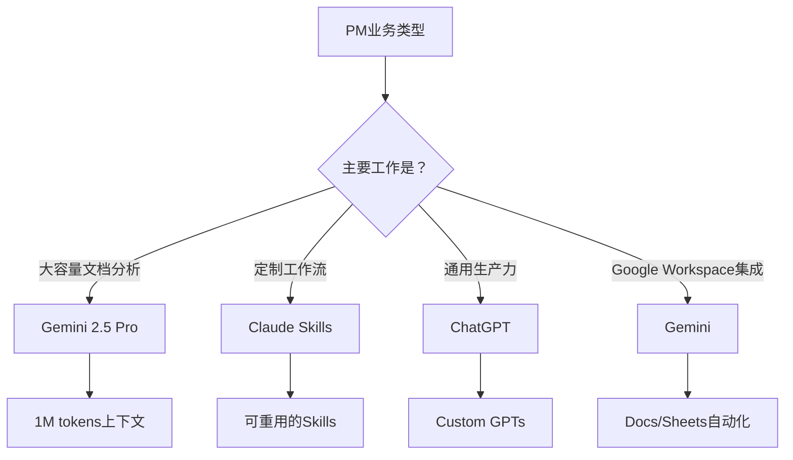
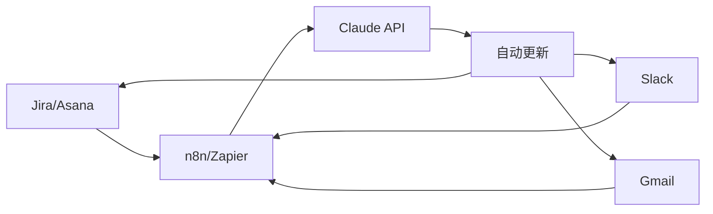
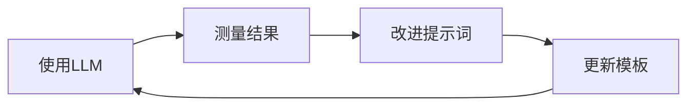

## 引言

项目经理（Project Manager, PM）的一天被会议、状态更新、风险管理、利益相关者沟通等工作填得满满当当。随着2025年LLM（Large Language Model，大语言模型）技术的发展，这些重复性工作可以通过自动化实现，使PM能够<strong>专注于战略决策和团队领导</strong>。

本文将结合实战案例，介绍如何利用ChatGPT、Claude、Gemini等最新LLM工具提升PM工作效率的方法。

## PM业务自动化的必要性

### PM当前面临的挑战

根据最近的调查，PM的<strong>60〜70%的时间花费在重复性行政工作</strong>上：

- 撰写和总结会议记录
- 编写进度报告
- 回复邮件和Slack消息
- 更新项目文档
- 跟踪风险和问题

### 采用LLM的优势

引入LLM的组织报告了以下成果：

- <strong>年节省14,976小时</strong>（Asana Intelligence案例）
- <strong>规划时间减少65%</strong>
- <strong>预测准确度提高60%</strong>
- 客户响应时间缩短30%

## 主要LLM工具比较

### 1. ChatGPT (OpenAI)

<strong>优势</strong>：
- 最通用且易用的界面
- GPT-4o提供快速响应和多模态功能
- 可通过Custom GPTs构建PM专用工作流
- 庞大的社区和插件生态系统

<strong>PM应用案例</strong>：
```markdown
提示词示例：
"请总结以下会议记录并提取行动项：
[粘贴会议记录]

格式：
- 主要决策事项
- 行动项（含负责人、截止日期）
- 需要后续讨论的事项"
```

<strong>局限性</strong>：
- 上下文窗口限制（GPT-4o：128K tokens）
- 实时网络搜索功能有限

### 2. Claude (Anthropic)

<strong>优势</strong>：
- <strong>200K tokens上下文窗口</strong>可处理大容量文档
- 可通过Claude Skills进行PM专用定制
- Artifacts功能可生成结构化输出
- 安全且符合伦理的AI响应

<strong>PM应用案例</strong>：
```markdown
Claude Skills示例："PRD Generator"

输入：项目概述、目标、约束条件
输出：
1. 项目背景和目标
2. 功能需求（含优先级）
3. 非功能需求
4. 成功指标（KPIs）
5. 风险和依赖关系
6. 时间线草案
```

<strong>局限性</strong>：
- 无图像生成功能
- 插件生态系统小于ChatGPT

### 3. Gemini (Google)

<strong>优势</strong>：
- <strong>1M tokens上下文窗口</strong>（Gemini 2.5 Pro）
- 与Google Workspace集成（Docs、Sheets、Gmail）
- 多模态能力（文本、图像、代码、音频、视频）
- 快速的Gemini Flash模型可实时处理

<strong>PM应用案例</strong>：
```python
# 使用Gemini API自动化项目风险分析
import google.generativeai as genai

genai.configure(api_key='YOUR_API_KEY')
model = genai.GenerativeModel('gemini-2.5-pro')

prompt = """
请分析以下项目状态报告并识别潜在风险：
[状态报告]

输出格式：
1. 高风险（影响度：高，发生可能性：高）
2. 中风险（影响度：中，发生可能性：中）
3. 低风险（影响度：低，发生可能性：低）
4. 针对每个风险的缓解策略
"""

response = model.generate_content(prompt)
print(response.text)
```

<strong>局限性</strong>：
- 尚未像ChatGPT那样普及
- 部分功能需要Google Workspace付费订阅

### 工具选择指南



## 可自动化的PM日常业务

### 1. 会议管理

<strong>自动化前</strong>：
- 手动编写会议记录：30分钟
- 整理行动项：15分钟
- 发送后续邮件：10分钟
- <strong>共55分钟/次会议</strong>

<strong>自动化后（Claude + n8n）</strong>：
```javascript
// n8n工作流示例
{
  "nodes": [
    {
      "name": "Zoom Webhook",
      "type": "n8n-nodes-base.webhook",
      "position": [250, 300]
    },
    {
      "name": "Claude API",
      "type": "n8n-nodes-base.httpRequest",
      "parameters": {
        "url": "https://api.anthropic.com/v1/messages",
        "method": "POST",
        "body": {
          "model": "claude-sonnet-4.5",
          "messages": [{
            "role": "user",
            "content": "总结会议记录并提取行动项：{{$json.transcript}}"
          }]
        }
      },
      "position": [450, 300]
    },
    {
      "name": "Send Email",
      "type": "n8n-nodes-base.gmail",
      "position": [650, 300]
    }
  ]
}
```

<strong>结果</strong>：会议后处理时间<strong>55分钟 → 5分钟（减少91%）</strong>

### 2. 编写进度报告

<strong>提示词模板</strong>：
```markdown
角色：你是一位经验丰富的项目经理。

输入数据：
- 上周完成工作：[从Jira/Asana提取]
- 本周计划工作：[参考路线图]
- 风险和问题：[风险登记册]
- 团队资源状况：[资源管理工具]

输出格式：
## 周进度报告（Week XX, 2025）

### 📊 摘要
- 整体进度：X%
- 已完成工作：X项
- 进行中工作：X项
- 风险状态：🟢 低 / 🟡 中 / 🔴 高

### ✅ 本周完成事项
1. [工作名] - [负责人]
2. ...

### 🚀 下周计划
1. [工作名] - [负责人] - [预计完成日期]
2. ...

### ⚠️ 风险和阻碍因素
1. [风险描述] - [影响度] - [缓解计划]
2. ...

### 💡 需要做出的主要决策
1. ...
```

<strong>节省时间</strong>：<strong>2小时 → 15分钟（减少87.5%）</strong>

### 3. 自动化邮件和Slack响应

<strong>Gmail + Claude集成</strong>：
```python
# 使用Gmail API + Claude自动生成邮件草稿
from googleapiclient.discovery import build
import anthropic

def draft_email_response(email_content, context):
    client = anthropic.Anthropic(api_key="YOUR_API_KEY")

    prompt = f"""
    请为以下邮件撰写专业回复草稿。

    原始邮件：
    {email_content}

    项目背景：
    {context}

    回复语气：专业、友好且简洁
    """

    message = client.messages.create(
        model="claude-sonnet-4.5",
        max_tokens=1024,
        messages=[{"role": "user", "content": prompt}]
    )

    return message.content[0].text

# 使用示例
email = "项目截止日期能提前两周吗？"
context = "当前Sprint 2/5，团队资源利用率80%"
draft = draft_email_response(email, context)
print(draft)
```

### 4. 项目风险监控

<strong>Gemini + BigQuery集成</strong>：
```sql
-- 从BigQuery提取项目指标
SELECT
  task_id,
  task_name,
  assigned_to,
  due_date,
  status,
  estimated_hours,
  actual_hours,
  CASE
    WHEN actual_hours > estimated_hours * 1.5 THEN 'High Risk'
    WHEN actual_hours > estimated_hours * 1.2 THEN 'Medium Risk'
    ELSE 'Low Risk'
  END AS risk_level
FROM project_tasks
WHERE due_date BETWEEN CURRENT_DATE() AND DATE_ADD(CURRENT_DATE(), INTERVAL 7 DAY)
```

```python
# 使用Gemini分析风险并生成建议
import google.generativeai as genai

def analyze_project_risks(task_data):
    genai.configure(api_key='YOUR_API_KEY')
    model = genai.GenerativeModel('gemini-2.5-pro')

    prompt = f"""
    请分析以下项目任务数据：
    1. 识别截止日期高风险任务
    2. 资源重新分配建议
    3. 向利益相关者报告的核心信息

    数据：
    {task_data}
    """

    response = model.generate_content(prompt)
    return response.text
```

## 实施策略：分步路线图

### Phase 1：试点项目（1〜2周）

<strong>目标</strong>：验证LLM工具效果并确认团队接受度

<strong>步骤</strong>：
1. <strong>工具选择</strong>：订阅ChatGPT Plus或Claude Pro
2. <strong>用例选定</strong>：从会议记录总结开始（最耗时的任务）
3. <strong>开发提示词模板</strong>：编写3〜5个标准提示词
4. <strong>测量</strong>：评估节省时间和质量

<strong>成功指标</strong>：
- 会议记录编写时间减少50%以上
- 团队成员满意度4/5以上
- 行动项遗漏率0%

### Phase 2：工作流集成（2〜4周）

<strong>目标</strong>：将现有PM工具与LLM集成

<strong>工具栈示例</strong>：


<strong>集成场景</strong>：
1. <strong>Jira → Claude → Slack</strong>
   - 创建Jira问题时自动分析上下文
   - 将优先级和影响度分析结果发送到Slack

2. <strong>Gmail → Claude → Calendar</strong>
   - 从邮件中自动提取截止日期
   - 在Google Calendar中自动创建事件

3. <strong>Zoom → Claude → Notion</strong>
   - 自动总结会议记录
   - 更新Notion项目页面

### Phase 3：高级自动化（1〜2个月）

<strong>目标</strong>：构建基于AI代理的自主工作流

<strong>利用Claude Skills</strong>：
```markdown
# Skill：Sprint回顾分析器

## 目的
分析Sprint回顾数据，导出团队生产力改进洞察

## 输入
- Sprint编号
- 完成的故事点
- 未完成事项
- 团队成员反馈（Keep、Problem、Try格式）

## 处理
1. 定量指标分析（速度、完成率）
2. 提取定性反馈主题
3. 识别重复出现的问题
4. 生成改进行动项

## 输出
- Sprint摘要仪表板
- 团队生产力趋势图表
- Top 3改进建议
- 下一个Sprint目标
```

### Phase 4：ROI测量和优化（持续）

<strong>测量指标</strong>：

| 指标 | 自动化前 | 自动化后 | 改进率 |
|------|----------|----------|--------|
| 会议记录编写时间 | 30分钟/次 | 3分钟/次 | 90% ↓ |
| 周报告编写 | 2小时 | 15分钟 | 87.5% ↓ |
| 邮件响应时间 | 10分钟/封 | 2分钟/封 | 80% ↓ |
| 风险识别速度 | 每周1次手动 | 实时自动 | 100% ↑ |
| PM战略工作时间 | 20% | 60% | 200% ↑ |

<strong>ROI计算</strong>：
```python
# 假设PM每小时人力成本为100,000韩元（约500元人民币）
hourly_rate = 100000  # 韩元

# 每周节省时间
weekly_hours_saved = 15  # 小时

# 年度节省成本
annual_savings = hourly_rate * weekly_hours_saved * 52
# = 78,000,000韩元（约39万元人民币）

# LLM工具成本
claude_pro_cost = 20 * 12 * 1300  # 月费$20，汇率1,300韩元
chatgpt_plus_cost = 20 * 12 * 1300
total_cost = claude_pro_cost + chatgpt_plus_cost
# = 624,000韩元（约3,120元人民币）

# ROI
roi = (annual_savings - total_cost) / total_cost * 100
# = 12,396%
```

## 最佳实践

### 1. 提示词工程（Prompt Engineering）

<strong>有效的提示词结构</strong>：
```markdown
[角色定义] + [上下文] + [任务描述] + [输出格式] + [约束条件]

示例：
角色：你是一位拥有10年经验的敏捷项目经理。

上下文：
- 项目：电商平台改版
- 团队：5人（前端2人、后端2人、QA 1人）
- Sprint：2周周期
- 当前：Sprint 3/8

任务：请审查以下Sprint计划并识别风险。
[粘贴Sprint计划]

输出格式：
1. Sprint目标达成可能性（高/中/低）
2. 主要风险3项
3. 每个风险的缓解策略
4. 资源重新分配建议

约束条件：
- 团队平均速度为每Sprint 25个故事点
- 1名后端开发人员下周休假
```

### 2. 数据安全和隐私保护

<strong>注意事项</strong>：
- ❌ 不要将客户个人信息直接输入LLM
- ❌ 禁止在公共LLM中使用公司机密信息
- ✅ 对敏感数据进行匿名化或掩码处理
- ✅ 使用企业级LLM API（Azure OpenAI、Anthropic Enterprise）
- ✅ 确认数据保留政策（Claude默认保留30天）

<strong>数据掩码示例</strong>：
```python
import re

def mask_sensitive_data(text):
    # 邮件掩码
    text = re.sub(r'\b[A-Za-z0-9._%+-]+@[A-Za-z0-9.-]+\.[A-Z|a-z]{2,}\b',
                  '[EMAIL]', text)

    # 电话号码掩码
    text = re.sub(r'\d{2,3}-\d{3,4}-\d{4}', '[PHONE]', text)

    # 姓名掩码（中文姓名模式）
    text = re.sub(r'[\u4e00-\u9fa5]{2,4}(?=\s?(先生|女士|经理|总监))',
                  '[NAME]', text)

    return text

# 使用示例
meeting_notes = """
张三经理让我联系john.doe@company.com，电话010-1234-5678。
"""
masked_notes = mask_sensitive_data(meeting_notes)
# "[NAME] 经理让我联系[EMAIL]，电话[PHONE]。"
```

### 3. 团队培训和变革管理

<strong>导入检查清单</strong>：
- [ ] 启动会议：分享LLM工具的优势和使用方法
- [ ] 动手研讨会：用实际PM工作进行实践
- [ ] 提示词库：构建团队共用模板
- [ ] 指定冠军：培养各团队的LLM专家
- [ ] 定期审查：每月1次效果测量和改进

### 4. 持续改进

<strong>反馈循环</strong>：


<strong>改进方法</strong>：
- 将效果好的提示词添加到团队库
- 每周分享LLM技巧（利用Slack频道）
- 发现新用例（团队头脑风暴）

## 应避免的陷阱

### 1. 过度依赖

❌ <strong>错误使用</strong>：
```markdown
"帮我制定完整的项目计划"
```

✅ <strong>正确使用</strong>：
```markdown
"请审查以下项目计划草案并指出遗漏部分：
[粘贴计划草案]
"
```

<strong>原则</strong>：LLM是<strong>辅助工具</strong>，不是替代品。

### 2. 缺乏上下文

❌ <strong>错误提示词</strong>：
```markdown
"分析风险"
```

✅ <strong>改进的提示词</strong>：
```markdown
"请基于以下信息分析项目风险：
- 项目：[项目名称]
- 当前阶段：[阶段]
- 团队组成：[成员]
- 截止日期：[日期]
- 当前问题：[问题列表]
"
```

### 3. 跳过输出验证

<strong>检查清单</strong>：
- [ ] LLM输出是否符合项目背景？
- [ ] 日期、数字、姓名等是否准确？
- [ ] 语气和风格是否符合组织文化？
- [ ] 是否存在法律/伦理问题？

## 实际成功案例

### 案例1：Asana Intelligence

<strong>组织</strong>：全球金融服务公司

<strong>导入背景</strong>：
- 研究流程管理的瓶颈
- 手动工作导致延误
- 资源分配效率低下

<strong>解决方案</strong>：
- 利用Asana Intelligence实现工作流自动化
- 基于AI的任务优先级设定
- 自动状态更新和通知

<strong>结果</strong>：
- <strong>年节省14,976小时</strong>
- 项目完成率提高35%
- 荣获2025 AI Visionary Work Innovation Award

### 案例2：ClickUp Brain

<strong>组织</strong>：创业公司产品团队（30人）

<strong>导入背景</strong>：
- 快速产品发布需求
- PM资源有限
- 同时进行多个项目

<strong>解决方案</strong>：
- 使用ClickUp Brain自动生成项目简报
- 自动构建RACI矩阵
- 使用AI知识管理器共享上下文

<strong>结果</strong>：
- 项目启动时间缩短70%
- 团队对齐改善（NPS +25分）
- PM可将60%的时间用于战略工作

## 2025年趋势和展望

### 1. Agentic AI的崛起

<strong>Agentic AI</strong>是指：
- 超越简单问答，<strong>自主执行任务</strong>的AI
- 连接多个工具执行复杂工作流
- 获得人类批准后执行实际操作

<strong>示例</strong>：Claude Computer Use
```markdown
PM："在Jira中创建下周的Sprint计划并通知团队"

Claude：
1. 通过Jira API创建Sprint
2. 基于故事优先级从待办事项中选择项目
3. 自动为每个项目分配负责人
4. 在Slack中发送Sprint启动消息
5. 在日历中预约Sprint审查会议

PM：[批准每个步骤后执行]
```

### 2. 多模态PM工具

<strong>文本 + 图像 + 语音集成</strong>：
- Gemini 2.5的多模态功能可<strong>直接分析会议视频</strong>
- 拍摄白板照片后自动转换为Miro/Figma
- 通过语音命令更新项目

### 3. 实时协作AI

<strong>实时上下文识别</strong>：
- 通过Google Workspace与Gemini集成，<strong>在编写文档时提供实时建议</strong>
- 分析Slack对话流程自动生成行动项
- 在代码审查过程中实时参考技术文档

## 入门：第一周行动计划

### Day 1：工具选择和设置
- [ ] 订阅ChatGPT Plus或Claude Pro
- [ ] 第一次提示词实验：总结最近的会议记录
- [ ] 评估结果并提供反馈

### Day 2-3：开发提示词模板
- [ ] 选择3项最耗时的任务
- [ ] 为每项任务编写提示词模板
- [ ] 用实际数据测试和改进

### Day 4-5：团队分享和反馈
- [ ] 在团队会议上演示LLM
- [ ] 共享提示词库（Notion/Confluence）
- [ ] 收集团队成员反馈

### Day 6-7：工作流集成计划
- [ ] 了解现有PM工具（Jira、Asana、Slack）
- [ ] 选择3个可集成的自动化场景
- [ ] 在下一个Sprint中计划试点项目

## 结论

利用LLM实现项目管理自动化已不再是未来的故事。ChatGPT、Claude、Gemini等工具已经<strong>将PM的生产力提高3倍以上</strong>，2025年将推出更强大的功能。

关键在于<strong>从小处着手，逐步扩展</strong>。从会议记录总结等简单任务开始，根据团队反馈进行改进，最终发展到自主AI代理工作流。

LLM不是要取代PM，而是<strong>将PM从重复性工作中解放出来，使其能够专注于战略决策和团队领导</strong>。现在就开始，革新您的PM工作流程吧。

## 参考资料

- [Anthropic Claude Skills官方文档](https://www.anthropic.com/claude-skills)
- [Asana Intelligence成功案例](https://asana.com/ai)
- [n8n AI Workflows指南](https://n8n.io/workflows/ai)
- [ClickUp Brain使用方法](https://clickup.com/features/ai)
- [HBR: Why Agentic AI Projects Fail](https://hbr.org/2025/10/why-agentic-ai-projects-fail)
