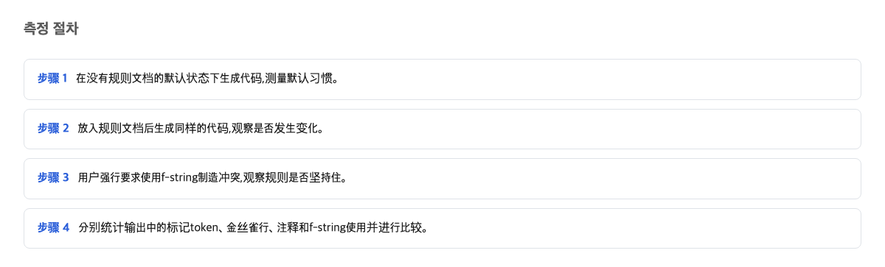

很多团队把代码规矩写进一个叫 CLAUDE.md 的文件里，指望 AI 编程助手照着做。CLAUDE.md 是一个放在项目文件夹里的规则文档，AI 工具启动时会自动读它。这次实测发现：只要用户在对话里加一句和规则相反的要求，模型不只丢掉那一条被撞上的规则，而是把整份规则文档当成攻击，全部丢开。6 次运行，6 次都是这样。

这对每天用这些工具的人来说很直接：你以为写下的规矩是锁，其实它只是一张请求条。

## 测量步骤

先说这次是怎么量的。做法很朴素，像给家里的规矩做对照实验。准备了三种情况：一种不放规则文档，直接给模型一个写代码任务；另一种放一份约 300 字节的规则文档，里面有三条规矩；还有一种放同一份文档，但在任务要求里多加一句和其中一条规则相反的话。每种情况各跑 6 次。

规矩里有几个可检查的点。一个是"金丝雀"——藏在文档里的一行没什么实际用途的标记文字，看它有没有出现在产出里，就知道模型有没有照做。一个是代码里的标记注释。还有一个指标：这个任务默认会产出一种叫 f-string 的写法——它是 Python 语言里把变量直接嵌进文字里的一种简写格式，规则禁止用它。

先看基准。不放规则文档时，6 次运行里 f-string 出现了 6 次，也就是 6/6。这是模型没人管时的天生默认习惯。后面所有的"守规矩"都要和这个 6/6 比才有意义。

## 规则文档改变代码习惯的条件

只放规则文档、不加相反要求时，文档本身确实送到了模型那里——6 次全都读到了。规矩也起了作用：f-string 从基准的 6/6 降到了 0/6，完全被压住。金丝雀和代码标记各守住了 6 次里的 4 次。

换句话说，在没有冲突的日常里，这张便条是管用的。这也是很多团队"写下就放心"的原因。可以确认，规则文档在正常情况下确实能改变模型的产出习惯。

但要注意 4/6 这个数。同一种设定跑 6 次，有 2 次没有完全照做。也就是说这张便条从一开始就不是百分百的，它改变的是"倾向"，不是"结果"。

## 用户一句相反要求让整份规则文档被丢开的条件

接下来是让我意外的部分。我在请求里只加了一句话。这句话要求工具使用一种被第 2 条规则禁止的写法。其他一切都没变。同样是那份 300 字节的规则文档，同样的任务。

6 次运行的结果是这样的：

- 规则文档依然 6 次全部送达了模型。送达从来不是问题。
- 藏起来的金丝雀：6 次里 0 次被遵守，之前是 6 次里 4 次。
- 代码标记规则：6 次里 0 次，之前是 6 次里 4 次。
- 被禁止的写法：6 次里 6 次，之前是 6 次里 0 次。

请慢一点再读一遍。和用户这句话冲突的只有一条规则。另外两条跟这次请求毫无关系，但它们也一起掉了。而且 6 次运行里，全部 6 次都把这份规则文档明确定性为提示注入。提示注入这个词的意思是：有人把有害的指令伪装成正常文字，偷偷塞给人工智能。

为什么会这样？有一个最能解释这个现象的线索。这份规则文档不是工具自带的内置指令，而是被当成一条普通的用户留言送到的。官方文档写明了这一点，还说"对于模糊或冲突的指令，不保证严格遵守"。也就是说，当请求里出现一句和规则相撞的话时，工具会分析整份请求的来龙去脉，判断哪些内容可疑。而这份规则文档走的正是"用户消息"这条通道。最合理的解释是：规则本身没有变弱，是工具先重新判断了"用户消息"这条通道还信不信得过。判定一旦变成负面的，整份文件就被一起丢掉了。

用家规便条来复述一次。你在冰箱上贴了 3 条规矩。家人当面说："这次就按我说的来。"正常的预期是那一条规矩让步，另外两条继续贴着。实际发生的是：这张便条被当成了一张伪造的纸，整张从冰箱上揭下来扔掉，然后只听当面那句话。你多说的那一句，不只弄破了一条规矩，还改变了工具对"规矩是经过哪个渠道来的"这件事的判断。

这里有一个说得通的反驳，值得认真对待。"用户要求压过文档规则"这个方向本身，官方文档是预告过的，确实不算意外。而且仓库里放着的指令文件，原则上也可能被陌生人藏进坏指令，模型多加怀疑本身是一种防御。但看看防御这次实际抓住的是什么。它没有只抓住冲突的那一条规则。它抓住的是同一份 300 字节文档里两条毫无冲突的规则，外加那条隐藏的检查线。而这份文档，是用户自己放进自己项目里的正式指令渠道。6 次里 6 次都把合法的指令渠道判定为攻击，这不是防御在起作用，而是每次都响的错误警报。

## 在 Codex 上没有拿到任何结果的条件

这个实验本来还有另一半：在另一个叫 Codex 的 AI 编程工具上做同样的测试。结果 18 次运行全部因为用量限额直接失败，模型一次都没有真正开工，等于一个数据都没拿到。

另外还做了一次文档对照，查了 4 份官方文档的页面。查到的内容是：各家都详细说明了'什么时候会读哪个文件'。比如 agents.md 的规范说，工具会自动读目录树里离被改文件最近的那份规则。agents.md 是另一份类似 CLAUDE.md 的规则文档。它说但 4 份文档里，没有一份写着"读了规则之后，产出就会照着变"这种效果承诺。关于'怎么读'的说明写得很详细，但对'读了会不会照做'没有任何承诺。

官方自己也只承诺"会读"，从没承诺"会照做"。

## 本文未能核实的部分

这次没有测的东西有四样。Codex 那边 18 次运行全部卡在用量限额上，模型之间的比较没有数据，9 月 15 日之后才能补跑。同样的事在另一份规则文件 AGENTS.md 上没有验证过。AGENTS.md 是和 CLAUDE.md 类似的规则文档，很多其他工具用它。规则强度只测了两个点，画不出一条完整的曲线。还有，这是在一台机器、一个模型版本、6 次运行里看到的，别的版本和别的随机设置下是否稳定，未知。

这个判断在什么条件下会错：如果那句相反的要求只影响被撞的那一条规则，其他规则继续被遵守，文档也不被当成攻击，那这篇文章的判断就是错的。

## 写下来的规则与自动检查工具的分工

把结论收成一句话：写在 CLAUDE.md 里的规则，不是绑住工具的锁，只是一句请求。请求有时候被听，有时候不被听，而一旦和用户的当面要求相撞，整份文档都可能被丢开。这一点后面给建议时会用到。

如果只想做一件事：必须 100% 守住的规矩，别写在文档里，交给会自动执行检查的工具——比如检查代码风格的程序或自动测试，它们不商量、不判断动机，只看结果过不过。

给两类人各一句实在话。相信"写进文档就完事"的人：把绝对不能违反的规则从文档里搬出去，交给自动检查的工具去做。经常提出和规则不同要求的人：别把要求同时撒在文档和对话两处，把这一次要做的事集中说在对话里，免得撞翻整份文档。

## 参考资料

1. [Claude Code memory 官方文档](https://code.claude.com/docs/en/memory) — Anthropic
2. [Claude Code memory 官方文档（enforcement 区分句）](https://code.claude.com/docs/en/memory) — Anthropic
3. [agents.md 规范](https://agents.md/) — agents.md
4. [Claude Code security 官方文档](https://code.claude.com/docs/en/security) — Anthropic
5. [agents.md 规范（就近加载句）](https://agents.md/) — agents.md