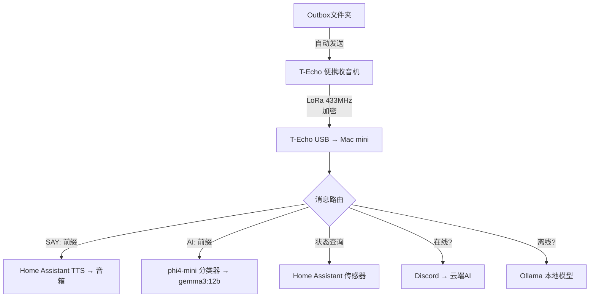
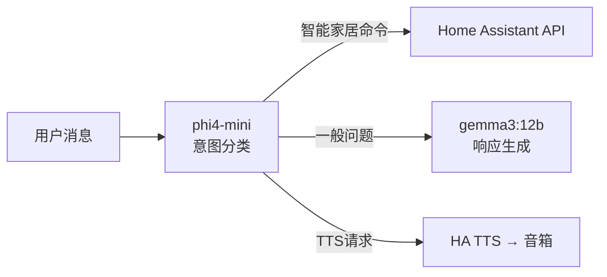

## 概述

当互联网中断时，智能家居就会瘫痪。基于云的语音助手和IoT自动化全部失效。然而，仅凭<strong>30美元的LoRa收音机</strong>和<strong>在Mac mini上运行的本地LLM</strong>，就有人实现了完全离线的智能家居。

一位居住在乌克兰的开发者，在战争导致频繁停电和互联网中断的情况下，将Meshtastic LoRa收音机与Ollama本地模型结合，构建了<strong>零互联网</strong>环境的智能家居控制系统。

本文将分析该项目的架构、技术栈、实现成本以及边缘AI的实用可能性。

## 系统架构

整体系统简单得令人惊讶。



核心是<strong>双路由机制</strong>。有互联网时利用云端AI，没有时自动切换到本地模型。用户无需感知差异。

## 核心技术栈

### LoRa通信 — Meshtastic + Lilygo T-Echo

<strong>Meshtastic</strong>是开源的LoRa网状网络固件。由于每个节点都能中继消息，部署多台设备可以构建数公里范围的通信网络。

- <strong>硬件</strong>：Lilygo T-Echo（约30美元）
- <strong>频率</strong>：433MHz LoRa
- <strong>特点</strong>：加密频道、USB连接、网状中继
- <strong>限制</strong>：每条消息200字符限制（通过AI响应自动分块解决）

### 本地LLM — Ollama

离线AI的核心是<strong>两阶段模型架构</strong>。

| 模型 | 角色 | 大小 | 用途 |
|------|------|------|------|
| phi4-mini | 意图分类器 | ~2B | 判别"智能家居命令还是提问？" |
| gemma3:12b | 响应生成 | 12B | 实际回答与推理 |

先用轻量模型分类意图，仅在需要时调用大模型，这种结构使<strong>Mac mini M4 16GB</strong>也能实现实时响应。

### Home Assistant集成

智能家居控制和TTS（文本转语音）由Home Assistant负责。

- 灯光控制、传感器读取、在室确认
- <strong>SAY: 前缀</strong>将收音机发送的文本转换为家中音箱的语音输出
- 支持乌克兰语TTS

```
SAY: Привіт, я скоро буду вдома
→ 无线电波 → Mac mini → HA TTS → 音箱播放语音
```

这是完全不需要互联网连接的<strong>完全离线语音消息</strong>系统。

## 实现成本分析

这套系统最大的魅力在于成本。

| 项目 | 价格 | 备注 |
|------|------|------|
| Lilygo T-Echo × 2 | 约60美元 | 基站 + 便携 |
| Mac mini M4 16GB | 约500美元 | 已有则为0美元 |
| Home Assistant | 免费 | 开源 |
| Ollama + 模型 | 免费 | 开源 |
| Meshtastic固件 | 免费 | 开源 |
| HA Voice PE音箱 | 约50美元 | TTS输出用 |
| <strong>总追加成本</strong> | <strong>约110美元</strong> | 已有Mac mini时 |

无需云端AI服务的月度订阅费，<strong>一次性110美元投资</strong>即可完成完整的离线AI智能家居。

## 边缘AI的实践教训

### 1. 离线优先设计的价值

这个项目诞生于战争的极端环境，但离线优先设计的价值是普遍的。

- <strong>灾害场景</strong>：地震、台风、停电时确保通信独立性
- <strong>隐私</strong>：语音数据不会发送到云端
- <strong>延迟</strong>：本地处理提升响应速度
- <strong>成本</strong>：零月度订阅费

### 2. 小模型的战略性运用

将phi4-mini（2B）作为路由器、gemma3:12b作为执行器的分离架构，是在边缘设备上利用LLM的<strong>典范模式</strong>。



### 3. 网状网络的扩展可能性

由于Meshtastic是网状协议，添加节点即可扩展通信范围。原作者构想的<strong>社区规模AI网络</strong>是一个现实可行的方案。

- 每个节点搭载本地LLM
- 网状中继覆盖数公里范围
- 无需互联网的社区AI基础设施

## 自行实现指南

以下是复现此系统的最低要求。

1. <strong>硬件准备</strong>：Lilygo T-Echo 2台、Mac mini（或任意Apple Silicon Mac）、HA兼容音箱
2. <strong>软件安装</strong>：Meshtastic固件、Ollama、Home Assistant
3. <strong>模型下载</strong>：`ollama pull phi4-mini`、`ollama pull gemma3:12b`
4. <strong>监听守护进程</strong>：通过Meshtastic CLI连接USB收音机，用Python守护进程实现消息路由
5. <strong>HA集成</strong>：通过REST API或WebSocket控制Home Assistant

整套技术栈均为开源，可以自行编写代码或委托AI编程工具完成。

## 结论

<strong>30美元收音机 + 本地AI = 无需互联网的智能家居</strong>。这个等式虽然简单，却清楚地展示了边缘AI的实用未来。

不依赖云端的AI系统已不再是理论。只要有16GB内存的Mac mini和30美元的收音机，今天就能实现。随着本地LLM性能的持续提升，<strong>边缘AI × IoT</strong>的组合将成为最具实用性的AI应用领域之一。

## 参考资料

- [Reddit - I plugged a $30 radio into my Mac mini and told my AI "connect to this"](https://www.reddit.com/r/LocalLLaMA/comments/1r8ectu/)
- [Meshtastic 官方网站](https://meshtastic.org/)
- [Ollama 官方网站](https://ollama.ai/)
- [Home Assistant 官方网站](https://www.home-assistant.io/)
- [Lilygo T-Echo](https://www.lilygo.cc/products/t-echo)
