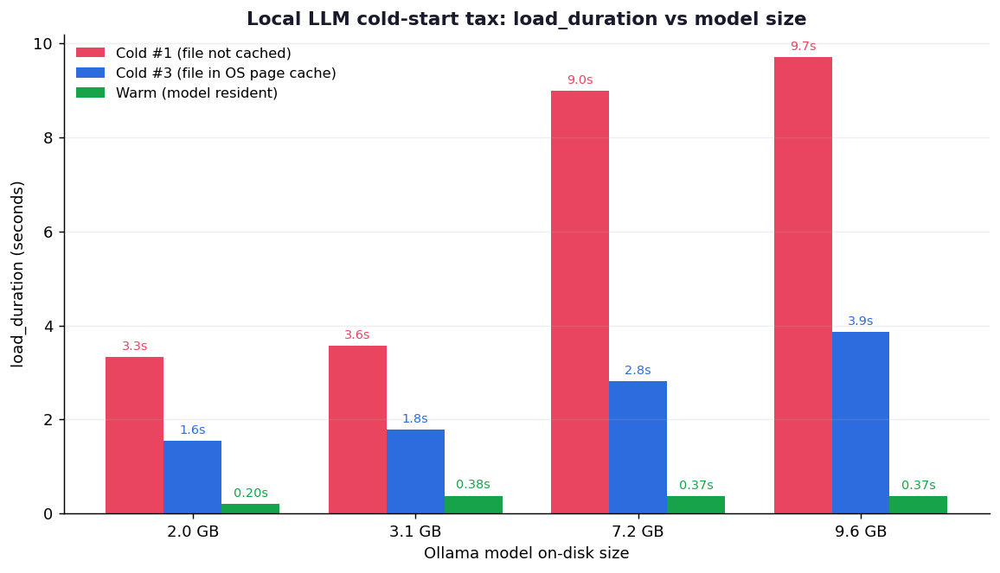
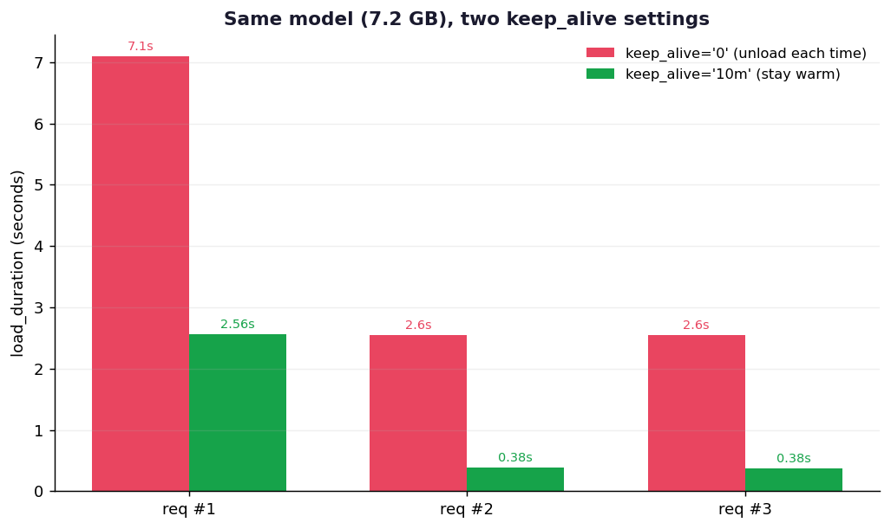

我在MacBook上跑本地代理已经好几天了。干活间隙去做点别的，再叫回同一个代理，第一条响应就格外迟钝。第二、第三条都正常，唯独第一条拖沓。昨天写[拆解prefill和generation成本的那篇](/zh/blog/zh/local-llm-prefill-generation-latency-experiment)时，我写道测量前先把模型热身一次，"好让模型加载时间(load_duration)不混进数据里"。写那句话时我有点心虚。那个被我特意剔掉的项目，恰恰是我日常最常体感到的延迟。

所以今天，我正面去测昨天剔掉的那笔成本。模型落到内存所需的时间，也就是我们随口叫的冷启动。

## load_duration：平时看不见的那个项目

Ollama的`/api/generate`每次响应都会附带一束时间戳。昨天我只看了其中的`prompt_eval_duration`(prefill)和`eval_duration`(generation)，其实最前面还有一个`load_duration`。顾名思义，就是加载模型花掉的时间。

它平时不易察觉是有原因的。连续调用同一个模型，从第二次起模型已经在内存里，`load_duration`就接近0。一旦一段时间不用，Ollama就把模型从内存里卸下(默认5分钟)，下一次调用时加载成本又复活。我所谓"离开一会儿再叫回来就慢"的真相，正是这个。

测法我做得很简单。为了只切出加载时间，提示词就一行`Reply with the single word: ok`，`num_predict`压到8，让生成趋近于0。要强制造出冷态，只需在调用前用`ollama stop <model>`把模型卸下。然后读取首次调用的`load_duration`，那就是冷启动。

```python
def gen(model, keep_alive="5m"):
    body = json.dumps({
        "model": model, "prompt": "Reply with the single word: ok",
        "stream": False, "keep_alive": keep_alive,
        "options": {"num_predict": 8, "temperature": 0}
    }).encode()
    req = urllib.request.Request(OLLAMA, data=body,
        headers={"Content-Type": "application/json"})
    with urllib.request.urlopen(req, timeout=600) as r:
        d = json.loads(r.read())
    return d["load_duration"] / 1e6  # 纳秒 -> 毫秒
```

想自己验证的话，一行curl就够。先卸下模型，再调用一次，把`load_duration`取出来。

```bash
ollama stop gemma4:12b-it-qat
curl -s http://localhost:11434/api/generate -d '{
  "model": "gemma4:12b-it-qat", "prompt": "ok", "stream": false
}' | python3 -c 'import sys,json; print(json.load(sys.stdin)["load_duration"]/1e9, "秒")'
```

数值是纳秒，除以1e9换成秒。把这一行换着模型跑几遍，立刻能体会到下面这张表在你自己硬件上会怎么变。

有一个理由可以信这个测量。Ollama把`load_duration`和`prompt_eval_duration`、`eval_duration`分开返回，也就是说加载时间不会渗进prefill或generation的数字里。响应的`total_duration`大致等于这三者之和，所以加载这一段能干净地切出来。昨天我看的是中间两个，今天只盯最前面那一个。

## 按模型大小测冷启动

我把手头拉下来的四个Gemma 4系列模型按大小排开。每个模型先用`ollama stop`卸下，再冷态调用三次，外加模型常驻的热态调用一次。换算成秒是这样：

| 模型 | 磁盘大小 | 冷 #1 | 冷 #3 | 热 |
|---|---|---|---|---|
| melavisions/gemma4 | 2.0 GB | 3.33秒 | 1.55秒 | 0.20秒 |
| yinw1590/gemma4-e2b | 3.1 GB | 3.57秒 | 1.79秒 | 0.38秒 |
| gemma4:12b-it-qat | 7.2 GB | 9.00秒 | 2.82秒 | 0.37秒 |
| gemma4:e4b | 9.6 GB | 9.71秒 | 3.86秒 | 0.37秒 |



大趋势如预期：模型越大，加载越久。9.6GB模型的首次冷启动是9.7秒，同一调用在热态下是0.37秒。相差26倍。换句话说，立起一个7.2GB的本地聊天机器人，放置超过5分钟再去搭话，话还没出来就先白白烧掉好几秒。

扎眼的是热态这一列。无论模型是2GB还是9.6GB，热态的`load_duration`都在0.2到0.4秒，几乎持平，不随大小变化。在我看来，这并不是真的在重新读权重，而是Ollama确认"这模型还在不在"的keep_alive巡检级开销。不是真正的加载，所以不吃大小。具体是什么操作我不下断言。但就实用而言，热态的0.4秒可以当成"几乎没有加载成本"，这是测量支持的结论。

## 同样是"冷"，为何#1和#3差出两倍

再看这张表，有一处不对劲。我明明每次都用`ollama stop`卸下模型重测，可冷#1几乎比冷#3慢一倍。7.2GB模型从9.00秒掉到2.82秒，9.6GB模型从9.71秒掉到3.86秒。都叫"冷"，数值却对不上。

这里我卡了一阵。起初怀疑测量有bug，答案却是操作系统的页缓存。`ollama stop`只是把模型从Ollama进程的内存里卸下，操作系统仍把读过一次的模型文件留在RAM的页缓存里。于是冷#2、#3是从RAM而非磁盘重读文件。整段磁盘I/O被省掉，自然就快。

这之所以重要，是因为我们随口说的"冷启动"其实是两种东西。

- 真正的冷：刚重启，或内存吃紧把缓存冲掉，权重头一回从磁盘读。对应冷#1。
- 已缓存的冷：模型从内存卸下，但文件仍在页缓存里。对应冷#3。

做基准测试时若不区分这两者，从第二次起就悄悄记下了缓存后的值，于是得出"冷启动比想象中快"的乐观结论。真实的生产服务器会重启，多个模型轮换又会把页缓存挤出去。所以设SLA或冷启动预算时，应以冷#1、也就是重启后的最坏值为准，而非冷#3。我若不知道这点只测一次，大概会把7.2GB模型的冷启动写成"2.8秒"，可真正的最坏是9秒。

有意思的是，小模型上这个差距小得多。2.0GB模型冷#1是3.33秒、冷#3是1.55秒，相差约1.8秒；而9.6GB模型的9.71秒和3.86秒拉开了近6秒。要从磁盘读的字节越多，页缓存替你省下的时间也越多。模型越大，"重启后第一个用户"背的罚单涨得越陡。若打算在本地服务13B级以上，得把这种缓存依赖当成正经的运维变量看待。

## keep_alive一个开关决定这笔账

避开冷启动最直接的旋钮是`keep_alive`，它决定模型在内存里留多久。我把它放到两个极端，对同一个7.2GB模型各请求三次。

| 请求 | keep_alive="0" (每次卸载) | keep_alive="10m" (保持热态) |
|---|---|---|
| 请求 #1 | 7.10秒 | 2.56秒 |
| 请求 #2 | 2.55秒 | 0.38秒 |
| 请求 #3 | 2.55秒 | 0.38秒 |



对比很鲜明。`keep_alive="0"`在处理完一个请求后立即卸下模型，所以每个请求都是冷的，每次都要先垫上2.5秒以上的加载。用`ollama ps`查看，请求之间模型并不在内存里。

反过来，`keep_alive="10m"`只在首个请求付出冷态值(2.56秒)，之后的请求降到0.38秒，等于把冷启动一次性压进第一个请求，其余都按热态处理。keep_alive=0那轮的请求#1之所以飙到7.1秒，是因为那一刻页缓存也是空的，属于真正的冷。上一节那个效应在这里又原样出现了。

命令行上也能用`OLLAMA_KEEP_ALIVE`环境变量或API的`keep_alive`字段调同样的东西。设成`-1`就让模型无限期留在内存。

## 那么，本地代理该怎么立

测完之后，平时含糊的几个运维判断清晰了。

第一，对话或代理用途要给`keep_alive`留足空间。用户每搭一次话模型就被卸下，那每一轮都是冷启动。7.2GB模型每轮垫2.5秒，会毁掉对话体验。内存允许的话，把`keep_alive`设长或用`-1`钉死更好。这套设置可以直接叠到我那篇[用Ollama加FastAPI做生产服务的文章](/zh/blog/zh/ollama-fastapi-production-deployment-guide-2026)里讲的部署结构上。

第二，起服务时先把模型热身一次。让启动脚本用一个假提示调用一次，提前把冷启动付掉，第一个真实用户就不必扛那9秒。冷成本压进首个请求是躲不掉的，但那个首个请求不必是真用户。

第三，在多个模型间轮换的路由比看上去贵。每个请求换一个模型，每次都重新加载，内存不够时还会互相挤掉页缓存，掉回真正的冷(冷#1级)。要写一个轮转四个模型的路由器，先把加载成本×切换次数算清楚。

第四，推理速度的基准必须热身后再测。昨天那篇我之所以测前热身，原因就在这。冷态只测一次，`load_duration`会在prefill和generation之上叠9秒，根本分不清是模型慢还是加载慢。我那篇[测输出可复现性的实验](/zh/blog/zh/llm-determinism-temperature-seed-experiment)里也是同一个原则：要测的项目之外的变量，先固定住。

第五，内存和响应性是互换关系。把`keep_alive`设长，首个请求之外的冷启动就消失，但那个模型会一直占着RAM。把9.6GB模型无限期立着，别的活儿能用的内存就少了，再立一个模型的瞬间页缓存被挤掉，冷又复活。所以我先定下"哪些模型常驻"，只给最常用的一两个设长`keep_alive`，其余设短。把所有模型都热态抱住，是内存撑得起时才有的奢侈。为了把冷启动压到0就盲目钉上`keep_alive=-1`，会在下一个模型加载时以更大的冷还回来。

## 边界与尚未弄清的部分

老实划清边界。这是在一台MacBook(Apple Silicon，统一内存)上测的值。带CUDA GPU的服务器，加载路径多了从磁盘经系统RAM再拷进VRAM这一段，绝对值会不一样。别把我的数字直接搬到别的硬件上。不过"冷吃大小、热不吃"、"页缓存有无把冷分成两种"、"keep_alive决定首个请求之外的开销"这些结构性结论，换了硬件应该依然成立。

还有，`load_duration`到底是哪些操作的总和，我没深挖Ollama内部，不下断言。除了读文件，可能还混了构建计算图之类的初始化。我能观测的是API返回的那个数字，以及这个数字对模型大小、页缓存、keep_alive的反应，今天测量的范围到此为止。热态下也会出现0.37秒，这个我只是推测，没法确证。

最后，页缓存的行为取决于空闲RAM多少。内存紧张的服务器上，冷#2、#3的缓存也可能很快被挤掉，慢回冷#1的水平。我的测量更接近RAM充裕的乐观情形。下一步我想人为施加内存压力，看缓存能撑多久。冷启动不是测一次就完的话题，而是要按环境反复重测的那类成本。

## 参考资料

- [Ollama API文档](https://github.com/ollama/ollama/blob/main/docs/api.md) — 包含`load_duration`在内的响应字段，以及`keep_alive`参数。
- [Ollama FAQ：把模型保留在内存里](https://docs.ollama.com/faq) — 默认5分钟保留，以及如何用`keep_alive`和`OLLAMA_KEEP_ALIVE`控制卸载。
- [Linux内核：内存管理概念](https://www.kernel.org/doc/html/latest/admin-guide/mm/concepts.html) — 操作系统把从磁盘读到的文件数据留在RAM页缓存里的机制，正是它把冷分成了两种。
