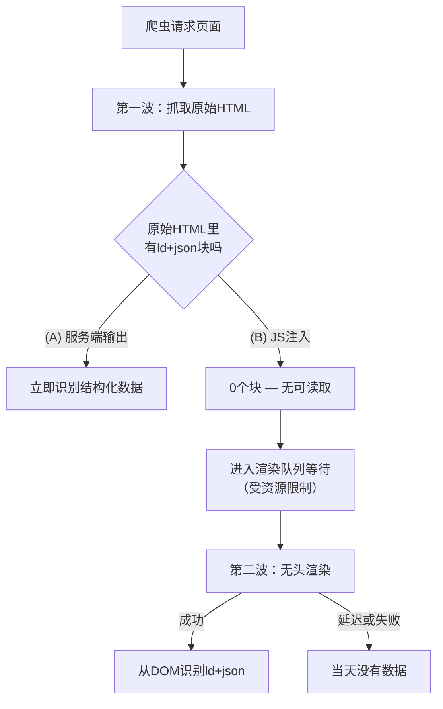

做店铺检索页时，开发者最晚处理、也最敷衍的往往就是结构化数据。屏幕上地图和营业时间对了，就感觉做完了。可是你的店铺能否在本地搜索（Google地图、本地组合）里被正确收录，取决的不是可见的页面，而是爬虫读取的标记。而这份标记是用JavaScript事后画上去，还是服务器从一开始就输出，差别比想象中大。

先澄清一个误解。"用JS注入结构化数据Google就读不到"，这是错的。

## Google官方立场：JS结构化数据是被支持的

Google明确表示支持。照搬官方文档的原话：

> "Google can read JSON-LD data when it is dynamically injected into the page's contents, such as by JavaScript code or embedded widgets."
> — Google Search Central, *Intro to Structured Data*

也就是说，即便你用`document.createElement('script')`事后附加`application/ld+json`块，Google也会在渲染后从DOM里读取它。到这一步，"JS也行"是成立的。问题是：何时读、读得多可靠。

## 直接验证：原始HTML里留下了什么

爬虫看一个页面看两遍。先原样抓取原始HTML（首波），资源允许时再用无头Chromium执行JS重新看一遍（二波）。所以首波时原始HTML里是否已含结构化数据，才是实质差别所在。

我把同一份LocalBusiness标记做成两种方式。一种是服务器输出的静态HTML，另一种在运行时用JS注入。

```html
<!-- (A) 服务端：原样存在于原始HTML -->
<script type="application/ld+json">
{"@context":"https://schema.org","@type":"LocalBusiness","name":"明眸眼镜 涩谷店"}
</script>

<!-- (B) JS注入：原始HTML里没有，执行后才生成 -->
<script>
  const ld = document.createElement('script');
  ld.type = 'application/ld+json';
  ld.textContent = JSON.stringify({ "@type": "LocalBusiness", name: "明眸眼镜 涩谷店" });
  document.head.appendChild(ld);
</script>
```

我只从未执行JS的原始HTML里解析真正的`<script type="application/ld+json">`块。

```
[A] 服务端：ld+json块 1个，@type=['LocalBusiness']
[B] JS注入：ld+json块 0个，@type=[]
```

服务端版本在首波抓取的原始HTML里已经带着这个块。JS注入版本原始HTML里是0个块。那个块只有在浏览器执行JS之后才出现在DOM里。对爬虫而言，这是要等二波渲染发生后才存在的数据。

把两种方式在爬虫眼中的差异画成流程，是这样的。



把实测结果和特性整理如下：

| 项目 | (A) 服务端输出 | (B) JS注入 |
|---|---|---|
| 原始HTML中的ld+json块 | 1个（实测） | 0个（实测） |
| 首波抓取时可见 | 立即 | 不可 |
| 依赖渲染队列 | 否 | 是（受资源限制） |
| 失败模式 | 几乎没有 | 渲染延迟或JS报错时数据缺失 |
| 适合的数据 | NAP、坐标等准确性即信任的值 | 服务端无法输出的小部件、第三方集成 |

## 为什么这个差距在本地场景尤其要紧

Google自己也承认动态生成标记的风险。虽然是电商语境的说明，但原理相同。

> "dynamically-generated markup can make Shopping crawls less frequent and less reliable, which can be an issue for fast-changing content."
> — Google Search Central, *Generate Structured Data with JavaScript*

渲染队列始终依赖资源。若二波渲染被推迟，或JS执行中外部脚本加载失败，那天那个页面的JSON-LD就根本不会生成。店名、地址、电话（NAP）这类以准确与一致为信任基础的数据，没理由每次都押注渲染成功。服务端输出没有这种依赖。

## 诚实的边界 — 结构化数据不会提升排名

这里有一点绝不能略过。即便你把结构化数据完美地服务端输出，单凭它也不会让搜索排名上升。Google文档明确：结构化数据只赋予展示富媒体结果的资格，既不保证展示也不保证排名。本地排名的真正驱动力在Google商家资料（GBP）一侧：运营、评价、类目准确度。站点标记只是辅助这一效果。

还有一点。结构化数据必须忠实反映页面上可见的内容。

> "don't add structured data about information that is not visible to the user, even if the information is accurate."
> — Google Search Central

若GBP登记的地址与页面标记的地址不一致，非但无益，只会削弱信任。

## 那么，什么时候用JS注入就够了

这不是要你把一切都搬到服务端。以下情况JS注入也是务实的选择。

- <strong>第三方小部件负责生成标记时</strong>：如果预订、评论小部件自己注入JSON-LD，把它搬到服务端的成本可能高于收益。
- <strong>动不了服务端模板时</strong>：在只能操作老旧CMS或标签管理器（GTM）的环境里，JS注入是唯一选项。Google也把经由GTM的注入写进了官方支持的文档。
- <strong>准确性跟着页面一起变化时</strong>：反正是在客户端计算并画到屏幕上的值，在同一条代码路径里生成标记，反而能减少"屏幕与标记不一致"。

反过来，像店名、地址、电话这种几乎不变、准确性就是信任本身的数据，服务端输出才是默认值。判断标准只有一条——"这份数据等得起第二波渲染吗？在渲染失败的那天它也必须存在吗？"

## 开发者今天能做的

- 把店铺的NAP、坐标、URL从服务端（路由／模板）静态输出，不依赖JS注入。
- 让这些值与GBP精确一致。不要放入不一致、占位或未经验证的值（比如假的社交URL）。
- 页面上不可见的信息不要标记。
- 部署后用富媒体结果测试和网址检查工具，检查原始与渲染两侧。别停在"用JS注入了应该没事"。
- 不承诺排名效果。守住"标记是帮助爬虫理解的辅助"这条线。

总而言之，JS结构化数据不是错误的方法。但对于像本地店铺信息这样、确定性即信任的数据，与其把它交给渲染队列碰运气，不如让服务器提前输出，更具防御性也更可预测。

---

如果你想把店铺检索页的结构化数据从服务端可靠地输出，或想让现有站点的本地SEO与标记结构做一次体检，我个人承接咨询与实现委托。欢迎通过jangwook.net个人资料里的联系方式找我。
