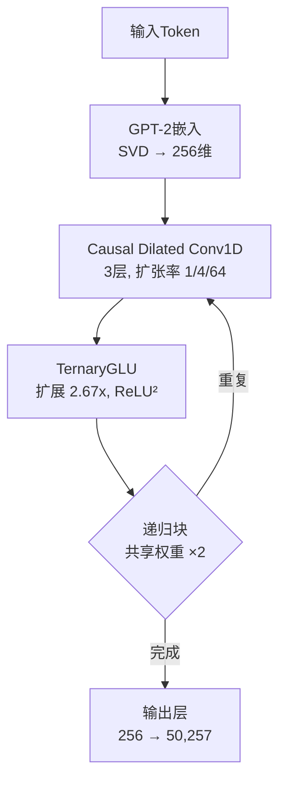

## 概述

如果无需GPU就能训练语言模型呢？最近，Reddit的r/LocalLLaMA社区公开了一个<strong>仅用CPU在1.2小时内训练1360万参数语言模型</strong>的项目，引起了广泛关注。这个名为FlashLM v3的模型采用了完全消除矩阵乘法（MatMul）的架构，推理时仅使用加法和减法运算。

本文将解析MatMul-Free架构的核心原理、FlashLM v3的结构，以及对边缘AI和低成本训练的启示。

## 什么是MatMul-Free架构？

### 矩阵乘法的问题

在传统Transformer模型中，消耗最多计算资源的是Attention和FFN（前馈网络）层中的<strong>矩阵乘法</strong>。这些运算具有O(n²d)或O(nd²)的复杂度，高度依赖GPU的并行处理能力。

2024年，UC Santa Cruz的研究团队发表了论文<strong>《Scalable MatMul-free Language Modeling》</strong>（arXiv:2406.02528），证明了可以在完全消除矩阵乘法的同时，在数十亿参数规模上保持具有竞争力的性能。

### 三值权重（Ternary Weights）

MatMul-Free模型的核心是将权重限制为<strong>{-1, 0, +1}</strong>三个值。这带来了：

- <strong>无需乘法</strong>：权重为-1时取反，0时跳过，+1时直接相加
- <strong>内存节省</strong>：每个权重仅需2位（相比FP16减少8倍）
- <strong>能效提升</strong>：整数加法比浮点乘法高效数十倍

```python
# 三值权重运算示例
# 传统: output = weight * input  (浮点乘法)
# MatMul-Free: output = sign(weight) * input  (仅加减法)

def ternary_linear(x, weights):
    """三值权重线性变换 — 无乘法"""
    result = torch.zeros_like(x[..., :weights.shape[1]])
    result += x[..., weights == 1].sum(dim=-1)   # +1: 加法
    result -= x[..., weights == -1].sum(dim=-1)   # -1: 减法
    # weights == 0: 不做任何操作
    return result
```

## FlashLM v3架构详解

FlashLM v3是一个将MatMul-Free概念实际实现的开源模型。

### 核心组件



| 组件 | 详情 |
|------|------|
| 参数量 | 1360万 |
| 模型维度 | 256 |
| Token混合器 | Causal Dilated Conv1D（扩张率 1/4/64） |
| FFN | TernaryGLU（扩展 2.67x，ReLU²激活） |
| 嵌入 | GPT-2预训练 → SVD投影（256维） |
| 分词器 | GPT-2（50,257词汇） |
| 递归次数 | 2（权重共享） |

### 训练配置

- <strong>数据集</strong>：FineWeb-Edu中3200万Token（3万文档）
- <strong>硬件</strong>：CPU 2线程（Deepnote环境）
- <strong>训练时间</strong>：约1.2小时
- <strong>步数</strong>：4,050（序列长度 64→128→256 逐步增加）
- <strong>优化器</strong>：NorMuon（2D权重）+ AdamW（嵌入、偏置）
- <strong>验证损失</strong>：6.80

## 有趣的发现：输出层瓶颈

开发者分享的最令人惊讶的发现是，<strong>86%的训练时间消耗在输出层</strong>。


将256维投影到50,257词汇的softmax输出层占据了绝大部分计算量。换言之，"高效的"三值核心实际上被低效的softmax头部"饿死"了，无法充分接收训练信号。

v4计划用<strong>层次化树结构</strong>替代softmax来解决这个瓶颈，预计在相同时间内实现5-10倍更有效的训练。

## 与Scalable MatMul-free LM论文的关系

FlashLM v3受到UC Santa Cruz的MatMul-Free论文启发，但存在几个不同点：

| 项目 | 论文（2024） | FlashLM v3 |
|------|-------------|------------|
| 规模 | 最大27亿参数 | 1360万参数 |
| 硬件 | GPU | 仅CPU |
| Token混合器 | MatMul-free Attention变体 | Causal Dilated Conv1D |
| 权重 | 三值 | 三值（STE训练） |
| 内存节省 | 训练时61%，推理时10倍 | CPU可运行级别 |
| 目标 | 证明大规模效率 | 证明超小型CPU训练可行性 |

## 对边缘AI和低成本训练的启示

### 1. 无GPU的AI开发

MatMul-Free架构为GPU受限环境下的AI开发开辟了可能性：

- <strong>教育用途</strong>：学生可以在笔记本电脑上直接训练语言模型
- <strong>发展中国家</strong>：无需昂贵GPU即可开发本地AI模型
- <strong>原型开发</strong>：快速验证想法无需等待GPU资源

### 2. 边缘设备推理

三值权重的最大优势是<strong>边缘设备上的推理效率</strong>：

- <strong>IoT设备</strong>：在微控制器上也能运行语言模型
- <strong>移动端</strong>：最小化电池消耗的端侧推理
- <strong>神经形态芯片</strong>：根据论文，异步处理可实现比边缘GPU高4倍的吞吐量和10倍的能效提升

### 3. 现实局限

当然，在现阶段存在明确的局限性：

- 验证损失6.80尚未达到实用水平
- 语法上看似合理但缺乏语义连贯性
- 没有Attention机制，处理长距离上下文依赖有限
- 输出层瓶颈不解决，扩展将面临困难

## 未来展望

MatMul-Free架构仍处于早期阶段，但有几个值得期待的发展方向：

1. <strong>输出层优化</strong>：通过层次化softmax、adaptive softmax等消除瓶颈
2. <strong>规模扩展</strong>：论文已验证到27亿参数，CPU训练也可能达到中等规模
3. <strong>硬件优化</strong>：针对三值运算的定制硬件或FPGA加速
4. <strong>混合方法</strong>：核心层使用MatMul-Free，输出层使用传统方式

## 结论

FlashLM v3是一个证明了"无需GPU也能训练语言模型"可能性的有趣项目。虽然目前仍处于研究原型阶段，但MatMul-Free架构的发展可能成为<strong>AI民主化</strong>的重要支柱。

特别是输出层瓶颈现象的发现，为未来高效架构设计提供了宝贵的洞察。通往无GPU AI的道路还很漫长，但第一步已经迈出。

## 参考资料

- [FlashLM v3模型（Hugging Face）](https://huggingface.co/changcheng967/flashlm-v3-13m)
- [Reddit讨论（r/LocalLLaMA）](https://www.reddit.com/r/LocalLLaMA/comments/1r7mscr/i_trained_a_language_model_on_cpu_in_12_hours/)
- [Scalable MatMul-free Language Modeling（arXiv:2406.02528）](https://arxiv.org/abs/2406.02528)
