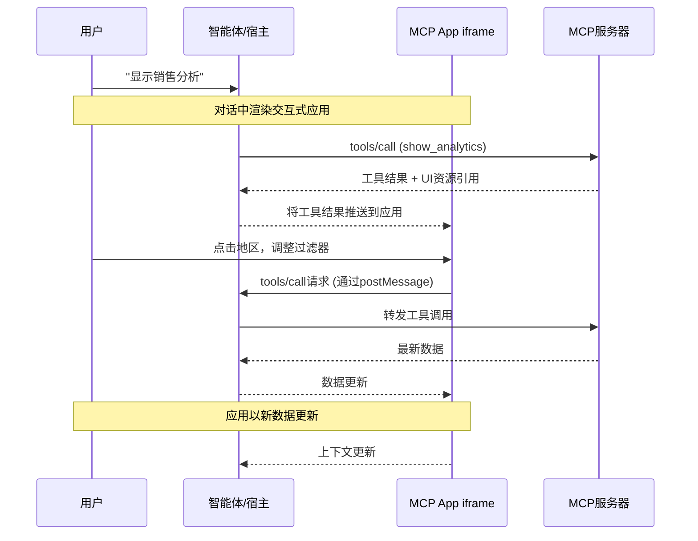

2026年1月26日，Model Context Protocol团队悄然发布了一项正在改变AI智能体UX范式的功能：**MCP Apps**。AI不再只能返回文字回答，而是可以在AI对话窗口内直接运行交互式仪表盘、表单和数据可视化组件。

从Engineering Manager的角度用一句话说明其重要性：过去AI智能体"展示数据"时，用户需要阅读文字再手动操作工具。MCP Apps消除了这一鸿沟。

## 什么是MCP Apps

MCP Apps是MCP（Model Context Protocol）的第一个官方扩展（extension）——<strong>一个让工具调用（tool call）响应中可以返回交互式HTML UI的协议</strong>。

传统MCP工具返回文本、图像和结构化数据。使用MCP Apps，同样的工具调用可以返回：

- 可点击的地区销售地图
- 实时更新的系统监控仪表盘
- 一目了然展示所有选项的部署配置表单
- PDF查看器、3D模型查看器或乐谱渲染器

而且这个UI<strong>在对话窗口内部、在对话上下文中</strong>运行。

## 为什么不只是发送网页链接

你可能会想，"发个链接不就行了？" MCP Apps与独立Web应用根本不同的原因有四点。

<strong>1. 上下文保持</strong>

UI存在于对话之中。用户不需要切换标签页，也不需要回想哪个聊天线程里有那个仪表盘。UI自然地融入对话流程中。

<strong>2. 双向数据流</strong>

MCP App可以调用MCP服务器上的任何工具，宿主（host）也可以将新结果推送到应用。独立Web应用需要自己的API、认证和状态管理，而MCP Apps直接利用现有的MCP模式。

<strong>3. 宿主能力集成</strong>

应用可以将操作委托给宿主。当应用向宿主发送"将此会议添加到日程"时，宿主通过用户已连接的日历集成来处理。应用不需要自己实现所有外部集成。

<strong>4. 安全保障</strong>

MCP Apps在沙箱iframe中运行。它们无法访问父页面、窃取cookie或逃出容器。宿主可以安全渲染第三方应用，而无需完全信任服务器开发者。有关MCP生态系统整体安全威胁与企业级强化方法，请参阅[MCP安全危机 — 60天内30个CVE：企业级强化指南](/zh/blog/zh/mcp-security-crisis-30-cves-enterprise-hardening)。

## 工作原理：架构详解

MCP Apps结合了两个MCP原语：声明UI资源的工具（tool），以及将数据渲染为交互式HTML界面的UI资源。



### 逐步工作流程

<strong>第1步：UI预加载</strong>

工具描述（tool description）中包含指向 `ui://` 资源的 `_meta.ui.resourceUri` 字段。宿主可以在工具被调用前预加载此资源，从而实现流式工具输入等功能。

<strong>第2步：资源获取</strong>

宿主从服务器获取UI资源。该资源是一个HTML页面，通常捆绑了JavaScript和CSS。

<strong>第3步：沙箱渲染</strong>

宿主在对话中以沙箱iframe渲染HTML。沙箱限制应用访问父页面。

<strong>第4步：双向通信</strong>

应用与宿主通过带有 `ui/` 方法名前缀的JSON-RPC协议通信。应用可以发起工具调用请求、发送消息、更新模型上下文以及接收宿主数据。

## 实战实现：构建MCP App服务器

让我们实际构建一个MCP App服务器。以下是一个简单的销售分析仪表盘示例。

### 1. 安装依赖

```bash
npm install @modelcontextprotocol/sdk @modelcontextprotocol/ext-apps express
```

### 2. 带UI声明的MCP服务器

```typescript
import { McpServer } from "@modelcontextprotocol/sdk/server/mcp.js";
import { StdioServerTransport } from "@modelcontextprotocol/sdk/server/stdio.js";

const server = new McpServer({
  name: "analytics-dashboard",
  version: "1.0.0",
});

// 声明UI资源的工具定义
server.tool(
  "show_sales_dashboard",
  "以交互式仪表盘展示各地区销售数据",
  {
    region: {
      type: "string",
      description: "要分析的地区 (all, kr, jp, us, cn)",
      default: "all",
    },
    period: {
      type: "string",
      description: "分析周期 (7d, 30d, 90d)",
      default: "30d",
    },
  },
  // _meta.ui: MCP Apps的核心 — 声明UI资源引用
  {
    _meta: {
      ui: {
        resourceUri: "ui://analytics-dashboard/sales",
      },
    },
  },
  async ({ region, period }) => {
    // 获取实际数据
    const salesData = await fetchSalesData(region, period);

    return {
      content: [
        {
          type: "text",
          text: `已加载${region}地区近${period}销售数据。`,
        },
        {
          type: "resource",
          resource: {
            uri: "ui://analytics-dashboard/sales",
            mimeType: "text/html",
          },
        },
      ],
      // 向UI应用传递初始数据
      _meta: {
        ui: {
          resourceUri: "ui://analytics-dashboard/sales",
          initialData: salesData,
        },
      },
    };
  }
);

// UI资源处理器
server.resource("ui://analytics-dashboard/sales", async () => {
  const htmlContent = generateDashboardHTML();
  return {
    contents: [
      {
        uri: "ui://analytics-dashboard/sales",
        mimeType: "text/html",
        text: htmlContent,
      },
    ],
  };
});

async function main() {
  const transport = new StdioServerTransport();
  await server.connect(transport);
}

main();
```

### 3. MCP App UI实现（React示例）

```tsx
// dashboard-app/src/App.tsx
import { useEffect, useState } from "react";
import { App as McpApp, useToolCall, useHostData } from "@modelcontextprotocol/ext-apps";

interface SalesData {
  regions: { name: string; revenue: number; growth: number }[];
  total: number;
  period: string;
}

function SalesDashboard() {
  const [data, setData] = useState<SalesData | null>(null);
  const [selectedRegion, setSelectedRegion] = useState<string>("all");

  // 从宿主接收初始数据
  const hostData = useHostData<SalesData>();

  // 工具调用hook — 用户交互时向服务器请求新数据
  const { call: fetchRegionData, loading } = useToolCall("show_sales_dashboard");

  useEffect(() => {
    if (hostData) {
      setData(hostData);
    }
  }, [hostData]);

  const handleRegionClick = async (region: string) => {
    setSelectedRegion(region);
    // 直接从UI调用MCP工具 — 无需额外LLM轮次！
    const result = await fetchRegionData({ region, period: "30d" });
    if (result?.data) {
      setData(result.data as SalesData);
    }
  };

  if (!data) return <div className="loading">数据加载中...</div>;

  return (
    <div className="dashboard">
      <h2>销售现状仪表盘</h2>
      <div className="region-filters">
        {["all", "kr", "jp", "us", "cn"].map((region) => (
          <button
            key={region}
            className={selectedRegion === region ? "active" : ""}
            onClick={() => handleRegionClick(region)}
            disabled={loading}
          >
            {region.toUpperCase()}
          </button>
        ))}
      </div>
      <div className="chart-area">
        {data.regions.map((r) => (
          <div key={r.name} className="region-bar">
            <span className="label">{r.name}</span>
            <div
              className="bar"
              style={{ width: `${(r.revenue / data.total) * 100}%` }}
            />
            <span className="value">
              ¥{r.revenue.toLocaleString()}
              <span className={r.growth > 0 ? "up" : "down"}>
                {r.growth > 0 ? "▲" : "▼"}{Math.abs(r.growth)}%
              </span>
            </span>
          </div>
        ))}
      </div>
      <div className="summary">
        合计：¥{data.total.toLocaleString()} | 周期：{data.period}
      </div>
    </div>
  );
}

// 用McpApp包装以启用与宿主的通信
export default function App() {
  return (
    <McpApp>
      <SalesDashboard />
    </McpApp>
  );
}
```

### 4. 安全配置（CSP与权限）

```typescript
// 在工具声明中明确安全策略
{
  _meta: {
    ui: {
      resourceUri: "ui://analytics-dashboard/sales",
      permissions: [], // 无额外权限（仅基本沙箱）
      csp: {
        // 明确列出允许的外部资源域名
        "script-src": ["'self'", "https://cdn.jsdelivr.net"],
        "connect-src": ["'self'", "https://api.yourcompany.com"],
        "style-src": ["'self'", "'unsafe-inline'"],
      },
    },
  },
}
```

## 当前客户端支持情况

截至2026年3月，支持MCP Apps的客户端如下：

| 客户端 | 支持状态 | 备注 |
|---|---|---|
| Claude (claude.ai) | ✅ 已支持 | Web + Desktop |
| Claude Desktop | ✅ 已支持 | v3.5+ |
| VS Code Copilot | ✅ 已支持 | Insiders → Stable |
| Goose (Block) | ✅ 已支持 | |
| Postman | ✅ 已支持 | 可用于API测试 |
| MCPJam | ✅ 已支持 | |
| ChatGPT | ⏳ 未知 | 无官方公告 |
| Cursor | ⏳ 未知 | 路线图讨论中 |

在VS Code中，可通过 `/mcp` 聊天命令启用/禁用服务器并管理OAuth认证。有关在浏览器中直接运行MCP服务器的方式，请参阅[WebMCP：Chrome 146让浏览器成为AI智能体的工具服务器](/zh/blog/zh/webmcp-chrome-146-ai-tool-server)。

## 实务应用：Engineering Manager视角

以下是EM在引入MCP Apps时需要判断的关键点。

### MCP Apps适合的场景

<strong>频繁的复杂数据探索</strong>。如果团队成员问AI"汇总本月故障情况"后，还要阅读文字再打开仪表盘确认——用MCP Apps将仪表盘内嵌到对话中即可。

<strong>多步骤配置/审批工作流</strong>也很适合。基础设施部署配置、成本审批、代码审查分类等工作，一次展示所有选项的表单远比逐一询问的对话方式高效得多。

<strong>实时监控</strong>也是优势所在。在聊天中提问，实时指标仪表盘随即出现的体验，与传统方式有着根本性的不同。

### 引入时的注意事项

<strong>Bundle大小管理</strong>：UI资源在对话中加载，初始加载性能至关重要。建议使用Preact或vanilla JS而非完整的React bundle。

<strong>CSP（内容安全策略）配置</strong>：必须明确声明外部脚本和API端点。需与安全团队协商维护允许域名列表。

<strong>Fallback设计</strong>：始终为不支持MCP Apps的客户端设计有用的文字响应作为回退方案。

<strong>用户同意流程</strong>：当UI发起工具调用时，宿主会请求用户同意。需将此UX设计得自然流畅。

### 客户端实现（构建自定义宿主时）

正在构建自己AI客户端的团队有两种选择：

```bash
# 选项1: @mcp-ui/client 包（提供React组件）
npm install @mcp-ui/client

# 选项2: 直接实现App Bridge
# 利用SDK的App Bridge模块：
# - 沙箱iframe渲染
# - 消息传递
# - 工具调用代理
# - 安全策略执行
```

## 用例展示

查看官方仓库中的示例，可以直观感受其可能性范围：

- <strong>map-server</strong>：CesiumJS地球仪 — "展示亚洲物流状况" → 3D地球在对话中出现
- <strong>cohort-heatmap-server</strong>：队列热力图 — 用户留存率分析仪表盘
- <strong>pdf-server</strong>：PDF查看器 — 在对话中直接审阅合同
- <strong>system-monitor-server</strong>：实时系统指标监控
- <strong>scenario-modeler-server</strong>：业务场景建模工具
- <strong>budget-allocator-server</strong>：预算分配模拟器

所有示例均提供React、Vue、Svelte、Preact、Solid和vanilla JavaScript版本。

## 结论

MCP Apps解决了AI智能体界面的根本性局限。原本只能通过文字交流的AI，现在可以<strong>在对话中直接运行实时UI</strong>。

从Engineering Manager的视角来看，这项技术的价值非常明确：团队成员向AI提问，在对话中直接获得交互工具并完成工作——无需切换到单独的仪表盘标签页或其他工具。

现在不必为所有MCP服务器都添加UI。但不妨从团队最常用的一个工具入手，试用MCP Apps。这一经验将改变你未来设计AI工作流的思路。有关AI智能体可利用的标准化技能系统，请参阅[Anthropic Agent Skills标准：AI智能体能力扩展](/zh/blog/zh/anthropic-agent-skills-standard)。

## 参考资料

- [MCP Apps官方公告 (2026-01-26)](http://blog.modelcontextprotocol.io/posts/2026-01-26-mcp-apps/)
- [MCP Apps官方文档](https://modelcontextprotocol.io/extensions/apps/overview)
- [ext-apps GitHub仓库](https://github.com/modelcontextprotocol/ext-apps)
- [WorkOS: MCP Apps are here](https://workos.com/blog/2026-01-27-mcp-apps)
- [VS Code: MCP Apps Support](https://code.visualstudio.com/blogs/2026/01/26/mcp-apps-support)
- [Goose: From MCP-UI to MCP Apps](https://block.github.io/goose/blog/2026/01/22/mcp-ui-to-mcp-apps/)
