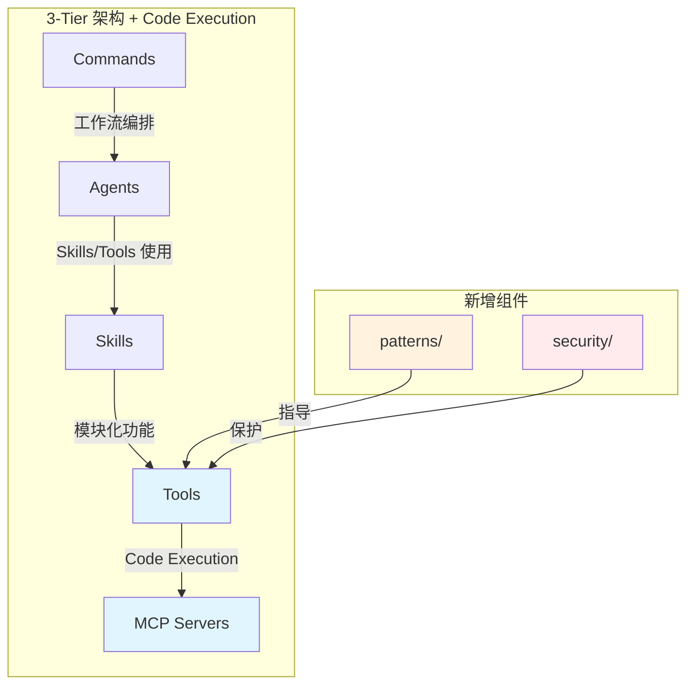
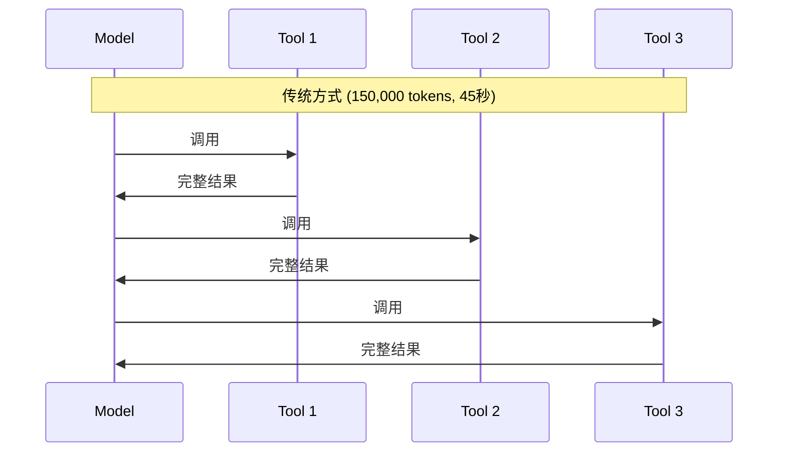
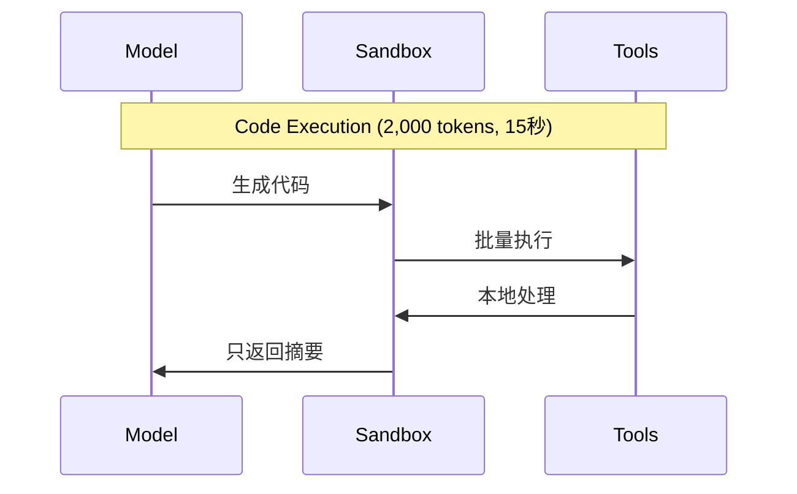
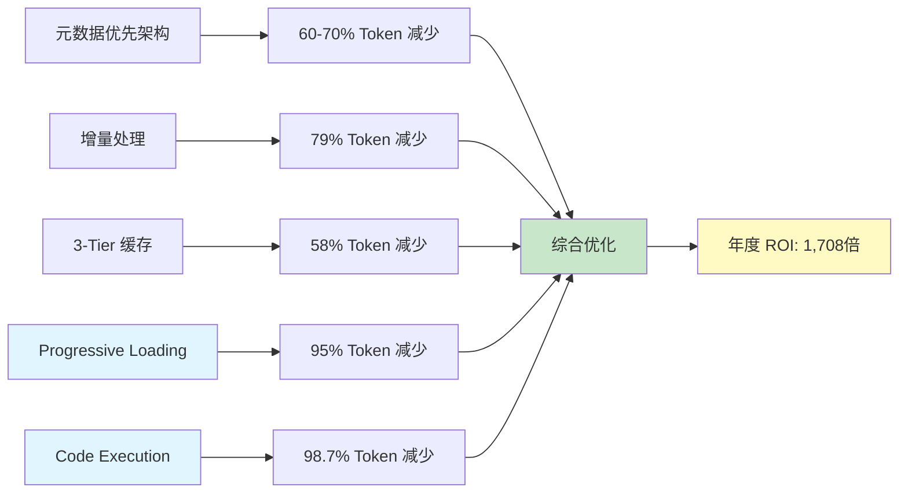

## 概述

在[上一篇文章](/zh/blog/zh/anthropic-code-execution-mcp)中，我们深入探讨了 Anthropic 的 <strong>Code Execution with MCP</strong> 技术，了解了它如何实现 <strong>98.7% 的 token 减少</strong>和 <strong>60% 的执行速度提升</strong>。今天，我们将从理论转向实践，展示如何将这些模式实际应用于 Claude Code 项目中。

本文将介绍我们对 `.claude/` 目录结构的具体改进，包括三个新增目录：<strong>tools/</strong>（MCP Tool Wrapper）、<strong>patterns/</strong>（实现模式）和 <strong>security/</strong>（安全配置）。这些改进旨在将 Anthropic 的最佳实践直接融入项目架构中。

## 结构改进概述

### 改进前的结构

```
.claude/
├── agents/          # 17个专业代理
├── skills/          # 4个模块化功能
├── commands/        # 7个用户工作流
└── guidelines/      # 指南文档
```

### 改进后的结构

```
.claude/
├── agents/          # 17个专业代理
├── skills/          # 4个模块化功能
├── commands/        # 7个用户工作流
├── tools/           # NEW: MCP Tool Wrapper (Code Execution 模式)
├── patterns/        # NEW: MCP Code Execution 实现模式
├── security/        # NEW: 安全指南（沙箱、输入验证）
├── guidelines/      # 指南文档
└── settings.local.json
```

### 架构演进



## tools/ 目录：MCP Tool Wrapper

### 核心概念

<strong>tools/</strong> 目录实现了 Anthropic Code Execution 模式中的三个关键概念：

1. <strong>Filesystem-based Tool Discovery</strong>：基于文件系统的工具发现
2. <strong>Progressive Loading</strong>：渐进式加载
3. <strong>Tool Wrapper Pattern</strong>：工具包装器模式

### 基于文件系统的工具发现

```
tools/
├── database/
│   ├── query.ts
│   └── update.ts
├── api/
│   └── fetch.ts
└── file/
    ├── read.ts
    └── write.ts
```

工具通过目录结构自动组织和发现，无需手动注册。这种方式具有以下优势：

- <strong>零配置</strong>：自动扫描目录发现工具
- <strong>模块化</strong>：按功能分类组织
- <strong>可扩展</strong>：添加新工具只需创建新文件

### Progressive Loading（95% 上下文减少）

传统方式会在初始上下文中加载所有工具描述，而 Progressive Loading 只加载实际使用的工具：

```typescript
// 传统方式：加载所有 100 个工具
const tools = {
  database: { description: "...", params: {...} },  // 500 tokens
  api: { description: "...", params: {...} },       // 400 tokens
  file: { description: "...", params: {...} },      // 300 tokens
  // ... 100 个工具
};
// 总计：~40,000 tokens

// Progressive Loading：只加载需要的 3 个工具
import { query } from './tools/database';  // 500 tokens
import { fetch } from './tools/api';       // 400 tokens
import { read } from './tools/file';       // 300 tokens
// 总计：1,200 tokens (95% 减少)
```

### 效率对比

| 全部工具数 | 使用工具数 | 传统方式 tokens | Progressive tokens | 减少率 |
|------------|------------|-----------------|-------------------|--------|
| 10 | 3 | 4,000 | 1,200 | 70% |
| 50 | 5 | 20,000 | 2,000 | 90% |
| 100 | 3 | 40,000 | 1,200 | <strong>97%</strong> |
| 200 | 10 | 80,000 | 4,000 | 95% |

### Tool Wrapper Pattern 实现

每个工具都遵循标准化的包装器模式：

```typescript
// tools/database/query.ts
import { z } from 'zod';

export const query = {
  name: 'database.query',
  description: 'Execute SQL query and return records',

  // Zod 模式进行类型安全的参数验证
  parameters: z.object({
    sql: z.string()
      .min(1, 'Query cannot be empty')
      .regex(/^SELECT/i, 'Only SELECT allowed'),
    limit: z.number()
      .int()
      .min(1)
      .max(1000)
      .default(100)
  }),

  async execute({ sql, limit }) {
    // 1. 输入验证
    const validated = this.parameters.parse({ sql, limit });

    // 2. 执行查询
    const records = await db.query(validated.sql);

    // 3. 返回摘要而非完整数据
    return {
      count: records.length,
      summary: `Retrieved ${records.length} records`
    };
  }
};
```

<strong>关键点</strong>：

- 使用 Zod 进行类型安全的参数验证
- 返回摘要而非完整数据（减少 token 消耗）
- 标准化的接口便于自动发现

### 当前工具目录

| 类别 | 工具 | 说明 | 位置 |
|------|------|------|------|
| blog-tools | `get_next_pubdate` | 计算下一个发布日期 | `skills/blog-writing/scripts/` |
| blog-tools | `generate_slug` | 生成 URL slug | `skills/blog-writing/scripts/` |
| blog-tools | `validate_frontmatter` | 验证 frontmatter | `skills/blog-writing/scripts/` |
| mcp-tools | `brave_web_search` | 网页搜索 | brave-search |
| mcp-tools | `run_report` | GA4 报告 | analytics-mcp |

## patterns/ 目录：实现模式

### Code Execution Pattern（98.7% token 减少）

<strong>patterns/code-execution.md</strong> 文档详细说明了如何从传统的顺序工具调用转变为代码执行模式：

#### 传统方式 vs Code Execution





#### 代码生成模式

```typescript
// 模型生成的代码示例
import { query } from './tools/database';
import { updateUser } from './tools/api';

// 本地循环（不需要模型调用）
for (const record of await query("SELECT * FROM users LIMIT 100")) {
  if (record.status === 'active') {
    const result = await updateUser(record.id, { last_checked: new Date() });
    if (result.error) {
      console.error(`Failed: ${record.id}`);
    }
  }
}

// 只返回摘要
return `Updated ${successCount} active users`;
```

<strong>优势</strong>：

- <strong>Token 最小化</strong>：只包含代码和最终摘要
- <strong>本地执行</strong>：循环和条件语句在代码中执行
- <strong>隐私保护</strong>：中间数据保留在沙箱内

### Progressive Loading Pattern

<strong>patterns/progressive-loading.md</strong> 提供了渐进式工具加载的详细指南：

#### 模块组织

```typescript
// 好的例子：按功能分类
tools/
├── database/
├── api/
├── file/
└── blog/

// 坏的例子：单文件
tools/all-tools.ts
```

#### 懒加载实现

```typescript
// 好的例子：需要时加载
const { query } = await import('./tools/database');

// 坏的例子：预先全部加载
import * as allTools from './tools';
```

#### Tree Shaking 支持

```typescript
// 好的例子：显式导出
export { query } from './query';
export { update } from './update';

// 坏的例子：全部重新导出
export * from './query';
export * from './update';
```

### 本项目预期效果

当前项目有 7 个 MCP 服务器，每个服务器平均 10 个工具：

- <strong>全部工具</strong>：70 个
- <strong>平均使用</strong>：5 个
- <strong>预期减少</strong>：<strong>93%</strong>

## security/ 目录：安全配置

### Sandbox Configuration（沙箱配置）

<strong>security/sandbox-config.md</strong> 提供了 AI 生成代码的安全执行指南。

#### 核心安全层

##### 1. 进程隔离

```typescript
const sandbox = createSandbox({
  runtime: 'node',
  isolation: 'bubblewrap',  // Linux
  // isolation: 'seatbelt', // macOS
});
```

##### 2. 文件系统限制

```typescript
filesystem: {
  readOnly: [
    '/tools',           // 工具定义
    '/node_modules'     // 依赖
  ],
  readWrite: [
    '/tmp',             // 临时文件
    '/workspace'        // 工作空间
  ],
  deny: [
    '~',                // 主目录
    '/etc',             // 系统配置
    '/.env'             // 环境变量
  ]
}
```

##### 3. 网络控制

```typescript
network: {
  allowedHosts: [
    'api.anthropic.com',
    'mcp.company.com'
  ],
  allowedPorts: [443, 80],
  denyOutbound: false,
  denyInbound: true
}
```

##### 4. 资源限制

```typescript
resources: {
  timeout: 30000,        // 30秒最大执行时间
  memory: '512MB',       // 内存限制
  cpu: 1,                // CPU 核心
  maxFiles: 100,         // 可打开文件数
  maxProcesses: 10       // 子进程数
}
```

#### 博客自动化沙箱示例

```typescript
const blogSandbox = createSandbox({
  runtime: 'node',
  timeout: 60000,  // 1分钟（包括图像生成）
  memory: '1GB',

  filesystem: {
    readOnly: [
      '.claude/tools',
      '.claude/skills',
      'src/content/blog'
    ],
    readWrite: [
      '/tmp',
      'src/content/blog',      // 写入文章
      'src/assets/blog',       // 保存图像
      'post-metadata.json'
    ]
  },

  network: {
    allowedHosts: [
      'api.brave.com',         // Brave Search
      'generativelanguage.googleapis.com',  // Gemini API
      'analyticsdata.googleapis.com'        // GA4
    ]
  },

  env: {
    NODE_ENV: 'production',
    GEMINI_API_KEY: process.env.GEMINI_API_KEY
  }
});
```

### Input Validation（输入验证，43% 漏洞缓解）

<strong>security/input-validation.md</strong> 提供了防止 AI 生成代码漏洞的验证模式。

根据 Anthropic 的安全研究，<strong>43% 的 AI 生成代码包含命令注入漏洞</strong>。以下是缓解这些风险的模式：

#### 主要漏洞类型

##### 1. 命令注入

```typescript
// 有漏洞的代码
const result = await exec(`cat ${userInput}`);

// 安全的代码
const allowedFiles = ['data.csv', 'report.txt'];
if (!allowedFiles.includes(userInput)) {
  throw new Error('Invalid file');
}
await readFile(userInput);
```

##### 2. SQL 注入

```typescript
// 有漏洞的代码
const query = `SELECT * FROM users WHERE id = ${userId}`;

// 安全的代码
const query = 'SELECT * FROM users WHERE id = ?';
const result = await db.query(query, [userId]);
```

##### 3. 路径遍历

```typescript
// 有漏洞的代码
const path = `./uploads/${filename}`;

// 安全的代码
const safeName = path.basename(filename);
const fullPath = path.join('./uploads', safeName);
if (!fullPath.startsWith('./uploads/')) {
  throw new Error('Invalid path');
}
```

#### Zod 模式验证

```typescript
import { z } from 'zod';

const QueryParams = z.object({
  sql: z.string()
    .min(1, 'Query cannot be empty')
    .max(1000, 'Query too long')
    .regex(/^SELECT/i, 'Only SELECT allowed')
    .refine(
      sql => !sql.includes(';'),
      'Multiple statements not allowed'
    ),
  limit: z.number()
    .int()
    .min(1)
    .max(1000)
    .default(100)
});

export async function query(params: unknown) {
  const { sql, limit } = QueryParams.parse(params);
  // 安全执行
}
```

#### 本项目的验证示例

##### 博客 Slug 验证

```typescript
const SlugSchema = z.string()
  .min(1)
  .max(100)
  .regex(/^[a-z0-9-]+$/, 'Slug must be lowercase alphanumeric with hyphens')
  .refine(
    s => !s.startsWith('-') && !s.endsWith('-'),
    'Slug cannot start or end with hyphen'
  );
```

##### 日期验证

```typescript
const PubDateSchema = z.string()
  .regex(/^\d{4}-\d{2}-\d{2}$/, 'Date must be YYYY-MM-DD format')
  .refine(date => {
    const parsed = new Date(date);
    return !isNaN(parsed.getTime());
  }, 'Invalid date');
```

##### 标签验证

```typescript
const TagSchema = z.array(
  z.string()
    .min(1)
    .max(30)
    .regex(/^[a-z0-9-]+$/, 'Tag must be lowercase alphanumeric')
)
  .max(10, 'Maximum 10 tags')
  .refine(
    tags => new Set(tags).size === tags.length,
    'Tags must be unique'
  );
```

## 实践应用效果

### Token 减少汇总

| 优化项 | 技术 | Before | After | 减少率 |
|--------|------|--------|-------|--------|
| 工具加载 | Progressive Loading | 40,000 | 2,000 | <strong>95%</strong> |
| 工作流执行 | Code Execution | 150,000 | 2,000 | <strong>98.7%</strong> |
| 博客文章写作 | 元数据优先 | 90,000 | 18,000 | <strong>80%</strong> |
| 增量处理 | Content Hash | 100% | 21% | <strong>79%</strong> |
| 趋势分析 | 3-Tier 缓存 | 40,000+ | 17,000 | <strong>58%</strong> |

### 综合效果预估

应用所有优化后的预期改进：

| 指标 | Before | After | 改进 |
|------|--------|-------|------|
| Token 消耗 | 150,000 | 2,000 | 98.7% |
| 执行时间 | 45秒 | 15秒 | 60% |
| API 成本 | $7.50 | $0.10 | 75倍 |
| 安全漏洞 | 高 | 低 | 大幅改善 |

### 与现有系统的协同

这些新模式与现有的优化策略协同工作：



## 研究文档

为了记录这次改进过程，我们创建了专门的研究目录：

```
research/anthropic-code-execution-with-mcp/
├── README.md           # 研究概述
├── key-concepts.md     # 核心概念整理
└── improvement-log.md  # 改进历史记录
```

这个目录包含：

- 原始技术的深度分析
- 应用于项目的具体决策
- 性能基准和预期效果
- 未来改进计划

## 未来计划

### 短期计划（1〜2周）

1. <strong>工具包装器转换</strong>：将现有 Python 脚本转换为 TypeScript 工具包装器
2. <strong>沙箱集成</strong>：实际配置和测试沙箱环境
3. <strong>性能基准</strong>：改进前后的详细比较测试

### 中期计划（1〜2月）

1. <strong>完整 Code Execution 实现</strong>：在 Commands 中引入代码生成模式
2. <strong>Agent 间通信优化</strong>：Agent 间只传递摘要而非完整数据
3. <strong>MCP 服务器调用批处理</strong>：并行处理代替顺序调用

### 长期计划（3月+）

1. <strong>状态持久化模式</strong>：跨对话复用沙箱状态
2. <strong>错误恢复模式</strong>：自动重试和降级策略
3. <strong>性能监控仪表板</strong>：实时跟踪 token 使用和成本

## 结论

通过将 Anthropic 的 <strong>Code Execution with MCP</strong> 模式应用于实际项目，我们建立了一个更高效、更安全的自动化系统。三个新目录的添加代表了从理论到实践的重要一步：

- <strong>tools/</strong>：实现了 Progressive Loading，预计减少 95% 的工具加载 token
- <strong>patterns/</strong>：文档化了 Code Execution 模式，为 98.7% token 减少奠定基础
- <strong>security/</strong>：建立了沙箱和输入验证指南，缓解 43% 的 AI 生成代码漏洞

这些改进与现有的元数据优先架构、增量处理和缓存策略协同工作，使整个系统的效率提升达到新的高度。

如果您对 MCP Code Execution 的理论基础感兴趣，请参阅我们的[上一篇文章](/zh/blog/zh/anthropic-code-execution-mcp)。如果您有任何问题或想分享您自己的实现经验，欢迎交流讨论。

## 参考资源

### 项目文档

- [.claude/tools/README.md](https://github.com/your-repo/.claude/tools/README.md)
- [.claude/patterns/code-execution.md](https://github.com/your-repo/.claude/patterns/code-execution.md)
- [.claude/security/sandbox-config.md](https://github.com/your-repo/.claude/security/sandbox-config.md)

### 官方资源

- [Anthropic Code Execution with MCP](https://www.anthropic.com/engineering/code-execution-with-mcp)
- [MCP Specification](https://github.com/modelcontextprotocol/specification)
- [Zod Documentation](https://zod.dev)

### 相关文章

- [上一篇：Anthropic Code Execution with MCP 深度解析](/zh/blog/zh/anthropic-code-execution-mcp)
- [EffiFlow 自动化分析 Part 1](/blog/zh/effiflow-automation-analysis-part1)
- [EffiFlow 自动化分析 Part 2](/blog/zh/effiflow-automation-analysis-part2)
