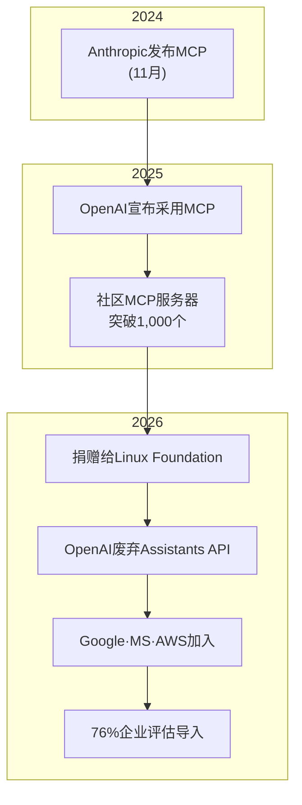
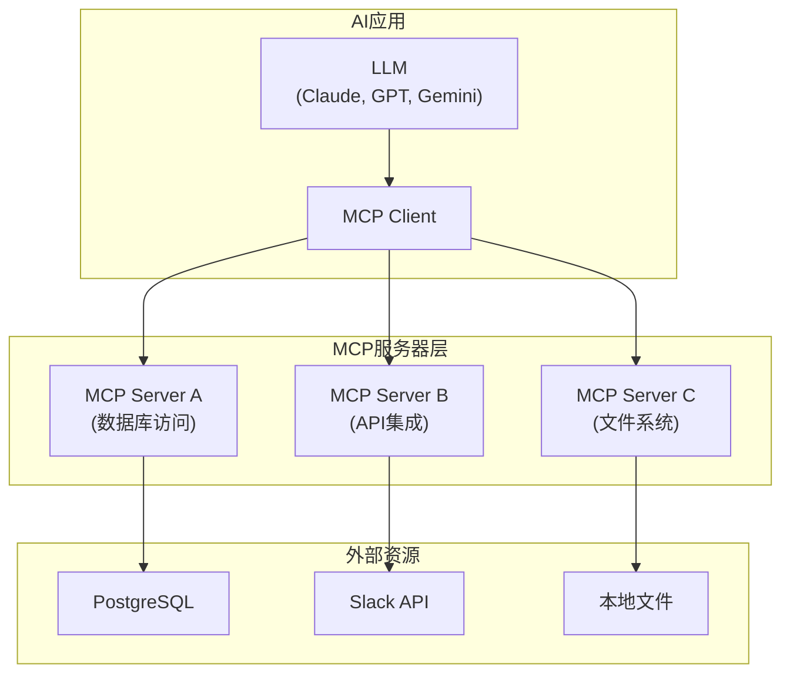
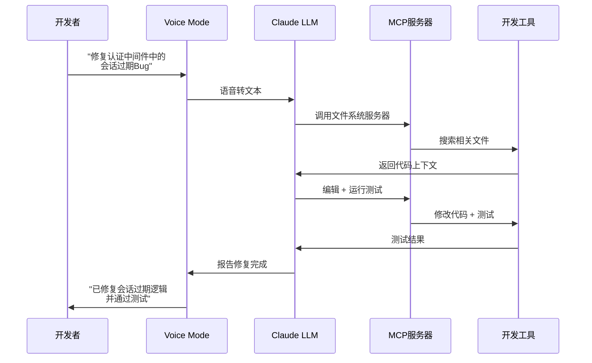
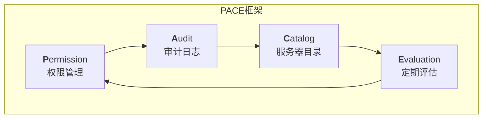
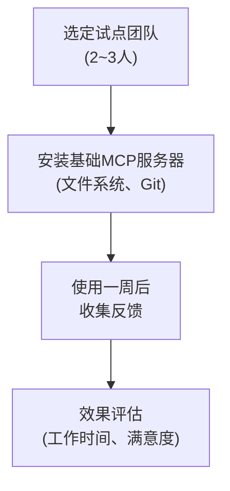

## MCP，从"AI的USB-C"到行业标准

2024年11月，Anthropic发布了<strong>Model Context Protocol（MCP）</strong>，最初它被视为"又一个协议"。然而仅仅16个月后，局势发生了根本性变化。

2026年初，Anthropic将MCP捐赠给<strong>Linux Foundation</strong>，OpenAI（废弃Assistants API，全面采用MCP）、Google DeepMind、Microsoft、AWS、Cloudflare作为共同创始成员加入。"AI模型与外部工具对话的方式"就此诞生了事实上唯一的标准。

本文将探讨MCP标准化对工程组织意味着什么，以及<strong>EM/VPoE/CTO</strong>应如何准备导入，并结合实战案例进行分析。

## 为什么是现在——三个转折点

### 1. 协议之争的终结

直到2025年，AI工具的连接方式仍然高度碎片化：

- OpenAI：Function Calling + Assistants API
- Google：Vertex AI Extensions
- Anthropic：Tool Use + MCP
- 各框架：LangChain Tools、CrewAI Tools等

2026年，OpenAI正式废弃Assistants API并全面采用MCP，这场碎片化之争实质上已经终结。在Linux Foundation治理下确立统一标准，这是继HTTP、REST之后最重要的基础设施标准化之一。

### 2. 76%的企业已在行动

根据CData 2026年调查，<strong>76%的软件供应商</strong>已在探索或实施MCP。这意味着问题已从"是否导入"转变为"如何导入"。

### 3. 安全管控跟不上采用速度

据VentureBeat报道，<strong>企业MCP的采用速度已超过安全管控的建立速度</strong>。这与2000年代初期REST API扩散时的模式类似——便利性跑在安全性前面，最终要付出代价。

## MCP架构核心——5分钟速览

为初次接触MCP的读者梳理核心架构。

<strong>核心概念</strong>：

- <strong>MCP Host</strong>：AI应用（Claude Code、Cursor、Windsurf等）
- <strong>MCP Client</strong>：在Host内部管理与Server的1:1连接
- <strong>MCP Server</strong>：提供对特定资源（数据库、API、文件等）的访问
- <strong>Transport</strong>：stdio（本地）或HTTP+SSE（远程）协议

USB-C的类比之所以恰当，正是因为——一个协议就能让任何AI模型连接任何工具。

## 三个实战案例——MCP如何改变工作流

### 案例1：Perplexity Computer——19个模型的Agentic编排

2026年2月发布的<strong>Perplexity Computer</strong>是基于MCP的多模型编排最具代表性的案例。

| 角色 | 模型 | 用途 |
|------|------|------|
| 核心推理 | Claude Opus 4.6 | 复杂决策 |
| 深度研究 | Gemini | 大规模文档分析 |
| 轻量任务 | Grok | 快速响应 |
| 长上下文召回 | ChatGPT 5.2 | 长对话历史利用 |

Perplexity将每个模型<strong>封装为MCP服务器</strong>，Sub-Agent并行执行任务。当用户请求"分析这个PDF，总结后发邮件"时，系统自动选择最优模型组合并分配任务。

<strong>EM视角的启示</strong>：不再依赖单一模型的多模型策略成为可能。团队的AI工具选择正在从"用哪个模型"进化为"什么任务分配给哪个模型"。

### 案例2：Claude Code Voice Mode——生产力提升3.7倍

2026年3月3日发布的<strong>Claude Code Voice Mode</strong>通过`/voice`命令激活，开发者可以用语音描述Bug、架构决策、重构指令，Claude则负责编写和执行代码。

早期用户数据显示，已有实现<strong>3.7倍工作流加速</strong>的案例报告。这一速度提升的关键在于基于MCP的工具连接——Voice Mode通过MCP服务器连接文件系统、Git、测试运行器、构建系统等，仅需一条语音指令即可控制整个开发流水线。

### 案例3：平台工程团队的MCP网关

MintMCP、Cloudflare Workers等提供的<strong>MCP网关</strong>使平台工程团队能够集中管理整个组织的MCP服务器。

实际导入案例中报告的效果：

- <strong>重复性工作时间减少40%</strong>：通过MCP自动化Jira Issue创建、Slack通知、数据库查询等
- <strong>缩短Onboarding时间</strong>：新成员通过标准化的MCP服务器即时访问团队工具
- <strong>减少影子IT</strong>：用标准MCP服务器统一工具访问，替代个人脚本

## EM/VPoE需要关注的安全与治理

### 安全风险现状

MCP的快速扩散伴随着代价。根据Cisco的分析，主要风险如下：

1. <strong>Prompt注入</strong>：MCP服务器返回的数据中可能包含恶意Prompt
2. <strong>供应链攻击</strong>：社区MCP服务器（如OpenClaw的5,700+技能）的质量管理问题
3. <strong>过度权限授予</strong>：向MCP服务器授予超出必要的系统访问权限
4. <strong>数据泄露</strong>：通过AI模型非预期地将内部数据传输到外部

### 治理框架：PACE模型

为工程组织提出MCP治理框架建议。

<strong>Permission（权限管理）</strong>：
- 对每个MCP服务器应用最小权限原则
- 明确区分只读与可写服务器
- 按团队管理可访问服务器白名单

<strong>Audit（审计日志）</strong>：
- 记录所有MCP调用的日志
- 检测异常模式（大量数据访问、非工作时间调用等）
- 自动生成每周审计报告

<strong>Catalog（服务器目录）</strong>：
- 集中管理已批准的MCP服务器列表
- 版本管理与安全补丁追踪
- 使用社区服务器时必须进行代码审查

<strong>Evaluation（定期评估）</strong>：
- 每季度进行MCP服务器安全审计
- 基于使用率清理不必要的服务器
- 评估新安全漏洞的影响

## 工程组织导入路线图

### Phase 1：试点（2~4周）

- <strong>对象</strong>：对AI工具感兴趣的2~3名资深工程师
- <strong>服务器</strong>：仅限文件系统、Git、基础数据库查询等低风险服务器
- <strong>衡量指标</strong>：重复性工作时间变化、开发者满意度

### Phase 2：团队扩展（1~2个月）

- <strong>对象</strong>：整个团队（10~20人）
- <strong>新增服务器</strong>：Slack、Jira、CI/CD集成
- <strong>治理</strong>：开始应用PACE框架
- <strong>培训</strong>：MCP基础概念 + 安全指南分享

### Phase 3：组织标准化（2~3个月）

- <strong>导入MCP网关</strong>：集中管理 + 认证/权限整合
- <strong>开发定制服务器</strong>：内部系统专用MCP服务器
- <strong>CI/CD集成</strong>：构建MCP服务器部署流水线
- <strong>设定KPI</strong>：正式追踪生产力指标

### Phase 4：持续优化

- 制定多模型策略（参考Perplexity Computer案例）
- MCP服务器性能监控
- 自动化新服务器评估与导入流程

## 缩小"80/13差距"的关键

根据McKinsey 2026年调查，<strong>80%的企业已部署GenAI，但只有13%真正看到了实质性影响</strong>。这一差距的核心原因在于"工具碎片化"和"工作流未整合"。

MCP标准化正是缩小这一差距的基础设施层：

| 问题 | MCP之前 | MCP之后 |
|------|---------|---------|
| 工具连接 | 每个模型定制集成 | 统一标准协议 |
| 切换成本 | 更换模型需重建所有集成 | 保留服务器，仅更换客户端 |
| 团队协作 | 个人脚本泛滥 | 共享标准服务器目录 |
| 安全管理 | 每个集成单独审计 | 网关层统一管理 |

## CTO视角：投资趋势的启示

据TechCrunch 2026年3月报道，VC们不再投资<strong>"薄工作流层"</strong>SaaS，而是专注于<strong>深度嵌入关键任务工作流的AI原生基础设施</strong>。

这意味着应将MCP定位为<strong>"组织的AI基础设施层"</strong>，而不仅仅是"简单的工具连接"。尽早构建MCP服务器生态的组织将获得：

1. <strong>模型切换灵活性</strong>：从Claude切换到GPT或开源模型，工作流照常运行
2. <strong>摆脱厂商锁定</strong>：构建不依赖特定AI供应商的基础设施
3. <strong>持续创新</strong>：仅需添加新的MCP服务器即可扩展AI能力

## 结语——现在正是投资MCP的最佳时机

MCP加入Linux Foundation终结了"这个协议能否存活"的疑问。OpenAI、Google、Microsoft、AWS全部坐到了同一张桌子上，这接近于<strong>自HTTP以来最重要的基础设施共识</strong>。

作为工程领导者，现在需要做的有三件事：

1. <strong>启动试点</strong>——与2~3名资深工程师一起，从基础MCP服务器开始
2. <strong>先设计治理</strong>——在没有安全管控的情况下扩散，日后必将付出代价
3. <strong>考虑多模型策略</strong>——得益于MCP，不依赖特定模型的架构已成为可能

"就像USB-C统一了所有设备的充电方式，MCP统一了所有AI的工具连接方式。区别在于——USB-C花了10年，而MCP不到2年。"

## 参考资料

- [How MCP will supercharge AI automation in 2026 — Hallam](https://hallam.agency/blog/how-mcp-will-supercharge-ai-automation-in-2026/)
- [Enterprise MCP adoption is outpacing security controls — VentureBeat](https://venturebeat.com/security/enterprise-mcp-adoption-is-outpacing-security-controls)
- [2026: The Year for Enterprise-Ready MCP Adoption — CData](https://www.cdata.com/blog/2026-year-enterprise-ready-mcp-adoption)
- [MCP Explained: How AI Agents Actually Work (2026) — DEV Community](https://dev.to/aristoaistack/mcp-explained-how-ai-agents-actually-work-2026-5p8)
- [Claude Code rolls out a voice mode — TechCrunch](https://techcrunch.com/2026/03/03/claude-code-rolls-out-a-voice-mode-capability/)
- [Best MCP Gateways for Platform Engineering Teams — MintMCP](https://www.mintmcp.com/blog/mcp-gateways-platform-engineering-teams)
