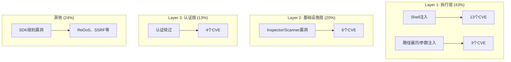
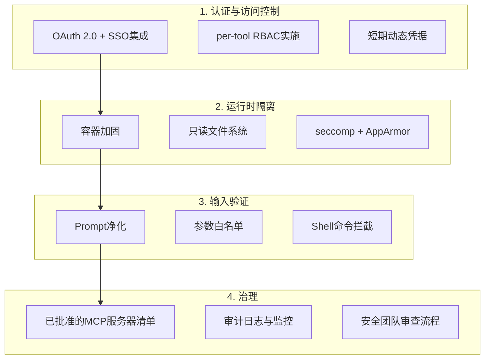

## MCP，成为AI的USB端口的代价

Model Context Protocol（MCP）已成为LLM连接外部工具和数据的事实标准。随着其转入Linux Foundation的开放治理体系，Anthropic、OpenAI、Google等主要厂商纷纷宣布支持，采用率呈爆发式增长。然而，<strong>便利性所到之处，攻击面必然随之而来。</strong>

2026年1〜2月，短短60天内，MCP生态系统中报告了<strong>30个CVE</strong>，暴露在互联网上的MCP服务器实例多达42,665个。在扫描的560个服务器中，36%完全没有身份认证。MCP正在成为AI时代增长最快的攻击面，这已不再是夸张之辞。

本文将从EM/VPoE/CTO的视角分析MCP安全现状，并提供团队和组织可立即应用的加固指南。

## 30个CVE揭示的三层攻击模型

对已报告的30个CVE进行分类后可以发现，MCP的攻击面已演化为<strong>三个明确的层次</strong>。

### Layer 1 — 执行层（43%，13+3个CVE）

最为经典却仍占比最高的层次。MCP服务器将用户输入直接传递给Shell命令的模式被反复发现。

<strong>典型案例</strong>：Anthropic官方Git MCP服务器中发现的3个漏洞（CVE-2025-68143〜68145）可通过Prompt注入实现远程代码执行（RCE）。路径验证绕过、无限制的`git_init`和参数注入共同作用。

### Layer 2 — 基础设施层（20%，6个CVE）

一种新的攻击模式：漏洞不在MCP服务器本身，而在<strong>管理和监控MCP的工具</strong>中。Inspector、Scanner、宿主应用等"元工具"成为攻击目标。

### Layer 3 — 认证层（13%，4个CVE）

已报告的认证相关漏洞包括：<strong>macOS上OAuth令牌刷新机制操控</strong>（CVE-2026-27487）、凭据以明文存储在`~/.openclaw/credentials/`等。

## SDK级别的威胁——供应链污染

超越单个服务器，<strong>威胁整个MCP生态系统的供应链攻击</strong>已被检测到。

### 官方TypeScript SDK漏洞

`@modelcontextprotocol/sdk`（官方TypeScript SDK）中确认了2个严重漏洞：

- <strong>ReDoS</strong>：`UriTemplate`类中用于资源URI匹配的正则表达式存在灾难性回溯漏洞，特殊URI可导致服务器进程挂起
- <strong>SSRF</strong>：Microsoft的MarkItDown MCP服务器中发现的SSRF漏洞潜在影响约36.7%的MCP服务器

### 技能注册表污染

| 时间 | 扫描范围 | 恶意技能数量 | 比例 |
|------|----------|-------------|------|
| 2026-01-29 | 2,857个包 | 341个 | 11.9% |
| 2026-02-16 | 10,700+个包 | 824+个 | 7.7% |

Bitdefender Labs在深度分析对象中确认了约<strong>20%包含恶意载荷</strong>。npm和PyPI的供应链攻击已扩展至MCP技能注册表。

## 面向EM/CTO的企业加固检查清单

### 1. 认证与访问控制

- <strong>OAuth 2.0 + SSO集成为必要条件</strong>：将MCP端点部署在SSO之后。考虑到36%的服务器无认证暴露的现实，这是最优先事项
- <strong>Per-tool RBAC</strong>：对所有MCP工具实施基于角色的访问控制。确保"文件读取"工具不会被同时授予"文件删除"权限
- <strong>动态凭据</strong>：使用短期令牌代替静态API密钥，实现自动轮换

### 2. 运行时隔离

- <strong>不可变基础设施</strong>：只读容器文件系统，受限的Linux Capabilities
- <strong>资源限制</strong>：通过CPU/内存配额设置缓解ReDoS等资源耗尽攻击
- <strong>强制访问控制</strong>：通过seccomp Profile + AppArmor/SELinux实现系统调用级别限制

### 3. 输入验证

- <strong>Prompt净化</strong>：防御Prompt注入攻击，基于白名单验证所有用户输入和工具参数
- <strong>禁止直接执行Shell命令</strong>：转换为仅允许预定义命令的架构

### 4. 治理

- <strong>运营已批准的服务器清单</strong>：建立安全团队审批流程，防止开发者随意安装MCP服务器
- <strong>审计日志</strong>：对所有MCP工具调用进行审计追踪，满足合规要求（GDPR、HIPAA、SOC2）
- <strong>SAST + SCA</strong>：对MCP服务器代码应用静态分析工具和软件组成分析

## 实战应用——MCP安全成熟度三阶段

根据组织的当前状况分阶段提升安全水平是务实的做法。

### Stage 1：立即行动（1〜2周）

- 立即停用或阻断无认证的MCP端点访问
- 检查凭据是否以明文存储（`~/.openclaw/credentials/`、`.env`）
- 确认正在使用的MCP SDK版本并应用补丁

### Stage 2：基础建设（1〜2个月）

- 完成OAuth 2.0 + SSO集成
- 转向基于容器的MCP服务器部署
- 建立已批准的MCP服务器/技能注册表
- 将MCP服务器代码纳入SAST/SCA流水线

### Stage 3：成熟运营（3〜6个月）

- 实时监控和异常行为检测
- 建立定期安全审计流程
- MCP安全策略内部培训计划
- 在红队演练中纳入MCP场景

## OWASP的MCP安全指南

OWASP于2026年初发布了MCP服务器安全开发实践指南，核心建议如下：

- <strong>最小权限原则</strong>：仅向每个MCP工具授予所需的最小权限
- <strong>密钥管理</strong>：使用专用密钥管理器而非环境变量，在运行时动态注入
- <strong>组件签名</strong>：对MCP服务器二进制文件和技能包进行签名
- <strong>DevSecOps集成</strong>：将MCP安全自动化为CI/CD流水线的一部分

## 结论——寻找便利性与安全性的平衡点

MCP是使AI代理能够真正执行业务任务的核心协议。但60天内涌现30个CVE的现实再次提醒我们<strong>"连接性即脆弱性"</strong>这一安全基本原则。

对于EM和CTO来说，重要的不是禁止使用MCP，而是<strong>建立在受控环境中安全使用的体系</strong>。消除无认证服务器、运行时隔离、审批流程——仅立即实施这三项措施，就能缓解当前已报告CVE的76%以上。

在AI代理深入组织核心业务的当下，MCP安全已不再是选项，而是必需。

## 参考资料

- [Adversa AI — Top MCP Security Resources (March 2026)](https://adversa.ai/blog/top-mcp-security-resources-march-2026/)
- [30 CVEs Later: How MCP's Attack Surface Expanded Into Three Distinct Layers](https://dev.to/kai_security_ai/30-cves-later-how-mcps-attack-surface-expanded-into-three-distinct-layers-ihp)
- [OWASP — A Practical Guide for Secure MCP Server Development](https://genai.owasp.org/resource/a-practical-guide-for-secure-mcp-server-development/)
- [MCP Security Best Practices — Model Context Protocol Official](https://modelcontextprotocol.io/specification/draft/basic/security_best_practices)
- [Red Hat — Model Context Protocol: Understanding Security Risks and Controls](https://www.redhat.com/en/blog/model-context-protocol-mcp-understanding-security-risks-and-controls)
- [Practical DevSecOps — MCP Security Vulnerabilities](https://www.practical-devsecops.com/mcp-security-vulnerabilities/)
