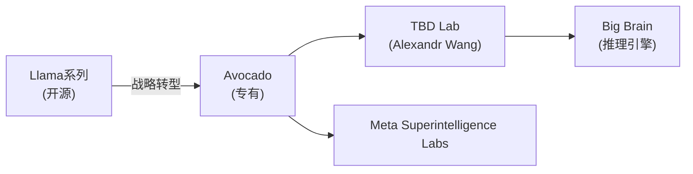
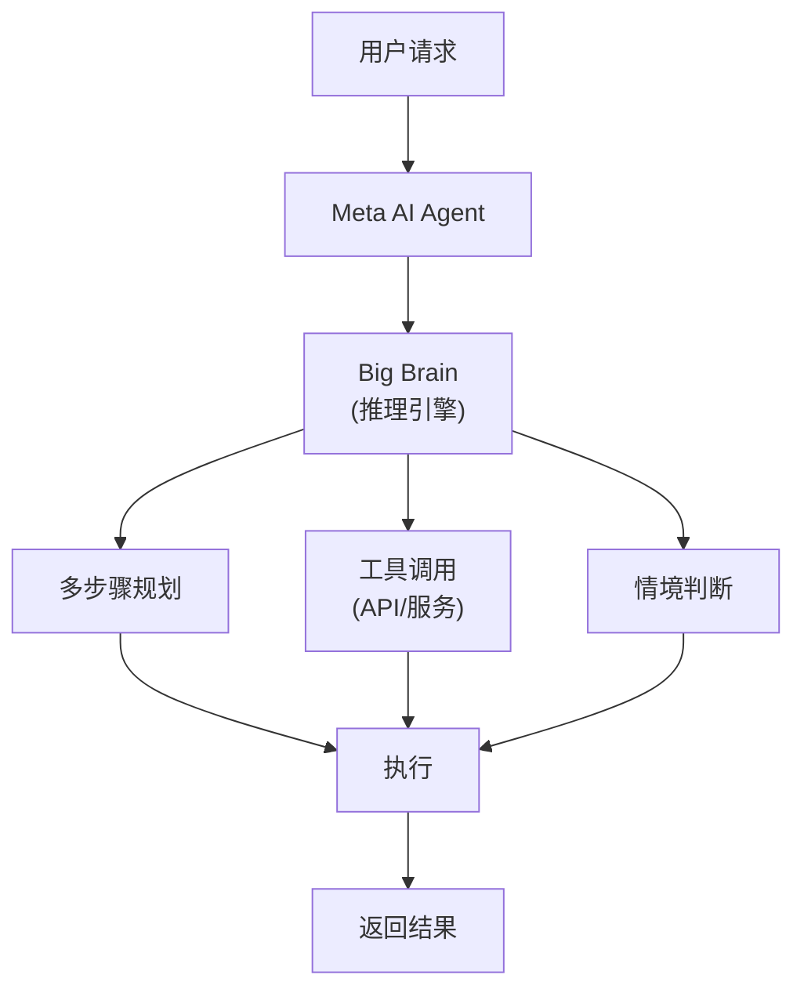
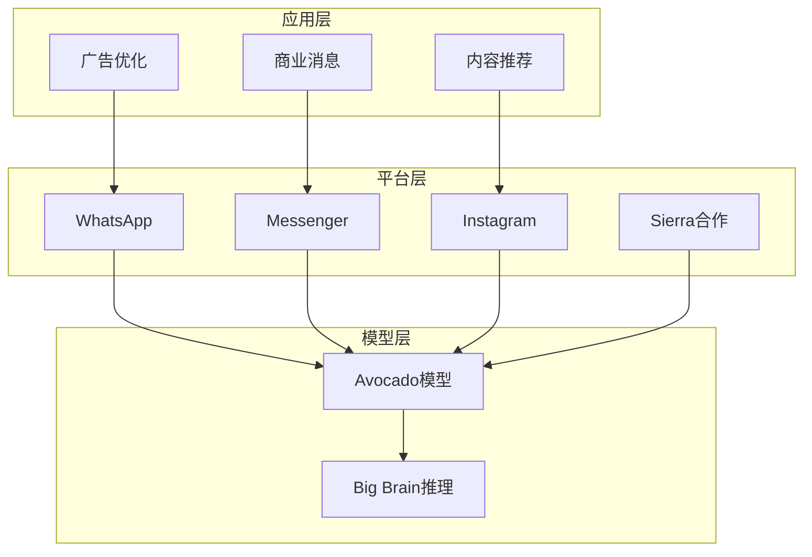

## 概述

Meta正在从一家社交媒体公司向**AI Agent平台企业**进行重大转型。这一自2025年末开始加速的战略可以用三个关键词来概括：代表外部Agent合作伙伴关系的**Sierra**、下一代前沿模型内部代号**Avocado**、以及代表高级推理能力的**Big Brain**。

本文分析Meta的AI战略如何变化，以及这对开发者和企业意味着什么。

## 从Llama到Avocado — 战略大转型

### 从开源到专有

Meta长期以来通过Llama模型系列将自己定位为**开源AI**的领导者。2024年，Mark Zuckerberg预测Llama将成为"行业中最先进的模型"。

然而，2025年4月Llama 4的发布未能达到开发者社区的期望，成为战略转型的导火索。Zuckerberg在2025年7月表示"我们需要对选择开源的内容保持谨慎"，暗示了方向的转变。

### Avocado — 下一代前沿模型

**Avocado**是Meta下一代前沿AI模型的代号。据CNBC报道，该模型具有以下特征：

- **专有模型**：与之前的Llama不同，权重可能不会公开
- **在TBD Lab开发**：由前Scale AI的Alexandr Wang领导的精英研究组织
- **计划2026年第一季度发布**：与OpenAI、Google、Anthropic的竞争进一步加剧

## Sierra — 外部Agent合作伙伴关系

### 什么是Sierra AI？

Sierra AI是由前Salesforce联合CEO、OpenAI董事会主席**Bret Taylor**创立的AI Agent初创公司。它提供企业级AI Agent平台，具有可扩展性，使复杂的受监管企业也能快速部署Agent。

### Meta × Sierra的协同效应

Meta推动与Sierra的合作伙伴关系具有重大战略意义：

| 领域 | Meta的优势 | Sierra的优势 |
|------|-----------|-------------|
| **用户基础** | 30亿+日活用户 | 企业客户网络 |
| **AI模型** | Avocado/Llama | Agent编排 |
| **渠道** | WhatsApp、Messenger、Instagram | B2B通信 |
| **数据** | 社交图谱 | 业务流程 |

Meta已通过WhatsApp的**Business AI**每周处理超过100万次对话，并计划进一步扩展。

## Big Brain — 高级推理引擎

### 推理能力的重要性

**Big Brain**据报道指的是Meta AI的高级推理功能。正如OpenAI的o1/o3系列和Google的Gemini 3所展示的，超越简单文本生成的**深度推理**能力是AI Agent的核心竞争力。

Agent要执行复杂的业务任务，需要以下能力：

1. **多步骤规划**：将复杂请求分解为阶段
2. **工具使用**：调用外部API和服务
3. **情境判断**：在异常情况下做出适当决策
4. **自我验证**：确认结果的准确性

Big Brain将这些推理能力内置于Avocado模型中，将Meta的Agent生态系统提升到新的高度。

## Meta Agent平台战略全景

Meta的AI Agent平台战略由三个层次构成：

### 1. 模型层（Avocado + Big Brain）

- 以下一代前沿模型确保对竞争对手的性能优势
- 通过推理能力提升Agent的自主性

### 2. 平台层（Sierra + Business AI）

- 通过WhatsApp、Messenger、Instagram部署Agent
- 提供企业级Agent SDK和API
- Business AI助手的全球扩展

### 3. 应用层

- **广告优化**：基于AI的广告创意生成（2025年Q4视频生成工具收入达到100亿美元）
- **内容推荐**：有机信息流浏览量提升7%
- **商业消息**：点击消息广告收入在美国增长超过50%

## 对开发者的影响

### 需要关注的要点

1. **Agent API生态系统**：Meta如果发布Agent SDK，将开启面向30亿用户的Agent开发
2. **WhatsApp Business Agent**：已在墨西哥和菲律宾启动的Business AI即将全球扩展
3. **Avocado模型的性能**：转向专有后，基于API的访问将成为主要集成方式
4. **Sierra平台集成**：企业级Agent开发可以利用Sierra的编排层

### 竞争格局变化

| 企业 | Agent战略 | 核心模型 |
|------|----------|---------|
| **Meta** | 基于社交平台的Agent | Avocado |
| **OpenAI** | ChatGPT + Operator | o3/GPT-5 |
| **Google** | Gemini + Android集成 | Gemini 3 |
| **Anthropic** | Claude + Agent Teams | Opus 4.6 |
| **Salesforce** | Agentforce + CRM | Einstein |

## 结论

Meta的AI Agent平台化不仅仅是技术转型，更是**商业模式的根本性重构**。在广告收入这一坚实基础之上，将拥有30亿用户的平台转化为Agent基础设施，这一尝试有潜力改变AI行业格局。

如果这一三角战略成功——通过Sierra增强企业Agent能力，通过Avocado确保模型竞争力，通过Big Brain提升推理能力——Meta将从社交媒体公司转变为**AI Agent平台的强者**。

2026年第一季度Avocado模型的发布和Business AI的全球扩展，将成为这一愿景的首次考验。

## 参考资料

- [CNBC: From Llamas to Avocados: Meta's shifting AI strategy](https://www.cnbc.com/2025/12/09/meta-avocado-ai-strategy-issues.html)
- [Meta: 2026 AI Drives Performance](https://about.fb.com/news/2026/01/2026-ai-drives-performance/)
- [Sierra AI: Year Two in Review](https://sierra.ai/blog/year-two-in-review)
- [Gadgets360: Meta AI Could Get New Avocado Models, AI Agents](https://www.gadgets360.com/ai/news/meta-ai-avocado-models-ai-agents)
