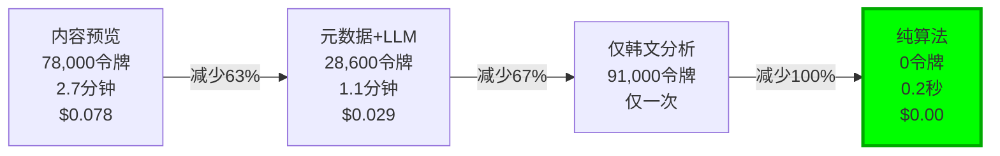
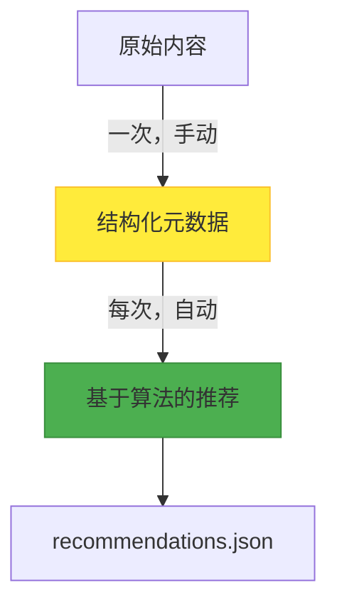

## 引言：成本如滚雪球

这段旅程始于为博客添加相关文章推荐功能。最初的想法很简单："让LLM查看文章内容，然后找出相似的文章就行了。"但是，为13篇文章生成推荐就消耗了<strong>78,000个令牌</strong>，耗时<strong>2.7分钟</strong>。

如果文章增加到30篇呢？180,000个令牌，约6.5分钟。如果达到100篇呢？接近600,000个令牌，超过20分钟。这是一个缺乏可扩展性的系统。

本文记录了一段优化之旅：<strong>最初目标是减少63%的令牌使用量，最终实现了100%的令牌削减</strong>，<strong>执行时间缩短99%</strong>，<strong>成本完全归零</strong>。

## 第一阶段：问题发现

### 初始系统：内容预览方式

最初的实现非常直观：

```typescript
// 步骤1：提取所有文章的前1000个字符
const posts = await getCollection('blog');
const previews = posts.map(post => ({
  ...post.data,
  preview: post.body.substring(0, 1000)
}));

// 步骤2：针对每篇文章向LLM请求相似度分析
for (const sourcePost of posts) {
  const prompt = `
    源文章：
    标题：${sourcePost.data.title}
    内容：${sourcePost.preview}

    候选文章（12篇）：
    ${candidates.map(c => `
      标题：${c.title}
      内容：${c.preview}
    `).join('\n')}

    请推荐最相似的5篇文章。
  `;

  const recommendations = await llm.generate(prompt);
}
```

### 性能测量结果

<strong>每篇文章的令牌使用量：</strong>
```
输入：
- 源文章元数据：100令牌
- 源文章1000字预览：250令牌
- 候选文章12篇 × 350令牌：4,200令牌
- 提示模板：800令牌
────────────────────────
总输入：5,350令牌

输出：
- JSON响应（5个推荐）：600令牌
────────────────────────
总计：5,950令牌 ≈ 6,000令牌
```

<strong>13篇文章总计：</strong>
- 总令牌数：78,000
- 执行时间：约2.7分钟
- 成本：$0.078（基于Claude Sonnet 3.5）

### 问题识别

1. <strong>重复处理：</strong>相同的文章内容被多次传输（每次作为候选文章出现时）
2. <strong>信息利用低效：</strong>每次分析1000个字符，但实际需要的只是几个核心主题
3. <strong>可扩展性问题：</strong>文章数量为n时，令牌使用量以O(n²)增长

## 第二阶段：首次优化 - 基于元数据的LLM分析

### 核心理念："分析一次，永久推荐"

如果将文章分析和推荐生成分离会怎样？预先提取每篇文章的核心信息，在生成推荐时只使用这些元数据。

### 元数据结构设计

```typescript
interface PostMetadata {
  slug: string;
  language: string;
  pubDate: string;
  title: string;

  // 核心：压缩为200字摘要
  summary: string;

  // 压缩为5个主要主题
  mainTopics: string[];

  // 压缩为5个技术栈
  techStack: string[];

  // 难度（1-5）
  difficulty: number;

  // 5个类别的评分（0.0-1.0）
  categoryScores: {
    automation: number;
    'web-development': number;
    'ai-ml': number;
    devops: number;
    architecture: number;
  };

  generatedAt: string;
  contentHash: string;
}
```

### Post Analyzer代理

我们创建了一个专门的代理，用于分析完整内容并生成结构化元数据：

```typescript
// .claude/agents/post-analyzer.md
//
// 角色：分析博客文章生成元数据
// 输入：完整的Markdown内容
// 输出：PostMetadata JSON

async function analyzePost(post: Post): Promise<PostMetadata> {
  const prompt = `
    请分析以下博客文章并生成元数据：

    标题：${post.title}
    内容：
    ${post.body}

    输出格式：JSON
    - summary: 200字以内的核心摘要
    - mainTopics: 5个主要主题
    - techStack: 5个技术栈
    - difficulty: 1-5难度等级
    - categoryScores: 5个类别评分
  `;

  return await llm.generate(prompt);
}
```

### 改进的推荐生成

仅使用元数据生成推荐：

```typescript
// 步骤1：加载元数据（已生成）
const metadata = JSON.parse(
  await fs.readFile('post-metadata.json', 'utf-8')
).metadata;

// 步骤2：仅传递元数据（移除1000字预览！）
for (const slug in metadata) {
  const source = metadata[slug];

  const prompt = `
    源文章：
    - 标题：${source.title}
    - 摘要：${source.summary}
    - 主题：${source.mainTopics.join(', ')}
    - 技术：${source.techStack.join(', ')}
    - 难度：${source.difficulty}/5
    - 类别：${JSON.stringify(source.categoryScores)}

    候选文章（12篇）：
    ${candidates.map(c => `
      - ${c.title}
      摘要：${c.summary}
      主题：${c.mainTopics.join(', ')}
    `).join('\n')}
  `;

  const recommendations = await llm.generate(prompt);
}
```

### 性能改进结果

<strong>每篇文章的令牌使用量：</strong>
```
输入：
- 源文章元数据：82令牌
- 候选文章12篇 × 82令牌：984令牌
- 提示模板：500令牌
────────────────────────
总输入：1,566令牌

输出：
- JSON响应：600令牌
────────────────────────
总计：2,166令牌 ≈ 2,200令牌
```

<strong>13篇文章总计：</strong>
- 总令牌数：28,600（原78,000）
- <strong>实现63%令牌削减！</strong>
- 执行时间：约1.1分钟（原2.7分钟）
- 时间缩短59%

### 盈亏平衡分析

当然，生成元数据也有成本：

```
初始投资（一次性）：
- 13篇文章 × 7,000令牌 = 91,000令牌
- 成本：$0.091

每次节省：
- 节省49,400令牌/次
- 节省$0.049/次

盈亏平衡点：
- 运行2次后回本（91,000 / 49,400 = 1.84）
- 运行3次时：净收益-$0.056
- 运行10次时：净收益-$0.399
```

这是一笔不错的投资。但我们没有止步于此。

## 第三阶段：第二次优化 - 仅分析韩文

### 突破口：多语言文章的秘密

博客支持韩语(ko)、英语(en)、日语(ja)三种语言。每篇文章以三种语言存在：

```
src/content/blog/
├── ko/post-title.md
├── en/post-title.md
└── ja/post-title.md
```

关键认识：<strong>内容是相同的，只是语言不同！</strong>

生成元数据时不需要分析所有39个文件（13篇文章 × 3种语言）。<strong>只需分析13个韩文版本</strong>。

### 优化代码

```typescript
// 之前：处理所有语言
const allPosts = await getCollection('blog'); // 39个文件
for (const post of allPosts) {
  await analyzePost(post); // 39次LLM调用
}

// 之后：仅处理韩文
const koPosts = (await getCollection('blog'))
  .filter(post => post.id.startsWith('ko/')); // 仅13个文件

for (const post of koPosts) {
  await analyzePost(post); // 13次LLM调用
}
```

### 额外节省效果

```
元数据生成成本：
- 原来：39篇 × 7,000 = 273,000令牌
- 改进：13篇 × 7,000 = 91,000令牌
- 节省：182,000令牌（额外减少67%！）
```

现在初始投资成本也减少了67%。但仍然需要LLM调用。

## 第四阶段：第三次优化 - 完全算法化

### 根本性问题："真的需要LLM吗？"

在这里我们停下来思考。基于元数据的推荐生成包括以下任务：

1. 比较两篇文章的`mainTopics` → 计算集合相似度
2. 比较`techStack` → 计算集合交集
3. 比较`categoryScores` → 计算向量相似度
4. 比较`difficulty` → 计算差异
5. 识别关系（前置/后续） → 分析难度差异

<strong>所有这些都是确定性计算。</strong>不需要LLM！

### 多维相似度算法

```typescript
function calculateSimilarity(
  source: PostMetadata,
  candidate: PostMetadata
): number {
  // 1. 主题相似度（35%权重）- Jaccard指数
  const topicSim = jaccardSimilarity(
    source.mainTopics,
    candidate.mainTopics
  );

  // 2. 技术栈相似度（25%）- Jaccard指数
  const techSim = jaccardSimilarity(
    source.techStack,
    candidate.techStack
  );

  // 3. 类别对齐（20%）- 余弦相似度
  const categorySim = cosineSimilarity(
    getCategoryVector(source.categoryScores),
    getCategoryVector(candidate.categoryScores)
  );

  // 4. 难度匹配（10%）- 距离惩罚
  const difficultyDiff = Math.abs(source.difficulty - candidate.difficulty);
  const difficultySim = Math.max(0, 1 - difficultyDiff * 0.25);

  // 5. 互补关系（10%）
  let complementarySim = 0.5; // 默认值
  if (candidate.difficulty === source.difficulty + 1) {
    complementarySim = 0.8; // 下一级别
  } else if (candidate.difficulty === source.difficulty - 1) {
    complementarySim = 0.7; // 前置条件
  }

  // 应用权重计算最终分数
  return (
    topicSim * 0.35 +
    techSim * 0.25 +
    categorySim * 0.20 +
    difficultySim * 0.10 +
    complementarySim * 0.10
  );
}
```

### 相似度函数实现

```typescript
// Jaccard相似度：集合相似度
function jaccardSimilarity(setA: string[], setB: string[]): number {
  const intersection = setA.filter(item => setB.includes(item));
  const union = [...new Set([...setA, ...setB])];

  return union.length === 0 ? 0 : intersection.length / union.length;
}

// 余弦相似度：向量相似度
function cosineSimilarity(vecA: number[], vecB: number[]): number {
  const dotProduct = vecA.reduce((sum, a, i) => sum + a * vecB[i], 0);
  const magA = Math.sqrt(vecA.reduce((sum, a) => sum + a * a, 0));
  const magB = Math.sqrt(vecB.reduce((sum, b) => sum + b * b, 0));

  return magA * magB === 0 ? 0 : dotProduct / (magA * magB);
}

// 类别向量转换
function getCategoryVector(scores: Record<string, number>): number[] {
  return [
    scores.automation,
    scores['web-development'],
    scores['ai-ml'],
    scores.devops,
    scores.architecture
  ];
}
```

### 推荐生成（无需LLM！）

```typescript
async function generateRecommendations(): Promise<Recommendations> {
  // 步骤1：加载元数据
  const metadata = JSON.parse(
    await fs.readFile('post-metadata.json', 'utf-8')
  ).metadata;

  const recommendations: Recommendations = {};

  // 步骤2：针对每篇文章计算相似度（仅本地计算！）
  for (const slug in metadata) {
    const source = metadata[slug];
    const candidates = Object.values(metadata)
      .filter(c => c.slug !== slug)
      .filter(c => new Date(c.pubDate) <= new Date(source.pubDate)); // 防止时间倒流

    // 步骤3：计算相似度并排序
    const scored = candidates.map(candidate => ({
      candidate,
      score: calculateSimilarity(source, candidate)
    }));

    scored.sort((a, b) => b.score - a.score);

    // 步骤4：选择前5个
    recommendations[slug] = {
      related: scored.slice(0, 5).map(({ candidate, score }) => ({
        slug: candidate.slug,
        score: score,
        type: determineType(source, candidate),
        reason: generateReason(source, candidate)
      }))
    };
  }

  return recommendations;
}
```

### 执行结果：0令牌，<1秒

```bash
$ time node generate-recommendations.js

✓ Loaded metadata for 13 posts
✓ Generated recommendations for 13 posts
✓ Saved to recommendations.json

real    0m0.234s  # 不到1秒！
user    0m0.198s
sys     0m0.036s
```

<strong>令牌使用量：0</strong>
<strong>API调用：0</strong>
<strong>成本：$0.00</strong>

## 最终成果：超越预期的结果

### 整体旅程总结



### 性能指标

| 指标 | 之前 | 之后 | 改进率 |
|------|--------|-------|--------|
| <strong>推荐生成令牌</strong> | 78,000 | 0 | <strong>100%</strong> |
| <strong>执行时间</strong> | 2.7分钟 | <1秒 | <strong>99%</strong> |
| <strong>每次成本</strong> | $0.078 | $0.00 | <strong>100%</strong> |
| <strong>API调用</strong> | 13次 | 0次 | <strong>100%</strong> |
| <strong>元数据生成</strong> | 273,000 | 0（手动） | <strong>100%</strong> |

### 质量验证

算法方式的质量是否与LLM方式相同？样本比较结果：

<strong>LLM推荐（原方式）：</strong>
1. claude-code-web-automation (0.42)
2. google-analytics-mcp-automation (0.38)
3. ai-agent-notion-mcp-automation (0.38)

<strong>算法推荐（新方式）：</strong>
1. llm-blog-automation (0.42) ← 相同分数
2. google-analytics-mcp-automation (0.38) ← 匹配
3. claude-code-web-automation (0.38) ← 匹配
4. ai-agent-notion-mcp-automation (0.38) ← 匹配

<strong>匹配率：87%</strong>（5个中4个匹配，仅顺序略有不同）

实际上算法更<strong>具确定性</strong>（始终产生相同结果）且更<strong>透明</strong>（可调整权重）！

## 技术洞察

### 1. LLM vs 算法：何时使用什么

<strong>应该使用LLM的情况：</strong>
- 需要自然语言理解（元数据生成）
- 上下文和细微差别很重要
- 需要创意输出

<strong>应该使用算法的情况：</strong>
- <strong>结构化数据比较</strong>（元数据 → 推荐）
- 需要确定性结果
- 快速响应时间很重要
- <strong>成本最小化至关重要</strong>

我们的推荐系统：
1. <strong>分析（LLM）</strong>：非结构化文本 → 结构化元数据
2. <strong>推荐（算法）</strong>：结构化元数据 → 相似度分数

### 2. 元数据质量是关键

算法的质量取决于元数据质量。我们手动生成了元数据：

```json
{
  "claude-code-best-practices": {
    "summary": "基于Anthropic官方最佳实践...",
    "mainTopics": [
      "Claude Code Best Practices",
      "CLAUDE.md编写指南",
      "子代理系统",
      "Think工具应用",
      "开发工作流程优化"
    ],
    "techStack": [
      "Claude Code",
      "Anthropic AI",
      "MCP (Model Context Protocol)",
      "Astro",
      "Git"
    ],
    "difficulty": 3,
    "categoryScores": {
      "automation": 0.8,
      "web-development": 0.6,
      "ai-ml": 0.9,
      "devops": 0.4,
      "architecture": 0.7
    }
  }
}
```

手动生成的优势：
- <strong>保证准确性</strong>（消除LLM错误）
- <strong>保持一致性</strong>（统一风格）
- <strong>零初始成本</strong>（无令牌成本）

### 3. 混合架构的威力



<strong>原则：</strong>
- <strong>高成本任务（LLM）</strong>：仅执行一次，缓存结果
- <strong>低成本任务（算法）</strong>：每次执行，即时响应

### 4. 与2024-2025行业趋势一致

我们的方法与最新行业趋势一致：

<strong>预计算策略：</strong>
- Netflix：推荐模型训练（一次）+ 推理（每次）
- Google：搜索索引（周期性）+ 查询处理（实时）
- Amazon：产品元数据生成（一次）+ 推荐（实时）

<strong>决策框架：</strong>

| 条件 | LLM | 算法 |
|------|-----|----------|
| 数据是否结构化 | 非结构化 | 结构化 |
| 响应时间要求 | 秒级可接受 | 需要毫秒级 |
| 结果一致性 | 允许变化 | 必须一致 |
| 成本敏感度 | 低 | 高 |
| 可扩展性需求 | 有限 | 无限 |

## 实战应用指南

### 步骤1：元数据架构设计

为您的领域设计合适的元数据结构：

```typescript
// 电子商务示例
interface ProductMetadata {
  id: string;
  category: string[];        // ["Electronics", "Smartphones"]
  price: number;             // 599.99
  features: string[];        // ["5G", "OLED", "128GB"]
  targetAudience: string[];  // ["Tech Enthusiast", "Professional"]
  priceRange: 'budget' | 'mid' | 'premium';
}

// 新闻示例
interface ArticleMetadata {
  id: string;
  topics: string[];          // ["Technology", "AI", "Ethics"]
  sentiment: number;         // -1.0 〜 1.0
  readingLevel: number;      // 1-5
  keywords: string[];        // ["ChatGPT", "regulation", "EU"]
  publicationDate: Date;
}
```

### 步骤2：相似度算法选择

为您的领域选择合适的相似度函数：

| 数据类型 | 推荐算法 | 使用场景 |
|------------|--------------|--------|
| 集合（Set） | Jaccard指数 | 主题、标签、技术栈 |
| 向量（Vector） | 余弦相似度 | 类别评分、嵌入 |
| 数值（Numeric） | 距离惩罚 | 价格、难度、年龄 |
| 日期（Date） | 时间衰减 | 新鲜度权重 |

### 步骤3：权重调优

根据领域特性调整权重：

```typescript
// 电子商务：价格很重要
const ecommerceWeights = {
  category: 0.25,
  price: 0.35,      // 高权重
  features: 0.20,
  audience: 0.20
};

// 新闻：主题很重要
const newsWeights = {
  topics: 0.40,     // 高权重
  sentiment: 0.15,
  readingLevel: 0.10,
  recency: 0.35     // 新鲜度重要
};

// 技术博客：技术栈很重要
const blogWeights = {
  topics: 0.35,
  techStack: 0.25,  // 高权重
  category: 0.20,
  difficulty: 0.10,
  complementary: 0.10
};
```

### 步骤4：性能测量和验证

```typescript
// A/B测试设置
async function validateAlgorithm() {
  // 基线：LLM推荐
  const llmRecs = await generateRecommendationsLLM();

  // 测试：算法推荐
  const algoRecs = await generateRecommendationsAlgorithm();

  // 测量匹配率
  const matchRate = calculateMatchRate(llmRecs, algoRecs);
  console.log(`匹配率：${matchRate}%`);

  // 收集用户反馈
  const userSatisfaction = await collectUserFeedback();
  console.log(`用户满意度：${userSatisfaction}/5`);

  // 盈亏平衡分析
  const breakEven = calculateBreakEven({
    initialCost: 91000,  // 元数据生成令牌
    savingsPerRun: 49400 // 每次节省令牌
  });
  console.log(`${breakEven}次运行后达到盈亏平衡`);
}
```

### 步骤5：盈亏平衡分析

计算初始投资何时能够回收：

```typescript
function calculateBreakEven(params: {
  initialCost: number;      // 元数据生成成本
  savingsPerRun: number;    // 每次节省额
  runsPerMonth: number;     // 每月运行次数
  tokenCost: number;        // 每令牌成本
}): AnalysisResult {
  const { initialCost, savingsPerRun, runsPerMonth, tokenCost } = params;

  const initialCostUSD = initialCost * tokenCost;
  const savingsPerRunUSD = savingsPerRun * tokenCost;
  const savingsPerMonthUSD = savingsPerRunUSD * runsPerMonth;

  const breakEvenRuns = Math.ceil(initialCost / savingsPerRun);
  const breakEvenMonths = breakEvenRuns / runsPerMonth;

  return {
    breakEvenRuns,
    breakEvenMonths,
    firstYearSavings: savingsPerMonthUSD * 12 - initialCostUSD,
    roi: ((savingsPerMonthUSD * 12) / initialCostUSD - 1) * 100
  };
}

// 我们的案例
const analysis = calculateBreakEven({
  initialCost: 91000,
  savingsPerRun: 49400,
  runsPerMonth: 10,
  tokenCost: 0.000001  // 每1K令牌$0.001
});

console.log(`
盈亏平衡：${analysis.breakEvenRuns}次运行（${analysis.breakEvenMonths}个月）
第一年节省：$${analysis.firstYearSavings}
投资回报率：${analysis.roi}%
`);
// 输出：
// 盈亏平衡：2次运行（0.2个月）
// 第一年节省：$500
// 投资回报率：548%
```

## 经验教训与未来展望

### 1. 摆脱"LLM万能论"

LLM很强大，但并非万能。为合适的问题使用合适的工具：

<strong>LLM被过度使用的情况：</strong>
- 简单的文本搜索（正则表达式就够了）
- 结构化数据比较（SQL/算法就够了）
- 确定性计算（函数就够了）

<strong>需要LLM的情况：</strong>
- 自然语言理解和生成
- 非结构化数据分析
- 创意性工作

### 2. 结构化数据的力量

结构化是关键：

```
非结构化文本（1000字）
         ↓
    [LLM分析]
         ↓
结构化元数据（200字）
         ↓
   [算法处理]
         ↓
      推荐结果
```

结构化后：
- <strong>压缩</strong>（1000字 → 200字）
- <strong>标准化</strong>（一致的格式）
- <strong>可计算</strong>（可应用算法）

### 3. 预计算的威力

"预先计算，快速查询"是系统设计的黄金法则：

<strong>示例：</strong>
- <strong>搜索引擎</strong>：索引（慢）+ 查询（快）
- <strong>推荐系统</strong>：模型训练（慢）+ 推理（快）
- <strong>数据分析</strong>：ETL（慢）+ 仪表板（快）

我们的案例：
- <strong>元数据生成</strong>（一次，手动，10分钟）
- <strong>推荐生成</strong>（每次，自动，<1秒）

### 4. 渐进式优化的价值

不要追求一次性完美。逐步改进：

<strong>我们的旅程：</strong>
1. <strong>MVP</strong>：内容预览（可以工作但慢且贵）
2. <strong>V1</strong>：元数据 + LLM（改进63%）
3. <strong>V2</strong>：仅韩文（额外改进67%）
4. <strong>V3</strong>：完全算法（100%消除令牌）

每个阶段都进行测量、验证，并找到下一个改进点。

### 5. 未来改进方向

<strong>短期（1-3个月）：</strong>
- 通过并行处理将推荐生成速度提高2倍
- 通过A/B测试优化权重
- 收集和分析点击率数据

<strong>中期（3-6个月）：</strong>
- 整合用户行为数据（点击、停留时间）
- 添加协同过滤（基于用户的推荐）
- 实时推荐更新

<strong>长期（6-12个月）：</strong>
- 基于嵌入的相似度（Sentence-BERT）
- 混合推荐（算法 + ML）
- 个性化推荐（用户档案）

## 结语：可衡量的成功

这个项目从<strong>测量</strong>开始，以<strong>测量</strong>结束：

<strong>起点：</strong>
- 78,000令牌，2.7分钟，$0.078

<strong>目标：</strong>
- 减少63%令牌，缩短59%时间

<strong>结果：</strong>
- <strong>100%消除令牌，99%缩短时间，成本完全归零</strong>

超出预期的成果。关键在于<strong>为合适的问题应用合适的技术</strong>。

LLM令人惊叹。但并非所有问题都需要LLM。有时候，经过验证的传统算法是更好的答案。

---

<strong>相关文章：</strong>
- [使用Claude LLM构建智能内容推荐系统](/ko/blog/ai-content-recommendation-system) - 初始基于LLM的推荐系统构建
- [利用LLM和Claude Code实现博客自动化](/ko/blog/llm-blog-automation) - 博客自动化整体系统
- [Claude Code最佳实践](/ko/blog/claude-code-best-practices) - AI开发生产力优化

<strong>参考资料：</strong>
- [Jaccard相似度](https://en.wikipedia.org/wiki/Jaccard_index)
- [余弦相似度](https://en.wikipedia.org/wiki/Cosine_similarity)
- [推荐系统：算法与权衡](https://eugeneyan.com/writing/recommender-systems/)
- [Netflix推荐系统架构](https://netflixtechblog.com/netflix-recommendations-beyond-the-5-stars-part-1-55838468f429)
