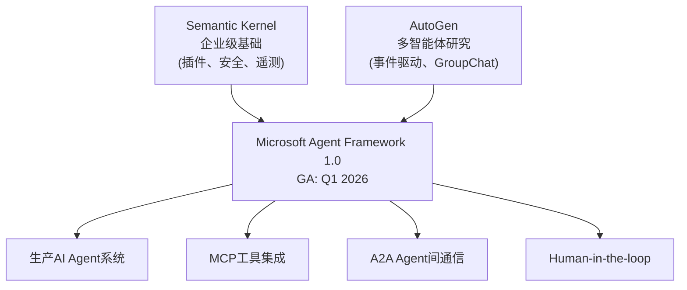
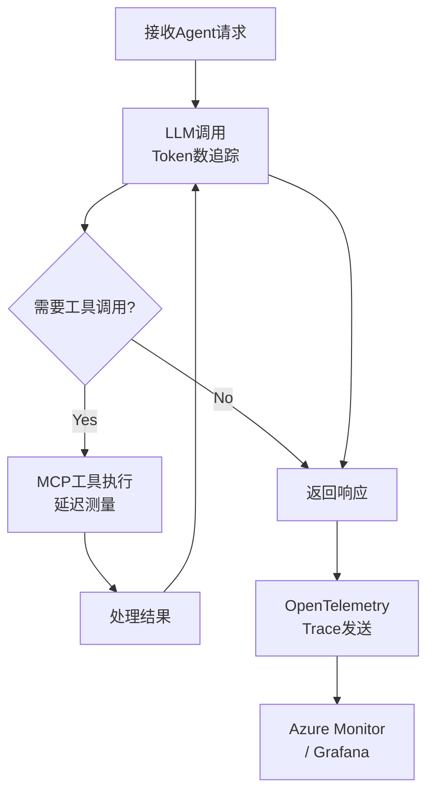
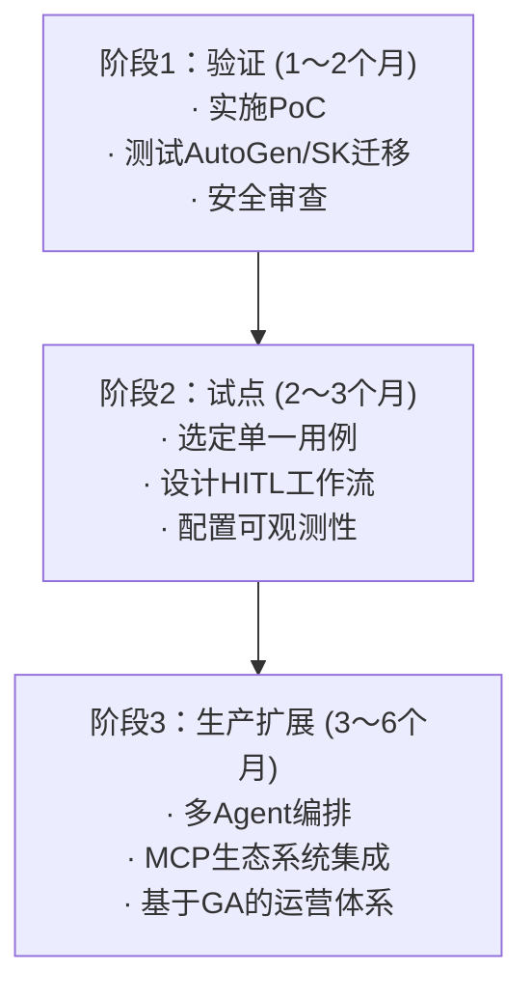

2026年3月，AI Agent框架市场最值得关注的整合行动已接近完成。Microsoft多年来分别发展的<strong>AutoGen</strong>与<strong>Semantic Kernel</strong>，已合并为同一个平台——<strong>Microsoft Agent Framework</strong>。2026年2月19日，RC（候选发布版）1.0正式推出，Q1 2026的GA（正式发布）指日可待。

本文将从Engineering Manager或CTO的视角，梳理这次整合意味着什么、现有团队应如何应对，以及如何规划生产环境落地路线图。

## 为何整合：框架分裂时代的终结

AutoGen与Semantic Kernel在Microsoft内部源自不同的设计哲学：

- <strong>AutoGen</strong>：由Microsoft Research主导，事件驱动型多智能体框架，强调Agent间异步对话。
- <strong>Semantic Kernel</strong>：由Azure AI团队主导，在插件模式与企业功能（遥测、安全、记忆）方面具有优势。

多年来，开发者社区一直在问"该用哪一个？"两个框架分裂了生态系统，企业不得不双倍投入人才和学习成本。Microsoft Agent Framework给出了明确答案：<strong>从今以后，只有一个。</strong>



## Microsoft Agent Framework核心功能

### 1. 基于图的工作流编排

与LangGraph类似，支持有状态（stateful）的基于图的工作流。可处理顺序执行、并行执行和条件分支，并通过<strong>检查点（checkpointing）</strong>实现长时间运行工作流的暂停与恢复。

```python
from microsoft.agents import AgentRuntime, Agent, tool
from microsoft.agents.workflows import SequentialWorkflow, ParallelWorkflow

# 定义基础Agent
@tool
def get_customer_data(customer_id: str) -> dict:
    """从CRM获取客户数据"""
    return crm_client.get(customer_id)

# 创建Agent
analyst = Agent(
    name="customer_analyst",
    instructions="分析客户数据并计算风险评分。",
    tools=[get_customer_data],
    model="gpt-4o"
)

# 配置工作流（顺序 + 并行）
workflow = SequentialWorkflow([
    analyst,
    ParallelWorkflow([risk_scorer, compliance_checker]),
    approval_agent  # Human-in-the-loop
])
```

### 2. 原生MCP与A2A协议支持

Microsoft Agent Framework从一开始就被设计为支持MCP（模型上下文协议）和A2A（Agent到Agent）协议。这意味着可以与HubSpot、Salesforce、Slack、Azure DevOps等数百个MCP服务器即时集成。

```python
from microsoft.agents.mcp import MCPToolServer

# 连接MCP服务器（例：GitHub MCP）
github_tools = MCPToolServer(
    name="github",
    transport="stdio",
    command=["npx", "@modelcontextprotocol/server-github"]
)

# 向Agent注入MCP工具
dev_agent = Agent(
    name="dev_assistant",
    instructions="负责代码审查和PR管理。",
    tools=[*github_tools.get_tools()],
    model="gpt-4o"
)
```

### 3. Human-in-the-loop（HITL）架构

企业环境中最重要的功能之一是<strong>审批工作流</strong>。Microsoft Agent Framework可以配置为在Agent执行超过特定阈值的操作之前，要求获得人工审批。

```python
from microsoft.agents.human import HumanApprovalInterrupt

# 为高风险操作添加Human-in-the-loop
@tool(requires_approval=lambda result: result.get("risk_score", 0) > 0.8)
def execute_transaction(amount: float, account: str) -> dict:
    """执行金融交易（风险评分超过0.8时需要审批）"""
    return finance_client.transact(amount, account)
```

### 4. 基于YAML的声明式Agent定义

用YAML而非代码定义Agent，可以大幅简化版本控制和团队协作。

```yaml
# agents/customer-support.yaml
name: customer_support_agent
instructions: |
  处理客户咨询，必要时升级至相应部门。
  回复必须友善且清晰。
model: gpt-4o
tools:
  - crm_lookup
  - ticket_create
  - email_send
escalation_policy:
  threshold: 3  # 3次解决失败后升级
  target: human_agent
```

### 5. 生产级可观测性

内置基于OpenTelemetry的完整遥测功能。所有Agent动作、工具调用和编排步骤均自动追踪。



## EM/CTO必知的战略要点

### 1. 已在使用AutoGen或Semantic Kernel的团队

Microsoft提供了清晰的迁移指南。两个框架都将继续提供v1.x安全补丁，但<strong>新功能仅在Microsoft Agent Framework中添加</strong>。建议在6〜12个月内完成迁移。

| 现有框架 | 主要变更 |
|---|---|
| Semantic Kernel | Plugin → Tool，Kernel → AgentRuntime |
| AutoGen | AssistantAgent → Agent，GroupChat → Workflow |
| 共同 | 向量存储集成保持不变 |

### 2. 全新起步的团队

对于深度投资Microsoft生态（Azure AI、Microsoft 365、Copilot Studio）的组织，Microsoft Agent Framework是<strong>最自然的选择</strong>。与Azure AI Foundry的完全集成、Entra ID身份验证和合规支持，是其他框架难以复现的企业级能力。

另一方面，基于AWS或GCP的组织，或Python原生团队，可能更适合LangGraph或CrewAI。<strong>选择应基于组织生态系统，而非单纯的技术栈。</strong>

### 3. Q1 2026 GA前的注意事项

从RC过渡到GA时，可能存在小的破坏性变更。生产部署建议推迟到GA官方发布之后。目前阶段适合用于<strong>概念验证（PoC）和内部实验。</strong>

### 4. 实际落地企业案例

Microsoft Agent Framework已被多家全球企业验证：

- <strong>毕马威（KPMG）</strong>：审计自动化 — Agent检测财务数据异常后，与HITL审批工作流联动
- <strong>宝马（BMW）</strong>：车辆遥测分析 — 多Agent并行处理传感器数据
- <strong>德国商业银行（Commerzbank）</strong>：客户支持自动化 — 通过MCP集成CRM/ERP
- <strong>富士通（Fujitsu）</strong>：企业IT运维自动化 — 基于声明式YAML的Agent编排

## 团队落地路线图（三阶段）



<strong>阶段1 — 验证（1〜2个月）</strong>：GA发布后立即实施简单的PoC。迁移现有AutoGen/SK代码以验证兼容性。与安全团队共同审查Azure AI Foundry集成和Entra ID连接。

<strong>阶段2 — 试点（2〜3个月）</strong>：选定一个具有可衡量业务影响的用例（例如：客户支持升级自动化）。定义HITL阈值，搭建OpenTelemetry仪表板。

<strong>阶段3 — 生产扩展</strong>：基于试点成果扩展多Agent架构。系统化MCP生态系统（CRM、ERP、BI工具）的集成。

## 总结

Microsoft Agent Framework不仅仅是一次框架升级，而是Microsoft在企业AI Agent市场宣布<strong>单一平台战略</strong>的明确信号。

如果您的团队正在使用AutoGen或Semantic Kernel，现在正是制定迁移计划的时机。对于全新起步的团队，Microsoft Agent Framework已成为Microsoft生态系统内事实上的默认选择。

重要的不是技术选型，而是<strong>将AI Agent能力内化到组织中</strong>。无论选择哪个框架，HITL设计、可观测性建设和渐进式发布的原则都同样适用。

## 参考资料

- [Microsoft Agent Framework官方公告 (Microsoft Foundry Blog)](https://devblogs.microsoft.com/foundry/introducing-microsoft-agent-framework-the-open-source-engine-for-agentic-ai-apps/)
- [Microsoft Agent Framework RC发布说明 (InfoQ)](https://www.infoq.com/news/2026/02/ms-agent-framework-rc/)
- [Semantic Kernel → Microsoft Agent Framework迁移指南](https://devblogs.microsoft.com/semantic-kernel/migrate-your-semantic-kernel-and-autogen-projects-to-microsoft-agent-framework-release-candidate/)
- [Microsoft Learn: Agent Framework Overview](https://learn.microsoft.com/en-us/agent-framework/overview/)
- [AutoGen GitHub Discussion #7066](https://github.com/microsoft/autogen/discussions/7066)
