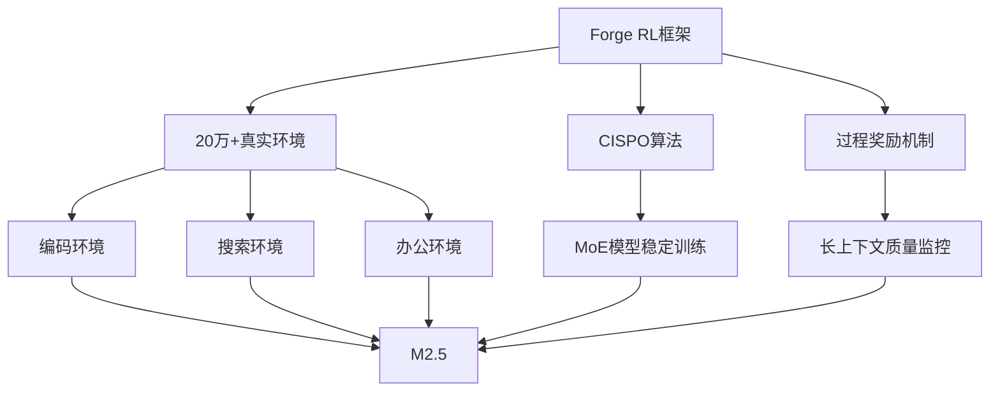
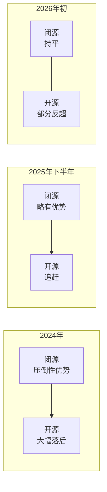

## 开源权重模型的反击已经开始

2026年2月，AI行业迎来了震撼消息。中国AI初创公司MiniMax发布的<strong>MiniMax M2.5</strong>在编码、智能体任务、搜索等多项基准测试中<strong>超越了闭源模型的分数</strong>。

该消息在Reddit r/LocalLLaMA上获得了362分以上的关注，"开源权重模型终于追上了闭源模型"的讨论日趋活跃。本文将详细分析M2.5的具体性能数据以及开源vs闭源模型的格局变化。

## MiniMax M2.5 主要规格

MiniMax M2.5是一个229B参数的开源权重模型，可从HuggingFace自由下载。

- <strong>参数量</strong>：229B（MoE架构）
- <strong>训练方式</strong>：在20万+真实环境中进行强化学习（RL）
- <strong>推理速度</strong>：100 tokens/秒（Lightning版本）
- <strong>支持语言</strong>：Go、C、C++、TypeScript、Rust、Python、Java等10+种
- <strong>部署支持</strong>：SGLang、vLLM、Transformers、KTransformers

## 基准测试对比：与闭源模型的差距几乎为零

### SWE-Bench Verified（编码）

SWE-Bench Verified衡量解决真实GitHub Issue的能力。

| 模型 | 得分 | 类型 |
|------|------|------|
| <strong>MiniMax M2.5</strong> | <strong>80.2%</strong> | 开源权重 |
| Claude Opus 4.6 | — | 闭源 |
| MiniMax M2.1 | — | 开源权重 |

不同Agent harness下的测试结果同样引人注目：

- <strong>Droid harness</strong>：M2.5（79.7%）> Opus 4.6（78.9%）
- <strong>OpenCode harness</strong>：M2.5（76.1%）> Opus 4.6（75.9%）

在所有环境中，开源权重模型都<strong>以微弱优势领先</strong>闭源模型——这是历史性的结果。

### Multi-SWE-Bench（多仓库）

在跨多个仓库的任务中达到<strong>51.3%</strong>，在更复杂的实际场景中也展现了优秀的性能。

### BrowseComp（搜索与工具使用）

在衡量网页搜索和工具调用能力的BrowseComp上，M2.5以<strong>76.3%</strong>（含上下文管理）达到行业领先水平。

## 成本革命：不仅是性能，价格上也占据压倒性优势

M2.5的冲击不仅在于性能，<strong>性价比</strong>更是完全不同的级别。

| 项目 | M2.5 Lightning | M2.5 Standard |
|------|---------------|---------------|
| 输入价格 | $0.3/百万tokens | $0.15/百万tokens |
| 输出价格 | $2.4/百万tokens | $1.2/百万tokens |
| 推理速度 | 100 TPS | 50 TPS |
| 1小时连续运行成本 | $1.0 | $0.3 |

与Claude Opus、Gemini 3 Pro、GPT-5相比，输出token单价仅为<strong>十分之一到二十分之一</strong>。

## M2.5为何能如此快速进化

### 大规模强化学习（RL Scaling）

MiniMax自主开发了名为<strong>Forge</strong>的Agent原生RL框架。

关键技术亮点：

- <strong>异步调度优化</strong>：平衡系统吞吐量与样本离策略程度
- <strong>树结构合并策略</strong>：训练样本合并实现约<strong>40倍训练加速</strong>
- <strong>CISPO算法</strong>：确保MoE模型大规模训练的稳定性
- <strong>过程奖励</strong>：解决Agent rollout长上下文中的信用分配问题

### Spec-Writing能力的涌现

M2.5的一个显著特点是，<strong>在编写代码之前像架构师一样进行设计和规划的能力</strong>在训练过程中自然涌现。模型会主动分解和规划项目的功能、结构和UI设计，然后再开始编码。

## 开源vs闭源格局的变化

### 历史性转折点

此前，AI行业有一个不言自明的共识："最强性能的模型永远是闭源的"。然而M2.5的出现正在改变这一局面。

### 对企业的意义

1. <strong>避免厂商锁定</strong>：如果开源权重模型能提供前沿性能，就可以减少对特定API供应商的依赖
2. <strong>定制自由</strong>：可以用自有数据进行微调和领域特化
3. <strong>成本优化</strong>：通过自托管控制成本；即使使用M2.5的API也只需1/10~1/20的成本
4. <strong>数据隐私</strong>：无需将敏感数据发送给外部供应商

## M2系列的快速进化

仅3.5个月（2025年10月底至2026年2月），MiniMax就发布了M2、M2.1、M2.5三代产品。

| 版本 | 发布时间 | SWE-Bench改进 | 亮点 |
|------|---------|--------------|------|
| M2 | 2025年10月底 | 基线 | HuggingFace 450K下载 |
| M2.1 | 2025年12月 | 大幅改进 | 86.7K下载 |
| M2.5 | 2026年2月 | 80.2% SOTA | 37%加速，成本1/10 |

## 内部实际应用

MiniMax在自身组织中积极使用M2.5：

- <strong>全公司30%的任务</strong>由M2.5自主完成
- 覆盖研发、产品、销售、人力资源和财务
- <strong>80%的新提交代码</strong>由M2.5生成

## 总结：三个关键要点

1. <strong>性能差距消失</strong>：开源权重模型在SWE-Bench上超越了闭源模型。这不是偶然现象，而是结构性变革的开始

2. <strong>成本革命</strong>：M2.5以Opus十分之一到二十分之一的成本提供同等甚至更优的性能。"不用担心成本的前沿模型"已经成为现实

3. <strong>选择扩大</strong>：企业不再需要默认选择闭源模型。通过开源权重模型实现自托管、定制和成本优化已成为实际可行的选项

## 参考资料

- [MiniMax M2.5 - HuggingFace](https://huggingface.co/MiniMaxAI/MiniMax-M2.5)
- [MiniMax Agent](https://agent.minimax.io/)
- [MiniMax API Platform](https://platform.minimax.io/)
- [Reddit r/LocalLLaMA Discussion](https://www.reddit.com/r/LocalLLaMA/)
