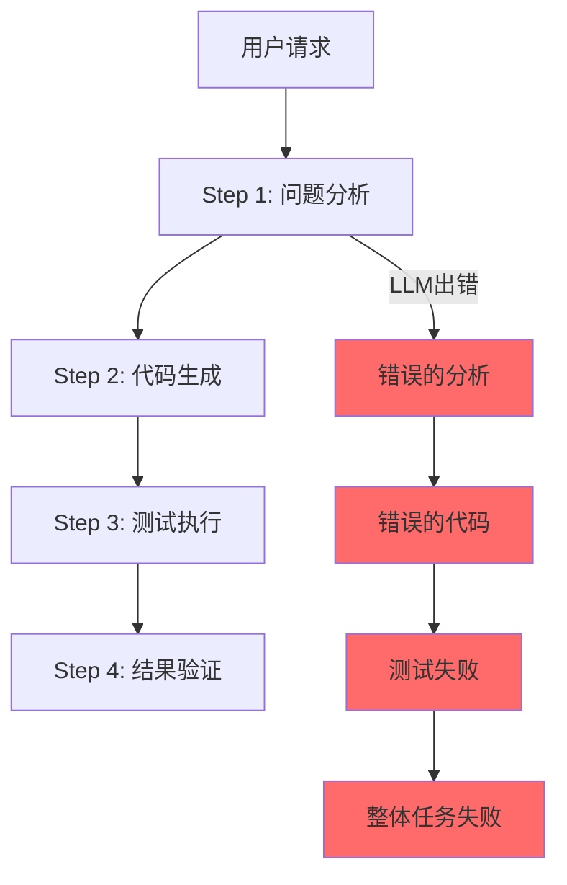
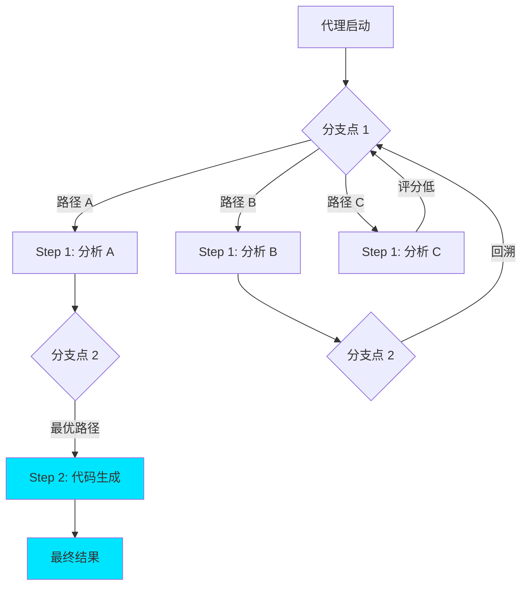
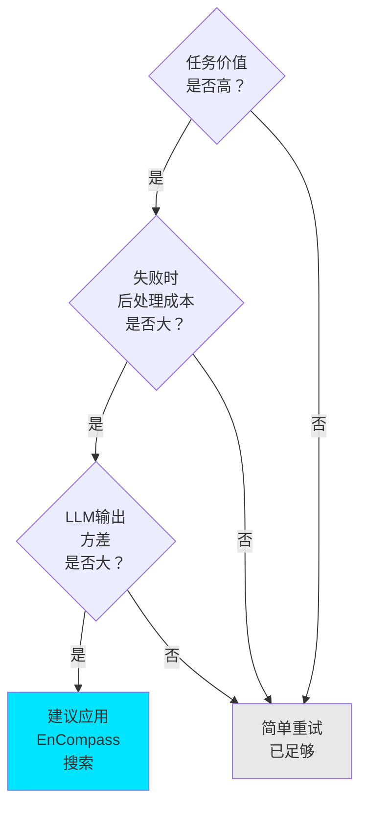

## 概述

2026年，AI代理在生产环境中承担越来越多的任务，但<strong>可靠性</strong>这一根本性问题仍然没有得到解决。基于LLM的代理本质上是概率性的，因此即使执行相同的任务，每次也可能产生不同的结果，而且一个阶段的错误会级联影响所有后续工作。

由MIT CSAIL和Asari AI开发的<strong>EnCompass</strong>框架为这个问题提出了一种根本上不同的解决方案。它将<strong>搜索算法</strong>（波束搜索、蒙特卡洛树搜索等）集成到代理程序的执行路径中，使代理在出错时能够自动回溯并探索更好的路径。因此实现了<strong>15〜40%的准确率提升</strong>，而所需的代码实现反而减少了82%。

本文分析了EnCompass的核心概念、运作原理，以及从工程管理角度的实际应用策略。

## AI代理可靠性问题的本质

### 代理为什么会失败

基于LLM的AI代理在生产中失败的核心原因是<strong>错误的级联传播</strong>。



传统的代理系统只遵循<strong>单一执行路径</strong>。如果Step 1中的LLM做出错误判断，之后的所有步骤都会建立在这个错误判断之上。即使加入重试逻辑，也经常会在相同的上下文中重复相同的错误。

### 现有方法的局限性

当前业界使用的代理可靠性策略：

| 策略 | 优势 | 局限 |
|------|------|------|
| 简单重试 | 实现简单 | 可能重复同一错误 |
| 思维链 | 提升推理质量 | 无法纠正错误的推理链 |
| 自我验证 | 能够检测错误 | 无法探索替代路径 |
| 多代理 | 多视角考虑 | 协调成本高 |

所有这些方法的共同限制是<strong>无法脱离已选择的路径</strong>。

## EnCompass：基于搜索的代理执行

### 核心理念——"选择你自己的冒险"

EnCompass的核心理念惊人地直观。如果将代理程序的执行比作<strong>"故事"</strong>：

- <strong>传统方式</strong>：遵循单一情节的小说
- <strong>EnCompass方式</strong>：在每个分支点都有选择的"游戏书（选择你自己的冒险）"

开发者在代理代码的特定位置添加<strong>"分支点(branchpoint)"</strong>注解。EnCompass会在这些分支点探索多个可能的LLM输出，并自动选择产生最佳结果的路径。



### 运作原理

EnCompass的运作分为3个阶段。

<strong>阶段1：定义分支点</strong>

开发者在代理代码中LLM调用发生的位置标记分支点。这是在声明"LLM的输出在此可能会有所不同，这种差异会影响最终结果"。

<strong>阶段2：定义评估函数</strong>

定义一个函数来评估每个阶段的结果有多好。例如，对于编码代理，"测试通过率"可能成为评估函数。

<strong>阶段3：选择搜索策略</strong>

EnCompass支持多种搜索策略：

- <strong>波束搜索</strong>：在每个分支点仅保留前N个路径继续进行
- <strong>蒙特卡洛树搜索 (MCTS)</strong>：结合随机探索和经验驱动探索
- <strong>自定义策略</strong>：可以实现适合特定领域的定制搜索策略

### 代码级实现模式

使用EnCompass的代理代码的概念结构：

```python
# 传统代理代码（单一路径）
def coding_agent(task):
    analysis = llm.analyze(task)       # LLM调用 1
    code = llm.generate_code(analysis) # LLM调用 2
    result = run_tests(code)           # 评估
    return result

# 应用EnCompass的代码（基于搜索）
def coding_agent_with_search(task):
    @branchpoint                        # 分支点注解
    analysis = llm.analyze(task)

    @branchpoint
    code = llm.generate_code(analysis)

    @evaluate                           # 评估函数
    score = run_tests(code)

    return code, score

# 应用搜索策略
result = encompass.search(
    agent=coding_agent_with_search,
    strategy=BeamSearch(beam_width=4),
    budget=16  # 最多16倍的LLM调用
)
```

关键在于<strong>基本上不需要修改现有代理逻辑</strong>，只需添加注解即可。根据MIT研究团队的说法，与手动实现搜索相比，<strong>可以节省348行代码（约82%）</strong>。

## 性能分析

### 量化结果

EnCompass论文报告的主要成果：

| 指标 | 数值 |
|--------|------|
| 准确率提升 | 15〜40% （基于5个代码库） |
| 代码减少 | 82% （减少348行） |
| 搜索预算 | 相比基础代理16倍的LLM调用 |
| 最优策略 | 2层波束搜索 |

<strong>值得注意的是</strong>"2层波束搜索"被证实为最优策略。这意味着<strong>结构化搜索策略比简单随机尝试更有效</strong>。

### 成本效益分析

搜索预算是16倍意味着LLM API调用成本也是16倍。让我们判断这在实际中是否合理：

```
基础代理执行成本：  $0.50/任务 (示例)
EnCompass应用成本： $8.00/任务 (16x)

基础代理成功率：   60%
EnCompass成功率：  85% (+25%p)

单位成功成本：
  基础：     $0.50 / 0.60 = $0.83/成功
  EnCompass: $8.00 / 0.85 = $9.41/成功
```

单纯从成本看，EnCompass更贵，但如果计入<strong>失败任务的后处理成本</strong>（人工修复、重做、质量问题），情况就不同了。特别是对于高价值任务（代码审查、安全分析等），准确率提升的价值足以抵消额外成本。

## 实际应用策略

### 工程经理视角的部署指南

在实际应用EnCompass的概念时需要考虑的事项总结如下。

<strong>1. 应用目标选择</strong>

并非所有代理任务都需要应用搜索。按以下标准进行筛选：



<strong>2. 逐步部署路线图</strong>

| 阶段 | 时间 | 目标 | 搜索预算 |
|------|------|------|-----------|
| 概念验证 | 2周 | 在单个任务上应用，测量效果 | 4x |
| 试点 | 1个月 | 在团队内应用2〜3个工作流 | 8x |
| 扩展 | 3个月 | 在关键生产工作流中应用 | 16x |
| 优化 | 持续 | 成本优化，开发定制策略 | 动态调整 |

<strong>3. 评估函数设计是关键</strong>

EnCompass的效果在很大程度上取决于<strong>评估函数的质量</strong>。好的评估函数的条件：

- 必须能自动化（无需人工介入即可得出分数）
- 执行速度快（在搜索循环中被调用数千次）
- 与最终质量的相关性高

示例：
- 编码代理：测试通过率、棉绒警告数
- 文档生成代理：结构完整度、关键词覆盖率
- 数据分析代理：结果一致性、统计显著性

### 2026年代理可靠性生态系统

除了EnCompass，还有其他多个提升代理可靠性的举措：

- <strong>Agent Definition Language (ADL)</strong>：Moca开源的代理定义标准。以声明方式定义代理的权限、工具和安全边界，确保治理
- <strong>OpenAI Open Responses</strong>：通过标准化代理AI工作流来简化模型间的切换
- <strong>GitHub代理工作流</strong>：用Markdown描述自动化目标，AI生成GitHub Actions工作流

这些举措的共同方向是<strong>"使代理更具可预测性和可控性"</strong>。

## 结论

MIT EnCompass为AI代理可靠性问题提供了<strong>根本性且实用的解决方案</strong>。核心见解总结如下：

1. <strong>搜索是代理的"安全网"</strong>：即使LLM出错，也可以通过回溯和替代探索来恢复
2. <strong>结构化搜索比随机重试更有效</strong>：2层波束搜索是最优策略
3. <strong>代码减少82%</strong>：相比直接实现搜索逻辑，极其便捷
4. <strong>成本与价值权衡</strong>：对于高价值任务，16倍成本也是合理的

作为工程经理，最重要的启示是<strong>"AI代理的性能不仅是模型本身的问题，更是系统框架(harness)的问题"</strong>。即使使用相同的LLM，根据采用的执行策略不同，结果也会大幅不同。

如果正在运营生产AI代理，与其等待更好的模型出现，不如<strong>直接改进执行策略本身</strong>，这样可以更快、更确定地取得成果。

## 参考资料

- [MIT CSAIL - Helping AI agents search to get the best results out of large language models](https://news.mit.edu/2026/helping-ai-agents-search-to-get-best-results-from-llms-0205)
- [EnCompass: Enhancing Agent Programming with Search Over Program Execution Paths (arXiv)](https://arxiv.org/pdf/2512.03571)
- [When agents backtrack, AI starts to scale](https://www.insights.onegiantleap.com/when-agents-backtrack-ai-starts-to-scale/)
- [Next Moca - Agent Definition Language (ADL)](https://www.nextmoca.com/blogs/agent-definition-language-adl-the-open-source-standard-for-defining-ai-agents)
- [GitHub Agentic Workflows (Technical Preview)](https://github.blog/changelog/2026-02-13-github-agentic-workflows-are-now-in-technical-preview/)
