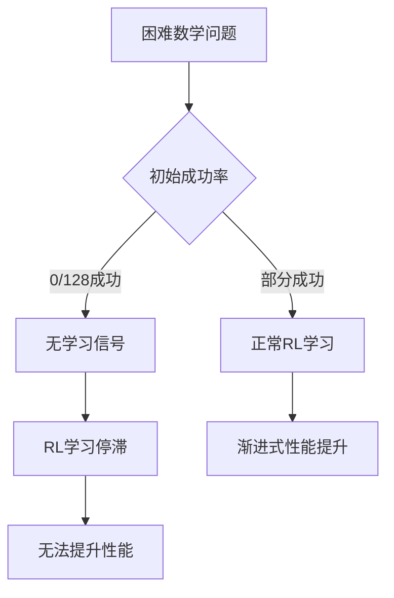
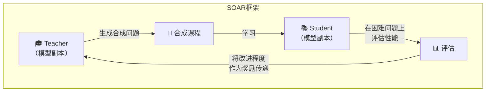
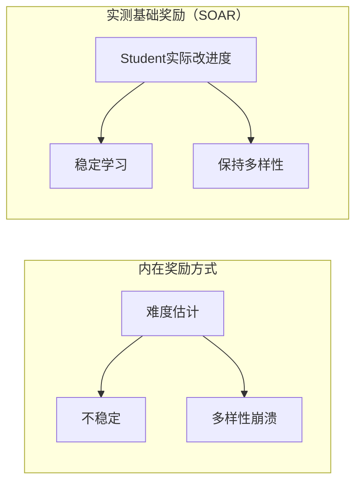

## 概述

近年来，通过强化学习（RL）微调来增强大语言模型（LLM）的推理能力备受关注。然而，在<strong>初始成功率极低的困难问题</strong>上，几乎没有学习信号，导致RL训练陷入停滞（plateau），这是一个根本性的局限。

MIT研究团队（Shobhita Sundaram等）发表的论文<strong>"Teaching Models to Teach Themselves: Reasoning at the Edge of Learnability"</strong>为这一问题提供了创新性的解决方案。这就是<strong>SOAR（Self-improvement through Open-ended Automated Reasoning）</strong>——一个让LLM自主生成学习课程、逐步攻克无法解决的问题的框架。

## 核心问题：RL学习的停滞现象

传统LLM推理强化学习的最大问题如下：

在数学基准测试最难的子集上，即使尝试128次也无一成功，模型就完全无法获得关于对错的反馈。这就是在<strong>可学习性边界（Edge of Learnability）</strong>上发生的根本问题。

## SOAR框架的核心结构

SOAR是基于<strong>元强化学习（Meta-RL）</strong>的自我改进框架，采用Teacher-Student架构。

### 步骤1：Teacher生成合成问题

Teacher模型（原始LLM的副本）生成中等难度的问题，作为Student当前无法解决的困难问题的<strong>垫脚石（stepping stones）</strong>。

### 步骤2：Student通过合成问题学习

Student模型使用Teacher生成的课程进行RL训练，逐步培养解决更难问题的能力。

### 步骤3：在实际困难问题上评估

在原本无法解决的<strong>少量困难问题集</strong>上测量Student的性能。

### 步骤4：根据测量的改进度奖励Teacher

这是核心差异化要点。Teacher接收<strong>Student的实际改进程度</strong>作为奖励（reward）。这与传统的内在（intrinsic）奖励方式有根本区别。

## 三大核心发现

### 发现1：双层元强化学习的可行性

SOAR证明，预训练模型所具备的<strong>潜在能力（latent capacity）</strong>可以在稀疏二值奖励（sparse binary rewards）环境下生成有用的垫脚石问题。即使模型不能直接解决困难问题，它仍然保持着设计通往这些问题的学习路径的能力。

### 发现2：实测奖励全面超越内在奖励

以往LLM自我对弈研究中使用的<strong>内在奖励（intrinsic rewards）</strong>经常导致不稳定性和多样性崩溃（diversity collapse）。相比之下，SOAR的<strong>实测基础奖励（grounded rewards）</strong>通过测量Student的实际进展，稳定地避免了这些问题。

### 发现3：结构质量比答案正确性更重要

对生成的合成问题进行分析后发现，对学习效果影响最大的是<strong>问题的结构质量和良好定义性（well-posedness）</strong>。令人惊讶的是，问题本身的结构比答案的正确性更为重要。

这是一个直观而深刻的启示：<strong>创造好问题的能力与知道正确答案的能力是独立的</strong>。

## 实践意义与未来展望

### 无需额外数据即可突破推理停滞

SOAR最大的意义在于，它提供了一条<strong>无需额外策划数据</strong>就能让模型自主突破学习停滞的原理性路径。这具有解决数据收集和标注巨大成本问题的潜力。

### 教育学视角下的AI学习

SOAR成功地将人类教育中的<strong>脚手架（scaffolding）</strong>概念应用于AI训练。就像学习者通过略高于当前水平的问题（最近发展区，ZPD）成长一样，LLM也通过自生成的渐进式问题扩展能力。

### 自我进化AI系统的可能性

这项研究开启了AI在没有外部人类监督的情况下<strong>自主设计和执行学习课程（autonomous self-improvement）</strong>的可能性。虽然从安全角度需要谨慎对待，但技术可行性已被明确证明。

## 结论

MIT的SOAR框架优雅地解决了LLM推理增强的核心瓶颈——困难问题上学习信号的缺失。Teacher-Student架构与实测基础奖励的结合克服了传统自我对弈方式的不稳定性问题，并在实验中证明了"创造好问题的能力"与"知道答案的能力"是相互独立的。

随着这种方法从数学扩展到编程、科学推理等其他领域，<strong>自我教学的AI</strong>新范式将由此开启。

## 参考资料

- [Teaching Models to Teach Themselves: Reasoning at the Edge of Learnability（arXiv, 2026）](https://arxiv.org/search/?query=%22Teaching+Models+to+Teach+Themselves%22&searchtype=all)
- [Chris Laub的X帖子 — SOAR解析](https://x.com/ChrisLaubAI/status/2020789996622664023)
