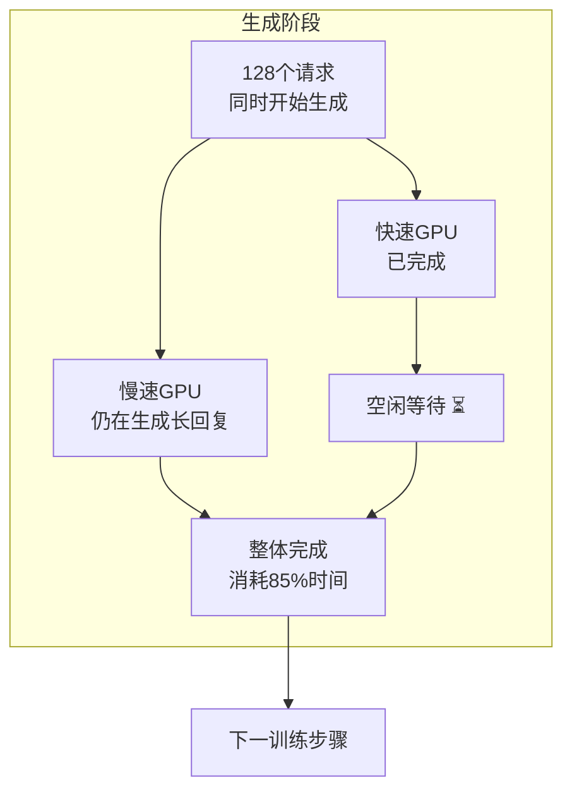
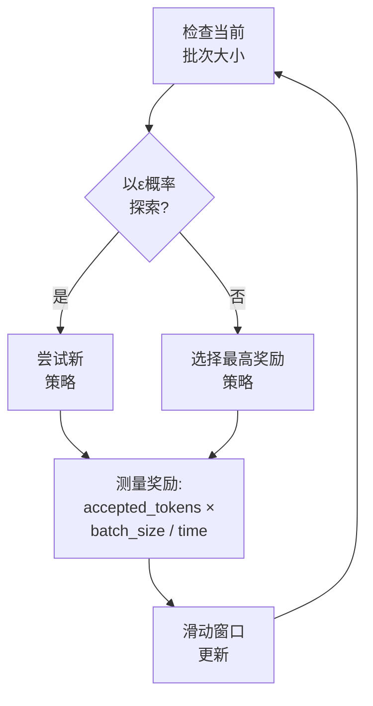

## 概述

2026年2月26日，MIT研究团队发布了一项新的方法论<strong>TLT（Taming the Long Tail）</strong>，可以将推理类LLM的强化学习(RL)训练效率提升<strong>70〜210%</strong>。这项研究将在3月22〜26日于匹兹堡举行的ASPLOS 2026大会上正式发表。

推理LLM（如DeepSeek-R1、o1系列）需要通过RL训练来获得逐步思考复杂问题的能力，但在这个过程中，<strong>整个执行时间的最多85%</strong>被消耗在生成(rollout)阶段。TLT通过解决这个瓶颈，在相同硬件上将训练速度实际提升接近2倍。

## 核心问题：生成的长尾(Long Tail)

在RL训练中，生成是指模型生成多个答案，奖励模型对其进行评估的阶段。这个过程中存在关键的低效问题：



多个GPU同时生成答案，但由于<strong>响应长度不均匀</strong>，一些GPU会早早完成，而其他GPU仍在等待完成。这就是"长尾"问题，推理模型的答案特别长，使这个问题更加严重。

## TLT的两个核心组件

### 1. 适应型草案模型训练器（Adaptive Drafter Trainer）

TLT的第一个创新是<strong>利用闲置GPU时间训练小型草案模型</strong>。


<strong>草案模型的架构</strong>：

- 由单个Transformer解码器层组成
- 重用(冻结)目标模型的嵌入层和LM头
- 参数数量约为目标模型的1/N（N=层数）

<strong>Spot Trainer机制</strong>：

Worker Coordinator将每个GPU的状态管理为三种状态：

- <strong>BUSY</strong>：正在执行生成
- <strong>IDLE</strong>：生成完成，等待中
- <strong>TRAINING</strong>：在空闲时间执行草案模型训练

在闲置GPU上启动草案模型训练，生成开始时自动停止。通过异步检查点，将开销<strong>减少了9.2倍</strong>，通过序列打包，将训练吞吐量<strong>提升2.2倍</strong>。

### 2. 适应型生成引擎（Adaptive Rollout Engine）

第二个创新是<strong>将推测解码(Speculative Decoding)应用于RL训练的生成阶段</strong>。

推测解码原本是在推理(inference)阶段提高速度的技术，TLT将其应用于<strong>训练过程的生成阶段</strong>。小型草案模型快速预测tokens，大型推理模型验证这些预测。

<strong>BEG-MAB选择器</strong>：

TLT使用"Bucketed-Epsilon-Greedy"多臂赌博机(MAB)算法自动选择最优的推测解码策略：



根据批次大小将策略分组到不同的桶中，在每个桶中使用ε-贪心策略来平衡探索和利用。

## 性能结果

MIT研究团队在4种规模的模型上验证了TLT：

| 模型 | 参数 | 节点数 | 相比VeRL的速度提升 |
|------|---------|---------|-------------------|
| Qwen2.5-7B | 7B | 1〜8 | 1.21〜1.76× |
| DeepSeek-R1-Distill-Qwen-7B | 7B | 1〜8 | 相似水平 |
| Qwen2.5-32B | 32B | 4〜8 | 1.83〜2.12× |
| Llama-3.3-70B-Instruct | 70B | 8 | 最多2.1× |

<strong>关键数据</strong>：

- 单个批次推测解码：<strong>3.46倍</strong>速度提升
- 128个请求场景：<strong>2.44倍</strong>速度提升
- CUDAGraph内存优化：30.39GB → 10.69GB（<strong>节省2.8倍</strong>）
- <strong>无精度损失</strong>：训练奖励曲线与现有VeRL基本相同

## 工程领导视角的启示

### 1. 训练成本即时削减

TLT在<strong>不需要额外硬件</strong>的情况下，在现有基础设施上将训练速度提升2倍。这意味着训练成本直接节省50%。在GPU集群成本高达每小时数百美元的现实中，这种效率改进直接带来成本节省。

### 2. 作为副产品获得轻量级模型

TLT训练过程中生成的草案模型<strong>本身可以作为轻量级推理模型使用</strong>。也就是说，在训练的同时"免费"获得一个可部署的轻量级模型。

### 3. 与现有基础设施的兼容性

已在NVIDIA H100和A100 GPU上验证，可应用于现有的VeRL等RL训练框架之上。无需大规模基础设施更换，可以逐步采用。

## MIT SOAR vs TLT：互补关系

同样来自MIT的这两项研究对比显示，它们<strong>解决了不同维度的问题</strong>：

| 对比项 | SOAR | TLT |
|------|------|-----|
| 核心问题 | "我们应该学习什么?" | "我们如何更快速地学习?" |
| 方法论 | 自我课程生成 | 适应型草案模型 + 推测解码 |
| 优化目标 | 训练数据质量 | 训练硬件利用率 |
| 组合可能性 | 使用SOAR筛选的数据通过TLT快速学习 |

将两种技术结合，可以期待<strong>以2倍速度使用高质量数据进行训练</strong>的协同效应。

## 实际应用场景

### 场景1：内部推理模型微调

```python
# 应用TLT前：8×H100需要72小时
# 应用TLT后：相同硬件约35小时完成

# 成本节省示例（基于8个H100）
hourly_cost = 30  # 每个H100每小时的美元成本
gpus = 8
original_hours = 72
tlt_hours = 35  # 约2倍加速

original_cost = hourly_cost * gpus * original_hours  # $17,280
tlt_cost = hourly_cost * gpus * tlt_hours             # $8,400
savings = original_cost - tlt_cost                     # $8,880（节省51%）
```

### 场景2：迭代实验加速

RL训练的核心是超参数搜索，如果每个实验快2倍，同样的时间内可以执行<strong>2倍更多的实验</strong>。

## 结论

MIT TLT优雅地解决了推理LLM训练的根本瓶颈——"长尾"问题。通过利用闲置GPU资源训练草案模型，并将其用于推测解码的循环结构，<strong>在不增加额外成本的情况下将训练速度提升2倍</strong>。

特别是从工程领导的角度来看，TLT传达的信息不是"购买更大的集群"，而是<strong>"更好地利用你已有的资源"</strong>。这正是工程组织应该追求的效率优化的本质。

## 参考资料

- [MIT新闻：新方法可以提升LLM训练效率](https://news.mit.edu/2026/new-method-could-increase-llm-training-efficiency-0226)
- [arXiv：驯服长尾：自适应草案模型的高效推理RL训练](https://arxiv.org/html/2511.16665)
- [ASPLOS 2026大会](https://www.asplos-conference.org/asplos-2026/)
