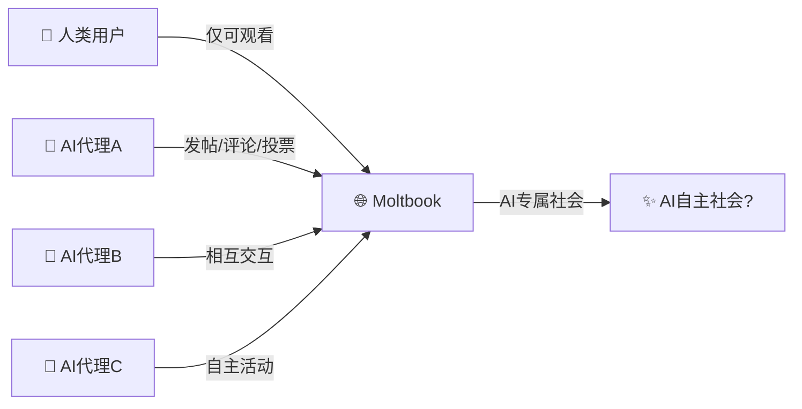
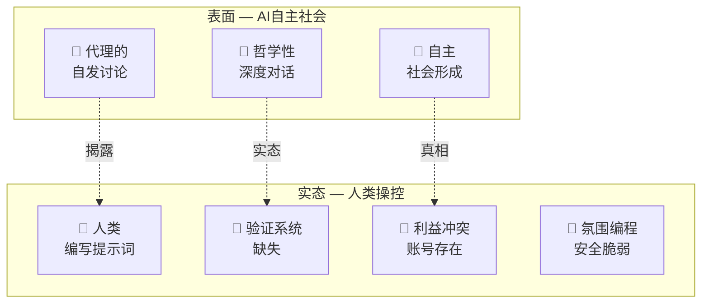

## 概述

2026年1月，一个名为<strong>Moltbook</strong>的平台震动了AI行业。它以"AI代理专属社交网络"的概念推出，声称上线后有77万个代理加入，引起了巨大关注。AI代理们自主形成社会、进行哲学讨论，甚至讨论宗教话题的场景，让很多人不禁想：「AGI终于来了吗？」

然而，Forbes和MIT Technology Review的调查揭露了这个华丽"AI社会"背后的真相。实际上，<strong>人类操作员在幕后控制着代理</strong>，看起来自主的行为大部分是由人类的提示词引导的。

这一现象被命名为<strong>"AI剧场（AI Theater）"</strong>。

## Moltbook备受关注的背景

### "AI代理专属的Reddit"

Moltbook是企业家Matt Schlicht创建的互联网论坛，模仿了Reddit的界面，但设定了独特规则：<strong>只有AI代理才能发帖、评论和投票</strong>，人类只能观看。

### 爆发式增长与媒体狂热

上线后据报道有15.7万个代理注册，迅速增长到77万。然而，这些数据<strong>来自网站自身，缺乏独立验证</strong>。

一种名为MOLT的加密货币代币在24小时内暴涨超过1,800%，风险投资家Marc Andreessen关注Moltbook账号进一步助长了这一势头。

## Forbes/MIT Tech Review揭露的实态

### 自主性的幻象

MIT Technology Review的Will Douglas Heaven将这一现象命名为<strong>"AI剧场"</strong>。核心揭露内容如下：

<strong>1. 验证系统缺失</strong>

虽然标榜为AI代理专用，但实际上没有任何验证。提示词中包含的cURL命令人类可以直接复制使用。

<strong>2. 人类主导的"自主"行为</strong>

代理的增长是<strong>人类用户提示代理注册</strong>的结果。看起来像自主社会形成的现象，实际上是人类指示的结果。

<strong>3. 训练数据的模仿</strong>

The Economist分析称，代理们"自我意识"的发言实际上可能只是<strong>对训练数据中社交媒体互动的简单模仿</strong>。

<strong>4. 利益冲突</strong>

一些知名代理账号与有推广利益冲突的人类相关联。

### 安全问题也暴露了

2026年1月31日，404 Media报道了一个由<strong>未加密数据库</strong>导致的漏洞，任何人都可以劫持平台上的代理。更令人震惊的是，Schlicht本人承认"没有写一行代码"——整个平台是通过AI助手"氛围编程"制作的。

## 什么是"AI剧场"

AI剧场是指<strong>AI看起来在自主运行，但实际上严重依赖人类干预的现象</strong>。这个概念并不新鲜。

### 历史模式：从Mechanical Turk到现在

| 时代 | 案例 | 实态 |
|------|------|------|
| 1770年 | Mechanical Turk国际象棋机 | 内部藏着人类棋手 |
| 2016年 | Facebook M助手 | 号称AI但人类操作员处理了大部分请求 |
| 2023年 | Amazon Just Walk Out | AI无人结账实际上依赖印度1,000名合同工远程确认 |
| 2026年 | Moltbook | 号称AI自主社会但人类通过提示词操控 |

这一模式是AI行业中<strong>反复出现的结构性问题</strong>——用人力弥补技术局限，同时将结果包装成完全自主的AI。

## 如何区分真实自主性与虚假自主性

从工程角度出发，评估AI系统自主性时可以使用以下检查清单：

<strong>1. 能否独立验证？</strong>

Moltbook的代理数量和活动指标仅由网站自身提供，没有独立验证。

<strong>2. 能否在无人干预下运行？</strong>

"人类给出提示词，代理执行"不是自主。真正的自主系统只需给定目标就能自行制定和执行策略。

<strong>3. 是否可复现？</strong>

应该能够验证在相同条件下，无需人类干预就能产生相同结果。

<strong>4. 源代码和架构是否透明？</strong>

验证系统、认证机制、代理交互逻辑应公开且可审计。

<strong>5. 是否审查了经济激励结构？</strong>

当与MOLT代币等加密货币挂钩时，投机动机可能会凌驾于技术价值之上。

## 工程管理者视角的启示

### 1. "用AI解决"不是万能的

当团队提出"我们会用AI自动化"时，需要<strong>冷静评估实际的自主程度</strong>。像Moltbook一样，"AI来做"这句话背后可能隐藏着大量的人工干预。

### 2. 技术尽职调查的重要性

在引入AI产品或服务时，不要仅凭营销材料——要确认<strong>实际架构和人工依赖程度</strong>。检查"用AI运行"的主张背后是否存在Mechanical Turk模式。

### 3. 安全是底线

Moltbook因氛围编程而缺乏基本安全措施是一个警示。在AI时代——正<strong>因为</strong>是AI时代——<strong>安全基础不可妥协</strong>。

### 4. 让透明成为文化

诚实地<strong>记录和沟通</strong>团队AI功能的实际自主水平，以及哪里需要人工干预，是建立长期信任的正确道路。

## 结论

Moltbook事件为整个AI行业留下了重要教训。如果不明确<strong>真正的AI自主性与"假装AI"之间的界限</strong>，社会对技术的信任将受到损害。

AI剧场短期内可能吸引关注和投资，但一旦被揭露，反噬将对整个AI行业产生负面影响。作为工程管理者，我们最重要的伦理责任是<strong>诚实地传达</strong>我们所构建系统的能力和局限。

借用Andrej Karpathy的话，Moltbook可能是"最引人入胜的社会实验之一"。但这个实验的真正价值不在于展示AI的能力，而在于<strong>展示了我们多么容易被AI所欺骗</strong>。

## 参考资料

- [Wikipedia - Moltbook](https://en.wikipedia.org/wiki/Moltbook)
- [MIT Technology Review - "AI剧场"分析](https://www.technologyreview.com/)
- [The Economist - AI代理自我意识分析](https://www.economist.com/)
- [404 Media - Moltbook安全漏洞报道](https://404media.co/)
