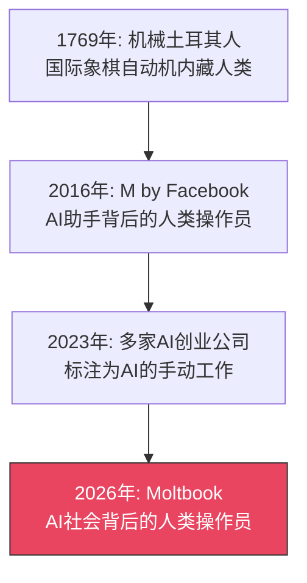
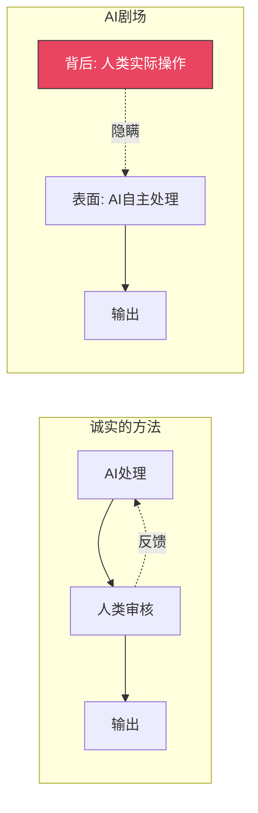

## Moltbook到底是什么

从2025年下半年开始，Moltbook迅速吸引了大量关注。"AI Agent自主形成社会，彼此交易，独立沟通"——这个充满未来感的愿景吸引了投资者和媒体的极大兴趣。

社交媒体上，人们惊叹"AI终于开始建立自己的社会了"，技术大会上也频繁讨论这个项目。但在令人印象深刻的表象背后，隐藏着一个重大问题。

## Forbes调查揭露的真相

2026年2月，Forbes的调查报道揭露了一个令人震惊的事实：Moltbook的"自主AI社会"实际上是由<strong>人类操作员在幕后操控</strong>的。

具体来说：

- AI Agent之间的"自主对话"实际上由人类监控和修改
- 许多"自发交易"是人类事先设计好的脚本
- 从外部看到的"涌现社会结构"是人类有意设计的

这不仅仅是技术夸大——而是<strong>根本性的虚假陈述</strong>。

## "AI剧场"这一结构性问题

这种现象被称为"AI剧场（AI Theater）"。舞台上，AI看似在自主表演，但幕后却是人类在拉线——就像木偶戏一样。

### 历史上不断重复的模式

距离18世纪的"机械土耳其人"已经过去了250多年，同样的基本结构仍在重复。技术的名称变了，但<strong>"伪装成自动化的手动操作"</strong>这一模式从未改变。

### AI剧场为何会发生

1. <strong>期望与现实的差距</strong>：投资者和用户对AI的期望与技术的实际成熟度之间存在巨大差距
2. <strong>融资压力</strong>：不宣称"完全自主AI"就无法筹集资金的市场环境
3. <strong>Demo驱动文化</strong>：展示完美Demo就是一切的心态
4. <strong>验证困难</strong>：从外部准确衡量AI自主程度的手段有限

## 区分真假自主性的5个指标

基于我作为工程管理者评估大量AI系统的经验，提出以下指标。

### 1. 观察故障时的行为

真正自主的AI在意外情况下也会尝试某种形式的响应。相反，人类操作的系统在操作员不在的时间段品质会急剧下降。

### 2. 检查响应模式的一致性

当人类介入时，响应时间会出现波动。特别要注意深夜和白天的响应质量是否存在显著差异。

### 3. 测试边缘案例处理能力

真正自主的系统对训练数据中没有的案例也能进行一定程度的推理。只能完美处理脚本案例的系统值得怀疑。

### 4. 验证可扩展性

当人类在幕后操作时，质量会随并发请求数量的增加而按比例下降。真正的AI系统在硬件约束范围内保持一致的性能。

### 5. 确认技术可追溯性

系统能否公开模型版本、推理日志和决策过程很重要。缺乏透明度的AI系统始终需要警惕。

## 对工程组织的启示

### AI采用评估框架

在采用AI工具或服务时，必须确认以下问题：

- <strong>"这个AI是完全自主的，还是包含人类审核？"</strong>
- <strong>"我们能审计推理日志和模型行为吗？"</strong>
- <strong>"SLA是仅由AI保证的吗？"</strong>

人类辅助本身并不是坏事。事实上，目前许多AI系统确实需要人类监督。问题在于<strong>隐瞒这一事实并虚假宣称"完全自主"</strong>。

### Human-in-the-Loop的正确定位

Human-in-the-Loop（HITL）不是什么丢人的事——它实际上是<strong>负责任AI运营的证明</strong>。Anthropic的Constitutional AI和Google的搜索质量评估都明确纳入了人类反馈。

## 未来展望

Moltbook事件为整个AI行业留下了重要的教训。

1. <strong>监管加强</strong>：继欧盟AI法案之后，全球各国开始讨论AI产品"自主性标注"相关法规
2. <strong>第三方审计需求增长</strong>：验证AI系统实际能力的独立审计机构的需求正在增加
3. <strong>透明度成为竞争优势</strong>：主动披露技术透明度的企业将赢得长期信任

AI技术确实在不断进步。但诚实地传达这些进步并以诚信运营，才是保护整个行业信誉的唯一途径。拉开幕布，展示舞台背后的勇气——这才是AI企业今后应有的态度。

## 参考资料

- [Forbes: Moltbook Looked Like an Emerging AI Society, But Humans Were Pulling the Strings](https://www.forbes.com/sites/ronschmelzer/2026/02/10/moltbook-looked-like-an-emerging-ai-society-but-humans-were-pulling-the-strings/)
- [EU AI Act — European Commission](https://digital-strategy.ec.europa.eu/en/policies/regulatory-framework-ai)
