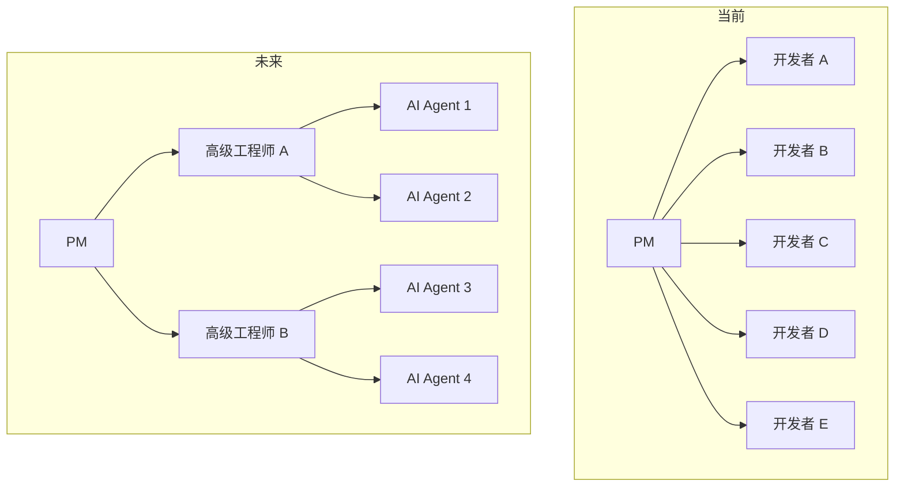
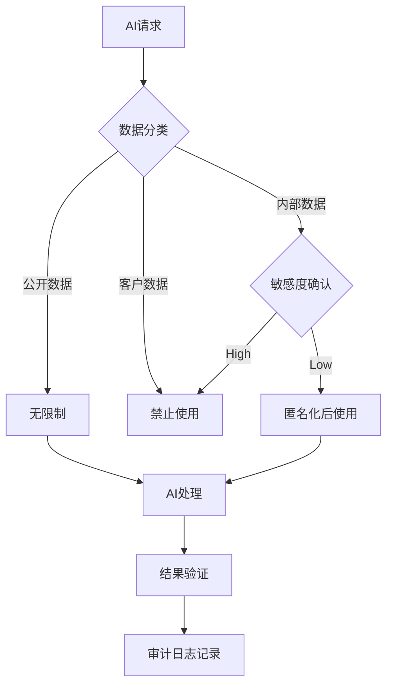
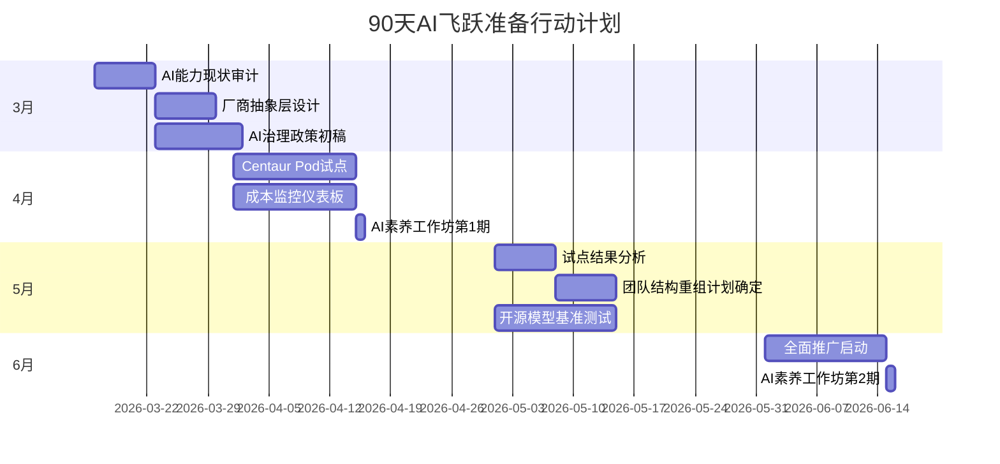

## Morgan Stanley的警告："世界还没准备好"

2026年3月13日，Morgan Stanley发布了一份报告。核心信息非常简洁：

> "2026年4〜6月之间，AI能力将发生<strong>非线性飞跃（non-linear jump）</strong>，而大多数组织对此毫无准备。"

这不是营销噱头。据Morgan Stanley的分析，美国顶级AI实验室正在集中<strong>前所未有规模的算力</strong>，而算力每增长10倍便将模型"智能"提升2倍的Scaling Law依然有效。

实际上，OpenAI最新的GPT-5.4 "Thinking"模型在GDPVal基准测试中达到了<strong>83.0%</strong>，已接近人类专家水平。这不是简单的渐进式改进，而是意味着AI在具有经济价值的任务中正逼近替代人类的临界点。

作为工程领导者，无论这一预测是否准确，<strong>不做准备才是最大的风险</strong>。本文将梳理CTO/VPoE/EM现在就应立即执行的5项准备战略。

## 1. 将AI引入路线图重新设计为季度制

大多数组织以年度为单位制定AI引入计划。然而，在模型性能每3〜6个月就会代际更替的环境下，年度计划已失去意义。

### 执行方案

- <strong>季度AI能力重新评估</strong>：每季度初查看最新模型的基准测试结果，重新识别当前工作流程中可自动化的领域。
- <strong>"AI-Ready"待办管理</strong>：单独维护一份当前仍手动操作但随着AI性能提升可实现自动化的任务清单。
- <strong>避免厂商锁定</strong>：设计抽象层以避免对单一AI厂商的依赖。MCP（Model Context Protocol）等标准以及[LangGraph、CrewAI、Dapr等可替换框架](/zh/blog/zh/ai-agent-framework-comparison-2026-langgraph-crewai-dapr-production)可以帮助实现这一目标。

```typescript
// AI厂商抽象层示例
interface AIProvider {
  complete(prompt: string, options: CompletionOptions): Promise<Response>;
  embed(text: string): Promise<number[]>;
}

class AIService {
  private providers: Map<string, AIProvider> = new Map();

  // 便于按季度切换厂商的架构
  switchProvider(name: string): void {
    this.activeProvider = this.providers.get(name);
  }
}
```

## 2. 将团队结构重组为"AI协作单元"

如果Morgan Stanley报告预测的AI飞跃成为现实，当前的团队结构将变得低效。关键不是<strong>将AI作为工具使用的团队</strong>，而是向<strong>与AI协作的团队</strong>转型。

### 执行方案

- <strong>引入Centaur Pod模型</strong>：通过2〜3名高级工程师 + AI Agent的组合，实现原来5〜6人团队的产出。
- <strong>新设AI编排师角色</strong>：在团队中创建专门负责设计[AI Agent工作流程](/zh/blog/zh/claude-code-agentic-workflow-patterns-5-types)并管理质量的角色。
- <strong>更新代码审查流程</strong>：为AI生成的代码单独定义审查标准和流程。



## 3. 从根本上重新审视基础设施成本结构

Morgan Stanley报告提到了<strong>"15-15-15"动态</strong>：15年数据中心租约、15%收益率、每瓦特$15的净价值创造。AI算力需求的爆发正在从根本上改变基础设施的成本结构。

### 执行方案

- <strong>混合AI基础设施战略</strong>：不要将所有AI工作负载都迁移到云端。考虑推理（inference）在本地/边缘端执行、训练（training）在云端进行的分离策略。
- <strong>构建成本监控仪表板</strong>：实时追踪[AI API调用成本](/zh/blog/zh/llm-api-pricing-comparison-2026-gpt5-claude-gemini-deepseek)，按模型和功能衡量ROI。
- <strong>开源模型利用规划</strong>：持续基准测试Mistral 3、GLM-5等能以15%成本实现专有模型92%性能的开源替代方案。

| 策略 | 成本节约效果 | 适用工作负载 |
|------|------------|-------------|
| 本地推理 (Ollama + llama.cpp) | 70〜90% | 重复性代码生成、文档摘要 |
| 云端API (GPT-5.x, Claude) | 基准线 | 复杂推理、多模态 |
| 开源微调 | 50〜70% | 领域特定任务 |
| 批处理优化 | 30〜50% | 夜间分析、大规模处理 |

## 4. 先发制人地构建AI治理框架

当AI能力急剧提升时，没有治理的AI使用将成为组织面临的实质性风险。最近Anthropic拒绝美国国防部将AI用于大规模监控和自主武器，被归类为"供应链风险"的事件表明，AI治理不仅仅是合规问题，更是<strong>业务连续性问题</strong>。

### 执行方案

- <strong>制定AI使用政策</strong>：明文规定哪些数据可以输入AI、AI输出的验证标准是什么。
- <strong>管理模型依赖</strong>：提前制定应对特定模型退役（如GPT-4o退役案例）的迁移计划。
- <strong>构建AI审计日志体系</strong>：确保AI做出的决策和生成的结果具有可追溯性（traceability）。



## 5. 系统性提升工程团队的AI素养

Morgan Stanley警告"世界还没准备好"的核心，并非<strong>技术本身，而是组织利用技术的能力</strong>。会使用AI工具和战略性地运用AI是完全不同的层次。

### 执行方案

- <strong>Prompt Engineering工作坊</strong>：每月1次，基于实际工作场景进行。不仅是"向AI提问"，而是提升到"与AI共同设计"的水平。
- <strong>AI代码审查能力</strong>：培养评估AI生成代码的安全漏洞、性能问题和架构适配性的能力。
- <strong>内部AI Champion计划</strong>：在每个团队指定负责挖掘和分享AI应用案例的"AI Champion"。

### 分阶段AI素养成熟度模型

| 等级 | 名称 | 说明 | 代表活动 |
|------|------|------|---------|
| L1 | 消费者 | 简单使用AI工具 | 用ChatGPT提问 |
| L2 | 实践者 | 将AI整合到工作中 | AI代码生成 + 审查 |
| L3 | 设计者 | 设计AI工作流程 | 构建Agent pipeline |
| L4 | 战略家 | 制定基于AI的组织战略 | AI引入ROI分析、团队重组 |

大多数工程师停留在L1〜L2。要在Morgan Stanley的预测成为现实时保持竞争力，<strong>将团队核心人才提升到L3以上</strong>是当务之急。

## 时间线：从现在到6月的行动计划

距离Morgan Stanley预测的飞跃时间点4〜6月，剩余时间已经不多。以下是务实的90天行动计划。



## 结论：既非乐观也非悲观，而是实用主义的准备

没有人知道Morgan Stanley的预测是否会完全准确。但方向是明确的——AI能力不会线性发展，非线性飞跃终将到来。

核心在于以下三点：

1. <strong>灵活的架构</strong>：能够快速切换模型和厂商的结构
2. <strong>可适应的团队</strong>：具备与AI协作能力的人才
3. <strong>系统化的治理</strong>：在快速引入和安全使用之间保持平衡

只要具备这三点，无论飞跃是在4月还是12月到来，您的组织都将做好准备。

## 参考资料

- [Morgan Stanley warns an AI breakthrough is coming in 2026](https://fortune.com/2026/03/13/elon-musk-morgan-stanley-ai-leap-2026/)
- [OpenAI GPT-5.4 "Thinking" Model Release](https://llm-stats.com/ai-news)
- [Anthropic Pentagon Supply Chain Risk Dispute](https://techcrunch.com/2026/03/09/openai-and-google-employees-rush-to-anthropics-defense-in-dod-lawsuit/)
- [MIT TLT Training Efficiency Method](https://news.mit.edu/2026/new-method-could-increase-llm-training-efficiency-0226)
- [Claude for Excel/PowerPoint Shared Context](https://claude.com/blog/claude-excel-powerpoint-updates)
