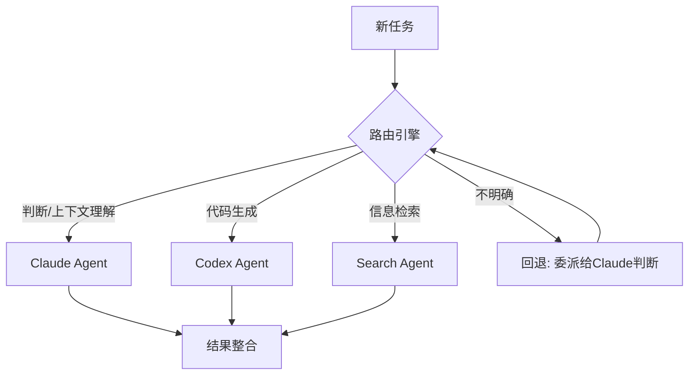
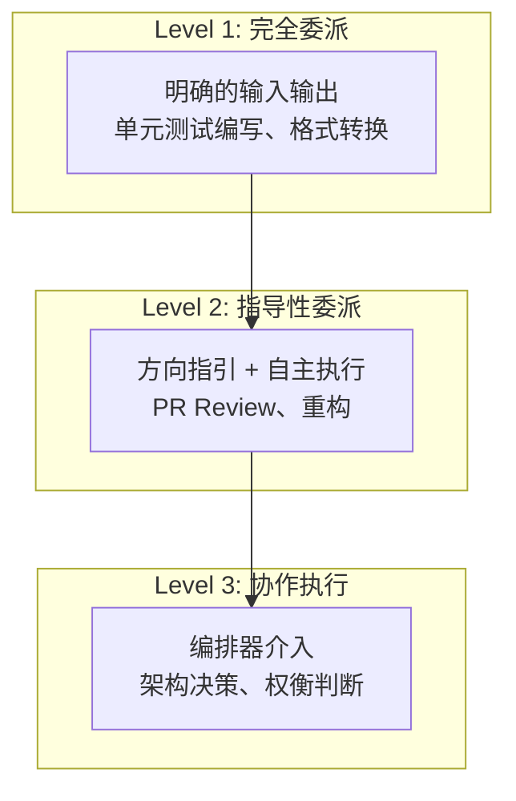
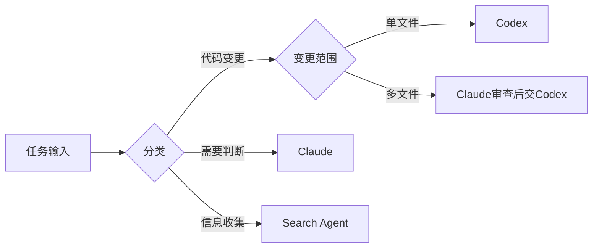

## 概述

同时运用多个AI智能体的时代已经到来。Claude擅长判断和上下文理解，Codex擅长精密的代码生成。但最困难的问题是**路由（Routing）**设计——决定将哪个任务交给哪个智能体。

本文从Engineering Manager（EM）的视角出发，论述多智能体路由为何与**团队管理中的权限委派**具有完全相同的结构。

## 为什么路由是最大难题

### 单一智能体的局限

将所有工作交给一个智能体会导致上下文窗口溢出、专业性不足、响应延迟等问题。因此需要按专业领域将智能体进行分割。

### 分割后的真正问题

分割智能体本身并不难。真正的问题是：

1. **任务分类的模糊性**："这个PR Review是代码质量问题还是架构判断？"
2. **上下文传递成本**：在智能体之间传递上下文时的信息丢失
3. **失败时的重新路由**：某个智能体失败时的回退策略
4. **依赖关系管理**：A的输出作为B的输入的流水线设计



## 与EM权限委派的同一结构

### 管理者的日常

想想Engineering Manager每天在做什么：

| EM的判断 | 智能体路由 |
|----------|-----------|
| "这个功能实现交给A" | "代码生成交给Codex" |
| "架构审查交给B" | "设计判断交给Claude" |
| "简单的Bug修复交给初级工程师" | "简单任务交给轻量模型" |
| "模糊的事情我自己处理" | "不明确的由编排器处理" |

### 权限委派的三个层级

将EM经验中的权限委派框架应用到智能体上：



**Level 1 — 完全委派**：输入输出明确的任务。单元测试编写、JSON格式转换等。直接交给Codex即可。

**Level 2 — 指导性委派**：确定方向但具体执行交给智能体的任务。PR Review、代码重构等。Claude编写指导方针，Codex执行。

**Level 3 — 协作执行**：编排器本身需要深度参与判断的任务。架构决策、技术选型等。

## 从实战案例学习路由设计

### okash1n的Claude Code + Codex MCP构成

[okash1n（super_bonochin）](https://x.com/okaboringcode)分享了将Codex通过MCP连接到Claude Code进行运用的构成。核心要点：

- **Claude Code担任编排器**角色，管理整体流程
- **Codex作为MCP服务器**，担任代码生成专家角色
- Claude判断"这是代码生成任务"后委派给Codex

这正是**EM（Claude）将实现工作委派给高级工程师（Codex）**的结构。

### NabbilKhan的8体智能体运用

NabbilKhan公开了同时运用8个智能体的构成。遇到的最大问题正是**路由**：

- 在8个智能体中"谁来处理这个任务"的判断成本
- 任务跨越多个智能体专业领域时的拆分策略
- 智能体间上下文同步的困难

这与**管理8名工程师的EM**面临的问题完全相同。

## 路由设计的核心原则

### 1. 明确的角色定义（Role Boundary）

像编写Job Description一样，明确记录每个智能体的责任范围。

```yaml
# agents/codex.yaml
name: Codex Agent
role: 代码生成专家
capabilities:
  - 函数/类实现
  - 单元测试编写
  - 重构执行
boundaries:
  - 禁止架构决策
  - 禁止外部API设计
escalation: 上报给Claude Agent
```

### 2. 路由标准的显式设计



### 3. 失败时的上报路径

就像下属遇到困难会上报给管理者一样，智能体失败时会上报给编排器。

```python
async def route_task(task: Task) -> Result:
    agent = classify(task)
    result = await agent.execute(task)

    if result.confidence < 0.7:
        # 上报: 编排器直接处理
        return await orchestrator.handle(task, context=result)

    return result
```

### 4. 通过反馈循环改进路由

就像管理者根据委派结果调整下次判断一样，智能体路由也需要基于结果进行改进：

- 追踪每个智能体的成功/失败率
- 识别频繁触发重新路由的模式
- 逐步细化路由规则

## 结论

多智能体编排的本质不是技术，而是**设计哲学**。就像EM将工作分配给团队成员一样，我们将任务分配给智能体。核心要点：

1. **明确角色边界** — 像Job Description一样定义智能体职责
2. **区分委派层级** — 完全委派 / 指导性委派 / 协作执行
3. **设计上报路径** — 提前准备失败时的回退方案
4. **通过反馈持续改进** — 追踪路由结果并细化规则

最终，就像优秀的管理者造就优秀的团队一样，优秀的编排器造就优秀的智能体系统。

## 参考资料

- [okash1n（super_bonochin）的Claude Code + Codex MCP构成](https://x.com/okaboringcode)
- [NabbilKhan的多智能体运用案例](https://x.com/NabbilKhan)
- [Anthropic - Building effective agents](https://docs.anthropic.com/en/docs/build-with-claude/agent-patterns)
- [OpenAI - Codex](https://openai.com/index/codex/)
