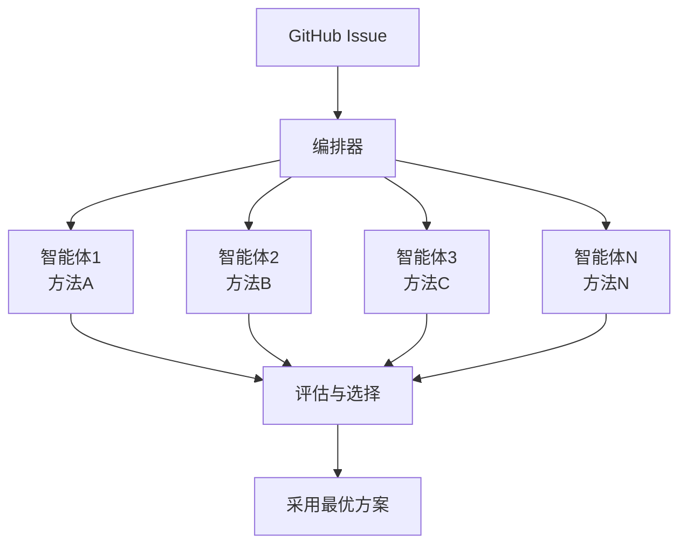

## 概述

2026年2月，SWE-bench Verified排行榜上出现了一个引人注目的名字。**Verdent AI**以**76.1%**的解决率跻身前列。值得关注的是，这一成果并非由单一大模型实现，而是通过**多智能体并行执行架构**达成的。

这预示着软件工程自动化领域的重要转折点。它表明"更好的协作结构"而非"更大的模型"可能才是提升性能的关键。

## 什么是SWE-bench Verified？

SWE-bench是基于真实GitHub Issue评估AI软件工程能力的基准测试。Verified版本由人工筛选的500个实例组成，是与OpenAI合作创建的高可信度数据集。

评估方式很简单：给定真实开源项目的Issue和测试用例，衡量AI修改代码使测试通过的比率。

## 旧范式：单体大模型的局限

到目前为止，SWE-bench的上位主要由单体大模型占据。

| 排名 | 系统 | 解决率 | 方法 |
|------|------|--------|------|
| - | Claude Opus 4系列 | ~70%+ | 单体模型 + 工具使用 |
| - | GPT-5系列 | ~70%+ | 单体模型 + 工具使用 |
| - | **Verdent AI** | **76.1%** | **多智能体并行执行** |

单体模型方法依赖于模型的规模和能力。想要更好的性能，就需要更大的模型、更多的算力。但这种方式存在根本性的局限：

- **单一视角的限制**：一个模型只能沿着一条解释路径前进
- **错误恢复困难**：一旦走错方向就很难回退
- **上下文窗口限制**：难以把握整个复杂代码库

## 新范式：多智能体并行执行

Verdent AI的方法从根本上不同。

### 核心机制

1. **并行分析**：多个智能体同时分析同一问题。每个智能体可以采用不同的策略。

2. **多样化解决路径**：即使一个智能体失败，其他智能体仍可能找到正确路径。这消除了单体模型"必须一次命中"的压力。

3. **最优结果选择**：从多个解决方案中选择通过测试的最优结果。

4. **集体智慧**：系统整体能力大于各个智能体能力之和。

## 工程管理者视角：团队vs个人

这个结果与软件工程领域中一个熟悉的讨论相呼应。

> **一个优秀的个人 vs 五个普通水平的团队成员，哪个更有生产力？**

在AI世界中，同样的问题依然有效。

| 维度 | 单体大模型（个人） | 多智能体（团队） |
|------|-------------------|-----------------|
| 优势 | 一致的上下文维护 | 多元视角、错误互补 |
| 劣势 | 单点故障 | 协调成本、一致性管理 |
| 可扩展性 | 依赖模型规模 | 通过增加智能体扩展 |
| 成本效率 | 大模型=高成本 | 多个小模型=灵活成本 |

正如实际软件团队中的代码评审、结对编程、群体编程等协作方式能够超越个人局限，AI智能体世界中**协作架构也在创造超越个体能力的成果**。

## 实践启示

### 1. AI工具选择标准的变化

如果说以前的核心问题是"用哪个模型"，那么今后**"如何架构和组合智能体"**将成为更重要的问题。

### 2. 成本效益优化

不一定非要使用最昂贵的大模型。并行运行多个中型模型可能在成本效益上取得更好的成果。

### 3. 容错系统设计

多智能体架构本质上是**容错**系统。即使一个智能体失败，整个系统仍然能找到正确答案。

## 未来展望

Verdent AI达成76.1%只是一个开始。随着多智能体架构的发展，我们可以预期：

- **专业化智能体生态系统**：调试专家、重构专家、测试编写专家等角色化智能体
- **动态团队组建**：根据问题特性自动确定最优智能体组合
- **学习型编排器**：通过学习历史成功/失败模式来优化智能体部署

## 结论

从单体模型的规模竞争到多智能体的架构竞争，软件工程自动化的范式正在转变。Verdent AI在SWE-bench Verified上达成76.1%是这一转变的具体证据。

作为开发者和工程领导者，我们已经到了需要超越"用哪个AI模型"，思考**"组建什么样的AI团队"**的时刻。

## 参考资料

- [SWE-bench官方排行榜](https://www.swebench.com/)
- [Verdent AI SWE-bench结果（X/Twitter）](https://x.com/hasantoxr/status/2020854332217049281)
- [SWE-bench Verified介绍（OpenAI）](https://openai.com/index/introducing-swe-bench-verified/)
