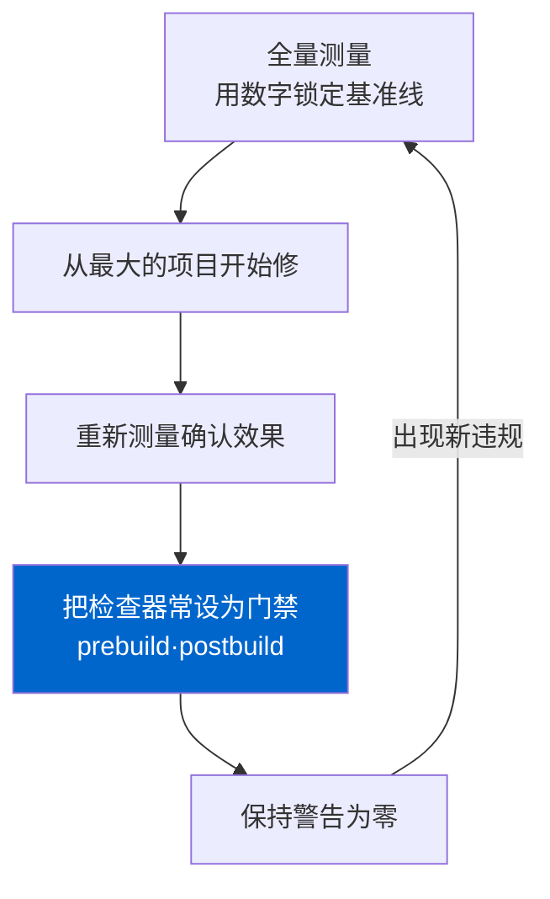

很多SEO审计以吐出一张工具报告收尾。跑一遍Lighthouse，截图Search Console的覆盖率，保存一张"发现12个问题"的面板，就算完事。问题是，这样收尾的审计结果大多在三个月后原样复原。有人发了新文章、重构了组件、换了字体，那一刻它就悄悄回来了。没人察觉。

过去五天，我实际审计了自己的四语言博客（ko/ja/en/zh，每种语言298篇）。项目共五个，全部修好。但我真正想说的不是"修了什么"，而是这五个修复远不如让它们再也回不来的<strong>构建门禁</strong>重要。审计应该是循环，而不是一次性事件。

## 为什么一张报告收尾的审计一定会回来

技术SEO的问题大多不是"代码错了"，而是"不变式从没在任何地方被强制"。比如"公开文章不得内链指向草稿"这条规则很清楚。但如果每次都要人去记，那么推荐生成器一旦拉进一个草稿slug，404就诞生了。报告会抓到那个404并展示给你，却挡不住下一次同样的错误。

所以我把审计当成三步循环来跑。测量。从最大的项目先修。再把那个项目<strong>做成检查器，钉进构建里</strong>。缺了第三步，前两步就变成每半年重复一次的苦工。门禁一旦就位，同类问题再次出现就会让`npm run build`失败。守规则的是流水线，而不是人的记性。

这不是新发明。它和测试防止bug回归是同一套逻辑，只是套用到了内容与标记这一层。只不过在SEO领域，这个习惯出奇地少见。多数团队把"SEO检查"留成每季度的手工活。

把这篇文章要讲的循环画成一张图：



## 五天里实际跑的五个项目

先测量。每个项目的before/after都用数字留档。不是"感觉好像好了"，而是可复现的数值。（五个项目的原始记录也留在[改进历史页面](/zh/improvement-history/)。）

| 日期 | 项目 | Before | After | 门禁 |
|---|---|---|---|---|
| 07-02 | relatedPosts完整性 | 指向草稿的404 <strong>12个</strong> | 0个 | prebuild |
| 07-04 | hreflang相互性 | 首页集群断链 <strong>4对</strong> | 253页损坏0 | postbuild |
| 07-05 | 性能关键路径 | 渲染阻塞字体CSS <strong>405KB</strong> | 渲染阻塞0 | 手动回归 |
| 07-05 | 翻译结构漂移 | 不一致slug <strong>21/50</strong> | 1（已接受遗留） | prebuild |
| 07-06 | JSON-LD实体模型 | 每篇ld+json <strong>7块</strong> | 1块，6节点连通 | 组件单一化 |

表面看是五个独立修复。实际上它们共享一个视角：全都是<strong>爬虫读取的标记，而非用户看到的画面</strong>的问题。hreflang、JSON-LD、草稿链接，人眼都看不见。所以肉眼QA永远抓不到，只有自动检查器能抓。

我特意把before/after钉成数字，是有理由的。"感觉好了"无法复现，无法复现就建不了门禁。门禁归根结底是一个判定："这个数字越过阈值就失败"。指向草稿的404如果是12个，门禁的条件就变成"超过0就构建报错"。把测量记成数字的那一刻，这个测量就成了回归测试的基线。这是把审计从事件变成循环的第一步。顺带一提，298篇公开文章里可索引的只有55篇，其余972篇（四语言合计）作为草稿被排除在信息流之外——这个比例本身也是测量才看清的。不知道它，就会去查"为什么站点地图里文章这么少"之类的错方向。

五个项目各自已有专文深挖，这里不重复。hreflang相互性为何必须双向，写在[实测审计hreflang并发现首页bug的文章](/zh/blog/zh/hreflang-reciprocity-audit-multilingual-2026/)里；把schema碎片连成单一`@graph`的理由，写在[用JSON-LD @graph连接实体的文章](/zh/blog/zh/json-ld-graph-entity-linking-2026/)里。本文的焦点不是单个手法，而是贯穿五者的循环本身。

## 从最大的项目先修，但我先怀疑了测量值

优先级很简单：影响范围 × 复发概率最大的先修。按这个标准，翻译结构漂移（21/50 slug）排第一。

这里我学到一点。<strong>处理异常值之前，先核对度量方法。</strong>打开"漂移最大的slug"一看，其实不是翻译粗糙，而是嵌套代码围栏坏了、渲染本身崩了。韩语文件里，三个反引号的代码块里又套了三个反引号的块，导致解析器把一半读成代码、一半读成正文。度量器以"结构不一致"抓到的最大值，不是翻译质量问题，而是解析污染。

要是我信了数字直接冲去"重新翻译"，就会在错的地方烧掉好几天。先核对度量器在数什么，21处里最大的异常值原来是代码围栏问题，其余则归结为恢复翻译中丢失的章节（约40个）和图表（12张）。恢复时我没有逐语言手搬，而是往共享模板里只换字符串参数。这样才能挡住二次漂移。

性能项目也一样。渲染阻塞的字体CSS是405KB，但优化的第一问不是"怎么加载得更快"，而是"到底需不需要加载"。我把任何语言都用不到的字形也一并搬运了。把Google Fonts按语言拆成子集后，405KB随语言降到1〜137KB，再把字体CSS异步化，渲染阻塞归零。附带地，无障碍分数也从91升到100。怎么把无障碍钉成数字，我另写在[实际跑Lighthouse无障碍审计并修复的文章](/zh/blog/zh/a11y-lighthouse-audit-fix-2026/)里。

## 不是修好，而是让它回不来

循环的第三步才是这次行动的真正产物。每个修好的项目都配了一个检查器。

以relatedPosts的404为例，我没有只修生成器的过滤就收工，而是在消费前的门禁强制不变式。构建前运行的`validate-publishing.mjs`检查这条规则。

```javascript
// 只有可索引的文章之间才能互相推荐。
// 指向草稿/noindex/未来文章/缺失slug就构建报错。
const indexableSlugsByLang = new Map(languages.map((lang) => [lang, new Set()]));
for (const post of posts.filter((item) => item.indexable)) {
  indexableSlugsByLang.get(post.lang).add(post.slug);
}

for (const post of posts.filter((item) => item.indexable)) {
  const related = Array.isArray(post.data.relatedPosts) ? post.data.relatedPosts : [];
  for (const rec of related) {
    if (!rec?.slug) continue;
    if (!indexableSlugsByLang.get(post.lang).has(rec.slug)) {
      errors.push(`${post.relPath}: relatedPosts references non-indexable post "${rec.slug}"`);
    }
  }
}
```

关键在于<strong>在消费前的一层拦，而不是在生成层</strong>。生成推荐的代码就算有一百处，只要真正发布的文章指向了草稿，就在一处被抓住。这道门禁上线后，草稿404在算术上归零，且会一直保持为零。

hreflang单凭源文件判定不了。必须爬取最终HTML，看页面之间是否真的互相指向，所以这个放在构建后（postbuild）跑。Google官方规则很明确：A把B指定为替代版本，B就必须回指A（相互性），且每个页面都要指向自己（self-reference）。我把这两条规则原样搬进了代码。

```javascript
for (const [url, targets] of annotations) {
  if (!targets.has(url)) missingSelf.push(url);        // 缺self-reference
  for (const target of targets) {
    if (target === url) continue;
    const back = annotations.get(target);
    if (back && !back.has(url)) {
      brokenPairs.push(`${url} -> ${target} (无回链)`);  // 相互性损坏
    }
  }
}
```

跑一遍构建，两个检查器实际会这样通过。下面是我写这篇文章时跑出来的日志。

```text
[publishing-check] posts by language: {"ko":{"total":298,"published":55,"indexable":55}, ...}
[publishing-check] past draft/noindex posts kept out of feeds: 972
[publishing-check] OK
...
[hreflang-check] annotated pages: 257
[hreflang-check] self-reference missing: 0
[hreflang-check] broken return-link pairs: 0
[orphan-check] pages: 260, orphans (排除allowlist): 0
[hreflang-check] OK
```

`orphan-check`也搭在同一个postbuild上。任何内链都到不了的孤立页面，爬虫很难发现，即便发现也读成孤立信号。审计途中我把一个原本孤立的页面用Footer链接接上，再把这项检查常设化以防复发。承认限度也是循环的一部分。翻译漂移从21处降到1处，那1处我故意留着。一篇非常老的遗留文章跨语言结构不同，如今硬要对齐就得动已索引的URL结构，风险大于收益。所以我把那一个slug明确登记进检查器的allowlist。与其"不为0就直接失败"，更现实的立场是"决定接受的例外，把理由留在代码里放行"。目标不是每个指标都归零，而是挡住意外复发。怎么对AI爬虫做差别化控制，我另写在[用robots.txt与llms.txt管控爬虫的文章](/zh/blog/zh/ai-crawler-control-robots-txt-llms-txt-2026/)里。

## Google不保证的东西

这里要诚实地划一条线。这次行动<strong>不是</strong>提排名的工作。Google Search Central官方文档说得很直白：结构化数据只赋予富媒体结果的<strong>资格</strong>，不保证展示或排名。hreflang也被描述为"把用户引导到合适的语言/地区版本"的路由装置，而非排名信号。填错的hreflang不会制造你原本没有的排名，相互性一坏，那段注释就直接被忽略。

所以这五个项目准确的效用应该这样讲：它们是<strong>减少爬虫误读你站点余地的卫生工作</strong>。404链接浪费抓取预算，损坏的hreflang让语言定位失效，碎片化的JSON-LD切断"这个组织、这个作者、这篇文章"的连接。修好它们，爬虫按你意图读取的概率就上升。至于是否转化为更高排名，取决于内容质量和无数其他变量，而我是Web开发者，不是了解搜索算法内部的人。那部分我不下断言。

性能这边也看到了限度。实验室数值（Lighthouse模拟）和实测（observed LCP 2.4秒）不一致。只盯实验室分数冲进过度优化，真实用户环境毫无体感，代码却更复杂了。知道实验室与现场的差距，恰恰告诉你该在哪里收手。

## 今天就能用的清单

把我在博客上做的一般化，任何站点都能这样启动这个循环。

- <strong>先测量，再怀疑。</strong> 发现异常值时，修之前先核对"度量器到底在数什么"。我最大的漂移不是翻译问题，而是代码围栏的解析污染。
- <strong>按影响 × 复发概率排优先级。</strong> 先处理会悄悄反复回来的，而非最显眼的。
- <strong>在消费前的一层拦截。</strong> 生成代码有多处时，别逐个去修，而是在发布前的一处强制不变式。
- <strong>能靠源判定就prebuild，需要看渲染产物就postbuild。</strong> frontmatter和链接引用放prebuild；hreflang相互性和孤立页面放爬取最终HTML的postbuild。
- <strong>每个修复都要变成检查器。</strong> 没有检查器的修复就是预约回归。一个30行的检查器胜过每季度的手工审计。
- <strong>不承诺排名。</strong> 这是卫生，不是魔法。减少爬虫误读，就是开发者职责的边界。

回望这五天，最有价值的产物不是修好的五项，而是仓库里留下的三个检查器。五项终会被遗忘，检查器却在我每次犯错时替我记着。把审计做成循环而非事件，说到底就是这个意思。

如果你想在服务端可靠地输出结构化数据，或想对多语言站点的hreflang、JSON-LD、性能做实测排查并给修复配上回归门禁，我私下接受咨询与实现委托。用代码控制服务器到底发给爬虫什么，正是我的专长。若想从"服务器输出的标记"这一视角重新审视你的站点，[在服务端输出LocalBusiness结构化数据的文章](/zh/blog/zh/localbusiness-structured-data-server-side-vs-js-2026/)也是同一路数的内容。
