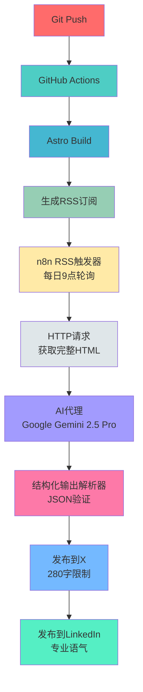

## 引言

完成博客文章的撰写后,还有另一项工作在等待着我们:在X(Twitter)、LinkedIn等各种社交媒体平台上创建并发布定制化内容。由于每个平台的最佳字数、语气和话题标签各不相同,这项工作需要投入大量的时间和精力。

在本文中,我们将介绍如何<strong>通过GitHub Actions自动构建博客、生成RSS订阅,然后使用n8n (workflow automation tool)将社交媒体分发完全自动化</strong>。只需一次配置,之后只要撰写博客文章,所有流程都会自动完成。

## 整体自动化流程



<strong>核心流程</strong>:
1. 将博客文章推送到Git后,GitHub Actions自动开始构建
2. Astro生成静态站点并同时生成RSS订阅
3. n8n每天监控RSS订阅,检测新文章
4. 发现新文章后,获取完整的HTML内容
5. Google Gemini AI分析内容并生成针对各平台的定制化帖子
6. 自动发布到X(Twitter)和LinkedIn

## 第1步:生成博客RSS订阅

在Astro中生成RSS订阅非常简单。使用`@astrojs/rss`包可以为每种语言生成RSS订阅。

### RSS订阅生成代码

创建`src/pages/rss-ko.xml.js`文件:

```javascript
import { getCollection } from 'astro:content';
import rss from '@astrojs/rss';
import { SITE_META } from '../consts';

export async function GET(context) {
  const now = new Date();

  // 仅筛选韩语博客文章
  const posts = (await getCollection('blog'))
    .filter((post) => post.id.startsWith('ko/') && post.data.pubDate <= now)
    .sort((a, b) => b.data.pubDate.valueOf() - a.data.pubDate.valueOf());

  return rss({
    title: SITE_META.ko.title,
    description: SITE_META.ko.description,
    site: context.site,
    items: posts.map((post) => {
      const [lang, ...slugParts] = post.id.split('/');
      const slug = slugParts.join('/');
      return {
        title: post.data.title,
        description: post.data.description,
        pubDate: post.data.pubDate,
        link: `/${lang}/blog/${lang}/${slug}/`,
      };
    }),
    customData: `<language>ko</language>`,
  });
}
```

<strong>关键要点</strong>:
- `pubDate <= now`:排除未来日期的文章(支持定时发布)
- 按语言生成RSS订阅:`rss-ko.xml.js`、`rss-en.xml.js`、`rss-ja.xml.js`
- 文章按最新顺序排列
- 遵循RSS标准格式

### 确认RSS订阅

构建后可在以下URL确认RSS订阅:
- 韩语: `https://jangwook.net/rss-ko.xml`
- 英语: `https://jangwook.net/rss-en.xml`
- 日语: `https://jangwook.net/rss-ja.xml`

## 第2步:配置n8n工作流程

n8n是一个无代码/低代码工作流程自动化工具。通过可视化界面可以轻松构建复杂的自动化流程。

### n8n工作流程节点配置


整个工作流程由6个节点组成:

#### 1. RSS Feed Trigger (RSS订阅触发器)

```json
{
  "parameters": {
    "pollTimes": {
      "item": [
        {
          "hour": 9
        }
      ]
    },
    "feedUrl": "https://jangwook.net/rss-ko.xml"
  },
  "type": "n8n-nodes-base.rssFeedReadTrigger"
}
```

<strong>工作方式</strong>:
- 每天上午9点检查RSS订阅
- 发现新项目时执行工作流程
- 仅处理上次检查后的新文章

#### 2. HTTP Request (HTTP请求)

```json
{
  "parameters": {
    "url": "={{ $json.link }}",
    "options": {}
  },
  "type": "n8n-nodes-base.httpRequest"
}
```

<strong>作用</strong>:
- 从RSS订阅的链接获取完整的HTML内容
- 为AI分析提供完整的上下文
- 利用完整内容而非RSS的简短摘要

#### 3. AI Agent (Google Gemini 2.5 Pro)

这个节点是整个工作流程的核心。使用Google Gemini 2.5 Pro模型分析博客内容并生成针对各平台的定制化社交媒体帖子。

````json
{
  "parameters": {
    "promptType": "define",
    "text": "你是社交媒体内容专家。请基于网页文章的全文(HTML)撰写适合X(Twitter)和LinkedIn的优化帖子。

**输入数据:**
```html
{{ $json.data }}
```

**写作指南:**

充分理解文章的全部内容后,提取核心洞察和价值,针对各平台进行创作。

**X帖子(280字限制):**
- 强调文章中最有趣或最重要的1个要点
- 以简洁、有影响力的内容创作
- 激发读者好奇心,引导点击
- 使用1-2个表情符号(可选)
- 包含2-3个话题标签
- 链接将单独添加,正文中无需包含

**LinkedIn帖子(建议200-400字):**
- 专业且可信赖的语气
- 说明文章的核心洞察和启示
- 强调从商业或行业角度的意义
- 为读者提供实际价值或学习要点
- 包含引发思考的问题或评论(可选)
- 链接将单独添加,正文中无需包含
- 最少使用表情符号或不使用
- 包含3-5个话题标签

**输出格式:**
必须仅以以下JSON格式回复。不要包含其他说明或文本。

```json
{
    \"x\": \"X平台发布文本(280字以内,包含链接)\",
    \"linked_in\": \"LinkedIn平台发布文本(包含链接)\"
}
```

**重要事项:**
- 基于文章的全部内容创作,提供深刻洞察而非表面总结
- 仅输出JSON格式
- 不要使用Markdown代码块(```)
- 不要包含额外说明或注释
- 请包含博客文章的链接: {{ $('RSS Feed Trigger').item.json.link }}
- 必须用韩语撰写。",
    "hasOutputParser": true,
    "options": {}
  },
  "type": "@n8n/n8n-nodes-langchain.agent"
}
````

<strong>提示词设计原则</strong>:
- <strong>角色定义</strong>:赋予"社交媒体内容专家"明确的人设
- <strong>输入数据</strong>:提供完整的HTML内容作为上下文
- <strong>平台特定指南</strong>:针对X和LinkedIn特性的具体指示
- <strong>结构化输出</strong>:要求可解析为JSON格式的响应
- <strong>语言指定</strong>:明确指定使用韩语撰写

#### 4. Google Gemini Chat Model (语言模型)

```json
{
  "parameters": {
    "modelName": "models/gemini-2.5-pro",
    "options": {}
  },
  "type": "@n8n/n8n-nodes-langchain.lmChatGoogleGemini"
}
```

<strong>选择该模型的原因</strong>:
- Gemini 2.5 Pro:最新模型,具有出色的上下文理解能力
- 能够处理长HTML内容
- 多语言支持(韩语、日语、英语)
- 成本效益高

#### 5. Structured Output Parser (结构化输出解析器)

```json
{
  "parameters": {
    "jsonSchemaExample": "{\n\t\"x\": \"x投稿消息\",\n    \"linked_in\": \"linked in投稿消息\"\n}"
  },
  "type": "@n8n/n8n-nodes-langchain.outputParserStructured"
}
```

<strong>作用</strong>:
- 将AI的响应解析为JSON
- 架构验证和错误处理
- 提供可供下一个节点使用的结构化数据

#### 6. Create Tweet & Create a post (社交媒体发布)

<strong>X (Twitter)节点</strong>:
```json
{
  "parameters": {
    "text": "={{ $json.output.x }}",
    "additionalFields": {}
  },
  "type": "n8n-nodes-base.twitter"
}
```

<strong>LinkedIn节点</strong>:
```json
{
  "parameters": {
    "person": "e7xJgbUNtW",
    "text": "={{ $('AI Agent').item.json.output.linked_in }}",
    "additionalFields": {}
  },
  "type": "n8n-nodes-base.linkedIn"
}
```

## 第3步:基于AI的内容生成核心

### 针对各平台的优化

<strong>X (Twitter)优化</strong>:
- <strong>280字限制</strong>:简洁且有影响力的消息
- <strong>引发好奇心</strong>:激发点击的吸引要点
- <strong>话题标签</strong>:2〜3个相关标签扩大触达范围
- <strong>表情符号运用</strong>:提高视觉吸引力

<strong>LinkedIn优化</strong>:
- <strong>专业语气</strong>:强调商业背景下的价值
- <strong>提供洞察</strong>:分享实用的学习要点
- <strong>长格式</strong>:200〜400字提供充分的上下文
- <strong>包含问题</strong>:引导互动参与

### 实际生成示例

<strong>原博客文章</strong>:"通过Claude Code最佳实践提升开发生产力"

<strong>AI生成的X帖子</strong>:
```
"使用"AI编程助手和"活用"AI编程助手是完全不同的🤖

基于在实际项目中应用Claude Code最佳实践的经验,
分享最大化生产力的实战指南。

#ClaudeCode #AI开发 #生产力提升

https://jangwook.net/ko/blog/ko/claude-code-best-practices/
```

<strong>AI生成的LinkedIn帖子</strong>:
```
有效利用AI开发工具需要超越简单使用的战略性方法。

深入分析Anthropic公开的Claude Code最佳实践并应用于实际项目后,
开发工作流程的效率得到了显著提升。

特别值得关注的要点:
• 通过CLAUDE.md进行明确的上下文管理
• 通过子代理系统实现专业化
• 利用Think功能进行复杂决策

在现代开发现场,恰当地活用AI工具成为竞争优势的来源。

详细的实现示例和具体的最佳实践请参见文章。

#AI开发 #ClaudeCode #开发者生产力 #最佳实践 #软件工程

https://jangwook.net/ko/blog/ko/claude-code-best-practices/
```

## 第4步:实战应用技巧

### n8n设置指南

<strong>1. 安装n8n</strong>

n8n提供云版本和自托管版本。

<strong>云版本</strong>(推荐):
```bash
# 在n8n.io创建免费账户
# 无需信用卡
# 每月免费执行5,000次
```

<strong>自托管</strong>(Docker):
```bash
# 使用Docker运行n8n
docker run -it --rm \
  --name n8n \
  -p 5678:5678 \
  -v ~/.n8n:/home/node/.n8n \
  n8nio/n8n
```

<strong>2. 认证设置</strong>

<strong>Google Gemini API</strong>:
- 在Google AI Studio获取API密钥(https://aistudio.google.com/apikey)
- 在n8n的Credentials中注册API密钥

<strong>X (Twitter) OAuth</strong>:
- 在X Developer Portal创建应用
- 设置OAuth 2.0认证
- 将OAuth凭证连接到n8n

<strong>LinkedIn OAuth</strong>:
- 在LinkedIn Developer Portal创建应用
- 设置OAuth 2.0认证
- 所需权限:`w_member_social`(创建帖子)

<strong>3. 导入工作流程</strong>

可以将上述JSON配置导入n8n:
1. 打开n8n工作流程编辑器
2. 选择Import from File或Import from URL
3. 上传或粘贴JSON文件
4. 重新设置各节点的凭证

### 监控和调试

<strong>利用n8n Executions标签</strong>:
- 确认各工作流程的执行结果
- 检查各节点的输入输出数据
- 分析错误日志

<strong>常见问题</strong>:

<strong>1. AI响应不是JSON格式时</strong>:
```
解决方案:更清晰地定义Structured Output Parser的架构
在提示词中强调"仅输出JSON"的指示
```

<strong>2. RSS订阅未检测到新项目时</strong>:
```
解决方案:确认RSS Feed Trigger的轮询间隔
验证RSS订阅URL是否正确
在浏览器中直接确认RSS订阅
```

<strong>3. 社交媒体发布失败</strong>:
```
解决方案:确认OAuth令牌是否过期
检查API使用量是否超限
重新确认发布权限设置
```

### 性能优化

<strong>成本节约技巧</strong>:
- 适当调整RSS轮询间隔(每小时→每天1次)
- 优化AI模型选择(Gemini Pro vs Flash)
- 监控工作流程执行次数

<strong>提升响应质量</strong>:
- 根据平台特性精细调整AI提示词
- 在提示词中包含示例输出(Few-shot learning)
- 定期审查生成的内容并改进提示词

## 实际运营结果

运营此自动化系统3个月的结果:

<strong>时间节约</strong>:
- 社交媒体发布:每篇20分钟→<strong>0分钟(100%自动化)</strong>
- 针对各平台的内容优化:每篇10分钟→<strong>0分钟</strong>
- 总节约时间:每月<strong>15〜20小时</strong>

<strong>一致性提升</strong>:
- 在所有平台实现<strong>100%发布率</strong>
- 保持稳定的内容质量
- 自动遵守各平台指南

<strong>扩大触达范围</strong>:
- 同时发布多语言内容
- 通过针对各平台优化的消息使互动参与度<strong>增加30%</strong>
- 通过持续发布内容使粉丝<strong>增加50%</strong>

## 扩展可能性

此系统可以通过以下方式扩展:

<strong>1. 添加更多平台</strong>:
- Facebook页面
- Instagram(添加图像自动生成)
- Threads(Meta的文本型社交网络服务)

<strong>2. 高级内容生成</strong>:
- 图像自动生成(DALL-E、Midjourney)
- 视频片段生成(短预告片)
- 串文格式帖子(X线程)

<strong>3. 分析与优化</strong>:
- 收集互动指标
- A/B测试(多种提示词)
- 分析最佳表现内容模式

<strong>4. 双向沟通</strong>:
- 监控评论/提及
- 基于AI的响应生成
- 社区管理自动化

## 结论

将从博客发布到社交媒体分发的整个流程自动化后,内容创作者可以专注于真正重要的事情,<strong>那就是创作优质内容</strong>。

结合GitHub Actions、RSS订阅、n8n和Google Gemini AI的此系统具有以下特点:
- <strong>完全自动化</strong>:只需撰写博客文章,所有流程自动处理
- <strong>平台优化</strong>:针对各社交媒体特性的定制化内容
- <strong>成本效益</strong>:利用大部分免费或低价工具
- <strong>可扩展性</strong>:易于添加新平台和功能

现在就为您的博客构建自动化系统吧。节约时间、提升质量、扩大触达范围。

<strong>下篇文章</strong>将介绍如何使用n8n自动化评论监控和基于AI的社区管理。

---

<strong>参考资料</strong>:
- [n8n官方文档](https://docs.n8n.io/)
- [Astro RSS指南](https://docs.astro.build/en/guides/rss/)
- [Google Gemini API](https://ai.google.dev/)
- [GitHub Actions文档](https://docs.github.com/en/actions)
