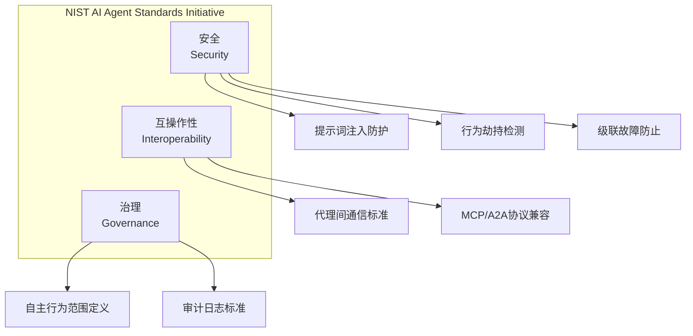
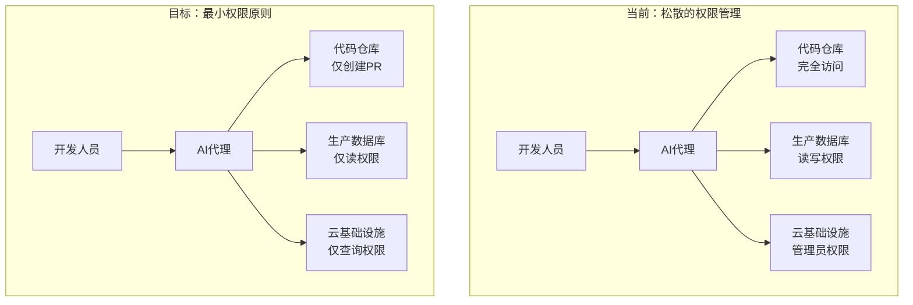
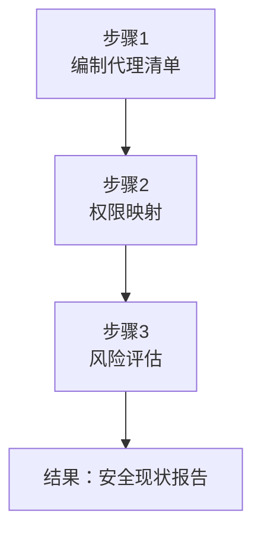
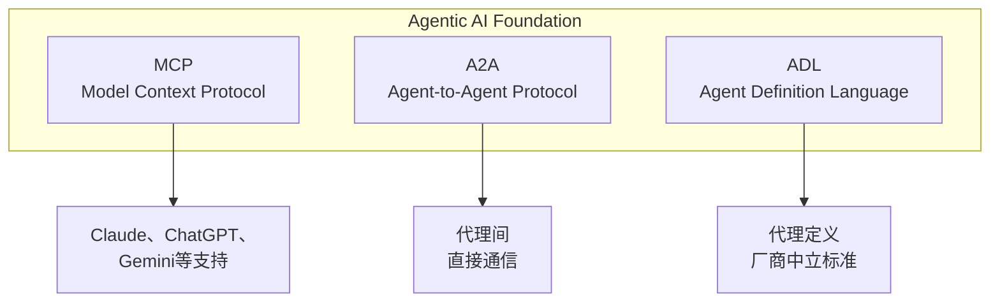

## 概述

2026年2月，NIST(美国国家标准与技术研究所)正式宣布了<strong>AI Agent Standards Initiative</strong>。在AI代理能够自主编写代码、发送电子邮件、管理基础设施的时代，这是对"这个代理真的安全吗？"这一问题的第一份官方答复。

特别是该倡议的<strong>AI Agent Security RFI</strong>意见提交截止日期为2026年3月9日，现在正是工程经理检查团队AI代理运营方式的最佳时机。

本文整理了NIST倡议的核心内容，并为EM/VPoE提供了可立即执行的安全清单。

## NIST AI代理标准倡议是什么？

由NIST的CAISI(AI标准与创新中心)主导的该倡议由三个核心支柱组成：



### 三大安全威胁

NIST特别关注的AI代理安全威胁如下：

<strong>1. 提示词注入(Prompt Injection)</strong>

这是一种对处理外部数据的AI代理注入恶意命令的攻击。例如，网络爬虫代理可能被迫遵循恶意网页中隐藏的指令。

<strong>2. 行为劫持(Behavioral Hijacking)</strong>

这种攻击通过改变代理的正常行为模式来使其执行非预期的操作。2026年2月的Cline npm发布事件是典型案例，该编码代理自动部署了恶意程序包。

<strong>3. 级联故障(Cascade Failure)</strong>

一个代理的故障以连锁反应方式导致整个系统瘫痪。这在多代理编排中特别危险。

## 为什么EM现在需要关注？

### 代理权限的危险扩大

在企业环境中，AI代理通常以比用户更广泛的权限运行。GitHub Copilot提交代码，Slack机器人发送消息，基础设施代理配置服务器。所有这些操作都可能绕过IAM(身份和访问管理)体系。



### 监管环境的急速变化

NIST标准很可能被纳入未来的联邦采购要求。随着EU AI Act从2026年开始分阶段实施，AI代理安全正在成为合规的核心领域。对于以全球市场为目标的企业来说，现在不做准备就意味着未来付出巨大代价。

## EM的AI代理安全清单

### 第1阶段：现状评估(1〜2周)



<strong>步骤1 — 代理清单</strong>

列出团队正在使用的所有AI代理：

```yaml
# agent-inventory.yaml 示例
agents:
  - name: "GitHub Copilot"
    type: "代码协助助手"
    scope: "代码生成、PR审查"
    data_access: "完整源代码"
    autonomous_actions: ["代码建议", "自动完成"]
    risk_level: "medium"

  - name: "Slack AI Bot"
    type: "通信代理"
    scope: "消息摘要、通知"
    data_access: "全部频道消息"
    autonomous_actions: ["发送消息", "频道摘要"]
    risk_level: "high"

  - name: "Infrastructure Agent"
    type: "基础设施自动化"
    scope: "服务器配置、监控"
    data_access: "AWS/GCP管理控制台"
    autonomous_actions: ["缩放", "部署", "回滚"]
    risk_level: "critical"
```

<strong>步骤2 — 权限映射</strong>

审计每个代理实际拥有的权限。特别注意"预期权限"和"实际权限"之间的差异。

<strong>步骤3 — 风险评估</strong>

基于NIST的三大威胁(提示词注入、行为劫持、级联故障)，评估每个代理的漏洞。

### 第2阶段：构建护栏(2〜4周)

```typescript
// agent-guardrail.ts — 代理执行前的安全验证示例
interface AgentAction {
  agentId: string;
  actionType: 'read' | 'write' | 'execute' | 'deploy';
  targetResource: string;
  reasoning: string;
  confidence: number;
}

interface GuardrailResult {
  allowed: boolean;
  reason: string;
  requiresHumanApproval: boolean;
}

function evaluateAction(action: AgentAction): GuardrailResult {
  // 1. 应用最小权限原则
  if (action.actionType === 'deploy' && !isApprovedDeployer(action.agentId)) {
    return {
      allowed: false,
      reason: '该代理不具有部署权限',
      requiresHumanApproval: true
    };
  }

  // 2. 验证置信度阈值
  if (action.confidence < 0.85) {
    return {
      allowed: false,
      reason: `置信度 ${action.confidence} 低于阈值 0.85`,
      requiresHumanApproval: true
    };
  }

  // 3. 异常行为检测
  if (isAnomalousPattern(action)) {
    return {
      allowed: false,
      reason: '检测到异常行为模式',
      requiresHumanApproval: true
    };
  }

  return { allowed: true, reason: 'OK', requiresHumanApproval: false };
}
```

### 第3阶段：监控和审计(持续)

<strong>审计日志标准化</strong>

NIST推荐的代理审计日志应包含以下信息：

```json
{
  "timestamp": "2026-03-06T09:30:00Z",
  "agent_id": "coding-assistant-v2",
  "action": "file_write",
  "target": "/src/api/auth.ts",
  "input_source": "user_prompt",
  "reasoning": "根据用户请求修改认证逻辑",
  "confidence": 0.92,
  "human_approved": false,
  "outcome": "success",
  "data_accessed": ["source_code"],
  "external_calls": []
}
```

## 代理AI基金会和MCP标准化

与NIST倡议并行，业界本身也在快速推进标准化。

Anthropic将<strong>Model Context Protocol(MCP)</strong>捐献给Linux Foundation新成立的<strong>Agentic AI Foundation(AAIF)</strong>。这个由OpenAI、Google、Microsoft、AWS和Cloudflare联合支持的基金会正在制定代理间互操作性标准。



作为EM需要注意的是，MCP已经达到月9700万次下载，实际上已成为行业标准。在设计团队的AI代理架构时，将MCP兼容性作为基本要求是明智的。

## 实战应用：从明天开始的3件事

<strong>1. 编制代理清单会议(30分钟)</strong>

团队聚集在一起梳理"我们团队使用的AI代理有哪些？"。您可能会发现有许多代理在非正式地被使用。

<strong>2. 应用最小权限原则(1小时)</strong>

检查每个代理的权限，识别被授予超出必要权限的代理。特别是对于能直接访问生产环境的代理，应立即限制其权限。

<strong>3. 构建审计日志管道(半天)</strong>

建立记录代理所有行为的日志管道。从向现有监控堆栈(Datadog、Grafana等)添加代理专用仪表板开始。

## 结论

NIST AI代理标准倡议不仅仅是政府指南。在AI代理成为企业核心基础设施的这一刻，它提供了安全和治理的基准线，代表着一个重要的转折点。

作为EM/VPoE，我们的任务很清楚。了解团队使用的AI代理，应用最小权限原则，保留审计日志。仅这三项就可以满足NIST标准要求的安全水平的70%。

现在不开始，等到监管全面实施时，成本会成倍增加。从今天的团队会议开始编制代理清单吧。

## 参考资源

- [NIST AI代理标准倡议官方页面](https://www.nist.gov/caisi/ai-agent-standards-initiative)
- [NIST RFI：AI代理的安全考虑](https://www.federalregister.gov/documents/2026/01/08/2026-00206/request-for-information-regarding-security-considerations-for-artificial-intelligence-agents)
- [代理AI基金会 — Linux Foundation](https://www.anthropic.com/news/donating-the-model-context-protocol-and-establishing-of-the-agentic-ai-foundation)
- [企业AI代理安全2026](https://www.agilesoftlabs.com/blog/2026/02/how-ai-agents-use-mcp-for-enterprise)
