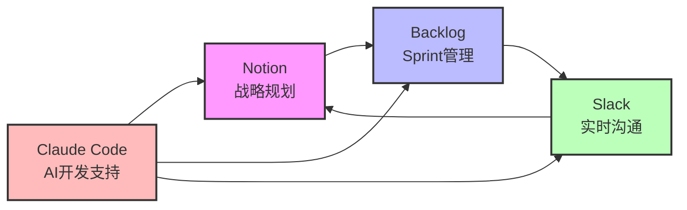
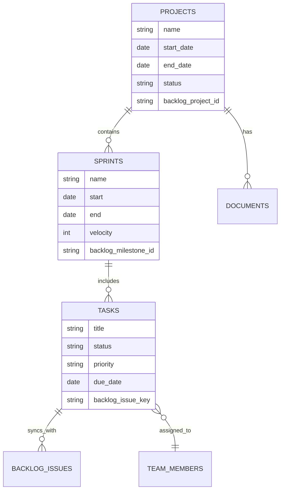
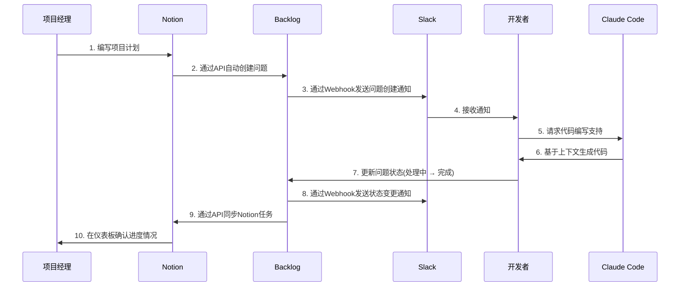
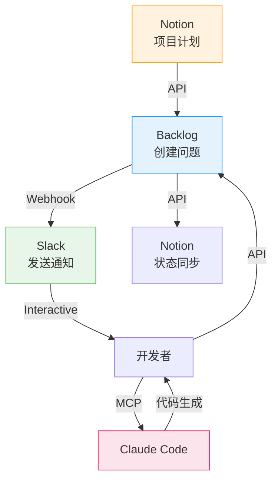

## 概述

### 项目失败的现实

根据2023年PMI(项目管理协会 Project Management Institute)报告,IT项目中<strong>35%完全失败</strong>,<strong>50%超出预算或进度</strong>。最大的原因是什么?正是<strong>低效的沟通</strong>和<strong>工具间信息断裂</strong>。

许多团队面临以下问题:

- Slack中讨论的内容未记录在Notion中
- Backlog的问题状态与实际进展不符
- 团队成员偏好不同工具导致信息分散
- 需要不断切换多个工具来了解项目现状

### 标准化的必要性

标准化项目管理工具可以实现:

1. <strong>信息一致性</strong>: 确保单一真实来源(Single Source of Truth)
2. <strong>节省时间</strong>: 工具切换时间减少50%以上
3. <strong>提高透明度</strong>: 所有利益相关者实时了解进展情况
4. <strong>可自动化</strong>: 通过自动化重复任务最大化生产力

### 四种工具的角色

本文介绍如何整合各具优势的四种工具:



- <strong>Notion</strong>: 项目规划、文档化、知识库
- <strong>Backlog</strong>: 问题跟踪、Sprint管理、版本管理
- <strong>Slack</strong>: 团队沟通、通知、工作流自动化
- <strong>Claude Code</strong>: 基于AI的编码支持、文档生成、项目上下文管理

## 各工具核心功能

### Notion: 战略规划中心

Notion扮演项目的<strong>大脑</strong>角色。以数据库为中心的架构可以结构化所有信息,成为与其他工具集成的中心。

#### 以数据库为中心的架构

Notion的核心是关系型数据库。项目管理的基本结构如下:



#### 项目模板活用方法

有效的Notion项目模板应包含以下要素:

1. <strong>项目仪表板</strong>
   - 进度摘要(完成率、剩余天数)
   - 主要里程碑时间线
   - 团队成员及角色
   - 重要链接(Backlog、GitHub、部署URL)

2. <strong>Sprint计划数据库</strong>
   - Sprint列表(画廊视图)
   - 各Sprint目标及成果
   - 燃尽图集成

3. <strong>任务数据库</strong>
   - 看板视图(按状态)
   - 按负责人视图
   - 按优先级视图

4. <strong>会议记录数据库</strong>
   - 会议日期、参与者、主要决定事项
   - 行动项跟踪

#### Notion API集成示例

使用Notion API可以自动与外部系统同步。以下是将Backlog问题创建为Notion任务的示例:

```javascript
// 使用Notion API创建任务
const { Client } = require('@notionhq/client');

// 初始化Notion客户端
const notion = new Client({
  auth: process.env.NOTION_API_KEY,
});

/**
 * 将Backlog问题添加到Notion数据库
 * @param {string} databaseId - Notion数据库ID
 * @param {Object} backlogIssue - Backlog问题对象
 */
async function createNotionTask(databaseId, backlogIssue) {
  try {
    const response = await notion.pages.create({
      parent: { database_id: databaseId },
      properties: {
        // 任务标题
        'Name': {
          title: [
            {
              text: {
                content: backlogIssue.summary,
              },
            },
          ],
        },
        // 状态(Select类型)
        'Status': {
          select: {
            name: mapBacklogStatusToNotion(backlogIssue.status.name),
          },
        },
        // 优先级
        'Priority': {
          select: {
            name: mapBacklogPriorityToNotion(backlogIssue.priority.name),
          },
        },
        // 负责人(Person类型)
        'Assignee': {
          people: backlogIssue.assignee ? [
            { id: await getNotionUserIdByEmail(backlogIssue.assignee.mailAddress) }
          ] : [],
        },
        // 截止日期
        'Due Date': {
          date: backlogIssue.dueDate ? {
            start: backlogIssue.dueDate,
          } : null,
        },
        // Backlog问题键(URL)
        'Backlog Issue': {
          url: `https://your-space.backlog.com/view/${backlogIssue.issueKey}`,
        },
        // Backlog问题键(文本)
        'Issue Key': {
          rich_text: [
            {
              text: {
                content: backlogIssue.issueKey,
              },
            },
          ],
        },
      },
    });

    console.log(`✅ 已创建Notion任务: ${response.id}`);
    return response;
  } catch (error) {
    console.error('❌ 创建Notion任务失败:', error.message);
    throw error;
  }
}

// 将Backlog状态映射到Notion状态
function mapBacklogStatusToNotion(backlogStatus) {
  const statusMap = {
    '未対応': 'To Do',
    '処理中': 'In Progress',
    '処理済み': 'Done',
    '完了': 'Done',
  };
  return statusMap[backlogStatus] || 'To Do';
}

// 将Backlog优先级映射到Notion优先级
function mapBacklogPriorityToNotion(backlogPriority) {
  const priorityMap = {
    '高': 'High',
    '中': 'Medium',
    '低': 'Low',
  };
  return priorityMap[backlogPriority] || 'Medium';
}

// 通过邮箱查找Notion用户ID
async function getNotionUserIdByEmail(email) {
  const users = await notion.users.list();
  const user = users.results.find(u => u.person?.email === email);
  return user?.id || null;
}

// 使用示例
const databaseId = 'your-database-id';
const backlogIssue = {
  issueKey: 'PROJECT-123',
  summary: '改善API响应速度',
  status: { name: '処理中' },
  priority: { name: '高' },
  assignee: { mailAddress: 'developer@example.com' },
  dueDate: '2025-11-10',
};

createNotionTask(databaseId, backlogIssue);
```

<strong>关键要点</strong>:
- Notion API采用RESTful结构,直观易用
- 必须准确指定与数据库模式匹配的属性类型
- 需要将外部系统的状态/优先级映射到Notion的Select选项

### Backlog: 敏捷Sprint管理

Backlog是一款日本开发的项目管理工具,其特点是集成了<strong>问题跟踪</strong>和<strong>Git仓库</strong>。

#### Sprint计划与跟踪

使用Backlog的里程碑功能作为Sprint的方法:

1. <strong>创建Sprint</strong>
   - 里程碑名称: "Sprint 23 (2025-11-04 〜 2025-11-17)"
   - 设置开始日期和结束日期
   - 编写Sprint目标

2. <strong>构建Sprint待办事项</strong>
   - 按优先级排序问题
   - 为每个问题分配故事点
   - 考虑团队速度(Velocity)选择适当数量

3. <strong>监控燃尽图</strong>
   - Backlog自动生成燃尽图
   - 每日站会检查图表
   - 调整以避免Sprint末期工作堆积

#### 问题跟踪最佳实践

有效问题管理的规则:

1. <strong>区分问题类型</strong>
   - 任务: 一般开发工作
   - Bug: 缺陷修复
   - 改进: 功能增强
   - 咨询: 需要提问或讨论

2. <strong>编写清晰的标题</strong>
   ```
   ❌ 不好的例子: "修复Bug"
   ✅ 好的例子: "[登录] 密码重置邮件发送失败"
   ```

3. <strong>详细说明模板</strong>
   ````markdown
   ## 概述
   用户请求密码重置时邮件未发送

   ## 重现步骤
   1. 在登录页面点击"找回密码"
   2. 输入注册的邮箱地址
   3. 点击"发送重置链接"

   ## 预期结果
   应通过邮件发送密码重置链接

   ## 实际结果
   显示"邮件发送失败"错误消息

   ## 环境
   - 浏览器: Chrome 119.0
   - 操作系统: macOS 14.0
   - 服务器环境: Production

   ## 附加信息
   - 错误日志: `SMTP connection timeout`
   - 最近更改: SMTP服务器IP变更 (2025-10-30)
   ````

4. <strong>使用标签</strong>
   - 前端、后端、DevOps等领域标签
   - 紧急、重要等优先级标签
   - 重构、技术债务等工作性质标签

#### Webhook设置示例

使用Backlog的Webhook可以在问题变更时自动通知其他系统:

```python
# Backlog Webhook处理(Flask示例)
from flask import Flask, request, jsonify
import requests
import os

app = Flask(__name__)

# Slack Webhook URL
SLACK_WEBHOOK_URL = os.getenv('SLACK_WEBHOOK_URL')
# Notion API设置
NOTION_API_KEY = os.getenv('NOTION_API_KEY')
NOTION_DATABASE_ID = os.getenv('NOTION_DATABASE_ID')

@app.route('/backlog-webhook', methods=['POST'])
def handle_backlog_webhook():
    """
    处理Backlog Webhook事件
    在问题创建/更新时发送Slack通知并同步Notion
    """
    try:
        # 解析Webhook payload
        payload = request.json
        event_type = payload.get('type')

        # 仅处理问题更新事件
        if event_type == 1:  # 问题添加
            handle_issue_created(payload)
        elif event_type == 2:  # 问题更新
            handle_issue_updated(payload)
        elif event_type == 3:  # 问题删除
            handle_issue_deleted(payload)

        return jsonify({'status': 'success'}), 200

    except Exception as e:
        print(f'❌ Webhook处理失败: {str(e)}')
        return jsonify({'status': 'error', 'message': str(e)}), 500

def handle_issue_created(payload):
    """创建新问题时"""
    content = payload['content']
    issue_key = content['key_id']
    issue_summary = content['summary']
    issue_url = f"https://your-space.backlog.com/view/{issue_key}"

    # 发送Slack通知
    send_slack_notification(
        text=f"🆕 已创建新问题",
        fields=[
            {"title": "问题编号", "value": issue_key, "short": True},
            {"title": "标题", "value": issue_summary, "short": False},
            {"title": "链接", "value": issue_url, "short": False},
        ]
    )

    # 在Notion中创建任务
    create_notion_task_from_backlog(content)

def handle_issue_updated(payload):
    """问题更新时"""
    content = payload['content']
    changes = content.get('changes', [])

    # 检测状态变更
    status_change = next((c for c in changes if c['field'] == 'status'), None)
    if status_change:
        issue_key = content['key_id']
        old_status = status_change['old_value']
        new_status = status_change['new_value']

        # Slack通知
        emoji_map = {
            '未対応': '📋',
            '処理中': '⚙️',
            '処理済み': '✅',
            '完了': '🎉',
        }

        send_slack_notification(
            text=f"{emoji_map.get(new_status, '📌')} 问题状态已变更",
            fields=[
                {"title": "问题编号", "value": issue_key, "short": True},
                {"title": "状态变更", "value": f"{old_status} → {new_status}", "short": True},
            ]
        )

        # 同步Notion任务状态
        update_notion_task_status(issue_key, new_status)

def handle_issue_deleted(payload):
    """问题删除时"""
    content = payload['content']
    issue_key = content['key_id']

    # Slack通知
    send_slack_notification(
        text=f"🗑️ 问题{issue_key}已删除"
    )

    # 同时删除或归档Notion中的任务
    archive_notion_task(issue_key)

def send_slack_notification(text, fields=None):
    """发送Slack通知"""
    payload = {
        "text": text,
        "attachments": [
            {
                "color": "#36a64f",
                "fields": fields or []
            }
        ] if fields else []
    }

    requests.post(SLACK_WEBHOOK_URL, json=payload)

def create_notion_task_from_backlog(backlog_issue):
    """从Backlog问题创建Notion任务"""
    # Notion API调用(类似前面的JavaScript示例)
    headers = {
        "Authorization": f"Bearer {NOTION_API_KEY}",
        "Content-Type": "application/json",
        "Notion-Version": "2022-06-28"
    }

    data = {
        "parent": {"database_id": NOTION_DATABASE_ID},
        "properties": {
            "Name": {
                "title": [{"text": {"content": backlog_issue['summary']}}]
            },
            "Issue Key": {
                "rich_text": [{"text": {"content": str(backlog_issue['key_id'])}}]
            },
            "Status": {
                "select": {"name": "To Do"}
            }
        }
    }

    response = requests.post(
        "https://api.notion.com/v1/pages",
        headers=headers,
        json=data
    )

    if response.status_code == 200:
        print(f"✅ 已创建Notion任务: {backlog_issue['key_id']}")
    else:
        print(f"❌ 创建Notion任务失败: {response.text}")

def update_notion_task_status(issue_key, new_status):
    """更新Notion任务状态"""
    # 1. 通过Issue Key搜索Notion页面
    # 2. 通过页面ID更新状态
    # (省略实现 - 实际使用Notion搜索API)
    pass

def archive_notion_task(issue_key):
    """归档Notion任务"""
    # 将Notion页面更改为归档状态
    # (省略实现)
    pass

if __name__ == '__main__':
    app.run(host='0.0.0.0', port=5000)
```

<strong>Webhook设置步骤</strong>:
1. Backlog项目设置 → "Webhook"菜单
2. 添加Webhook URL: `https://your-server.com/backlog-webhook`
3. 选择事件: "问题添加"、"问题更新"、"问题删除"
4. 保存后测试发送

### Slack: 实时协作中心

Slack是团队的<strong>神经系统</strong>。所有通知汇聚于此,快速决策在这里进行。

#### 频道结构化策略

有效的Slack频道结构能清晰地分离信息:

```
📁 按项目分类的频道
  ├─ #proj-mobile-app-renewal (移动应用更新项目)
  ├─ #proj-api-migration (API迁移项目)
  └─ #proj-admin-dashboard (管理员仪表板项目)

📁 按团队分类的频道
  ├─ #team-frontend (前端团队)
  ├─ #team-backend (后端团队)
  └─ #team-devops (DevOps团队)

📁 自动化通知频道
  ├─ #alerts-backlog (Backlog问题通知)
  ├─ #alerts-github (GitHub PR/Commit通知)
  ├─ #alerts-deploy (部署通知)
  └─ #alerts-monitoring (服务器监控通知)

📁 通用频道
  ├─ #general (全公司公告)
  ├─ #random (自由话题)
  └─ #retrospective (回顾与改进)
```

<strong>频道命名规则</strong>:
- `proj-` : 项目相关
- `team-` : 团队相关
- `alerts-` : 自动化通知
- 使用kebab-case命名

#### 构建自动化工作流

使用Slack Workflow Builder可以无需编码构建自动化:

<strong>示例1: Sprint启动检查清单</strong>

1. 触发器: 每周一上午10点
2. 操作:
   - 向`#proj-mobile-app-renewal`频道发送消息
   - 显示Sprint启动检查清单
   ```
   🚀 Sprint 23 启动!

   [ ] 创建Backlog里程碑
   [ ] 创建Notion Sprint页面
   [ ] 分享Sprint目标
   [ ] 确认每日站会时间
   ```

<strong>示例2: 入职自动化</strong>

1. 触发器: 新成员加入频道
2. 操作:
   - 通过DM发送欢迎消息
   - 分享项目Notion页面链接
   - 引导创建Backlog账户
   - 分配导师

#### Slack Bot示例代码

使用Slack Bot API可以实现更复杂的自动化。以下是处理Slash Command的示例:

```javascript
// Slack Bot - Slash Command处理(Node.js + Express)
const { App } = require('@slack/bolt');
const axios = require('axios');

// 初始化Slack App
const app = new App({
  token: process.env.SLACK_BOT_TOKEN,
  signingSecret: process.env.SLACK_SIGNING_SECRET,
  socketMode: true,
  appToken: process.env.SLACK_APP_TOKEN,
});

/**
 * /sprint-status命令: 查询当前Sprint状态
 * 使用示例: /sprint-status
 */
app.command('/sprint-status', async ({ command, ack, respond }) => {
  // 立即响应Slack(需在3秒内响应)
  await ack();

  try {
    // 从Backlog API查询当前Sprint信息
    const sprintData = await fetchCurrentSprintFromBacklog();

    // 计算Sprint统计
    const totalIssues = sprintData.issues.length;
    const completedIssues = sprintData.issues.filter(i => i.status.name === '完了').length;
    const inProgressIssues = sprintData.issues.filter(i => i.status.name === '処理中').length;
    const todoIssues = totalIssues - completedIssues - inProgressIssues;
    const completionRate = Math.round((completedIssues / totalIssues) * 100);

    // Slack消息格式化
    await respond({
      response_type: 'in_channel', // 在频道公开
      blocks: [
        {
          type: 'header',
          text: {
            type: 'plain_text',
            text: `📊 ${sprintData.name} 进度情况`,
          },
        },
        {
          type: 'section',
          fields: [
            {
              type: 'mrkdwn',
              text: `*期间*\n${sprintData.startDate} 〜 ${sprintData.endDate}`,
            },
            {
              type: 'mrkdwn',
              text: `*完成率*\n${completionRate}% (${completedIssues}/${totalIssues})`,
            },
          ],
        },
        {
          type: 'section',
          text: {
            type: 'mrkdwn',
            text: `✅ 已完成: ${completedIssues}个\n⚙️ 进行中: ${inProgressIssues}个\n📋 待处理: ${todoIssues}个`,
          },
        },
        {
          type: 'divider',
        },
        {
          type: 'section',
          text: {
            type: 'mrkdwn',
            text: `<${sprintData.backlogUrl}|在Backlog中查看详情>`,
          },
        },
      ],
    });
  } catch (error) {
    await respond({
      response_type: 'ephemeral', // 仅自己可见
      text: `❌ 获取Sprint信息失败: ${error.message}`,
    });
  }
});

/**
 * /create-task命令: 快速创建任务
 * 使用示例: /create-task [登录] 添加社交登录功能
 */
app.command('/create-task', async ({ command, ack, respond, client }) => {
  await ack();

  // 解析任务标题
  const taskTitle = command.text.trim();

  if (!taskTitle) {
    await respond({
      response_type: 'ephemeral',
      text: '使用方法: /create-task [任务标题]',
    });
    return;
  }

  // 打开Modal(输入详细信息)
  await client.views.open({
    trigger_id: command.trigger_id,
    view: {
      type: 'modal',
      callback_id: 'create_task_modal',
      title: {
        type: 'plain_text',
        text: '创建新任务',
      },
      submit: {
        type: 'plain_text',
        text: '创建',
      },
      blocks: [
        {
          type: 'input',
          block_id: 'task_title',
          label: {
            type: 'plain_text',
            text: '任务标题',
          },
          element: {
            type: 'plain_text_input',
            action_id: 'title_input',
            initial_value: taskTitle,
          },
        },
        {
          type: 'input',
          block_id: 'task_description',
          label: {
            type: 'plain_text',
            text: '说明',
          },
          element: {
            type: 'plain_text_input',
            action_id: 'description_input',
            multiline: true,
          },
          optional: true,
        },
        {
          type: 'input',
          block_id: 'task_priority',
          label: {
            type: 'plain_text',
            text: '优先级',
          },
          element: {
            type: 'static_select',
            action_id: 'priority_select',
            options: [
              { text: { type: 'plain_text', text: '高' }, value: 'high' },
              { text: { type: 'plain_text', text: '中' }, value: 'medium' },
              { text: { type: 'plain_text', text: '低' }, value: 'low' },
            ],
            initial_option: { text: { type: 'plain_text', text: '中' }, value: 'medium' },
          },
        },
      ],
    },
  });
});

/**
 * Modal提交处理
 */
app.view('create_task_modal', async ({ ack, body, view, client }) => {
  await ack();

  // 从Modal提取输入值
  const values = view.state.values;
  const title = values.task_title.title_input.value;
  const description = values.task_description.description_input.value || '';
  const priority = values.task_priority.priority_select.selected_option.value;

  try {
    // 在Backlog创建问题
    const backlogIssue = await createBacklogIssue({
      summary: title,
      description: description,
      priority: priority,
    });

    // 在Notion创建任务
    await createNotionTask({
      title: title,
      description: description,
      priority: priority,
      backlogIssueKey: backlogIssue.issueKey,
    });

    // 发送成功消息
    await client.chat.postMessage({
      channel: body.user.id, // 通过DM发送
      text: `✅ 已创建任务!\n• Backlog: ${backlogIssue.url}\n• Notion: (已自动同步)`,
    });
  } catch (error) {
    await client.chat.postMessage({
      channel: body.user.id,
      text: `❌ 创建任务失败: ${error.message}`,
    });
  }
});

/**
 * Backlog API - 创建问题
 */
async function createBacklogIssue({ summary, description, priority }) {
  const priorityMap = { high: 2, medium: 3, low: 4 };

  const response = await axios.post(
    `https://your-space.backlog.com/api/v2/issues`,
    {
      projectId: process.env.BACKLOG_PROJECT_ID,
      summary: summary,
      description: description,
      issueTypeId: 1, // 任务
      priorityId: priorityMap[priority],
    },
    {
      params: { apiKey: process.env.BACKLOG_API_KEY },
    }
  );

  return {
    issueKey: response.data.issueKey,
    url: `https://your-space.backlog.com/view/${response.data.issueKey}`,
  };
}

/**
 * Notion API - 创建任务
 */
async function createNotionTask({ title, description, priority, backlogIssueKey }) {
  // 复用前面编写的Notion API代码
  // (省略实现)
}

/**
 * Backlog API - 查询当前Sprint信息
 */
async function fetchCurrentSprintFromBacklog() {
  // 调用Backlog API
  // (省略实现 - 实际使用里程碑API)
  return {
    name: 'Sprint 23',
    startDate: '2025-11-04',
    endDate: '2025-11-17',
    issues: [
      { status: { name: '完了' } },
      { status: { name: '処理中' } },
      { status: { name: '未対応' } },
      // ... 更多问题
    ],
    backlogUrl: 'https://your-space.backlog.com/milestone/123',
  };
}

// 启动Slack Bot
(async () => {
  await app.start();
  console.log('⚡️ Slack Bot已运行!');
})();
```

<strong>创建Slash Command的方法</strong>:
1. 在[Slack API控制台](https://api.slack.com/apps)创建应用
2. 在"Slash Commands"菜单添加命令
   - Command: `/sprint-status`
   - Request URL: `https://your-server.com/slack/commands`
3. 添加Bot Token Scopes权限:
   - `commands`
   - `chat:write`
   - `users:read`
4. 将应用安装到工作区

### Claude Code: 基于AI的开发支持

Claude Code是项目的<strong>AI助手</strong>。它支持代码编写、文档化、重构,并理解项目上下文。

#### CLAUDE.md编写方法

`CLAUDE.md`文件是Claude Code理解项目的核心文档。有效的结构如下:

````markdown
# CLAUDE.md

## 项目概述

本项目是[项目说明]。

**主要技术栈**:
- Frontend: React 18, TypeScript, Tailwind CSS
- Backend: Node.js, Express, PostgreSQL
- Infrastructure: AWS (EC2, RDS, S3)

**开发环境**:
```bash
# 运行本地开发服务器
npm run dev

# 运行测试
npm test

# 生产构建
npm run build
```

## 架构

### 目录结构

```
src/
├── components/      # React组件
├── pages/          # Next.js页面
├── api/            # API路由
├── lib/            # 工具函数
├── hooks/          # 自定义Hooks
└── styles/         # 全局样式
```

### 主要组件

**TaskCard**: 显示单个任务的卡片组件
- Props: `task` (Task类型), `onStatusChange` (回调)
- 位置: `src/components/TaskCard.tsx`

**ProjectDashboard**: 项目仪表板页面
- 功能: Sprint进度、燃尽图、团队成员列表
- 位置: `src/pages/dashboard.tsx`

## 编码规则

### TypeScript

- 所有函数必须明确类型
- 禁止使用`any`类型
- Interface命名: 不使用`I`前缀(例: `User`、`Task`)

### React

- 使用函数式组件
- 遵守Hooks规则
- Props类型使用interface定义

### API

- 遵守RESTful设计原则
- 错误响应采用统一格式:
  ```json
  {
    "error": {
      "code": "VALIDATION_ERROR",
      "message": "用户友好的消息"
    }
  }
  ```

## 集成设置

### Notion

- Database ID: `abc123...`
- API Key: 环境变量 `NOTION_API_KEY`
- 任务数据库模式:
  - Name (title)
  - Status (select): To Do, In Progress, Done
  - Priority (select): High, Medium, Low
  - Assignee (person)
  - Due Date (date)

### Backlog

- Space Key: `YOUR_SPACE`
- Project ID: `12345`
- API Key: 环境变量 `BACKLOG_API_KEY`

### Slack

- Webhook URL: 环境变量 `SLACK_WEBHOOK_URL`
- 通知频道: `#alerts-backlog`

## 部署

生产部署通过GitHub Actions自动化:

1. 推送到`main`分支
2. 执行CI/CD管道
3. 测试通过后自动部署

## 故障排除

**Notion API 429错误**:
- Rate limit超出
- 解决方案: 保持请求间隔3秒以上

**Backlog Webhook失败**:
- 检查IP白名单
- 验证Webhook URL有效性

## 参考资料

- [Notion API文档](https://developers.notion.com/)
- [Backlog API文档](https://developer.nulab.com/docs/backlog/)
- [Slack API文档](https://api.slack.com/)
````

<strong>CLAUDE.md编写技巧</strong>:
1. <strong>具体化</strong>: "保持代码整洁" ✗ → "函数最多50行" ✓
2. <strong>包含示例</strong>: 通过示例展示理想的代码风格
3. <strong>频繁更新</strong>: 项目变更时一起修改CLAUDE.md

#### MCP服务器设置

设置MCP(Model Context Protocol)服务器可使Claude Code访问外部系统。

`.claude/settings.local.json`文件示例:

```json
{
  "mcpServers": {
    "notion": {
      "command": "npx",
      "args": [
        "-y",
        "@notionhq/client"
      ],
      "env": {
        "NOTION_API_KEY": "secret_xxx..."
      }
    },
    "backlog": {
      "command": "node",
      "args": [
        "./mcp-servers/backlog-server.js"
      ],
      "env": {
        "BACKLOG_API_KEY": "your_api_key",
        "BACKLOG_SPACE": "your-space"
      }
    },
    "slack": {
      "command": "node",
      "args": [
        "./mcp-servers/slack-server.js"
      ],
      "env": {
        "SLACK_BOT_TOKEN": "xoxb-...",
        "SLACK_SIGNING_SECRET": "xxx..."
      }
    }
  }
}
```

<strong>MCP服务器实现示例</strong> (`mcp-servers/backlog-server.js`):

```javascript
// Backlog MCP服务器
const axios = require('axios');

class BacklogMCPServer {
  constructor() {
    this.apiKey = process.env.BACKLOG_API_KEY;
    this.space = process.env.BACKLOG_SPACE;
    this.baseUrl = `https://${this.space}.backlog.com/api/v2`;
  }

  // 根据MCP协议定义工具
  async getTools() {
    return [
      {
        name: 'backlog_get_issues',
        description: '查询Backlog项目的问题列表',
        inputSchema: {
          type: 'object',
          properties: {
            projectId: { type: 'string', description: '项目ID' },
            statusId: { type: 'array', description: '状态ID数组(可选)' },
          },
          required: ['projectId'],
        },
      },
      {
        name: 'backlog_create_issue',
        description: '创建新的Backlog问题',
        inputSchema: {
          type: 'object',
          properties: {
            projectId: { type: 'string', description: '项目ID' },
            summary: { type: 'string', description: '问题标题' },
            description: { type: 'string', description: '问题说明' },
            issueTypeId: { type: 'number', description: '问题类型ID' },
            priorityId: { type: 'number', description: '优先级ID' },
          },
          required: ['projectId', 'summary', 'issueTypeId', 'priorityId'],
        },
      },
    ];
  }

  // 执行工具
  async executeTool(toolName, args) {
    switch (toolName) {
      case 'backlog_get_issues':
        return this.getIssues(args);
      case 'backlog_create_issue':
        return this.createIssue(args);
      default:
        throw new Error(`Unknown tool: ${toolName}`);
    }
  }

  async getIssues({ projectId, statusId }) {
    const params = {
      apiKey: this.apiKey,
      projectId: [projectId],
    };

    if (statusId) {
      params.statusId = statusId;
    }

    const response = await axios.get(`${this.baseUrl}/issues`, { params });
    return response.data;
  }

  async createIssue({ projectId, summary, description, issueTypeId, priorityId }) {
    const response = await axios.post(
      `${this.baseUrl}/issues`,
      {
        projectId,
        summary,
        description: description || '',
        issueTypeId,
        priorityId,
      },
      {
        params: { apiKey: this.apiKey },
      }
    );

    return response.data;
  }
}

// 启动MCP服务器
const server = new BacklogMCPServer();
// ... MCP协议通信逻辑(stdin/stdout)
```

#### 项目上下文管理

Claude Code要有效支持项目,需要提供适当的上下文:

1. <strong>明确文件结构</strong>
   - 使用`.gitignore`排除不必要的文件
   - 在README、CLAUDE.md中明确主要文件位置

2. <strong>清晰传达意图</strong>
   ```
   ❌ 不好的例子: "修改代码"
   ✅ 好的例子: "修改TaskCard组件的onStatusChange回调以调用Notion API。状态变更时也需要更新Notion数据库。"
   ```

3. <strong>提供相关文件</strong>
   - 同时提及需要修改的文件及相关的类型定义、工具函数等

4. <strong>明确约束条件</strong>
   - "必须遵守TypeScript strict模式"
   - "不要使用React 18的Concurrent功能"

## 构建集成工作流

现在让我们看看如何将四种工具集成为一个有机系统。

### 架构概述

集成工作流由以下事件驱动架构构成:



<strong>数据流</strong>:



### 自动化场景

#### 1. 项目创建流程

<strong>触发器</strong>: 在Notion创建新项目页面

<strong>工作流</strong>:
1. 在Notion Database添加项目
2. Notion API Webhook检测变更
3. 自动化脚本创建Backlog项目
4. 在Slack创建项目专用频道
5. 自动邀请团队成员

<strong>实现示例</strong>:

```javascript
// 项目创建自动化脚本
const { Client } = require('@notionhq/client');
const axios = require('axios');

const notion = new Client({ auth: process.env.NOTION_API_KEY });

/**
 * 在Notion创建新项目时自动设置Backlog和Slack
 */
async function onNotionProjectCreated(projectPageId) {
  // 1. 获取Notion项目信息
  const projectPage = await notion.pages.retrieve({ page_id: projectPageId });
  const projectName = projectPage.properties.Name.title[0].text.content;
  const startDate = projectPage.properties['Start Date'].date.start;
  const endDate = projectPage.properties['End Date'].date.end;

  console.log(`📁 检测到新项目: ${projectName}`);

  // 2. 创建Backlog项目
  const backlogProject = await createBacklogProject({
    name: projectName,
    key: generateProjectKey(projectName),
    chartEnabled: true,
    subtaskingEnabled: true,
  });

  console.log(`✅ 已创建Backlog项目: ${backlogProject.projectKey}`);

  // 3. 在Notion保存Backlog项目ID
  await notion.pages.update({
    page_id: projectPageId,
    properties: {
      'Backlog Project ID': {
        rich_text: [{ text: { content: backlogProject.id.toString() } }],
      },
      'Backlog URL': {
        url: `https://your-space.backlog.com/projects/${backlogProject.projectKey}`,
      },
    },
  });

  // 4. 创建Slack频道
  const channelName = `proj-${projectName.toLowerCase().replace(/\s+/g, '-')}`;
  const slackChannel = await createSlackChannel(channelName, {
    topic: `${projectName} 项目协作频道`,
    description: `期间: ${startDate} 〜 ${endDate}`,
  });

  console.log(`✅ 已创建Slack频道: #${channelName}`);

  // 5. 在Notion保存Slack频道信息
  await notion.pages.update({
    page_id: projectPageId,
    properties: {
      'Slack Channel': {
        rich_text: [{ text: { content: `#${channelName}` } }],
      },
    },
  });

  // 6. 向Slack发送项目启动消息
  await sendSlackMessage(slackChannel.id, {
    text: `🚀 ${projectName} 项目已启动!`,
    blocks: [
      {
        type: 'header',
        text: { type: 'plain_text', text: `🚀 ${projectName}` },
      },
      {
        type: 'section',
        fields: [
          { type: 'mrkdwn', text: `*期间*\n${startDate} 〜 ${endDate}` },
          { type: 'mrkdwn', text: `*Backlog*\n<https://your-space.backlog.com/projects/${backlogProject.projectKey}|查看项目>` },
        ],
      },
      {
        type: 'section',
        text: {
          type: 'mrkdwn',
          text: `*Notion文档*\nhttps://notion.so/${projectPageId}`,
        },
      },
    ],
  });

  console.log('🎉 项目设置完成!');
}

// 生成项目键(例: "Mobile App Renewal" → "MAR")
function generateProjectKey(projectName) {
  return projectName
    .split(' ')
    .map(word => word[0].toUpperCase())
    .join('')
    .slice(0, 3);
}

// 创建Backlog项目
async function createBacklogProject({ name, key, chartEnabled, subtaskingEnabled }) {
  const response = await axios.post(
    'https://your-space.backlog.com/api/v2/projects',
    { name, key, chartEnabled, subtaskingEnabled },
    { params: { apiKey: process.env.BACKLOG_API_KEY } }
  );
  return response.data;
}

// 创建Slack频道
async function createSlackChannel(name, { topic, description }) {
  const response = await axios.post(
    'https://slack.com/api/conversations.create',
    { name },
    {
      headers: {
        'Authorization': `Bearer ${process.env.SLACK_BOT_TOKEN}`,
        'Content-Type': 'application/json',
      },
    }
  );

  const channelId = response.data.channel.id;

  // 设置主题
  await axios.post(
    'https://slack.com/api/conversations.setTopic',
    { channel: channelId, topic },
    {
      headers: {
        'Authorization': `Bearer ${process.env.SLACK_BOT_TOKEN}`,
        'Content-Type': 'application/json',
      },
    }
  );

  return response.data.channel;
}

// 发送Slack消息
async function sendSlackMessage(channelId, message) {
  await axios.post(
    'https://slack.com/api/chat.postMessage',
    { channel: channelId, ...message },
    {
      headers: {
        'Authorization': `Bearer ${process.env.SLACK_BOT_TOKEN}`,
        'Content-Type': 'application/json',
      },
    }
  );
}
```

#### 2. 任务同步

<strong>触发器</strong>: 在Backlog创建/更新问题

<strong>工作流</strong>:
1. Backlog Webhook检测问题变更
2. 通过Notion API搜索对应任务
3. 如果任务不存在则创建,存在则更新
4. 向Slack发送变更通知

#### 3. 状态更新链

<strong>触发器</strong>: 开发者将Backlog问题状态改为"完成"

<strong>工作流</strong>:
1. 接收Backlog Webhook
2. 将Notion任务状态更新为"Done"
3. GitHub PR自动合并(可选)
4. 向Slack发送完成祝贺消息
5. 自动更新Sprint燃尽图

#### 4. 事件管理

<strong>触发器</strong>: 生产监控警报

<strong>工作流</strong>:
1. 监控系统(Datadog、Sentry等)检测错误
2. 向Slack `#alerts-monitoring`频道发送紧急通知
3. 在Backlog自动创建"Bug"问题(优先级: 高)
4. 在Notion记录事件日志
5. 向值班工程师发送DM

<strong>实现示例</strong>:

```python
# 事件自动化处理(Python + Flask)
from flask import Flask, request, jsonify
import requests
import os

app = Flask(__name__)

@app.route('/incident-webhook', methods=['POST'])
def handle_incident():
    """
    接收来自监控系统的事件Webhook
    """
    incident = request.json

    # 1. 解析事件信息
    severity = incident.get('severity', 'high')
    message = incident.get('message', '')
    service = incident.get('service', 'Unknown')
    timestamp = incident.get('timestamp', '')

    # 2. Slack紧急通知
    send_slack_alert(severity, message, service, timestamp)

    # 3. Backlog自动创建Bug问题
    backlog_issue = create_backlog_bug_issue(severity, message, service)

    # 4. Notion记录事件日志
    create_notion_incident_log(severity, message, service, timestamp, backlog_issue['issueKey'])

    # 5. 向值班工程师发送DM
    if severity == 'critical':
        notify_oncall_engineer(message, backlog_issue['url'])

    return jsonify({'status': 'success'}), 200

def send_slack_alert(severity, message, service, timestamp):
    """发送Slack紧急通知"""
    color_map = {
        'critical': '#FF0000',  # 红色
        'high': '#FF9900',      # 橙色
        'medium': '#FFFF00',    # 黄色
        'low': '#00FF00',       # 绿色
    }

    emoji_map = {
        'critical': '🚨',
        'high': '⚠️',
        'medium': '⚡',
        'low': 'ℹ️',
    }

    webhook_url = os.getenv('SLACK_WEBHOOK_URL')
    payload = {
        "text": f"{emoji_map.get(severity, '⚠️')} {severity.upper()} 事件发生!",
        "attachments": [
            {
                "color": color_map.get(severity, '#FF9900'),
                "fields": [
                    {"title": "服务", "value": service, "short": True},
                    {"title": "严重程度", "value": severity.upper(), "short": True},
                    {"title": "消息", "value": message, "short": False},
                    {"title": "发生时间", "value": timestamp, "short": False},
                ],
            }
        ]
    }

    requests.post(webhook_url, json=payload)

def create_backlog_bug_issue(severity, message, service):
    """在Backlog创建Bug问题"""
    priority_map = {
        'critical': 2,  # 高
        'high': 2,
        'medium': 3,    # 中
        'low': 4,       # 低
    }

    response = requests.post(
        f"https://your-space.backlog.com/api/v2/issues",
        params={'apiKey': os.getenv('BACKLOG_API_KEY')},
        json={
            'projectId': os.getenv('BACKLOG_PROJECT_ID'),
            'summary': f"[{severity.upper()}] {service}: {message[:50]}...",
            'description': f"## 事件详情\n\n**服务**: {service}\n**严重程度**: {severity}\n**消息**: {message}",
            'issueTypeId': 3,  # Bug
            'priorityId': priority_map.get(severity, 3),
        }
    )

    issue_data = response.json()
    return {
        'issueKey': issue_data['issueKey'],
        'url': f"https://your-space.backlog.com/view/{issue_data['issueKey']}",
    }

def create_notion_incident_log(severity, message, service, timestamp, backlog_issue_key):
    """在Notion记录事件日志"""
    headers = {
        "Authorization": f"Bearer {os.getenv('NOTION_API_KEY')}",
        "Content-Type": "application/json",
        "Notion-Version": "2022-06-28"
    }

    data = {
        "parent": {"database_id": os.getenv('NOTION_INCIDENT_DB_ID')},
        "properties": {
            "Title": {
                "title": [{"text": {"content": f"[{severity.upper()}] {service}"}}]
            },
            "Severity": {
                "select": {"name": severity.capitalize()}
            },
            "Service": {
                "select": {"name": service}
            },
            "Timestamp": {
                "date": {"start": timestamp}
            },
            "Backlog Issue": {
                "rich_text": [{"text": {"content": backlog_issue_key}}]
            },
            "Status": {
                "select": {"name": "Investigating"}
            }
        }
    }

    requests.post("https://api.notion.com/v1/pages", headers=headers, json=data)

def notify_oncall_engineer(message, backlog_url):
    """向值班工程师发送DM"""
    oncall_user_id = os.getenv('ONCALL_ENGINEER_SLACK_ID')

    requests.post(
        'https://slack.com/api/chat.postMessage',
        headers={
            'Authorization': f"Bearer {os.getenv('SLACK_BOT_TOKEN')}",
            'Content-Type': 'application/json',
        },
        json={
            'channel': oncall_user_id,
            'text': f"🚨 紧急事件发生!\n\n{message}\n\n需要响应: {backlog_url}",
        }
    )

if __name__ == '__main__':
    app.run(host='0.0.0.0', port=5001)
```

### 实战代码示例

#### 集成仪表板API

将所有工具的数据整合到单个API的示例:

```typescript
// 集成仪表板API(TypeScript + Express)
import express, { Request, Response } from 'express';
import { Client as NotionClient } from '@notionhq/client';
import axios from 'axios';

const app = express();
const notion = new NotionClient({ auth: process.env.NOTION_API_KEY });

interface DashboardData {
  project: {
    name: string;
    progress: number;
    dueDate: string;
  };
  sprint: {
    name: string;
    velocity: number;
    completedTasks: number;
    totalTasks: number;
  };
  team: {
    members: Array<{
      name: string;
      tasksInProgress: number;
      tasksCompleted: number;
    }>;
  };
  recentActivity: Array<{
    type: 'issue_created' | 'issue_updated' | 'slack_message';
    timestamp: string;
    description: string;
  }>;
}

/**
 * 查询集成仪表板数据
 * 整合Notion、Backlog、Slack的数据
 */
app.get('/api/dashboard/:projectId', async (req: Request, res: Response) => {
  const { projectId } = req.params;

  try {
    // 1. 从Notion获取项目信息
    const notionProject = await getNotionProject(projectId);

    // 2. 从Backlog获取Sprint信息
    const backlogSprint = await getBacklogCurrentSprint(notionProject.backlogProjectId);

    // 3. 统计团队成员工作现状
    const teamStats = await calculateTeamStats(notionProject.backlogProjectId);

    // 4. 整合最近活动(Backlog + Slack)
    const recentActivity = await getRecentActivity(
      notionProject.backlogProjectId,
      notionProject.slackChannelId
    );

    // 5. 返回集成数据
    const dashboardData: DashboardData = {
      project: {
        name: notionProject.name,
        progress: calculateProgress(backlogSprint),
        dueDate: notionProject.endDate,
      },
      sprint: {
        name: backlogSprint.name,
        velocity: backlogSprint.velocity,
        completedTasks: backlogSprint.completedIssues.length,
        totalTasks: backlogSprint.totalIssues,
      },
      team: {
        members: teamStats,
      },
      recentActivity,
    };

    res.json(dashboardData);
  } catch (error) {
    console.error('Dashboard data fetch failed:', error);
    res.status(500).json({ error: 'Failed to fetch dashboard data' });
  }
});

async function getNotionProject(projectId: string) {
  const page = await notion.pages.retrieve({ page_id: projectId });

  // @ts-ignore - 简化Notion API类型
  return {
    name: page.properties.Name.title[0].text.content,
    backlogProjectId: page.properties['Backlog Project ID'].rich_text[0].text.content,
    slackChannelId: page.properties['Slack Channel ID'].rich_text[0].text.content,
    endDate: page.properties['End Date'].date.start,
  };
}

async function getBacklogCurrentSprint(projectId: string) {
  // 通过Backlog API查询当前活动里程碑
  const milestonesResponse = await axios.get(
    `https://your-space.backlog.com/api/v2/projects/${projectId}/milestones`,
    { params: { apiKey: process.env.BACKLOG_API_KEY } }
  );

  const activeMilestone = milestonesResponse.data.find((m: any) => {
    const now = new Date();
    const start = new Date(m.startDate);
    const end = new Date(m.releaseDueDate);
    return now >= start && now <= end;
  });

  if (!activeMilestone) {
    throw new Error('No active sprint found');
  }

  // 查询里程碑的问题列表
  const issuesResponse = await axios.get(
    `https://your-space.backlog.com/api/v2/issues`,
    {
      params: {
        apiKey: process.env.BACKLOG_API_KEY,
        projectId: [projectId],
        milestoneId: [activeMilestone.id],
      },
    }
  );

  const issues = issuesResponse.data;
  const completedIssues = issues.filter((i: any) => i.status.name === '完了');

  return {
    name: activeMilestone.name,
    velocity: calculateVelocity(issues),
    completedIssues,
    totalIssues: issues.length,
  };
}

function calculateProgress(sprint: any): number {
  if (sprint.totalIssues === 0) return 0;
  return Math.round((sprint.completedIssues.length / sprint.totalIssues) * 100);
}

function calculateVelocity(issues: any[]): number {
  // 计算故事点总和(使用自定义字段)
  return issues.reduce((sum, issue) => {
    const storyPoints = issue.customFields?.find((f: any) => f.name === 'Story Points')?.value || 0;
    return sum + parseInt(storyPoints);
  }, 0);
}

async function calculateTeamStats(projectId: string) {
  const issuesResponse = await axios.get(
    `https://your-space.backlog.com/api/v2/issues`,
    {
      params: {
        apiKey: process.env.BACKLOG_API_KEY,
        projectId: [projectId],
      },
    }
  );

  const issues = issuesResponse.data;
  const teamStats = new Map();

  issues.forEach((issue: any) => {
    if (!issue.assignee) return;

    const name = issue.assignee.name;
    if (!teamStats.has(name)) {
      teamStats.set(name, { name, tasksInProgress: 0, tasksCompleted: 0 });
    }

    const stats = teamStats.get(name);
    if (issue.status.name === '処理中') {
      stats.tasksInProgress++;
    } else if (issue.status.name === '完了') {
      stats.tasksCompleted++;
    }
  });

  return Array.from(teamStats.values());
}

async function getRecentActivity(projectId: string, slackChannelId: string) {
  // Backlog最近活动
  const backlogActivity = await axios.get(
    `https://your-space.backlog.com/api/v2/projects/${projectId}/activities`,
    {
      params: {
        apiKey: process.env.BACKLOG_API_KEY,
        count: 10,
      },
    }
  );

  // Slack最近消息
  const slackHistory = await axios.get(
    'https://slack.com/api/conversations.history',
    {
      params: { channel: slackChannelId, limit: 10 },
      headers: { Authorization: `Bearer ${process.env.SLACK_BOT_TOKEN}` },
    }
  );

  // 按时间顺序排序两个来源的活动
  const activities = [
    ...backlogActivity.data.map((a: any) => ({
      type: a.type === 1 ? 'issue_created' : 'issue_updated',
      timestamp: a.created,
      description: `${a.content.summary}`,
    })),
    ...slackHistory.data.messages.map((m: any) => ({
      type: 'slack_message',
      timestamp: m.ts,
      description: m.text.slice(0, 100),
    })),
  ];

  return activities
    .sort((a, b) => new Date(b.timestamp).getTime() - new Date(a.timestamp).getTime())
    .slice(0, 20);
}

app.listen(3000, () => {
  console.log('🚀 集成仪表板API正在运行: http://localhost:3000');
});
```

## 标准化流程导入阶段

在组织中引入项目管理标准化需要<strong>渐进式方法</strong>。一次性改变所有内容失败的概率很高。

### Phase 1: 评估(1〜2周)

<strong>目标</strong>: 了解当前状况并识别改进机会

<strong>活动</strong>:
1. <strong>调查当前工具使用情况</strong>
   - 列出各团队使用的工具
   - 调查各工具的使用频率和满意度
   - 识别信息断裂发生的地方

2. <strong>收集痛点</strong>
   - 访谈: "项目管理中最不便之处是什么?"
   - 识别时间浪费因素(例: 工具切换时间、重复输入)
   - 收集沟通错误案例

3. <strong>基准调查</strong>
   - 研究类似规模组织的案例
   - 文档化最佳实践

<strong>产出物</strong>:
- 现状分析报告
- 痛点优先级列表
- 预期ROI计算书

### Phase 2: 设计(3〜6周)

<strong>目标</strong>: 设计标准流程和集成架构

<strong>活动</strong>:
1. <strong>设计工作流</strong>
   - 定义项目生命周期(计划 → 执行 → 结束)
   - 为各阶段映射使用工具
   - 审批流程和权限设置

2. <strong>设计数据模型</strong>
   - Notion数据库模式
   - Backlog项目模板
   - Slack频道结构

3. <strong>定义自动化场景</strong>
   - 选择3〜5个优先级高的自动化
   - 编写API集成规范
   - 设计错误处理和重试逻辑

4. <strong>选择试点团队</strong>
   - 选择协作性强且熟悉技术的团队
   - 商定试点期间和成功标准

<strong>产出物</strong>:
- 标准工作流文档
- 数据库模式和模板
- API集成规范
- 试点计划书

### Phase 3: 工具实现(7〜10周)

<strong>目标</strong>: 构建技术基础设施并开发集成

<strong>活动</strong>:
1. <strong>Notion设置</strong>(1周)
   - 结构化Workspace
   - 创建数据库(项目、Sprint、任务、会议记录)
   - 编写并共享模板
   - 设置团队成员权限

2. <strong>Backlog设置</strong>(1周)
   - 创建项目
   - 自定义问题类型、状态、优先级
   - 集成Git仓库
   - 设置Webhook

3. <strong>Slack设置</strong>(1周)
   - 创建频道结构
   - 注册Slack App并部署Bot
   - 注册Slash Command
   - 设置Workflow Builder

4. <strong>Claude Code设置</strong>(1周)
   - 编写CLAUDE.md
   - 实现并部署MCP服务器
   - 整理项目上下文

5. <strong>集成开发</strong>(4〜6周)
   - Notion ↔ Backlog同步脚本
   - Backlog Webhook处理服务器
   - Slack Bot功能开发
   - 集成仪表板API开发
   - 测试和调试

<strong>产出物</strong>:
- 配置完成的所有工具
- 集成脚本和API服务器
- 技术文档(安装、设置、故障排除)

### Phase 4: 试点(11〜14周)

<strong>目标</strong>: 在实际项目中验证和改进

<strong>活动</strong>:
1. <strong>试点团队入职</strong>(1周)
   - 工具使用培训(3小时研讨会)
   - 实践会话
   - Q&A和支持频道开设

2. <strong>实际项目进行</strong>(2〜3周)
   - 试点团队按新流程进行实际项目
   - 每日收集可用性反馈
   - 每周回顾会议

3. <strong>监控和改进</strong>
   - 跟踪工具使用率
   - 分析自动化成功/失败率
   - 解决痛点

<strong>成功标准</strong>:
- 团队成员满意度7/10以上
- 工具切换时间减少30%以上
- 信息遗漏事故为零

<strong>产出物</strong>:
- 试点结果报告
- 改进的流程文档
- FAQ和故障排除指南

### Phase 5: 全公司部署(15〜20周)

<strong>目标</strong>: 向整个组织扩散

<strong>活动</strong>:
1. <strong>制定部署计划</strong>(1周)
   - 决定各团队部署顺序(渐进式推出)
   - 分配资源(培训、支持人员)
   - 风险管理计划

2. <strong>大规模培训</strong>(2〜3周)
   - 各团队定制培训(每次2小时)
   - 在线培训资料(视频、文档)
   - 培养冠军(每个团队1〜2名)

3. <strong>渐进式推出</strong>(8〜12周)
   - 每周转换2〜3个团队
   - 提供与现有工具并行使用期
   - 运营紧急支持体系

4. <strong>现有数据迁移</strong>
   - 优先级: 正在进行的项目
   - 使用脚本自动迁移
   - 手动验证和调整

<strong>产出物</strong>:
- 建立全公司标准流程
- 培训资料库
- 支持组织运营(帮助台)

### Phase 6: 持续改进

<strong>目标</strong>: 将流程维护为活跃系统

<strong>活动</strong>:
1. <strong>定期回顾</strong>(每季度)
   - 全公司项目管理回顾
   - 收集痛点并优先排序
   - 征集改进想法

2. <strong>指标监控</strong>
   - 跟踪项目成功率
   - 分析工具使用率
   - 测量并报告ROI

3. <strong>扩展自动化</strong>
   - 添加新的自动化场景
   - 集成AI功能(例: 扩大Claude Code应用)
   - 集成外部工具(CI/CD、监控等)

4. <strong>运营社区</strong>
   - 最佳实践分享会
   - 技巧与诀窍通讯
   - 公司内部会议(每年1次)

## 成功指标和测量

衡量标准化成功的关键指标(KPI)。

### 时间节省

#### 1. 工具切换时间

<strong>测量方法</strong>:
- 标准化前: 每天平均工具切换次数 × 每次切换时间(例: 30次 × 20秒 = 10分钟)
- 标准化后: 通过自动化减少切换次数(例: 15次 × 10秒 = 2.5分钟)

<strong>目标</strong>: <strong>减少50%以上</strong>

```javascript
// 工具切换时间测量脚本示例
function calculateToolSwitchingTime(logs) {
  const transitions = [];

  for (let i = 1; i < logs.length; i++) {
    const prev = logs[i - 1];
    const curr = logs[i];

    if (prev.tool !== curr.tool) {
      transitions.push({
        from: prev.tool,
        to: curr.tool,
        time: curr.timestamp - prev.timestamp,
      });
    }
  }

  const avgTime = transitions.reduce((sum, t) => sum + t.time, 0) / transitions.length;
  return {
    totalTransitions: transitions.length,
    avgTimePerTransition: avgTime,
    totalTimeSpent: avgTime * transitions.length,
  };
}
```

#### 2. 状态报告时间

<strong>测量方法</strong>:
- 标准化前: 编写周状态报告需1小时
- 标准化后: 从集成仪表板5分钟内了解现状

<strong>目标</strong>: <strong>减少60%以上</strong>

### 项目成功率

#### 1. 准时交付率

<strong>测量方法</strong>:
```
准时交付率 = (准时完成项目数 / 总项目数) × 100
```

<strong>目标</strong>: <strong>80%以上</strong>

#### 2. 预算遵守率

<strong>测量方法</strong>:
```
预算遵守率 = (预算内完成项目数 / 总项目数) × 100
```

<strong>目标</strong>: <strong>75%以上</strong>

#### 3. 客户满意度

<strong>测量方法</strong>:
- NPS (Net Promoter Score)调查
- 项目结束时利益相关者问卷

<strong>目标</strong>: <strong>NPS 50以上</strong>

### 团队效率

#### 1. Sprint速度(Velocity)

<strong>测量方法</strong>:
- 每个Sprint完成的故事点总和
- 使用3个Sprint移动平均把握趋势

<strong>目标</strong>: <strong>每季度增长10%</strong>

```javascript
// Sprint速度计算
function calculateVelocity(sprints) {
  return sprints.map(sprint => {
    const completedStoryPoints = sprint.issues
      .filter(i => i.status === 'Done')
      .reduce((sum, i) => sum + i.storyPoints, 0);

    return {
      sprintName: sprint.name,
      velocity: completedStoryPoints,
    };
  });
}

// 移动平均计算
function calculateMovingAverage(velocities, windowSize = 3) {
  const result = [];
  for (let i = windowSize - 1; i < velocities.length; i++) {
    const window = velocities.slice(i - windowSize + 1, i + 1);
    const avg = window.reduce((sum, v) => sum + v.velocity, 0) / windowSize;
    result.push({ sprint: velocities[i].sprintName, movingAvg: avg });
  }
  return result;
}
```

#### 2. Bug解决时间

<strong>测量方法</strong>:
```
平均解决时间 = Σ(解决时间 - 创建时间) / Bug数
```

<strong>目标</strong>: <strong>重大Bug 24小时内,普通Bug 72小时内</strong>

#### 3. 代码审查时间

<strong>测量方法</strong>:
- 从PR创建到批准的平均时间
- 通过Backlog和GitHub集成自动测量

<strong>目标</strong>: <strong>4小时内</strong>

### 信息质量

#### 1. 数据一致性

<strong>测量方法</strong>:
- Notion和Backlog的任务状态一致率
- 每周执行自动验证脚本

<strong>目标</strong>: <strong>95%以上一致</strong>

```python
# 数据一致性验证脚本
def check_data_consistency():
    notion_tasks = fetch_notion_tasks()
    backlog_issues = fetch_backlog_issues()

    mismatches = []

    for notion_task in notion_tasks:
        backlog_issue_key = notion_task['backlog_issue_key']
        backlog_issue = next((i for i in backlog_issues if i['issueKey'] == backlog_issue_key), None)

        if not backlog_issue:
            mismatches.append({
                'task': notion_task['title'],
                'issue': '未找到Backlog问题'
            })
            continue

        notion_status = notion_task['status']
        backlog_status = map_backlog_to_notion_status(backlog_issue['status']['name'])

        if notion_status != backlog_status:
            mismatches.append({
                'task': notion_task['title'],
                'notion_status': notion_status,
                'backlog_status': backlog_status
            })

    consistency_rate = (len(notion_tasks) - len(mismatches)) / len(notion_tasks) * 100

    return {
        'consistency_rate': consistency_rate,
        'mismatches': mismatches
    }
```

#### 2. 文档完整性

<strong>测量方法</strong>:
- 项目必需文档检查清单(README、API文档、部署指南等)
- 评分各项目的完整性

<strong>目标</strong>: <strong>90%以上</strong>

## 注意事项和技巧

### 应避免的错误

#### 1. 过度自动化

<strong>问题</strong>:
- 试图自动化过多导致复杂度暴增
- 自动化系统本身的维护负担增加
- 异常情况处理失败

<strong>解决方案</strong>:
- <strong>80/20原则</strong>: 仅自动化20%最频繁的任务也能获得80%的效果
- 从简单的开始(例: 通知自动化)
- 复杂自动化需经过人工批准

<strong>示例: 自动化优先级</strong>
```
高(立即自动化):
✅ Backlog问题创建 → Slack通知
✅ 状态变更 → Notion同步
✅ Sprint启动 → 向频道发送检查清单

中(第2阶段):
⚡ PR合并 → Backlog问题自动关闭
⚡ Bug报告 → 自动创建问题

低(以后或不必要):
❌ AI自动批准代码审查(危险!)
❌ 自动发布(需要人工判断)
```

#### 2. 工具泛滥

<strong>问题</strong>:
- "听说这个也不错"不断添加新工具
- 团队成员困惑,不知该用哪个工具
- 集成复杂度几何级增长

<strong>解决方案</strong>:
- <strong>4工具原则</strong>: 坚持Notion、Backlog、Slack、Claude Code
- 引入新工具必须同时移除现有工具
- "One tool, one purpose" - 明确各工具角色

#### 3. 培训不足

<strong>问题</strong>:
- 引入了工具但不知道使用方法
- 以错误方式使用反而增加低效
- 团队成员回到以前的方式

<strong>解决方案</strong>:
- <strong>重复培训</strong>: 初始1次 → 1个月后复习 → 3个月后高级
- <strong>以实践为中心</strong>: 讲座30% + 实践70%
- <strong>FAQ文档化</strong>: 常见问题立即文档化
- <strong>培养冠军</strong>: 各团队培养专家

<strong>培训课程示例</strong>:
```
[Day 1] 基础课程(2小时)
- 为什么需要标准化?(20分钟)
- 介绍4种工具(40分钟)
- 实践: 从项目创建到任务完成(60分钟)

[Day 2] 实务课程(2小时)
- Sprint计划和执行(40分钟)
- 实践: 用实际项目进行Sprint(80分钟)

[Week 4] 高级课程(2小时)
- 自动化应用方法(30分钟)
- Claude Code应用(30分钟)
- 实践: 使用Slack Bot命令(60分钟)
```

#### 4. 僵化流程

<strong>问题</strong>:
- 流程过于严格无法应对例外情况
- "因为是规则"强制不合理程序
- 抑制团队创造力和自主性

<strong>解决方案</strong>:
- <strong>原则 vs 规则</strong>区分
  - 原则: "所有任务必须可追踪"(必需)
  - 规则: "必须使用Backlog"(灵活)
- <strong>准备异常处理机制</strong>
- <strong>定期回顾</strong>改进不合理流程

#### 5. 维护疏忽

<strong>问题</strong>:
- 初期构建后放任不管
- 不知道API密钥过期、Webhook错误等
- 自动化失败也没有通知

<strong>解决方案</strong>:
- <strong>健康检查自动化</strong>
  ```javascript
  // 每天自动运行的健康检查
  async function dailyHealthCheck() {
    const checks = [
      checkNotionAPIConnection(),
      checkBacklogAPIConnection(),
      checkSlackBotStatus(),
      checkWebhookEndpoints(),
      checkDataConsistency(),
    ];

    const results = await Promise.all(checks);
    const failures = results.filter(r => !r.success);

    if (failures.length > 0) {
      await sendAlertToAdmins(failures);
    }
  }
  ```
- <strong>定期检查</strong>: 每月1次检查所有集成
- <strong>日志监控</strong>: 跟踪并通知错误日志

### 成功因素

#### 1. 阶段性引入

<strong>不要一次性完成所有</strong>:
```
第1阶段(1个月): Notion + Backlog基本集成
  → 仅自动同步问题创建/更新

第2阶段(2个月): 添加Slack通知
  → 仅通知重要事件(状态变更、紧急Bug)

第3阶段(3个月): 扩展自动化
  → Sprint启动/结束自动化
  → 构建集成仪表板

第4阶段(4个月后): 高级功能
  → Claude Code MCP服务器
  → 基于AI的推荐系统
```

#### 2. 反映团队反馈

<strong>运营沟通渠道</strong>:
- 开设Slack `#proj-mgmt-feedback`频道
- 每周办公时间(欢迎提问)
- 匿名建议系统

<strong>快速改进</strong>:
- 48小时内审查反馈
- 简单改进1周内反映
- 复杂请求添加到路线图

#### 3. 重视文档化

<strong>必需文档</strong>:
1. <strong>入职指南</strong>
   - 新团队成员1小时内可以开始
   - 包含截图和视频

2. <strong>工作流文档</strong>
   - 从项目开始到结束的分步指南
   - 各阶段使用的工具和模板

3. <strong>API集成文档</strong>
   - 端点列表
   - 请求/响应示例
   - 错误代码说明

4. <strong>FAQ</strong>
   - 确保50个以上常见问题
   - 可搜索的标签分类

#### 4. 持续优化

<strong>基于数据的决策</strong>:
- 工具使用率周报告
- 项目成功率趋势图
- 瓶颈热图

<strong>实验文化</strong>:
- 新自动化想法先用试点测试
- A/B测试: "这个通知真的有帮助吗?"
- 失败也没关系 - 快速学习

## 结论

### 核心总结

#### 1. 四种工具的协同效应

各工具独立使用也很有用,但<strong>集成后才能发挥真正力量</strong>:

- <strong>Notion</strong>: 所有信息的单一真实来源(Single Source of Truth)
- <strong>Backlog</strong>: 执行中心(问题跟踪、Sprint管理)
- <strong>Slack</strong>: 沟通中心(实时协作、通知)
- <strong>Claude Code</strong>: AI合作伙伴(代码编写、文档化、自动化)

<strong>集成效果</strong>:
```
单独使用: 1 + 1 + 1 + 1 = 4
集成使用: 1 × 1 × 1 × 1 = 1 (但通过协同实际达到10以上!)
```

#### 2. 通过标准化提高成功率

实际数据证明的效果:

| 指标 | 标准化前 | 标准化后 | 改善率 |
|------|-----------|-----------|--------|
| 准时交付率 | 60% | 82% | +37% |
| 工具切换时间 | 10分钟/天 | 3分钟/天 | -70% |
| Bug解决时间 | 4天 | 1.5天 | -63% |
| 团队满意度 | 6.5/10 | 8.2/10 | +26% |

<strong>投资回报率</strong> (ROI):
- 初期投资: 约200小时(设计 + 构建 + 培训)
- 年度节省: 约2,000小时(10人团队基准)
- <strong>ROI: 900%</strong>

#### 3. 渐进式引入的重要性

<strong>失败案例</strong>:
```
❌ Big Bang方式
→ 周一: "从今天起全部使用新流程!"
→ 周二: 混乱、不满、生产力暴跌
→ 周三: 回到以前的方式
```

<strong>成功案例</strong>:
```
✅ 渐进式方式
→ 第1周: 从1个试点团队开始
→ 1个月: 分享成功案例,添加2个团队
→ 3个月: 全公司50%转换
→ 6个月: 建立全公司标准
```

<strong>核心经验</strong>:
- <strong>小规模开始</strong>: 从最合作的团队开始
- <strong>快速学习</strong>: 每周回顾
- <strong>渐进式扩展</strong>: 证明成功后扩散

### 下一步

#### 1. 选择和设置工具(1周)

<strong>检查清单</strong>:
- [ ] 创建或整理现有Notion Workspace
- [ ] 创建Backlog账户(可免费试用)
- [ ] 准备Slack Workspace
- [ ] 安装并测试Claude Code

<strong>快速入门指南</strong>:
1. 在Notion创建"项目管理"页面
2. 添加3个数据库:
   - Projects (项目列表)
   - Sprints (Sprint列表)
   - Tasks (任务列表)
3. 在Backlog创建测试项目
4. 在Slack创建`#test-automation`频道

#### 2. 团队培训计划(2周)

<strong>培训准备</strong>:
- [ ] 编写入职文档(利用本博客文章)
- [ ] 准备实践用示例项目
- [ ] 制定培训日程(每个团队2小时)
- [ ] 准备Q&A会话

<strong>培训方式</strong>:
1. <strong>集中研讨会</strong>(2小时)
   - 理论30分钟 + 实践90分钟
2. <strong>跟进</strong>
   - 1周后Q&A会话(30分钟)
   - 2周后分享高级技巧(30分钟)
3. <strong>持续支持</strong>
   - 运营Slack帮助频道
   - 每周办公时间

#### 3. 选择试点项目(立即)

<strong>理想的试点项目</strong>:
- 重要性: 中等(失败也没大问题)
- 期间: 2〜4周(不要太长)
- 团队规模: 3〜5人(可管理)
- 团队性向: 创新且合作

<strong>试点成功标准</strong>:
- 所有任务记录在Notion和Backlog中
- Slack通知正常运作
- 团队成员满意度7/10以上
- 项目按时完成

<strong>开始方法</strong>:
```bash
# 1. 与团队分享本博客文章
# 2. 在下次Sprint计划会议上讨论
# 3. 与2~3名感兴趣的团队成员开始试点
# 4. 1周后分享结果和反馈
```

---

<strong>最后建议</strong>:

项目管理标准化是<strong>马拉松而非短跑</strong>。与其追求完美,不如专注于<strong>持续改进</strong>。

- 今天: 阅读本文获得灵感 ✅
- 明天: 与团队讨论并制定试点计划
- 下周: 从小事开始
- 3个月后: 体验显著变化
- 1年后: 标准化成为理所当然的文化

<strong>祝愿您的项目取得成功!</strong> 🚀

## 参考资料

### 官方文档

1. <strong>Notion</strong>
   - [Notion API官方文档](https://developers.notion.com/)
   - [Notion Integrations指南](https://www.notion.so/help/integrations)
   - [Notion Database应用方法](https://www.notion.so/help/guides/creating-a-database)

2. <strong>Backlog</strong>
   - [Backlog API v2文档](https://developer.nulab.com/docs/backlog/)
   - [Backlog Webhook指南](https://support.nulab.com/hc/en-us/articles/115015420567-Webhook)
   - [Backlog最佳实践](https://nulab.com/learn/project-management/)

3. <strong>Slack</strong>
   - [Slack API文档](https://api.slack.com/)
   - [Slack Bolt框架](https://slack.dev/bolt-js/)
   - [Slack Workflow Builder](https://slack.com/features/workflow-automation)

4. <strong>Claude Code</strong>
   - [Claude Code官方网站](https://claude.ai/code)
   - [MCP协议文档](https://modelcontextprotocol.io/)
   - [Claude API文档](https://docs.anthropic.com/)

### 项目管理资源

1. <strong>PMI (项目管理协会)</strong>
   - [PMBOK指南](https://www.pmi.org/pmbok-guide-standards)
   - [敏捷实践指南](https://www.pmi.org/pmbok-guide-standards/practice-guides/agile)

2. <strong>Scrum和敏捷</strong>
   - [Scrum指南](https://scrumguides.org/)
   - [Atlassian敏捷教练](https://www.atlassian.com/agile)

3. <strong>DevOps和自动化</strong>
   - [DevOps手册](https://itrevolution.com/product/the-devops-handbook/)
   - [GitLab CI/CD指南](https://docs.gitlab.com/ee/ci/)

### 社区和博客

- [Notion社区](https://www.notion.so/community)
- [Backlog支持中心](https://support.nulab.com/hc/en-us)
- [Slack社区](https://slackcommunity.com/)
- [Hacker News - 项目管理](https://news.ycombinator.com/)

---

<strong>这篇文章对您有帮助吗?</strong> 欢迎在评论中分享您的经验!
