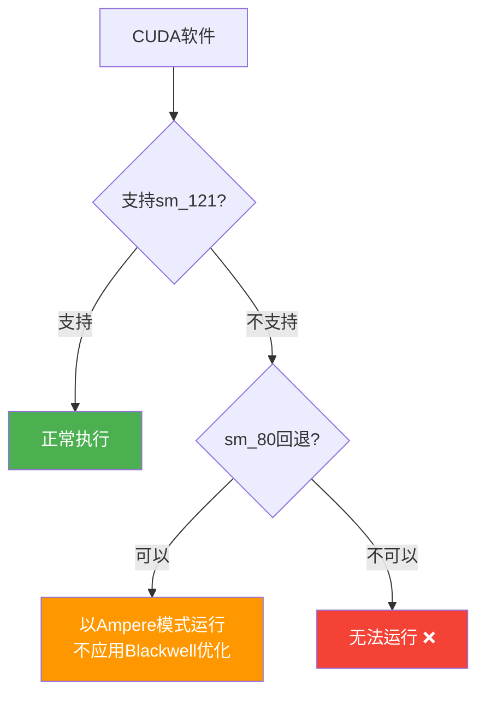

## 概述

NVIDIA DGX Spark在2025年CES上以"3,000美元个人AI超级计算机"的定位发布。搭载128GB统一内存和Blackwell架构，被定位为桌面级AI工作站。然而，实际用户的报告呈现出与营销截然不同的现实。

Reddit的r/LocalLLaMA社区中，一位用户在使用DGX Spark一周后决定退货的帖子引发了巨大反响。核心问题在于<strong>CUDA软件兼容性</strong>。

## sm121：既非数据中心也非游戏的特殊架构

DGX Spark最大的问题在于其GPU架构。

| 分类 | 架构 | SM版本 | 特点 |
|------|------|--------|------|
| 数据中心Blackwell | GB200/B200 | sm_100 | tcgen05张量核心，完整Blackwell |
| 游戏Blackwell | RTX 5090等 | sm_120 | 游戏优化 |
| <strong>DGX Spark</strong> | <strong>GB10</strong> | <strong>sm_121</strong> | <strong>独特架构，包含RT核心</strong> |
| Ampere | A100等 | sm_80 | 6年前的架构 |

DGX Spark既不使用数据中心Blackwell（sm_100），也不使用游戏Blackwell（sm_120），而是采用<strong>sm_121这一独特架构</strong>。这导致许多CUDA软件无法运行，或回退到sm_80（Ampere）代码路径执行。

## 掌机游戏芯片挪用嫌疑

NVIDIA官方论坛上工作人员的回复加深了疑虑：

> sm80-class kernels can execute on DGX Spark because Tensor Core behavior is very similar, particularly for GEMM/MMAs (closer to the GeForce Ampere-style MMA model). DGX Spark not has tcgen05 like jetson Thor or GB200, due die space with RT Cores and DLSS algorithm

从这个回复中揭示的关键事实：

1. <strong>张量核心非Blackwell级别</strong>：没有tcgen05（Blackwell第五代张量核心），更接近Ampere风格的MMA模型
2. <strong>RT核心和DLSS算法占用芯片面积</strong>：AI开发套件为什么需要游戏功能？
3. <strong>与Jetson Thor和GB200设计不同</strong>：使用相同的Blackwell名称，但内部完全不同

这些事实暗示DGX Spark的GPU原本是<strong>为掌上游戏设备设计的芯片</strong>，被转用为AI工作站。支持统一内存的游戏GPU这一特点也支持了这一假设。

## CUDA软件兼容性现状

已报告的兼容性问题：

- <strong>Triton</strong>：已打补丁回退到sm_80代码路径（[GitHub Issue #8335](https://github.com/triton-lang/triton/issues/8335)）
- <strong>众多CUDA库</strong>：无法识别sm_121，导致构建失败或运行时错误
- <strong>Blackwell优化功能</strong>：FP4/FP6量化等Blackwell专属功能不可用

更令人担忧的是，NVIDIA论坛工作人员引用了<strong>不存在的软件版本和发布</strong>来声称问题已解决。这被怀疑是LLM幻觉，也引发了对NVIDIA客户支持质量的担忧。

## 硬件质量问题

除软件兼容性外，还报告了基本的硬件问题：

- <strong>HDMI显示输出故障</strong>：多个无法在1080p 144Hz显示器上输出的案例
- <strong>ServeTheHome等专业评测机构</strong>也确认了相同的显示问题
- 标榜"开箱即用"体验却存在基本显示连接问题，这是严重的质量问题

## 消费者的教训

从DGX Spark案例中获得的教训很明确：

1. <strong>不要被营销名称欺骗</strong>：即使带有"Blackwell"品牌，也与数据中心Blackwell完全不同
2. <strong>确认SM版本</strong>：GPU的实际计算能力由SM架构版本决定
3. <strong>必须验证软件生态系统</strong>：实际想用的软件能否运行比硬件规格更重要
4. <strong>等待早期用户评测</strong>：特别是新品类产品，确认实际使用评测后再做购买决定

## 与Apple Silicon的对比

与同样使用统一内存架构的Apple Silicon（M4 Ultra等）进行对比也很有意义：

| 项目 | DGX Spark | Mac Studio（M4 Ultra） |
|------|-----------|----------------------|
| 内存 | 128GB统一 | 最大512GB统一 |
| 内存带宽 | ~273GB/s | ~819GB/s |
| CUDA支持 | sm_121（有限） | 不支持（使用Metal） |
| 软件兼容性 | 部分 | MLX生态系统成熟 |
| 价格 | ~$3,000 | ~$4,000+ |

Apple Silicon虽然不支持CUDA，但MLX框架生态系统正在快速成熟，在本地LLM推理方面反而提供了更稳定的体验。

## 结论

DGX Spark做出了"将CUDA生态系统的力量带到个人桌面"的诱人承诺，但现实是<strong>6年前Ampere级别的CUDA兼容性</strong>和<strong>基于游戏芯片的有限AI性能</strong>之间存在差距。

消费级AI硬件市场仍处于早期阶段。在NVIDIA为sm_121提供完整的软件支持之前，购买DGX Spark需要谨慎判断。在为"AI工作站"标签支付溢价之前，务必确认实际能运行哪些工作负载。

## 参考资料

- [Reddit r/LocalLLaMA - PSA: NVIDIA DGX Spark has terrible CUDA software](https://www.reddit.com/r/LocalLLaMA/comments/1r569eb/psa_nvidia_dgx_spark_has_terrible_cuda_software/)
- [Triton Issue #8335 - sm_121兼容性补丁](https://github.com/triton-lang/triton/issues/8335)
- [NVIDIA Developer Forum - DGX Spark sm121 Support Discussion](https://forums.developer.nvidia.com/t/dgx-spark-sm121-software-support-is-severely-lacking-official-roadmap-needed/357663)
