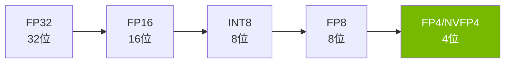
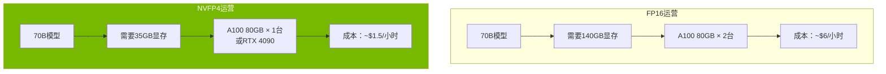
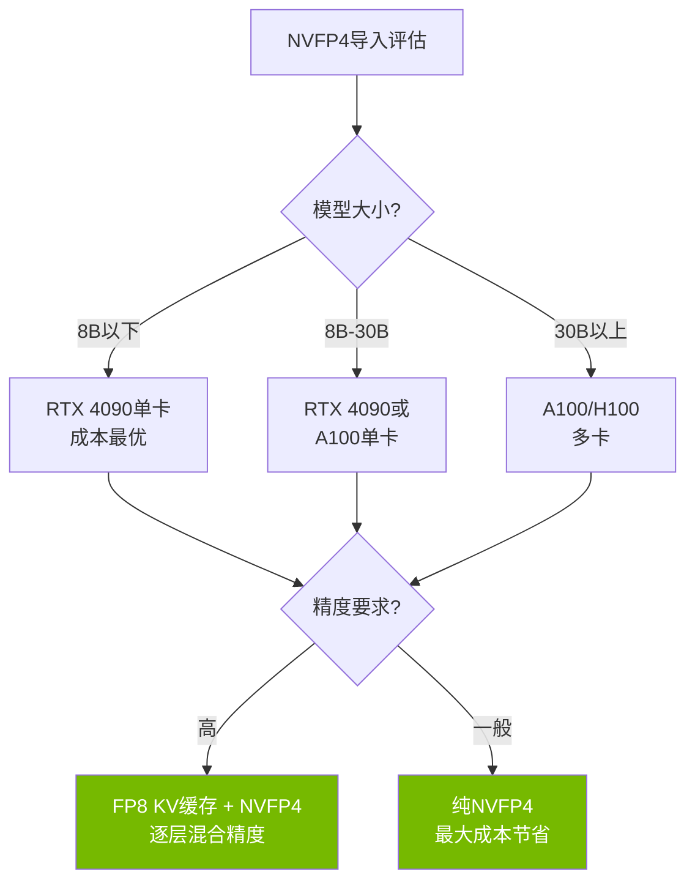

## 概述

LLM推理成本已成为企业AI落地的最大瓶颈。GPU显存占用、电力消耗以及硬件投资成本——随着模型规模增大，成本呈指数级增长。NVIDIA发布的<strong>NVFP4（4位浮点数）</strong>量化格式，具有从根本上改变这一格局的潜力。

从FP32（32位）到FP4（4位）的转换，简单计算就意味着<strong>8倍的内存节省</strong>，实际基准测试也在将精度损失控制在最低的同时接近了这一数字。

本文将分析NVFP4的技术原理、实际性能数据及其对LLM运营成本结构的影响。

## 什么是FP4量化

### 比特缩减的历史

LLM量化的演进脉络如下：



每个阶段中，表示模型权重的比特数不断减少，内存占用和计算成本随之降低。核心问题在于<strong>能保持多少精度</strong>。

### NVFP4的结构

NVFP4是NVIDIA从Blackwell架构起在硬件层面支持的4位浮点数格式。与常规INT4不同，它使用<strong>浮点数表示</strong>来维持更宽的动态范围。

| 格式 | 位数 | 相对FP32内存 | 动态范围 | 硬件支持 |
|------|------|------------|---------|---------|
| FP32 | 32 | 1x | 非常宽 | 全部 |
| FP16 | 16 | 2x | 宽 | 大部分 |
| FP8 | 8 | 4x | 中等 | Ada/Blackwell |
| NVFP4 | 4 | 8x | 中等 | Blackwell/Ada* |

*Ada Lovelace（RTX 4090等）通过社区项目提供支持

### Microscaling（MX）格式

NVFP4的核心创新之一是<strong>Microscaling</strong>技术。该方法将权重分成小块，并为每个块应用独立的缩放因子。

```
块大小：32个元素
每个块 = [4位权重 × 32] + [8位缩放因子 × 1]

有效位数 = 4 + (8/32) = 4.25位/元素
```

这种方式使得即使在极端比特缩减下，也能精确校正每个块的值分布，相比INT4实现了显著更优的精度。

## 实战基准测试：AdaLLM项目

在Reddit r/LocalLLaMA社区引起热议的<strong>AdaLLM</strong>项目，公布了在RTX 4090（Ada Lovelace）上实际运行NVFP4的结果。

### Qwen3-8B NVFP4性能

| 批量大小 | 总Token数 | 耗时（秒） | 吞吐量（tok/s） | 显存（GB） |
|---------|----------|----------|---------------|----------|
| 1 | 128 | 3.39 | 37.79 | 7.55 |
| 4 | 512 | 3.44 | 148.87 | 7.55 |
| 8 | 1024 | 3.45 | 297.16 | 7.56 |
| 16 | 2048 | 4.36 | 469.34 | 7.56 |

### Gemma3-27B NVFP4性能

| 批量大小 | 总Token数 | 耗时（秒） | 吞吐量（tok/s） | 显存（GB） |
|---------|----------|----------|---------------|----------|
| 1 | 128 | 9.40 | 13.62 | 19.83 |
| 4 | 512 | 9.53 | 53.70 | 19.84 |

<strong>关键发现</strong>：
- Qwen3-8B：相比FP16，显存减少2.4倍，吞吐量损失约20-25%
- Gemma3-27B（27B参数）：可在RTX 4090单卡上运行
- 吞吐量损失来自<strong>计算效率</strong>而非内存，因此批量越大，成本效率越好

## 成本结构变化分析

### GPU显存节省效果

FP4量化对实际运营成本的影响按场景分析如下。



### 成本对比模拟

70B参数模型的月度运营成本估算：

| 项目 | FP16 | NVFP4 | 降幅 |
|------|------|-------|------|
| GPU数量 | 2× A100 | 1× A100 | 50% |
| 每小时成本 | ~$6.00 | ~$1.50 | 75% |
| 月度成本（24/7） | ~$4,320 | ~$1,080 | 75% |
| 功耗 | ~600W | ~300W | 50% |

与FP32相比，内存方面可实现8倍节省。即使与FP16相比，成本降幅也接近4倍。

## 精度保持的秘诀

### MXFP4 vs 传统INT4

论文"Bridging the Gap Between Promise and Performance for Microscaling FP4 Quantization"（2025年）详细分析了MXFP4/NVFP4格式的精度保持机制。

关键技术：

1. <strong>Microscaling校正</strong>：每32个元素应用独立的缩放因子，最小化值分布失真
2. <strong>FP8 KV缓存</strong>：Key-Value缓存使用FP8以维持注意力计算的精度
3. <strong>逐层自适应量化</strong>：敏感层保持高精度，非敏感层采用更激进的量化
4. <strong>基于校准数据的优化</strong>：根据实际输入数据分布调整量化参数

### 质量验证结果

在社区基准测试中，NVFP4模型展示了以下性能：

- <strong>困惑度增加</strong>：相比FP16在1-3%以内
- <strong>下游任务</strong>：在MMLU、HellaSwag等上性能差异在1-2%以内
- <strong>编程基准</strong>：在HumanEval上保持实用水平的性能

## 实战应用指南

### 使用AdaLLM运行NVFP4模型

```bash
# 安装
pip install git+https://github.com/BenChaliah/NVFP4-on-4090-vLLM.git

# 部署Qwen3-8B NVFP4模型
adallm serve nvidia/Qwen3-8B-NVFP4

# 启用FP8 GEMM路径（可选）
export NVFP4_FP8=1
adallm serve nvidia/Qwen3-8B-NVFP4
```

### 支持的模型

当前AdaLLM支持的NVFP4模型：

- <strong>nvidia/Qwen3-8B-NVFP4</strong>：8B参数，RTX 4090上占用7.5GB显存
- <strong>Gemma3-27B-it-NVFP4</strong>：27B参数，RTX 4090上占用19.8GB显存
- <strong>Qwen3 MoE变体</strong>：已支持但优化仍在进行中

### 生产部署注意事项



## 未来展望

### Blackwell架构的原生FP4支持

NVIDIA的Blackwell GPU（B100、B200）在<strong>硬件层面原生支持FP4</strong>。与当前Ada Lovelace上的软件实现不同，Blackwell提供：

- 专用FP4张量核心带来的额外性能提升
- 无吞吐量损失的FP4运算
- 更大模型的单卡承载能力

### 产业影响

FP4量化的普及将带来以下变化：

1. <strong>LLM服务降价</strong>：基于API的LLM服务价格可能降至当前的1/4至1/8
2. <strong>边缘设备部署</strong>：70B模型可在消费级GPU上运行，加速本地LLM部署
3. <strong>创业门槛降低</strong>：运营高性能LLM所需的初始投资大幅减少
4. <strong>环境影响</strong>：GPU功耗降低将缩小AI行业的碳足迹

## 结论

NVIDIA的NVFP4量化技术具有从根本上改变LLM推理成本结构的潜力。在实现FP32比8倍、FP16比4倍内存节省的同时保持实用水平的精度，这不仅仅是优化，而是一次<strong>范式转变</strong>。

特别是AdaLLM等社区项目证明了NVFP4在RTX 4090上也能实用运行，表明这项技术不仅为数据中心，也为个人开发者和小型团队提供了实质性价值。

随着2026年后Blackwell架构的普及，FP4量化很可能成为LLM运营的新标准。

## 参考资料

- [AdaLLM: NVFP4-first inference on RTX 4090](https://github.com/BenChaliah/NVFP4-on-4090-vLLM) — GitHub
- [Bridging the Gap Between Promise and Performance for Microscaling FP4 Quantization](https://arxiv.org/abs/2509.17880) — arXiv
- [Reddit r/LocalLLaMA 社区讨论](https://www.reddit.com/r/LocalLLaMA/) — 基准测试与用户反馈
- [NVIDIA Blackwell Architecture](https://www.nvidia.com/en-us/data-center/technologies/blackwell-architecture/) — 官方文档
