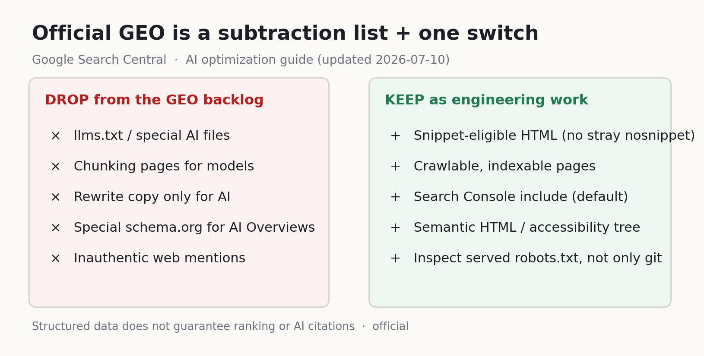
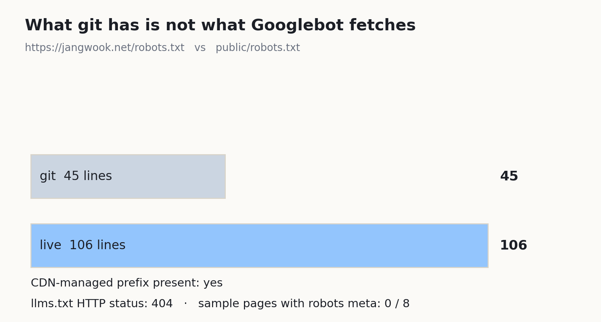
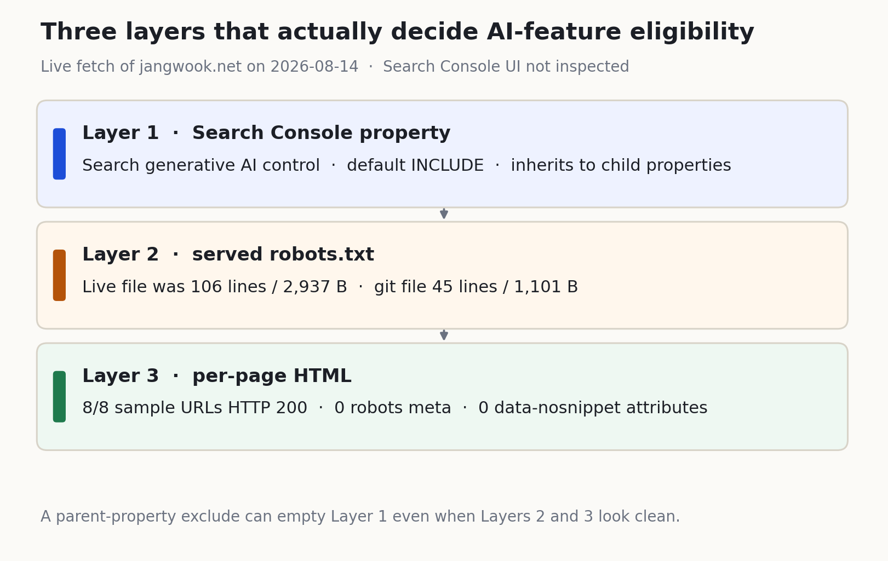

先跑这两行，再决定要不要做 `llms.txt`。

```bash
curl -sI https://jangwook.net/llms.txt
# HTTP/2 404

curl -sL https://jangwook.net/robots.txt | wc -l
# 106
```

仓库里的 `public/robots.txt` 是 45 行、1,101 字节。线上是 106 行、2,937 字节。Search Console 没登录。只抓了公开面。



## 先 curl，再谈清单

`LLMs.txt` 和 `www` 主机一样是 404。这个站没放那份文件。

市面上的 GEO 清单仍把它放在最上面。Google Search Central 2026 年 5 月 15 日发了 [生成式 AI 功能优化指南](https://developers.google.com/search/docs/fundamentals/ai-optimization-guide)，7 月 10 日又改过一版。LLMS.txt 那一行很短。

> Doing so will neither harm nor help your site's visibility or rankings in Google Search, as Google Search ignores them.

出处：同一份 [优化指南](https://developers.google.com/search/docs/fundamentals/ai-optimization-guide) 的 LLMS.txt 条目

别的系统要读，就留着，目的写清楚。Google Search 的待办里把它划掉。如果已经用 [robots.txt 把训练爬虫和搜索爬虫分开](/zh/blog/zh/ai-crawler-control-robots-txt-llms-txt-2026)，今天要去掉的错觉只有一句：Google 会读这份文件。线上 robots.txt 里那篇文章的 URL 只出现在注释里。不是指令。

## 线上多出来的前缀

git 这边拦训练机器人（`GPTBot`、`ClaudeBot`、`CCBot`、`Google-Extended`），对搜索机器人和 `*` 只藏跨语言 URL。线上响应前面多了一截 CDN 前缀。`User-agent: *` 带着 `Content-Signal: search=yes,ai-train=no,use=reference`，学习、扩展机器人的 `Disallow: /` 又出现一次。线上能看到两组 Google-Extended 拦截。仓库正文接在后面。



今天读过的 Search Central robots.txt 说明里，我没把 `Content-Signal` 确认为受支持的规则。文件里写着，和 Googlebot 会不会用这个词，是两件事。后者不断言。

八个页面（`/`、`/ko/`、`/en/`、`/ko/blog/`、三篇文章、`/ko/contact/`）都是 HTTP 200。`<meta name="robots">` 零条，`data-nosnippet` 零个。有一页正文里出现了 `nosnippet` 这个词，不是指令标签。现在的模板只在打开 `noindex` 时才吐 robots 标签。

把 GEO 理解成“往仓库里加一个文件”，会漏掉爬虫已经在读、却在仓库外头变长的那份。该 diff 的是已部署的 URL，不是 `public/robots.txt` 自己和自己比。

## 富结果的标记还留

首页 JSON-LD 是 `Organization`、`ImageObject`、`Person`、`WebSite`。`/ko/` 和 `/en/` 还多一个 `FAQPage`。文章再叠 `WebPage`、`SpeakableSpecification`、`BreadcrumbList`、`BlogPosting`。按今天的官方文本，这套标记不是生成式搜索的门票。它留在富结果和实体整理这边。和 [FAQPage 富结果结束后仍留下问答标记](/zh/blog/zh/faqpage-deprecation-ai-citation-2026) 是同一条线。

结构数据那一节我读了两遍。生成式搜索不要求它，也没有专用类型。富结果资格仍然用它，所以还是 SEO 的一部分。我没读成“删掉 JSON-LD”。读成“别因为有生成式搜索再加一种类型”。排名本来就不保证，引用也不保证。

指南的破除迷信一节，把 AEO、GEO 写成搜索体验优化的另一个名字。

> From Google Search's perspective, optimizing for generative AI search is optimizing for the search experience, and thus still SEO.

出处：[Optimizing your website for generative AI features](https://developers.google.com/search/docs/fundamentals/ai-optimization-guide)

待办里我划掉四项。`llms.txt` 和专用 AI 文件：Google Search 不用，做了既不帮也不害。为模型把文章切碎：没要求，它说能理解一页里多个主题，长度按读者定。只给 AI 改写句子：同义和意思它懂，不必为每个长尾再开一页，人读的草稿留下，批量变体页会撞上 [scaled content](https://developers.google.com/search/docs/essentials/spam-policies#scaled-content)。生成式搜索专用 schema.org：不需要，也没有专用标记，富结果那套留下，不要新铺“AI Overview 专用 schema”。

往网上埋假提及，官方也不觉得有用。第三方工具自称能看“内部指标”，同一篇文档也砍掉了。没有第三方工具能进内部排名或 AI 系统。[评估第三方 SEO 建议](https://developers.google.com/search/docs/fundamentals/third-party-seo) 让人拿 AEO、GEO 建议去对官方文档。工具可以进工作流。别把它的数字当成 Google 的数字。

## 父级站点资源会往下传

优化指南里写的“必须包含在 Search Console 中”，指向帮助文档的 [Search generative AI control](https://support.google.com/webmasters/answer/16908024)。路径：Settings > Search generative AI。

三个选项。纳入、排除、跟随父级。纳入是默认值。排除之后，AI Overview、AI Mode、Discover 里的生成式功能不再给链接，也不再拿你当 grounding 输入。这些功能带来的展示和流量也没有。

> This control only affects whether your content can appear in certain Search generative AI features; this control isn't used as a ranking or inclusion signal affecting other parts of Search.

出处：[Search generative AI control](https://support.google.com/webmasters/answer/16908024)

限制训练用 [Google-Extended](https://developers.google.com/search/docs/crawling-indexing/google-common-crawlers#google-extended)。整站退出搜索用 `noindex`。控制生效后，排除大概 1〜2 天落地。缓存可能再拖一阵。

有人在域名资源上点排除，没单独设置过的 URL-prefix 子资源会跟着走。博客拆在 `https://example.com/blog/` 也没用，父级先动手，子级默认跟。HTML 再干净、robots.txt 再拆，这层关掉，生成式功能的资格就在这里断。

控制和报告都还在向部分站点开放。2026 年 6 月 3 日的 [生成式 AI 效果报告公告](https://developers.google.com/search/blog/2026/06/gen-ai-performance-reports) 也写了先给部分资源。报告数的是展示，不是点击，也不是排名。Search Labs 实验数据不算。屏幕上没有，不等于已经被排除。可能还没轮到你，也可能生成式展示还不够。

我的站点资源上有没有这个菜单，这里不断言。能断言的只有：文档里的默认值是纳入，以及继承是写明的。

团队里应该先看父级域名资源的当前值，记下每个子 URL-prefix 是在继承还是手改过，然后再看模板里的 robots meta 和线上 robots.txt。顺序反了，改一周标记也解释不了为什么生成式功能里整站失踪。改完当天下午报告不动，也不该立刻回滚。文档已经写了 1〜2 天。

改 HTML 的人和 Search Console 所有者若不是一拨人，这一层进不了代码评审。



AI Overview 给难题贴要点和依据链接。AI Mode 把比较、推理这类以前要搜好几轮的问题收成一条对话。两者都在 Google 搜索里，都从线上索引取页。Google 把这套说成核心排名之上的 RAG，再加上 query fan-out。

要成为生成式功能里的链接和依据，页面得被收录，还得允许出摘要。[AI features and your website](https://developers.google.com/search/docs/appearance/ai-features) 的句子是这样的。

> There are no additional requirements to appear in AI Overviews or AI Mode, nor other special optimizations necessary.

出处：[AI features and your website](https://developers.google.com/search/docs/appearance/ai-features)

技术要求、垃圾内容政策和面向人的内容指南还在。守住这些，抓取、收录、展示仍不保证。搜索原来就有的保留。

摘要这一侧我量过一次。`nosnippet` 和 `max-snippet:0` 会挡住 AI Overview、AI Mode 的直接输入，定义写在 [robots 摘要指令实测](/zh/blog/zh/robots-snippet-controls-ai-overviews-2026)。今天不重跑那个解析器。上面又多了一层站点资源上的值。

## 代理走的是无障碍树

指南末尾是浏览器代理。订座、比规格。和搜索引用不是一路活。摸到的表面一样。[web.dev 的 agent-friendly 说明](https://web.dev/articles/ai-agent-site-ux) 写了三条路径：截图、原始 HTML、无障碍树。

无障碍树留下角色、名字、状态，丢掉装饰。和屏幕阅读器读的是同一棵。把 `div` 画成按钮，只读 DOM 的那边看不见按钮，只看截图的那边知道位置，不知道它干什么。

优化指南谈语义 HTML，也不是“完美代码”，而是可读性和辅助技术解析。它写明整个网络并不是合法 HTML，Google 也能理解。即便如此，用 `button` 和 `a` 的理由也不只是搜索爬虫。

剩下的实现很闷。输入配 `label for`。别用透明遮罩挡住点击区。别让每个类目的版面跳得太厉害。这是把 WCAG 再做一遍，不是给代理发明一种新格式。

web.dev 写过，只信截图的路径又慢又贵，是结构糊掉时的备用。主路径放在树和 DOM 上，爬虫读的文本和代理读的角色就从同一份标记出来。这和再埋一段给搜索看的隐藏文字正好相反。

## 评审单上没有的那一栏

```bash
curl -sI https://example.com/llms.txt | head -n 1

curl -sL https://example.com/robots.txt > /tmp/live-robots.txt
diff -u public/robots.txt /tmp/live-robots.txt
```

这两行仍然看不见 Search Console 里的值。那一层在站点资源设置里。

从迭代里拿掉：为 Google Search 新建 `llms.txt`、专用 AI markdown、生成式搜索专用 schema.org、给模型切段落、按查询增页、把第三方“内部指标”当成发布门槛。

留下：收录和摘要资格、线上 robots.txt 对 git 的 diff、父级和子级资源上的生成式 AI 控制、语义 HTML，以及富结果 JSON-LD 的用途栏写成“富结果资格”，不要写成“生成式搜索必需”。

纳入开着，摘要开着，也收录了，Google 仍不欠你一次引用。今天量的是资格在哪一层断，不是效果有多大。

把官方文本和实际发出去的字节对上，是我的本职。联系方式在简介里。

---
*来源：Google Search Central 的 [生成式 AI 功能优化指南](https://developers.google.com/search/docs/fundamentals/ai-optimization-guide)（2026-07-10 更新）、[AI features and your website](https://developers.google.com/search/docs/appearance/ai-features)、[第三方 SEO 建议指南](https://developers.google.com/search/docs/fundamentals/third-party-seo)、[生成式 AI 效果报告公告](https://developers.google.com/search/blog/2026/06/gen-ai-performance-reports)（2026-06-03）、Search Console 帮助的 [Search generative AI control](https://support.google.com/webmasters/answer/16908024)·[Generative AI performance report](https://support.google.com/webmasters/answer/16984139)、web.dev 的 [Build agent-friendly websites](https://web.dev/articles/ai-agent-site-ux)（均为官方）。正文四条英文块引用均从原页取回、折叠空白后对照，引用旁附原文链接。线上测量：2026-08-14，`https://jangwook.net` 的 robots.txt、llms.txt、8 个页面，curl + HTML 解析。原始数据 `data/official-geo-gsc-control-probe-2026.json`，图 `scripts/chart-official-geo-gsc-control.py`。未登录 Search Console。Content-Signal 仅存在于线上 robots.txt，未在 Google Search Central robots.txt 支持规则中确认。结构化数据与该开关不保证排名。*
