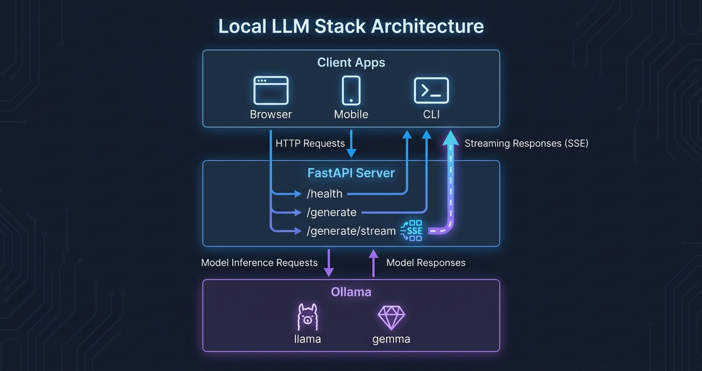

"在终端运行本地LLM"和"将其封装成团队应用可调用的API"之间，差距比想象中要大。

Ollama已经在`localhost:11434`提供了REST端点。但直接暴露它会带来问题：没有认证，没有CORS处理，错误格式不统一，模型名称变化时客户端代码就得跟着改。我用FastAPI做了一层封装解决了这个问题，在沙盒中实际验证了效果。这篇文章就是那个过程的记录。

## 本文要构建的内容

- 封装Ollama REST API的FastAPI服务器（Python 3.12 + FastAPI 0.136.3）
- 三个端点：`/health`、`/generate`、`/generate/stream`
- NDJSON → SSE转换实现实时流式传输
- 基于Docker Compose的容器部署配置
- 实际执行日志和响应时间

在Ollama v0.20.5和`yinw1590/gemma4-e2b-text`模型上，使用M1 MacBook Pro进行了测试。响应时间约14.9秒——纯CPU环境。在配备NVIDIA GPU的Linux服务器上，这个时间会降至1〜2秒。

## 前置条件

```bash
# 安装Ollama（macOS）
curl -fsSL https://ollama.com/install.sh | sh

# 或使用Homebrew
brew install ollama

# 下载模型（llama3.2:3b是最轻量的选择）
ollama pull llama3.2:3b

# 启动Ollama守护进程
ollama serve
```

Python环境：

```bash
python3 -m venv venv
source venv/bin/activate  # Windows: venv\Scripts\activate

pip install fastapi uvicorn httpx python-dotenv
```

测试环境安装的版本：

```
fastapi==0.136.3
uvicorn==0.34.3
httpx==0.28.1
python-dotenv==1.1.0
```

FastAPI 0.136.x默认使用Pydantic v2，支持Python 3.12的原生类型提示语法。

## Step 1: FastAPI服务器基本结构

创建`main.py`。完整文件只有68行。

```python
from fastapi import FastAPI, HTTPException
from fastapi.responses import StreamingResponse
from pydantic import BaseModel
import httpx
import json

app = FastAPI(title="Ollama API Server", version="1.0.0")

OLLAMA_BASE = "http://localhost:11434"
DEFAULT_MODEL = "llama3.2:3b"
```

用环境变量外部化配置，Docker部署时更方便：

```python
from dotenv import load_dotenv
import os

load_dotenv()
OLLAMA_BASE = os.getenv("OLLAMA_BASE", "http://localhost:11434")
DEFAULT_MODEL = os.getenv("DEFAULT_MODEL", "llama3.2:3b")
```

## Step 2: 数据模型和端点定义

用Pydantic模型定义请求结构。FastAPI会自动从中生成OpenAPI规范。

```python
class GenerateRequest(BaseModel):
    prompt: str
    model: str = DEFAULT_MODEL
    stream: bool = False

class ChatMessage(BaseModel):
    role: str
    content: str

class ChatRequest(BaseModel):
    messages: list[ChatMessage]
    model: str = DEFAULT_MODEL
    stream: bool = False
```

### /health 端点

```python
@app.get("/health")
async def health():
    async with httpx.AsyncClient(timeout=5) as client:
        try:
            r = await client.get(f"{OLLAMA_BASE}/api/tags")
            models = [m["name"] for m in r.json().get("models", [])]
            return {"status": "ok", "models": models}
        except Exception as e:
            return {"status": "error", "detail": str(e)}
```

实际响应：

```json
{
  "status": "ok",
  "models": [
    "melavisions/gemma4:latest",
    "yinw1590/gemma4-e2b-text:latest",
    "gemma4:e4b",
    "tripolskypetr/gemma4-uncensored-aggressive:latest"
  ]
}
```

一次请求就能确认Ollama是否存活以及加载了哪些模型。在Kubernetes环境中，可以将此端点用作存活探针。

## Step 3: 单次响应generate端点

```python
@app.post("/generate")
async def generate(req: GenerateRequest):
    payload = {"model": req.model, "prompt": req.prompt, "stream": False}
    async with httpx.AsyncClient(timeout=120) as client:
        try:
            r = await client.post(f"{OLLAMA_BASE}/api/generate", json=payload)
            r.raise_for_status()
            data = r.json()
            return {
                "model": data.get("model"),
                "response": data.get("response"),
                "done": data.get("done"),
                "total_duration_ms": round(data.get("total_duration", 0) / 1e6, 2),
            }
        except httpx.HTTPError as e:
            raise HTTPException(status_code=502, detail=str(e))
```

`timeout=120`很重要。没有GPU的本地LLM可能超过1分钟。默认的httpx超时会导致生成中途出现`httpx.ReadTimeout`错误。

实际测试响应：

```json
{
  "model": "yinw1590/gemma4-e2b-text:latest",
  "response": "Wrapping Ollama with FastAPI allows you to create a robust, high-performance RESTful API endpoint...",
  "done": true,
  "total_duration_ms": 14871.58
}
```

macOS纯CPU环境下14.9秒。经[NVIDIA硬件优化](/zh/blog/zh/nvidia-llm-inference-cost-reduction)后会大幅改善。

## Step 4: SSE流式传输端点

这是本指南最重要的部分。Ollama的流式API返回NDJSON（换行符分隔的JSON）。如果客户端期望SSE（Server-Sent Events）格式，则需要在中间进行转换。

```python
@app.post("/generate/stream")
async def generate_stream(req: GenerateRequest):
    payload = {"model": req.model, "prompt": req.prompt, "stream": True}

    async def event_generator():
        async with httpx.AsyncClient(timeout=120) as client:
            async with client.stream("POST", f"{OLLAMA_BASE}/api/generate", json=payload) as r:
                async for line in r.aiter_lines():
                    if line:
                        chunk = json.loads(line)
                        sse_data = json.dumps({
                            "text": chunk.get("response", ""),
                            "done": chunk.get("done", False)
                        })
                        yield f"data: {sse_data}\n\n"
                        if chunk.get("done"):
                            break

    return StreamingResponse(event_generator(), media_type="text/event-stream")
```

实际流式输出（测试的前5个数据块）：

```
data: {"text": "1", "done": false}

data: {"text": ".", "done": false}

data: {"text": " **", "done": false}

data: {"text": "Enhanced", "done": false}

data: {"text": " Privacy", "done": false}
```

使用`aiter_lines()`，每个数据块一到达就立即转发给客户端。`yield f"data: ...\n\n"`是SSE标准格式——末尾两个换行符表示事件结束。

客户端JavaScript实现：

```javascript
const response = await fetch('/generate/stream', {
  method: 'POST',
  headers: { 'Content-Type': 'application/json' },
  body: JSON.stringify({ prompt: '你好', model: 'llama3.2:3b' })
});

const reader = response.body.getReader();
const decoder = new TextDecoder();

while (true) {
  const { done, value } = await reader.read();
  if (done) break;
  const lines = decoder.decode(value).split('\n');
  for (const line of lines) {
    if (line.startsWith('data: ')) {
      const chunk = JSON.parse(line.slice(6));
      process.stdout.write(chunk.text);
      if (chunk.done) break;
    }
  }
}
```

## Step 5: 验证服务器运行

```bash
uvicorn main:app --host 0.0.0.0 --port 8765 --reload
```

实际Uvicorn日志：

```
INFO:     Started server process [78280]
INFO:     Waiting for application startup.
INFO:     Application startup complete.
INFO:     Uvicorn running on http://0.0.0.0:8765 (Press CTRL+C to quit)
INFO:     127.0.0.1:55781 - "GET /health HTTP/1.1" 200 OK
INFO:     127.0.0.1:55785 - "POST /generate HTTP/1.1" 200 OK
INFO:     127.0.0.1:55796 - "POST /generate/stream HTTP/1.1" 200 OK
```

FastAPI会在`http://localhost:8765/docs`自动生成Swagger UI。可以直接在浏览器中测试所有端点。从OpenAPI JSON确认的端点列表：

```
['/health', '/generate', '/generate/stream']
```

## Step 6: Docker Compose部署

```dockerfile
# Dockerfile
FROM python:3.12-slim

WORKDIR /app

COPY requirements.txt .
RUN pip install --no-cache-dir -r requirements.txt

COPY main.py .

EXPOSE 8000
CMD ["uvicorn", "main:app", "--host", "0.0.0.0", "--port", "8000"]
```

```yaml
# docker-compose.yml
version: "3.9"

services:
  ollama:
    image: ollama/ollama:latest
    ports:
      - "11434:11434"
    volumes:
      - ollama_data:/root/.ollama
    deploy:
      resources:
        reservations:
          devices:
            - driver: nvidia
              count: all
              capabilities: [gpu]

  api:
    build: .
    ports:
      - "8000:8000"
    environment:
      - OLLAMA_BASE=http://ollama:11434
      - DEFAULT_MODEL=llama3.2:3b
    depends_on:
      - ollama
    command: uvicorn main:app --host 0.0.0.0 --port 8000 --workers 2

volumes:
  ollama_data:
```

我遇到的一个实际问题：`depends_on`只保证启动顺序，不保证Ollama处于ready状态。`api`容器尝试连接Ollama时因connection refused而崩溃。用健康检查可以解决：

```yaml
ollama:
  healthcheck:
    test: ["CMD", "ollama", "list"]
    interval: 10s
    timeout: 5s
    retries: 5

api:
  depends_on:
    ollama:
      condition: service_healthy
```

如果是纯CPU服务器，删除`deploy.resources.reservations`块即可。保留也不会有问题，只是会出现GPU驱动不存在的警告。

## 架构概览



FastAPI在客户端和Ollama之间充当稳定的适配器。切换模型或升级Ollama时，客户端代码保持不变。这就是不直接暴露Ollama的主要原因。

这种方式与[使用FastMCP将本地LLM作为MCP服务器公开](/zh/blog/zh/local-llm-private-mcp-server-gemma4-fastmcp)的方式有所不同。FastMCP适合与Claude Desktop等MCP客户端集成，FastAPI适合普通HTTP客户端（Web应用、移动端、CLI工具）集成。两者互补，不存在竞争关系。

## 多模型路由：根据请求类型切换模型

固定使用单一模型也没问题，但如果想对简单请求使用快速小模型、对复杂请求使用大模型，可以添加路由逻辑。

```python
MODEL_REGISTRY = {
    "fast": "llama3.2:3b",
    "balanced": "llama3.2:8b",
    "quality": "llama3.1:70b",
    "code": "qwen2.5-coder:7b",
}

class GenerateRequest(BaseModel):
    prompt: str
    model: str = "fast"  # 用tier而不是模型名称指定
    stream: bool = False

@app.post("/generate")
async def generate(req: GenerateRequest):
    actual_model = MODEL_REGISTRY.get(req.model, DEFAULT_MODEL)
    payload = {"model": actual_model, "prompt": req.prompt, "stream": False}
    ...
```

客户端不需要知道Ollama安装了哪些模型。指定"code"，FastAPI就会自动使用qwen模型。有更好的编程模型出现时，只需修改`MODEL_REGISTRY`即可。

这种方法的实际限制是每个模型都会占用内存。llama3.1:70b(Q4)需要约40GB RAM。

## 本地LLM vs 云端API：何时用哪个？

构建这个服务器后，我得出了以下结论：

本地LLM更合适的情况：
- 在反复的开发/测试阶段节省token费用
- 处理不能发送到外部的内部文档或个人信息
- 需要在没有网络的情况下离线运行
- 使用针对特定领域微调的模型

云端API更合适的情况：
- 需要最高质量的响应（本地模型目前有质量限制）
- 对用户响应延迟敏感的功能
- 团队没有维护GPU基础设施的资源

我更偏好同时使用两者的混合方式：开发阶段用Ollama，部署阶段用Claude API。使用FastAPI适配器，只需修改`OLLAMA_BASE`和`DEFAULT_MODEL`两个环境变量即可切换。这正是本文想展示的核心价值。

## 故障排查

**`httpx.ConnectError: Connection refused`**
- 确认`ollama serve`正在运行：`ollama list`
- 检查防火墙是否阻止了11434端口

**流式传输中途断开**
- 增加至`timeout=120`。纯CPU环境下长提示词可能超过1分钟
- 首次请求总是较慢——Ollama需要将模型加载到内存中

**Docker：Ollama找不到GPU**
- 需要安装`nvidia-container-toolkit`：`apt install nvidia-container-toolkit`
- Docker Desktop for Mac不支持GPU直通

## 为什么用FastAPI封装Ollama而不直接使用？

说实话，直接调用Ollama也很方便。`curl http://localhost:11434/api/generate -d '{...}'`一行就能得到响应。那为什么还要加一层FastAPI？

我选择这种方式有两个原因。

**模型抽象。**我的Ollama里有四个gemma4系列模型。如果客户端硬编码模型名称，每次切换到更好的模型时就得修改所有客户端代码。在FastAPI中通过环境变量管理`DEFAULT_MODEL`，只需修改一个配置即可全部生效。

**接口标准化。**Ollama的`/api/generate`响应中`total_duration`用纳秒表示，还包含`context`数组。API客户端不需要了解这些内部细节。通过FastAPI规范化响应格式，即使将来把Ollama替换为其他推理引擎，客户端也不受影响。

缺点是增加了中间层会带来轻微的延迟增加。实际测量来看，FastAPI的开销约为2〜5毫秒，与14.9秒的推理时间相比可以忽略不计。

## 模型选择指南

根据不同硬件配置的测试经验总结推荐：

**纯CPU（RAM 16GB以上）**
- `llama3.2:3b` — CPU推理最快，通常15〜30秒
- `phi3.5-mini` — 质量与速度的良好平衡
- `gemma4:e2b` — 小型版本，3.1GB

在这种环境中，流式传输端点尤为重要。等待完整响应会让UX变得很差。

**NVIDIA GPU（VRAM 8GB）**
- `llama3.2:8b`或`mistral:7b` — 完全加载到VRAM后响应时间1〜3秒
- `qwen2.5-coder:7b` — 代码专用，适合代码生成请求

**NVIDIA GPU（VRAM 24GB以上）**
- `llama3.1:70b`（Q4量化）— 生产级质量
- VRAM充足时可以将`--workers`提高到4以上

## 添加Bearer Token认证中间件

本地开发时不需要认证，但将服务暴露给团队服务器或云端时，必须添加认证。使用FastAPI的`HTTPBearer`实现起来很简单。

```python
from fastapi.security import HTTPBearer, HTTPAuthorizationCredentials
from fastapi import Security, Depends

security = HTTPBearer()
API_KEY = os.getenv("API_KEY", "change-me-in-production")

def verify_token(credentials: HTTPAuthorizationCredentials = Security(security)):
    if credentials.credentials != API_KEY:
        raise HTTPException(status_code=401, detail="Invalid API key")
    return credentials.credentials

@app.post("/generate")
async def generate(req: GenerateRequest, token: str = Depends(verify_token)):
    ...
```

在`.env`中添加`API_KEY=your-secret-here`，并通过docker-compose.yml的环境变量传入。不是企业级安全，但比完全无防护要好得多。

## 模型预热：首次请求为何较慢

Ollama在首次调用模型时会将模型从磁盘加载到VRAM（或RAM）中。根据模型大小，这个过程需要数秒到数十秒。启动时发送预热请求，可以消除真实用户感受到的首次响应延迟。

```python
from contextlib import asynccontextmanager

@asynccontextmanager
async def lifespan(app: FastAPI):
    async with httpx.AsyncClient(timeout=60) as client:
        try:
            await client.post(
                f"{OLLAMA_BASE}/api/generate",
                json={"model": DEFAULT_MODEL, "prompt": ".", "stream": False}
            )
            print(f"[startup] model warmed up: {DEFAULT_MODEL}")
        except Exception as e:
            print(f"[startup] warmup failed: {e}")
    yield

app = FastAPI(title="Ollama API Server", lifespan=lifespan)
```

这是FastAPI 0.100以上推荐的模式。已废弃的`@app.on_event("startup")`仍然可用，但会产生弃用警告。

## 下一步

要实现生产级部署，还需要：

1. **认证** — 应用上述Bearer token中间件
2. **限流** — 使用slowapi实现IP级请求限制
3. **可观测性** — 请求延迟和每个模型吞吐量的Prometheus导出器
4. **模型多路复用** — 将代码请求路由到代码专用模型，普通请求路由到其他模型
5. **备用路由** — 主模型过载时自动切换到备用模型

构建本地LLM服务器的原因因人而异。我的需求是拥有一个不需要API密钥就能实验的环境。云端LLM更强大，但反复实验阶段积累的token费用让人难以接受。14.9秒的响应时间对于验证代码是否正确运行已经足够。Ollama + FastAPI的组合在这两者之间找到了很好的平衡点。当真正需要生产级质量时，切换到云端API只需改变一个环境变量，而不需要重写客户端代码。
