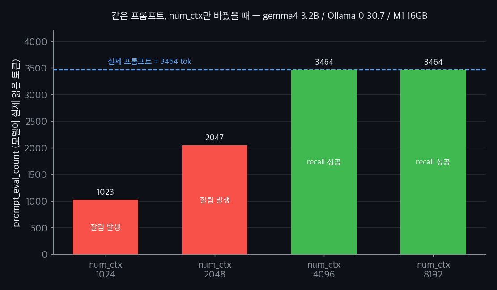

几天前，我在本地跑的会议纪要总结智能体开始犯怪。短的纪要处理得好好的，可一喂长纪要，它就把我写在最上面的指令("只用 JSON 回答")整段无视，改用大白话啰嗦一通。我起初以为是模型笨。让我在意的是，同一个模型在短输入下却老老实实守着指令。那也许不是模型变笨了，而是模型**压根没看见**我的指令。

在[上一篇拆解 prefill 与 generation 成本的文章](/zh/blog/zh/local-llm-prefill-generation-latency-experiment)里，我测过上下文越长、首个 token 越晚出。那讲的是速度。这回我怀疑的是另一面。过了某个长度，受损的也许不是速度，而是**内容**直接消失。于是我动手测了。

## 把秘密藏在开头，再逐步加长

做法是把 needle-in-haystack 稍微改了改。在提示最前面(head)塞一行秘密代码。下面铺一长段填充文本，像会议纪要那样，把 token 数撑大。然后在最末尾问："最上面写的秘密代码是什么?"模型答对了，说明它看到了 head；答不出，说明 head 没了。

关键是**保持同一段提示不变，只改 num_ctx**。如果输入一模一样却 recall 崩了，那祸首就不是模型，而是上下文窗口的设置。

```python
import json, urllib.request

SECRET = "ALPHA-7723-ZULU"
HEAD = (f"重要: 本文档某处藏着一个秘密代码。秘密代码是 {SECRET}。\n"
        "请阅读下面的纪要，但只回答最后一个问题。\n\n")
FILLER = ("会议讨论了季度路线图、发布排期、值班轮换和成本优化。"
          "各团队同步了进度，并重排了下个冲刺的优先级。\n")
Q = "\n\n问题: 本文档最上面写的秘密代码是什么? 只回答代码本身。"

def ask(num_ctx, n_filler):
    prompt = HEAD + (FILLER * n_filler) + Q
    body = {"model": "melavisions/gemma4:latest", "prompt": prompt,
            "stream": False,
            "options": {"num_predict": 40, "temperature": 0, "num_ctx": num_ctx}}
    req = urllib.request.Request("http://localhost:11434/api/generate",
            data=json.dumps(body).encode(), headers={"Content-Type": "application/json"})
    d = json.load(urllib.request.urlopen(req, timeout=600))
    return d["prompt_eval_count"], SECRET in d["response"], d["response"].strip()
```

测试用的是 `gemma4:latest`(3.2B、Q4_K_M)量化版。它小而快，而且这个实验考的是输入有没有被保留，不是模型有多聪明，小模型足够了。填充重复 40 次，整段提示来到 3464 token。记住这个数。

## 只改 num_ctx，recall 就塌了

我把同一段 3464 token 的提示丢了四次，只把 num_ctx 在 1024、2048、4096、8192 之间换。结果干净利落地分成两半。

| num_ctx | prompt_eval_count | 秘密代码 recall | 模型回答 |
|---|---|---|---|
| 1024 | 1023 | 失败 | "秘密代码是 None" |
| 2048 | 2047 | 失败 | "秘密代码是 ro" |
| 4096 | 3464 | 成功 | `ALPHA-7723-ZULU` |
| 8192 | 3464 | 成功 | `ALPHA-7723-ZULU` |



有一点一下就跳出来了。num_ctx 是 1024 时 `prompt_eval_count` 正好 1023，2048 时正好 2047。我发的提示明明是 3464 token，可模型实际读进去的 token 数被掐到了 num_ctx。Ollama 把超窗口的输入削到了窗口大小。而被削掉的那一侧是 head，藏在最上面的秘密代码整段没了。

没有报错。没有警告。它就一脸正经地答了句 "None"，或者 "ro"。说实话这才是最吓人的地方。输入被砍了这件事，模型回答里没有任何信号告诉你。从 num_ctx 4096 起，3464 装得进窗口，于是 `prompt_eval_count` 完整读到 3464，recall 也正确。临界线落在 2048 和 4096 之间，正好压在我的提示长度 3464 上。

## 为什么砍的是开头而不是结尾

一开始觉得跟直觉反着来，有点意外。一般说"被砍"，你会以为砍尾巴，可这里消失的是头。原因藏在自回归推理的机制里。LLM 生成下一个 token 时，最直接依赖的是紧挨着的最近 token。所以窗口不够时，运行时会保住最新的 token(尾部)，丢掉最旧的(头部)。用 `/api/chat` 跑多轮对话也是同一个道理，[Ollama 官方 FAQ](https://docs.ollama.com/faq) 写明上下文溢出时会"悄悄从最旧的消息开始丢"。

麻烦在于，你最不想被砍的东西全住在前面。系统提示、角色指令、工具定义、输出格式规则。按惯例它们都摆在最上面。可裁剪偏偏从那儿开始。如果一个本来顺畅跑长对话的智能体突然丢了人设，或者破了工具调用格式，那不是模型耍脾气，而是系统提示被挤出了窗口。我那个纪要智能体就是这毛病。

这里能引出一条实战防线。真正绝不能丢的指令，别只放在开头，在**问题前面**、也就是靠尾部的位置再塞一遍。把它放在截断够不着的地方。不优雅，但在你控制不了 num_ctx 的场景里，这招挺管用。

## prompt_eval_count 把截断给供出来了

这次实验最实用的收获在别处：**截断会在响应里留下痕迹。** Ollama 在 `/api/generate` 响应里返回的 `prompt_eval_count`，是模型真正 prefill 的输入 token 数。这个值比你发出去的提示 token 数小，又紧贴 num_ctx，那基本就是被截了。

为什么重要? 因为平时没人看这个数。答案出来像模像样，你就默认整段输入都进去了。可即便你[用结构化输出把答案稳住了](/zh/blog/zh/ollama-structured-outputs-pydantic-local-llm-guide-2026)，要是模型一开始就只看到半段输入，你拿到的是 schema 干净、内容却错的答案。schema 校验过得了，事实却对不上，这是最难排的那类 bug。

## 可默认值并不是 4096

要是就此打住，我大概会落到那句老生常谈："Ollama 默认 num_ctx 是 4096，小心点。"可是**完全不设 num_ctx**，发那段 3464 token 的提示，recall 成功了，`prompt_eval_count` 也完整读到 3464。按 4096 默认的说法，3464 当然过得去，到这儿都说得通。于是我把输入加大。

| 填充次数 | 默认 num_ctx 下的 prompt_eval_count | 备注 |
|---|---|---|
| 70 | 5911 | 完整进入 |
| 100 | 8431 | 完整进入 |
| 150 | 12631 | 完整进入 |
| 200 | 16383 | 在 16384 处被砍 |
| 250 | 16383(recall 失败，回答 "secret") | head 被丢 |

要是默认是 4096，5911 那会儿就该被砍了。结果 12631 token 还稳稳进去，到 16383(= 16384 − 1)才撞顶。也就是说，在我的 MacBook 上，Ollama 0.30.7 选的**默认 num_ctx 不是 4096，而是 16384**。翻了 [Ollama 官方 FAQ](https://docs.ollama.com/faq) 和社区文档才知道，近期版本会按可用内存自动放大默认上下文。16GB 的 M1 上就落到了 16384。

这不是冷知识，是个 portability 问题。在我 32GB 台式机上跑得欢的智能体，挪到 8GB 云实例，默认 num_ctx 变小，同一份代码对同一份输入就可能无声截断。于是你得到一桩难复现的事故：本地测试一切正常，部署后质量塌方。我的立场很明确：别信默认值，永远显式设定。如果默认值还因机器而异，那它本质上就是个不可信的值。

## 所以我在代码里加了一道守卫

没什么花哨的。做了两件事。第一，每次请求都显式写死 `num_ctx`。第二，响应回来后，检查 `prompt_eval_count` 有没有逼近 num_ctx，好把可能的截断当场记进日志。

```python
def guarded_generate(prompt, num_ctx=8192, model="melavisions/gemma4:latest"):
    body = {"model": model, "prompt": prompt, "stream": False,
            "options": {"num_ctx": num_ctx, "num_predict": 256}}
    req = urllib.request.Request("http://localhost:11434/api/generate",
            data=json.dumps(body).encode(), headers={"Content-Type": "application/json"})
    d = json.load(urllib.request.urlopen(req, timeout=600))

    used = d["prompt_eval_count"]
    # 填满了窗口 98% 以上，就当作很可能被截断而告警
    if used >= num_ctx * 0.98:
        print(f"[warn] prompt_eval_count={used} ≈ num_ctx={num_ctx}: "
              f"输入可能被截断。请调大 num_ctx 或缩短输入。")
    return d["response"]
```

这道守卫不直接拦截断。它只是不让截断悄无声息地溜过去。在我这儿，就靠这一行，五分钟就查清了总结智能体为什么只在长输入下无视指令。输入 token 越过了默认窗口，前面的系统提示被砍掉了。把 num_ctx 调够大，同一份输入又乖乖守起指令来。

要是嫌响应回来才知道的事后守卫太被动，也可以在发送前先数 token。Ollama 没有单独的分词器端点，所以我用 `/api/generate` 配 `num_predict: 0`，不生成、只取 `prompt_eval_count`，先把长度量出来。花一次轻量 prefill 的代价，先确认输入装不装得进窗口。如果是输入忽长忽短的 RAG 流水线，这个预测量能让你动态调大 num_ctx，或者分支去减少上下文分块数。

## 这个实验没法告诉你的事

老实把边界划清楚。第一，我只用一个 3.2B 量化模型测过。截断本身是 Ollama 运行时层面的行为，与模型无关，但"head 被砍后模型幻觉得有多像真"会因模型而异。更大的模型也许会答"我不知道"。

第二，把秘密放在最前面，是我故意造的最坏情况。真实的 RAG 或智能体里，重要信息未必总在 head。只是系统提示和工具定义几乎总在最前，它们被砍最致命，所以我才这么设计。

第三，默认 num_ctx 落到 16384，是我 16GB M1 加 Ollama 0.30.7 这个组合的结果。它会随版本、内存、同时加载的模型数变化。所以我带走的教训不是"默认值是 16384"，而是"默认值因环境而异，别信它"。

还有一件，老实说我没解开。我也用 OpenAI 兼容端点(`/v1/chat/completions`)跑了同一套测试，那里没法每次请求传 `options.num_ctx`，而且 `usage.prompt_tokens` 报出来的数和 `/api/generate` 的 `prompt_eval_count` 不一样(同一段文本，3464 对 2384)。更怪的是，在我机器上即便长输入 head 也活了下来，recall 成功。我能想通的是 token 计数方式不同、两个端点没法一比一对照，但为什么连截断行为看起来都不一样，我没法干净地解释。不过 [OpenAI 兼容 API 不认 num_ctx、在 4096 处无声截断的问题](https://github.com/ollama/ollama/issues/2714)确实有人报过，所以走 `/v1` 这条路的话，要记住你完全受制于服务端默认值(`OLLAMA_CONTEXT_LENGTH`)。

这跟[冷启动时追踪 load_duration](/zh/blog/zh/local-llm-cold-start-load-duration-experiment) 是一个路子。Ollama 悄悄塞进每个响应里的那些数字，哪怕文档写得稀薄，也是追踪它真实行为最诚实的线索。就像 `load_duration` 供出了冷启动，`prompt_eval_count` 供出了截断。要是你认真在跑本地模型，不妨把这些数字一个个翻出来看看。
